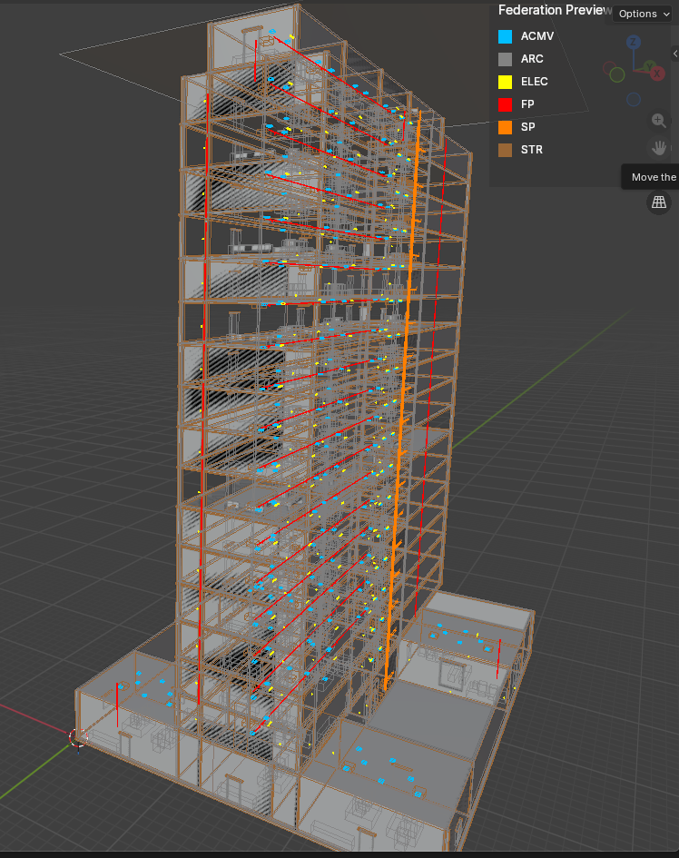

<div align="center">

# BIM Intent Compiler

**[Construction is manufacturing. A building IS its Bill of Materials.](https://red1oon.github.io/BIMCompiler/)**

[](https://www.gnu.org/licenses/old-licenses/gpl-2.0.en.html)
[](https://openjdk.org/)
[](https://www.sqlite.org/)
[](#project-stats)
[](https://red1oon.github.io/BIMCompiler/)
[](#project-stats)

### [Try It Live Now — 25 IFC buildings in your browser, zero install](https://objectstorage.ap-kulai-2.oraclecloud.com/n/ax3cp6tzwuy2/b/bim-ootb-full/o/index.html)

</div>

---



A metadata-driven, deterministic compiler that reads BOM data and produces verified 3D building coordinates — the same way an ERP system explodes a manufacturing BOM into work orders.

Every output element traces to a library input. Nothing is invented. No AI inside. Pure arithmetic.

&nbsp;

| | |
|:---|:---|
| **35 buildings** compiled (126K elements largest) | **77 verbs**, 2,475 products |
| **1M elements** loaded in a single federated session | **6 mathematical gates** prove every output |
| **ERP-native** data model ([iDempiere](https://idempiere.org/)) | **[Blender](https://www.blender.org/)/[Bonsai](https://bonsaibim.org/)** live GUI |

<br clear="right"/>

---

## Quick Start

```bash
# Prerequisites: Java 17+, Maven 3.8+, SQLite3
git clone https://github.com/red1oon/BIMCompiler.git && cd bim-compiler

mvn compile -q                                        # Compile all modules
./scripts/run_RosettaStones.sh classify_sh.yaml       # Compile Sample House + verify gates
./scripts/run_tests.sh                                # Full test gate (392 tests)
```

## Documentation

**https://red1oon.github.io/BIMCompiler/**

50 specs with full-text search, dark mode, and sidebar navigation.

See a [walkthrough of how Claude does pair programming with the Creator](https://youtu.be/bOcwiILBVUE).

## How It Works

```
IFC file → extract → classify.yaml → IFCtoBOM → BOM.db → compile → output.db → gates
           (once)    (human intent)    (once)     (recipe)   (repeat)  (elements)   (proof)
```

## BIM Streaming — From IFC to Viewport in 3 Steps

Every BIM viewer loads the file, then queries it. We query the database.
The geometry streams directly from SQLite BLOBs into Blender — no intermediate
files, no baking, no server. Two database files, one Python timer.

```
Step 1: Extract        python3 extractIFCtoDB.py --ifc building.ifc --library component_library.db
Step 2: Preview        Ctrl+Shift+P → 1M GPU wireframes in ~13s (instant orbit)
Step 3: Stream         Ctrl+Shift+A → solid geometry appears, largest pieces first
```

**Three speed secrets:**

1. **Geometry hashing** — 1M elements compress to 50K unique meshes. A hospital
   has 10,000 doors but only 15 unique door shapes. Mesh creation runs 15 times,
   not 10,000.

2. **Spatial ordering** — walls and slabs stream first (`ORDER BY bbox volume DESC`).
   The building looks complete after 5% of elements are placed.

3. **No format conversion** — IFC is tessellated once at extraction. After that,
   streaming is binary unpack → `from_pydata()`. SQLite reads are effectively
   memcpy from disk cache.

| Metric | Proven |
|:---|:---|
| Time to first geometry | **2-3s** (shell walls appear) |
| RTree wireframe load (1M) | **~13s** |
| Orbit / pan | **Instant (60 FPS)** |
| Geometry deduplication | **95%** (1M → 50K meshes) |
| Total data footprint | **~1.1GB** (two SQLite files) |
| Server required | **None** |

See [RTree.md](docs/RTree.md) for architecture.

### nD Analysis (4D–8D)

Template-driven engine generates schedules (4D), cost estimates (5D), carbon (6D),
lifecycle (7D), and safety plans (8D) from the same compiled database. 37 buildings +
1M sandbox costed at MYR 1.59B. See [4D5DAnalysis.md](docs/4D5DAnalysis.md).

## Project Structure

```
bim-compiler/
├── DAGCompiler/           # 12-stage compilation pipeline (G1-G6 gates)
├── BIM_COBOL/             # 64 domain verbs, witness engine
├── BIMEyes/               # Geometric comprehension: 28 shape proofs
├── IFCtoBOM/              # IFC extraction → BOM database pipeline
├── BonsaiBIMDesigner/     # GUI server + validation (TCP :9876)
├── BIMBackOffice/         # ERP reporting + portfolio (HTTP :9877)
├── orm-core/              # Base ORM, BIMLogger, shared utilities
├── library/               # SQLite databases (product catalog, BOMs)
├── migration/             # SQL migration scripts (append-only)
├── scripts/               # Build, test, docs, and audit scripts
└── docs/                  # 50 specifications (mkdocs site source)
```

## About

**Redhuan D. Oon** ([red1](mailto:red1org@gmail.com)) — Kuala Lumpur, Malaysia.
Led [ADempiere](https://www.adempierebr.com/User:Red1) (2006), paved the way for
[iDempiere](https://idempiere.org/) (2010), authored
*[Open Source ERP](https://www.amazon.com/Open-Source-ERP-Redhuan-Oon/dp/9673490228)*
(Pearson Malaysia, 2010). Two decades of ERP manufacturing BOM expertise applied to construction.

## Project Stats

| | |
|:---|:---|
| **Java** | 1,140 files, 261K lines across 12 Maven modules |
| **Tests** | 129 test classes, 392+ assertions, all GREEN |
| **SQL** | 106 migration scripts (append-only) |
| **Databases** | 55 SQLite DBs (4-DB architecture per building) |
| **Specifications** | 50 docs, governed by SystemContract.md |
| **Buildings** | 35 compiled (34 extracted + 1 generative) |
| **Library** | 123,573 tessellated meshes in component_library.db |
| **Scale** | 1,063,563 elements federated, 35 buildings, 6 disciplines |

---

<div align="center">

**Alpha v1.0** — April 2026

Code: GPL v2 · Documentation: CC BY-SA 4.0

Copyright (c) 2026 Redhuan D. Oon. All rights reserved.

</div>
