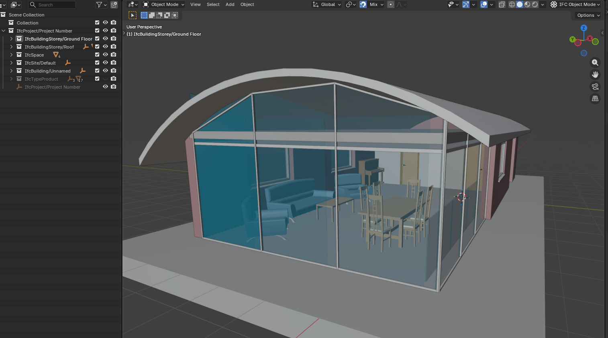
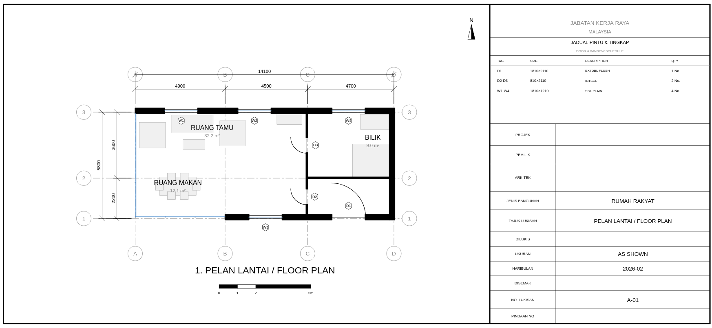
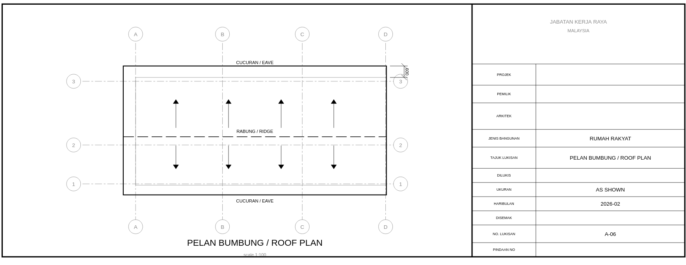
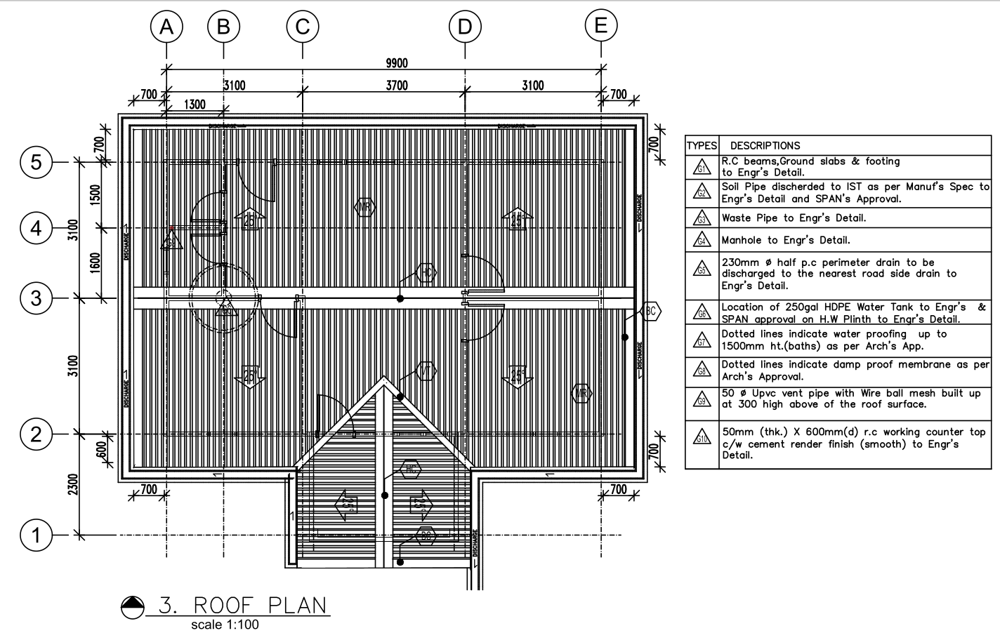

# 2D Layout — Grid Overlay Architecture

> **Module:** `deploy/dev/grid_overlay.js` · `grid_scissors.js` · `section_cut.js` · `print_sheet.js` · `kernel_ops.js` · `cost_panel.js`
> **Spec:** `prompts/2D_022_grid_overlay_mode.md` · `2D_025` · `2D_028` · `2D_029`
> **Architecture:** See [BIM Modeller OOTB — The Modelling Inversion](BIM_Modeller_OOTB.md#the-modelling-inversion) for why the log replaced the file.

<div class="bim-banner" markdown>
<b>The 3D model IS the drawing.</b> Section cuts and grid overlays happen live in the browser — no DXF pipeline, no separate drafting tool, no server.
</div>

---

## The Deprecated Path (Why We Moved On)

The original 2D pipeline generated DXF files from the compiled `output.db` via the Java `DAGCompiler`:

```
compiled output.db → section cut → SVG/DXF floor plan / elevation / roof plan
```

This worked for the POC — floor plans and roof plans for Sample House were produced and matched the architect's original drawings (the Rosetta Stone proof). The Java pipeline produced:

- `2D_Layout/output/` — floor plan, roof plan, 4 elevation DXFs + SVG proofs
- Dimension tiers (3 offset levels), JKR/ISO title blocks, crowded-bay triage

**But it introduced structural friction:**

| DXF pipeline | Grid overlay (current) |
|---|---|
| Separate file, separate viewer, separate tab | Live in the 3D scene |
| Static — regenerate on any change | Adaptive — updates as user adjusts scissors |
| Dimension tier logic over-engineered for most use cases | One panel, all bay spans at a glance |
| User loses spatial context switching to 2D tab | User stays in 3D; grids pan/rotate with model |
| Requires DXF parsing library + Java build | Zero extra dependency — Three.js line geometry |
| Round-trip impossible — drawings are outputs | Round-trip designed in from the start |

The DXF/SVG visual proofs remain as the Rosetta Stone evidence. The pipeline that produced them is retired as the primary 2D mode.

---

## Current Architecture — Grid Overlay in the 3D Scene

Press the **2D Plans** toolbar button → the viewer enters **Grid Mode** without leaving the 3D scene.

### Module Map

| Module | File | Role |
|--------|------|------|
| `GridOverlay` | `grid_overlay.js` | IIFE attached to APP — grid lines, bubbles, panel, saved sections |
| `GridScissors` | `grid_scissors.js` | Scissors-driven adaptive grids — rewires grids to the cut plane |
| `GridDims` | `grid_dims.js` | Column/wall cluster detection, bay dimension generation |
| `GridViews` | `grid_views.js` | View presets (Ground Floor, Level 1, elevation axes) |
| `SectionCut` | `section_cut.js` | Triangle mesh slicer — produces 2D contours from 3D geometry BLOBs |
| `DoorArcs` | `grid_door_arcs.js` | Door swing arcs, window dashes, stair treads, opening callout labels |
| `GridDrag` | `grid_drag.js` | Long-press drag editing with rules-driven cascade and clearance |
| `KernelOps` | `kernel_ops.js` | Transactional operation log — `commitOp`, `undoOp`, `redoOp`, `replayOps` |
| `CostPanel` | `cost_panel.js` | Live BOQ panel — spatial SQL query scoped to grid positions |
| `PrintSheet` | `print_sheet.js` | Interactive A3 preview — canvas capture, title block, corporate.json |

Each module is an IIFE or self-contained object. If any one fails to load, the viewer continues unaffected — they are progressive enhancements, not dependencies of the core render loop.

### What Renders

When Grid Mode is active:

1. **Grid lines** — `THREE.Line` objects in a `gridGroup`, extending 15% past the building bounding box with overshot bubbles (A, B, C / 1, 2, 3) at both ends. They pan, rotate, and zoom with the model naturally because they live in scene space, not screen space.
2. **Bubble labels** — `CSS2DObject` sprites rendered by `CSS2DRenderer`. Always screen-readable regardless of zoom level. Same technique as storey info cards.
3. **Measurements panel** — frosted-glass DOM panel listing all bay spans (`A–B: 6.000 m`, `B–C: 4.500 m`, total). Updates live when scissors move.
4. **Section cut contours** — `SectionCut.sectionCut()` slices every wall/column/door/window mesh at the scissors plane, producing 2D contours rendered as `THREE.LineSegments` in the scene.

### How Grid Lines Are Derived from the DB

Grid line detection is entirely DB-driven — no geometry parsing, no mesh traversal. The source is `element_transforms` joined with `elements_meta`.

**`GridDims.detectGrids(db, tolerance=0.3)`** — ground-floor grids on first open:

1. Query `IfcColumn` centroids from `element_transforms`. If fewer than 2 columns, fall back to `IfcWall` / `IfcWallStandardCase` centroids.
2. **Cluster** — sort all X values, group positions within `tolerance` (default 300 mm) into one cluster. Repeat for Y. Each cluster's representative position is the mean of its member centroids.
3. **Label** — X-axis clusters get numeric labels (1, 2, 3…) left to right. Y-axis clusters get letter labels (A, B, C… skipping I) bottom to top.
4. **Snap** — bay widths are snapped to the nearest 300 mm module. A raw bay of 5 920 mm rounds to 6 000 mm. Minimum snapped bay: 300 mm.
5. **Filter** — drop any grid line whose both adjacent bay spans are under 1.0 m (sub-metre column pairs from structural details, not planning grids).
6. **Thin** — if more than 12 lines remain on either axis after filtering, stride-thin the interior ones so at most 12 survive (first and last always kept).

Output: `{ xLines: [{label, position, guids}], yLines: [{label, position, guids}] }`

Each line carries the `guids` of the elements that voted for it — used for highlight-on-click and for `saved_sections` snap targets.

**`GridDims.detectGridsAtPlane(db, cutZ, tolerance=0.3)`** — scissors-adaptive grids:

Same pipeline, but the SQL adds a vertical extent filter:

```sql
WHERE ifc_class IN ('IfcColumn','IfcWall','IfcWallStandardCase','IfcBeam','IfcMember')
  AND (center_z - COALESCE(bbox_z, 3.0) / 2) <= cutZ
  AND (center_z + COALESCE(bbox_z, 3.0) / 2) >= cutZ
```

Only elements whose IFC bounding box **straddles** the cut plane contribute to the grid. A wall that ends below the scissors plane is excluded. `bbox_z` defaults to 3.0 m if null (typical storey height) — a conservative fallback that avoids dropping structural elements with incomplete bbox data.

After clustering, the same snap → filter → thin pipeline runs, then labels are re-assigned sequentially so survivors always start at 1 / A regardless of which lines were dropped.

### Scissors-Driven Adaptive Grids (D1)

When the scissors slider moves (`APP.onSectionSliderChange` fires), `GridScissors` debounces at 200ms then:

1. Calls `GridDims.detectGridsAtPlane(db, cutVal, axis)` — clusters structural element centroids at the cut elevation using the extent filter above
2. If ≥ 2 grid lines detected at the new plane, swaps `scissorsGroup` for the current `gridGroup`
3. Supports all three axes: Y (horizontal floor cut), X (vertical width cut), Z (vertical depth cut)

Gate: fewer than 2 grid lines at the cut plane → grids stay at their last valid position (no degradation to empty panel).

---

## IFC Element Handling — Pre-Compressed for the Browser

### The Right Framing

This architecture does not "bypass" IfcOpenShell. It **pre-compresses** the expensive operations — geometry tessellation, property extraction, spatial placement resolution — into a query-optimised SQLite format that a browser can consume directly. The work IfcOpenShell would do at viewing time is done once at import time and stored as BLOBs.

IfcOpenShell remains the superior tool for:

- **Programmatic IFC creation and modification** — full schema awareness, property set manipulation, relationship tree traversal
- **Round-trip IFC preservation without data loss** — modify and re-serialise the original IFC tree, keeping all property sets, openings, type objects intact
- **Complex geometric operations** — CSG, clash detection at the solid-model level, Boolean operations on IFC geometry
- **Server-side batch processing** — Python scripting, CI/CD pipeline integration, bulk migration

BIM OOTB optimises for a different constraint: **zero-install browser delivery**. The SQLite DB is the pre-computed result of the expensive IFC operations. The viewer consumes it like a GPU would consume a pre-baked asset — fast, offline, without the originating toolchain.

### Extraction Pipeline

There are three extraction paths, all producing the same schema:

| Path | Engine | When used |
|---|---|---|
| `scripts/extractIFC2DB.js` | **web-ifc** (Node.js WASM) | Normal batch extraction, < 200K elements |
| Browser Drop IFC | **web-ifc** (browser WASM) | Interactive import in the viewer |
| `scripts/extract_merge_disciplines.py` | **IfcOpenShell** (Python) | Large merged IFCs > 200 MB, per-discipline splits |

**web-ifc is the primary browser engine.** For very large models where web-ifc's WASM memory envelope is insufficient, IfcOpenShell handles the batch extraction server-side and writes to the same schema. The viewer does not know or care which engine produced the DB.

### web-ifc in the Browser vs IfcOpenShell on the Server

| Capability | IfcOpenShell | web-ifc (WASM) |
|---|---|---|
| Environment | Python/C++ — server or desktop | 1.3 MB WASM — browser or Node.js |
| Tessellation | Configurable, robust, memory-heavy | Fast, suitable for < 200K elements |
| IFC write (create/modify) | Full schema support | Limited — primarily a reader |
| Property sets | Full read/write | Read only, used at extraction time |
| Bbox | Computed from vertices by default | Extracted from `IfcBoundingBox` representation directly |
| Round-trip fidelity | High — preserves full tree | Low — projection only |
| Browser deployment | Impossible (C++ + Python) | Native |

The critical difference for the section-cut and grid-overlay workflows: web-ifc extracts the IFC `IfcBoundingBox` as the **author's stated design value** rather than recomputing it from tessellation. The bbox in `element_transforms` is what the architect intended, not a numerical approximation of the mesh — which matters when grid detection clusters structural elements by their envelope, not their rendered surface.

### How Elements Are Stored

Every element extracted from IFC becomes two rows:

```sql
-- Identity and classification
INSERT INTO elements_meta (guid, ifc_class, element_name, storey, discipline, material_rgba)

-- Spatial placement (world-space, metres)
INSERT INTO element_transforms (guid, center_x, center_y, center_z,
                                bbox_x, bbox_y, bbox_z)
```

The `guid` is the IFC `GlobalId` — the 22-character base64 string assigned by the authoring tool. It is the **only stable identity** across the IFC file, the extracted DB, and any downstream write-back. It does not change on re-extraction from the same IFC.

Geometry is stored separately, deduplicated by content hash:

```sql
INSERT INTO component_geometries (geometry_hash, vertices BLOB, faces BLOB)
INSERT INTO element_instances (guid, geometry_hash)
```

`vertices` is a raw `Float32Array` — centred at origin, Z-up, metres. `faces` is a raw `Int32Array` of triangle indices. These are the GPU buffers. The viewer reads them directly: `sql.js` returns a `Uint8Array`, which is wrapped in a `Float32Array` view and handed to `THREE.BufferGeometry` with zero conversion.

### What the DB Does NOT Store

- The IFC file itself — only the extracted data
- The IFC tree hierarchy (IfcRelAggregates, IfcRelContainedInSpatialStructure) — flattened to `storey` string
- IFC property sets beyond material and discipline — these remain in the source IFC
- Normals — recomputed by Three.js from vertices + faces at load time

This means the DB is a **read-optimised projection** of the IFC, not a lossless IFC container.

---

## Save As IFC — The Custom STEP Builder

When a user drops an IFC file into the browser, the viewer extracts it to a SQLite DB and stores that DB in IndexedDB (with wizard modifications versioned as `record.versions[]`). The **Export IFC** button reconstructs a valid IFC file from that DB — without web-ifc, without IfcOpenShell, without any server.

### Why Not Use web-ifc for Writing?

web-ifc is primarily a **reader and tessellator** — its write API is limited and not suitable for reconstructing a full valid IFC from raw geometry BLOBs. IfcOpenShell has a mature write path but cannot run in a browser. The solution: a custom ISO-10303-21 STEP text builder in a Web Worker.

**File:** `deploy/dev/ifc_export_worker.js` — pure JavaScript, no dependencies, runs off the main thread.

### What the STEP Builder Does

`import.js` → `A.exportIFC(key)` reads the **versioned DB** (post-wizard edits) from IndexedDB, queries three tables, and hands the data to the worker:

```
elements_meta   → guid, ifc_class, element_name, storey, discipline, material_rgba
element_transforms → guid, center_x, center_y, center_z
element_instances + component_geometries → guid, vertices BLOB, faces BLOB
```

The worker writes ISO-10303-21 STEP text line by line:

1. **FILE_DESCRIPTION / FILE_NAME / FILE_SCHEMA** header
2. Fixed infrastructure — `IFCPERSON`, `IFCORGANIZATION`, `IFCAPPLICATION`, `IFCOWNERHISTORY`
3. Unit assignment (metre, square metre, cubic metre, radian)
4. Spatial hierarchy — `IFCPROJECT → IFCSITE → IFCBUILDING → IFCBUILDINGSTOREY[]` with `IFCRELAGGREGATES`
5. Per element: `IFCLOCALPLACEMENT` from `center_x/y/z`, geometry as `IFCFACETEDBREP` / `IFCSHELLBASEDSURFACEMODEL` from the raw Float32Array vertices and Int32Array faces, `IFCPRODUCTDEFINITIONSHAPE`, and the typed element entity (e.g. `IFCWALL`)
6. Containment: `IFCRELCONTAINEDINSPATIALSTRUCTURE` grouping elements into their storey

The output is a valid `.ifc` file openable in any IFC viewer (BIMvision, Solibri, Bonsai).

### What Is Preserved vs Reconstructed

| Property | Status | Notes |
|---|---|---|
| IFC GlobalId | **Preserved** | `toIfcGuid()` validates the stored GUID — passes through unchanged if valid 22-char IFC base64 |
| IFC class (type) | **Preserved** | `IfcWall`, `IfcColumn` etc. from `elements_meta.ifc_class` |
| Element name | **Preserved** | From `elements_meta.element_name` |
| Storey assignment | **Preserved** | `elements_meta.storey` string → matched to reconstructed `IfcBuildingStorey` |
| World-space position | **Preserved** | `center_x/y/z` → `IFCLOCALPLACEMENT` with world-space cartesian point |
| Tessellated geometry | **Preserved** | Raw Float32Array → `IFCFACETEDBREP` faces — same vertices as extracted |
| Spatial hierarchy tree | **Reconstructed** | Original `IfcRelAggregates` tree is lost; storey names are re-used but parent/child nesting is rebuilt fresh |
| Property sets | **Lost** | Not in the DB — IfcPropertySet, IfcQuantitySet, fire rating, thermal etc. are not exported |
| Openings (IfcOpeningElement) | **Lost** | Voids are baked into host wall mesh — not represented as separate entities |
| Type objects (IfcWallType) | **Lost** | Only occurrence-level data in the DB |
| Material assignments | **Partial** | `material_rgba` → `IFCSURFACESTYLERENDERING` colour, not IfcMaterial with proper layer sets |
| Rotation | **Lost** | `rotation_x/y/z` not currently read by the export worker — elements placed at their centre with identity rotation |

### Integrity Implication for Round-Trip

This is a **DB-to-IFC reconstruction**, not a **source-IFC modification**. The difference matters:

- A proper round-trip would modify `IfcLocalPlacement` nodes in the original IFC file tree and write the result as a delta. This preserves property sets, openings, type objects, and the full IfcRelAggregates tree.
- This approach rebuilds the IFC from the DB projection. It is valid and viewable, but it loses anything the DB did not store.

For the grid overlay and 2D workflow, this is sufficient — the exported IFC carries the correct element positions and classes, which is what a downstream viewer or clash detection tool needs. For full BIM authoring round-trip, the missing pieces (property sets, openings, type objects, rotation) would need to be addressed either by expanding what the DB stores or by keeping the original IFC alongside the DB.

The `saved_sections` table (D2) is a step toward a more principled round-trip: named spatial planes attached to the building DB that survive export and can be interpreted by any tool reading the same DB schema.

---

## Round-Trip Editing — The Vision and the Current State

### What "Round-Trip" Means Here

In classical BIM, round-trip means: modify a model in one tool → export IFC → re-import in another tool → the change survives. This is an IFC-to-IFC contract enforced by schema.

In BIM OOTB, round-trip means something more granular: **user interaction in the browser → DB write → persists across reloads → feeds downstream computation.** The IFC file is the upstream source. The DB is the working model. Changes live in the DB first; IFC write-back is a later concern.

### What Is Implemented Today

| Layer | Status | Mechanism |
|---|---|---|
| Grid positions | **Persisted** | `kernel_ops` table — GRID_MOVE ops replayed on init, survives reload |
| Grid move undo/redo | **Persisted** | Ctrl+Z / Ctrl+Shift+Z — `undone` flag in `kernel_ops`, no DELETE |
| Saved section cuts | **Persisted** (D2, 2026-05-08) | `saved_sections` table — name, cut_value, plane_normal, timestamp |
| Storey band visibility | **Persisted** | VIEW_FILTER op in `kernel_ops` — which elements shown/hidden |
| Scissors adaptive grids | **Live** | `scissorsGroup` rebuilt on every 200ms debounce — not yet written to DB |
| Print output | **Captured** (D3) | A3 canvas snapshot + title block from `corporate.json` |
| Live cost panel | **Live** | BOQ query scoped to grid bounding box, refreshes on grid drag |
| Element position edits | **Not yet** | Vision: drag element → `commitOp('PLACE')` → live reposition |
| IFC write-back | **Not yet** | Requires `kernel_ops` replay → web-ifc write or custom STEP builder |

The `saved_sections` table is the first step toward a proper round-trip. A user positions the scissors slider at a meaningful cut plane (e.g. the structural frame of Level 1), saves it with a name, and that position is recovered on next load. The cut is not just a viewing preference — it is a **named spatial assertion** about the building that can feed printed drawings, clash checks, and BOQ slicing.

### Integrity Without IfcOpenShell

Because we bypass IfcOpenShell in normal extraction, integrity guarantees must be maintained by the schema and the extraction code rather than by a library.

**What is guaranteed:**

- `guid` is read verbatim from IFC `GlobalId` — no transformation, no hash, no synthetic key. If the IFC is re-extracted, the same elements get the same GUIDs.
- `ifc_class` is read from the IFC schema type (e.g. `IfcWall`) — not inferred from geometry.
- `bbox_x/y/z` comes from the IFC `IfcBoundingBox` representation, not from vertex extents. This is the design intent value.
- `center_x/y/z` is the world-space centroid computed from the IFC `IfcLocalPlacement` chain — the same transform that positions the element in the original IFC coordinate system.
- Geometry BLOBs are centred at origin with the placement removed. The `center_x/y/z` in `element_transforms` is the displacement vector needed to reconstruct world-space position. Geometry + placement = original IFC position.

**What is not guaranteed (known gaps):**

- **Property sets:** IfcPropertySet values (fire rating, thermal properties, structural grade) are not extracted. They remain in the source IFC file only.
- **Relationship tree:** The IfcRelAggregates hierarchy is flattened to a `storey` string. A DB-only client cannot reconstruct the spatial container tree.
- **Openings:** IfcOpeningElement voids (door/window cutouts) are tessellated into the host wall mesh but not stored separately. You cannot query "which walls have openings" from the DB alone.
- **Type objects:** IfcWallType, IfcDoorType etc. are not stored — only the occurrence-level data.

For the grid overlay and section-cut workflows, these gaps are immaterial. Grid detection reads centroids and bboxes from `element_transforms`. Section cut slices the tessellated geometry BLOBs in `component_geometries`. Neither needs property sets or the relationship tree.

For IFC write-back (future), the gaps would matter: a round-trip that modifies element position must write back to the correct IfcLocalPlacement node in the original IFC tree, which requires either the original file or a reconstructed schema tree.

---

## Corporate Identity Schema (`corporate.json`)

`corporate.json` is the one file a firm edits to brand every drawing output. It lives alongside the viewer scripts and is fetched once, then cached in module memory for the session.

**Required fields:**

| Field | Type | Purpose |
|---|---|---|
| `company` | string | Company name — rendered in title block header |
| `address` | string | Full postal address — rendered below company name |
| `phone` | string | Contact phone |
| `email` | string | Contact email |
| `website` | string | Website URL |
| `logo_text` | string | Short logo text (e.g. initials) rendered in the logo cell when no image is available |
| `registration` | string | Company registration number or equivalent |
| `drawn_by` | string | Default value for the Drawn By field (overridable per-print in the preview panel) |
| `checked_by` | string | Default value for the Checked By field |

**Example (`deploy/dev/corporate.json`):**

```json
{
  "company": "SYSNOVA UK",
  "address": "71-75 Shelton Street, Covent Garden, London WC2H 9JQ",
  "phone": "+44 20 7946 0958",
  "email": "bim@sysnova.co.uk",
  "website": "www.sysnova.co.uk",
  "logo_text": "SYSNOVA",
  "registration": "Company No. 12345678",
  "drawn_by": "",
  "checked_by": ""
}
```

If `corporate.json` is absent or the fetch fails, `PrintSheet` falls back to `"BIM OOTB"` as the company name and leaves the address cell blank. The file is intentionally simple — no logo image path, no colour codes. Those are deferred to a later phase; the title block currently renders text only.

---

## Print Sheet and Corporate Identity (D3/D4)

`PrintSheet.capture(APP)` produces an A3 landscape sheet (2480 × 1754 px at 150 DPI) from the current Three.js view:

1. Captures `renderer.domElement` as a base64 PNG (the 3D viewport snapshot)
2. Opens a draggable overlay with a live canvas on the left and editable fields on the right
3. Loads `corporate.json` once (cached) — company name, address, logo path, drawn-by / checked-by defaults
4. `drawTitleBlock()` renders company name, project name, drawing title, scale, date, revision, drawn-by, checked-by, and north arrow into the bottom-right title block cell — JKR/ISO convention
5. A contrast slider applies `grayscale(0–80%) contrast(100–120%)` CSS filter to the viewport image, converting colour renders to publication-quality greyscale line weights
6. **Save PNG** re-renders at full A3 resolution to a separate off-screen canvas and downloads it

`corporate.json` lives alongside the viewer scripts. It is the one file a firm edits to brand every drawing output — no code change required.

---

## Phases and What Is Done

| Phase | Scope | Status |
|-------|-------|--------|
| **A — Grid overlay MVP** | Grid lines + bubbles in 3D scene, auto-detect, measurements panel, DB persistence | **DONE** (2D_022) |
| **B — Scissors adaptive** | Grids reposition to scissors cut plane, all 3 axes, 200ms debounce | **DONE** (2D_025 D1) |
| **C — Save sections** | `saved_sections` table, save/restore/delete UI in grid panel | **DONE** (2D_025 D2) |
| **D — Print preview** | A3 overlay, title block, corporate.json, Save PNG | **DONE** (2D_025 D3/D4) |
| **E — Section contours** | `SectionCut` contours rendered in scene at scissors plane — see below | **DONE** (2D_023–2D_027) |
| **F — Storey band + opportunity grids** | Z-band filter excludes roof/foundation noise; opening-weighted vote detects grids in residential buildings | **DONE** (2D_028) |
| **G — kernel_ops log + 3D grid planes** | Transactional operation log, 3D grid planes, live cost panel, undo/redo, crash recovery — see [§ below](#kernel_ops--the-shift-from-file-to-log) | **DONE** (2D_029) |
| **H — Element drag** | Drag element → `commitOp('PLACE')` → live reposition, log survives reload | Planned |
| **I — IFC write-back** | Export modified DB back to valid IFC via `kernel_ops` replay | Future |

### Phase E — Section Contours: Expected Output and Targets

`SectionCut.sectionCut(db, libDb, cutZ, storeyName)` already runs in `section_cut.js` and produces contours. Phase E wires those contours into the grid overlay scene as visible geometry at the scissors plane.

**What `sectionCut()` returns per element:**

```js
{
  guid: string,           // IFC GlobalId
  ifcClass: string,       // e.g. 'IfcWall'
  elementName: string,
  storey: string,
  category: string,       // 'WALL_FULL' | 'WALL_PRTN' | 'COLUMN' | 'DOOR' | 'WINDOW' | 'SLAB' | …
  contours: [[[x,y],…]], // array of closed polylines in IFC XY coordinates (metres)
  bbox2d: {minX,minY,maxX,maxY}
}
```

`sliceMesh()` intersects each triangle with the plane Z = cutZ using linear interpolation (5 mm endpoint-matching tolerance). `chainSegments()` connects the resulting edge segments into closed contours.

**How Phase E will render them:**

Each contour polyline → `THREE.BufferGeometry` line loop in a `contourGroup`, added to the scene at the scissors plane elevation. Colour follows AIA discipline convention: walls white, columns near-white, doors cyan, windows blue, slabs grey. The group is rebuilt on every scissors debounce alongside the adaptive grids.

**Performance targets:**

| Building size | Target | Basis |
|---|---|---|
| Sample House (~200 elements) | < 200 ms per scissors move | `sectionCut()` on SH runs in ~80 ms in current tests |
| Mid-size (~2 000 elements) | < 500 ms | Acceptable with 200 ms debounce — user perceives one update |
| Large (> 5 000 elements) | Auto-clip to 30 m × 30 m centred window | Same `CLIP_MARGIN = 15 m` already in `section_cut.js` |

The 200 ms debounce on the scissors slider absorbs most of the cost — `sectionCut()` only runs once the user pauses, not on every pixel of drag. Contour rendering (Three.js line geometry) is negligible compared to the SQL + mesh slicing time.

---

## Visual Record — The Rosetta Stone Proofs

These remain the evidence base for the original round-trip claim: the compiler, given only the BOM recipe, produces drawings that match the architect's originals.

**Sample House — compiled 3D model:**



**Sample House — floor plan from section cut:**



**Sample House — roof plan:**



**Architect's original roof plan (ground truth):**



The spatial layout matches. The compiler did not draft — it compiled.

---

## kernel_ops — The Shift from File to Log

> **Architectural reference:** [BIM Modeller OOTB — The Modelling Inversion](BIM_Modeller_OOTB.md#the-modelling-inversion)
>
> This section describes a fundamental change in how the grid system persists state.
> The grid overlay was originally a viewing feature. With `kernel_ops`, it becomes the
> first **transactional modelling operation** — the proof that a browser BIM tool can
> record operations as a log rather than save state as a file.

### Why the Approach Changed

The original grid persistence wrote positions directly to a `grids` table — flat rows, no history, no undo, no replay. When the user reloaded, grids reappeared at their saved positions. But there was no record of *how* they got there, no way to undo, and no crash recovery if the tab closed mid-drag.

The [BIM Modeller OOTB manifesto](BIM_Modeller_OOTB.md) identifies a deeper principle: **every modelling operation should be a committed database transaction.** The current state is the result of replaying the log from the beginning. There is no "save" command because every operation is already saved. Geometry (and grid positions) become derived views of the operation log.

Grid drag is the simplest possible test of this principle — one axis, one position, one output. No geometry evaluation, no Boolean operations, no extrude. If this works, the pattern is proven for everything that follows.

### The kernel_ops Table

```sql
CREATE TABLE IF NOT EXISTS kernel_ops (
    id           INTEGER PRIMARY KEY,
    timestamp    INTEGER NOT NULL,        -- unixepoch() ms
    op_type      TEXT    NOT NULL,         -- GRID_MOVE, VIEW_FILTER, GRID_DETECT
    parameters   TEXT    NOT NULL,         -- JSON: { axis, from, to, label, ... }
    input_guids  TEXT,                     -- JSON array: affected elements (nullable)
    output_guid  TEXT,                     -- created/modified entity (nullable)
    undone       INTEGER DEFAULT 0         -- 1 = undone (soft delete), skip in replay
);
```

**Why `undone` instead of DELETE:** Undo marks the op as undone. Redo clears the flag. The full history is always visible for audit. DELETE would lose the log.

### The Four Operations

| Function | What it does | When called |
|----------|-------------|-------------|
| `KernelOps.commitOp(db, type, params)` | INSERT one row into `kernel_ops` | Grid drag pointerup, band visibility apply |
| `KernelOps.undoOp(db)` | Mark most recent active op as `undone=1` | Ctrl+Z while grid overlay active |
| `KernelOps.redoOp(db)` | Clear `undone` flag on earliest undone op | Ctrl+Shift+Z while grid overlay active |
| `KernelOps.replayOps(db, 'GRID_MOVE')` | SELECT all non-undone ops in order | Grid overlay init — restores positions from previous session |

### Operation Types (Current Vocabulary)

| op_type | parameters JSON | Trigger |
|---------|----------------|---------|
| `GRID_MOVE` | `{ axis, label, from, to }` | User drags a grid line (2D or 3D) |
| `VIEW_FILTER` | `{ mode, bandMin, bandMax, shown, hidden }` | Saved cut applies storey band visibility |
| `GRID_DETECT` | `{ xCount, yCount, method }` | Grid detection runs (informational, not undoable) |

### What Happens Step by Step

**1. User toggles grid overlay (G key or toolbar):**
```
§KERNEL_OP replay type=GRID_MOVE count=0     ← first time, no saved moves
§GRID_DETECT xLines=4 yLines=3
§DOOR_ARC_LABEL guid=... width=900mm tag=Single-Flush
```

**2. User long-presses a grid line (~400ms hold):**
```
§GRID_3D_DRAG axis=X label=3 from=4.200
§GRID_3D_PLANES count=7 mode=adjust           ← 3D planes appear
```

Semi-transparent planes slice through the building — red for X-axis, blue for Y-axis. The building remains fully visible (no clipping). These are annotation planes, not scissors cuts.

**3. User drags and releases:**
```
§KERNEL_OP committed id=1 type=GRID_MOVE params={"axis":"X","label":"3","from":4.2,"to":5.1}
§GRID_3D_BOQ elements=47 area=82.30 vol=14.520
§GRID_3D_DRAG_END axis=X label=3 final=5.100 cascaded=3
```

The cost panel appears (bottom-right), showing elements within the grid scope grouped by IFC class with quantities, areas, and volumes. The `kernel_ops` row is committed — the drag end IS the save.

**4. User presses Ctrl+Z:**
```
§KERNEL_OP undo id=1 type=GRID_MOVE
```

Grid snaps back to 4.200. The op is not deleted — `undone=1`. Ctrl+Shift+Z redoes it.

**5. User reloads the page (F5, crash, close/reopen):**
```
§KERNEL_OP replay type=GRID_MOVE count=1
§KERNEL_OP grid positions restored from log, moves=1
```

Grid appears at 5.100, not 4.200. The DB survived the reload. No save button was clicked.

**6. User restores a saved GF section:**
```
§GRID_3D_BAND_VIS bandMin=0.05 bandMax=3.40 shown=142 hidden=87
§KERNEL_OP committed id=2 type=VIEW_FILTER params={...}
```

Elements outside the storey band become invisible in 3D. Not clipped (scissors) — hidden (`mesh.visible = false`). The floor plate is visible in context of the building skeleton.

### 3D Grid Planes — What They Are

When the user enters drag mode (long-press), grid lines are projected into the 3D scene as `THREE.PlaneGeometry` meshes:

- **X-axis planes:** red (`#ff4444`), opacity 0.12, span the full building Y-range and Z-height
- **Y-axis planes:** blue (`#4444ff`), same opacity, span X-range and Z-height
- Both use `THREE.DoubleSide`, `depthWrite: false`, `renderOrder: -1` (behind solid geometry)
- Positioned via `APP.ifc2three()` — same coordinate transform as all scene objects
- Removed automatically on drag end or grid overlay toggle-off

The planes are not interactive yet (drag is still on the 2D grid lines). 3D plane drag (raycaster → plane intersection → IFC coordinate) is wired but requires the 3D planes to be raycast targets, which is the next step.

### Cost Panel — Live BOQ on Grid Drag

`CostPanel.refresh(APP, gridData)` runs this SQL:

```sql
SELECT m.ifc_class, COUNT(*) AS qty,
       ROUND(SUM(t.bbox_x * t.bbox_y), 2) AS area_m2,
       ROUND(SUM(t.bbox_x * t.bbox_y * t.bbox_z), 3) AS vol_m3
FROM elements_meta m JOIN element_transforms t ON m.guid = t.guid
WHERE t.center_x BETWEEN gridX1 AND gridX2
  AND t.center_y BETWEEN gridY1 AND gridY2
GROUP BY m.ifc_class ORDER BY vol_m3 DESC
```

Grid X/Y min/max are taken from the current grid line positions. When a grid line moves, the bounding box changes, the query re-runs, and the panel updates. When a rate template is loaded (from `rates/*.json`), costs can be derived by multiplying quantities by unit rates.

### Opening Callout Labels

Every `IfcDoor` and `IfcWindow` in the section cut gets a two-line label:

- **Line 1:** width in mm + "W" (e.g. `900W`) — bold, grey `#666666`
- **Line 2:** type tag from `element_name` (e.g. `Single-Flush`) — smaller, grey `#999999`

Positioned perpendicular to the host wall face, offset by `opening_label_offset_m` (default 0.15 m). These are architectural convention — width labels sit outside the opening, not inside the dim chain.

### Rules Configuration

All constants are in `grid_rules.json`, never hardcoded:

```json
{
  "plane_3d": {
    "plane_opacity":  0.12,
    "plane_color_x":  "#ff4444",
    "plane_color_y":  "#4444ff",
    "show_on_drag":   true
  },
  "floor_plan": {
    "opening_label_offset_m": 0.15,
    "opening_label_font_px":  9
  }
}
```

### What This Does NOT Do (Explicit Scope)

These are deferred by design, not forgotten:

| Deferred | Why |
|----------|-----|
| Replay engine / time travel UI | Replay is internal (crash recovery), not user-facing yet |
| Branching / merging / CRDT | Single-writer only — collaboration is a future phase |
| Log compression / snapshots | Not needed until 100K+ ops per building |
| Migrate `element_transforms` to log-derived | Existing direct writes continue unchanged |
| Geometry evaluation (Extrude, Boolean) | Proof 2+ — grid drag is Proof 1 |
| Manifold WASM integration | Future prompt for Boolean operations |
| IFC re-export from `kernel_ops` | Future prompt — requires replay → STEP builder |

The scope is deliberate: **grid drag is the first `kernel_op` consumer. Everything else continues to write directly.** This is the transition path — keep existing writers, add the log in parallel, eventually switch readers from direct tables to log-derived views.

### § Log Tags (Observable Evidence)

Every operation emits a `§`-tagged console line. These are the whitebox verification mechanism — open the browser console and read them:

| Tag | Proves |
|-----|--------|
| `§KERNEL_OP committed id=N type=T` | Operation was logged to DB |
| `§KERNEL_OP undo id=N` | Undo marked the op without deleting it |
| `§KERNEL_OP redo id=N` | Redo cleared the undone flag |
| `§KERNEL_OP replay type=T count=N` | Init replayed N ops from DB |
| `§KERNEL_OP grid positions restored` | Replay changed grid positions |
| `§GRID_3D_PLANES count=N mode=adjust` | 3D planes injected into scene |
| `§GRID_3D_DRAG axis=A label=L from=F` | Drag started on a grid line |
| `§GRID_3D_DRAG_END axis=A final=P` | Drag completed, position committed |
| `§GRID_3D_BOQ elements=N area=A vol=V` | Cost panel refreshed with spatial query |
| `§GRID_3D_BAND_VIS shown=N hidden=N` | Storey band visibility applied |
| `§DOOR_ARC_LABEL guid=G width=Nmm tag=T` | Opening label generated |

---

## Keyboard & Interaction Cheat Sheet

| Key / Gesture | Action | Requires |
|---------------|--------|----------|
| **G** | Toggle grid overlay on/off | Building loaded |
| **GF** button | Lock to Ground Floor plan (section cut + door arcs) | Grid overlay on |
| **L1** button | Lock to Level 1 plan | Grid overlay on |
| **Front / Back / Left / Right** buttons | Elevation views | Grid overlay on |
| **Roof** button | Roof plan view | Grid overlay on |
| **Unlock** button (lock icon) | Return to free 3D orbit | Grid overlay on |
| **Long-press** (~0.4s) on grid line | Start grid drag — 3D planes appear | Grid overlay on |
| **Drag** after long-press | Move grid line — cost panel updates live | Grid drag active |
| **Release** after drag | Commit `GRID_MOVE` to `kernel_ops` log | Grid drag active |
| **Ctrl+Z** | Undo last grid move | Grid overlay on |
| **Ctrl+Shift+Z** or **Ctrl+Y** | Redo undone grid move | Grid overlay on |
| **Scissors slider** (Section Cut panel) | Move cut plane — grids recompute at new elevation | Grid overlay on, Section Cut open |
| **Save cut** button | Save current section as named view | Section Cut panel open |
| **F5 / reload** | Grid positions restored from `kernel_ops` log — no save needed | Any time |

### First Proof of kernel_ops (2026-05-09)

The grid drag on the **Duplex** building produced the first live `kernel_ops` transaction:

- `§KERNEL_OP committed id=1 type=GRID_MOVE` — grid line position logged to SQLite
- Cost panel appeared with element counts per IFC class, scoped to grid bounding box
- 3D orange plane visible during drag (semi-transparent, axis-coloured)

This is [Proof 1 from BIM_Modeller_OOTB.md](BIM_Modeller_OOTB.md#the-five-proofs-required): a reparametrizable operation that persists across reload without a save button. The building is not a static object — it is a live query against a cost model.

---

## How It Connects to the Broader Pipeline

| Dimension | Role |
|-----------|------|
| **3D** | Source geometry — element meshes from `component_geometries` BLOBs |
| **2D** | Derived views — section cuts and grid overlays in the same scene |
| **[4D](ProjectOrderBlueprint.md#51-4d-schedule-topological-sort-of-bom-tree)** | Saved section planes can delimit construction zones for sequence animation |
| **[5D](ProjectOrderBlueprint.md#52-5d-cost-inherent-in-the-data-model)** | Section cut bounding box defines the spatial scope of a BOQ slice — `CostPanel` does this live |
| **[7D](TIER1_SRS.md)** | Facility management views use the same grid detection on as-maintained IFC |
| **[kernel_ops](BIM_Modeller_OOTB.md#the-modelling-inversion)** | The operation log is the model — every grid drag is a committed transaction, replay = crash recovery |
| **[iDempiere AD_PrintFormat](https://wiki.idempiere.org/en/AD_PrintFormat)** | The `saved_sections` table mirrors AD_PrintFormat's concept — named output views, not ad-hoc queries |

---

*Copyright (c) 2025-2026 Redhuan D. Oon. MIT Licensed.*
