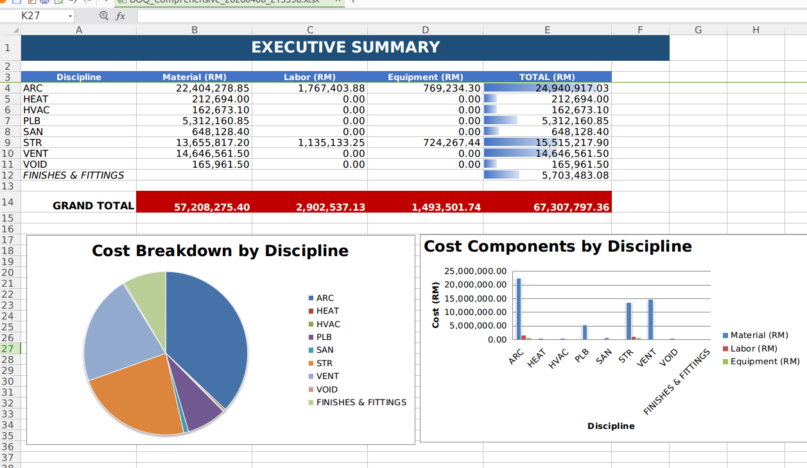
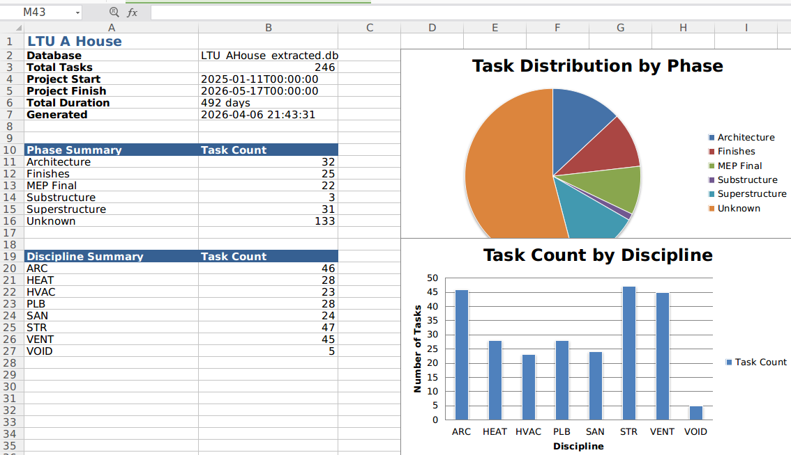
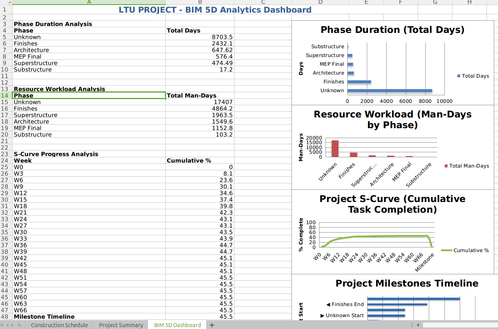

# 4D/5D Analysis — Construction Schedule and Costing from the Federated Model DB

> **Foundation:** [Enterprise](Enterprise.md) · [LTU A-House](LTUAHouseAnalysis.md) · [DATA_MODEL](DATA_MODEL.md)

<div style="max-width: 620px; margin: 32px auto; padding: 24px 40px; background: #263238; border-left: 4px solid #ff9800; text-align: center; border-radius: 4px;">
<span style="font-size: 1.3em; line-height: 1.7; color: #eceff1; letter-spacing: 0.3px;">What was once <b style="color: #ff9800;">PRIMAVERA/ORACLE</b>'s domain, is now ours.</span>
</div>

## What We Have

The [Federated Model DB](Enterprise.md) (`_extracted.db`) drives both 4D scheduling and 5D costing
in **2 seconds** from a single SQLite file. All IFC disciplines live in this one DB.
No IFC file open, no geometry iterator, no RAM spike.

| Dimension | Script | Input | Output |
|---|---|---|---|
| 4D Schedule | `scripts/schedule_generator.py` | `elements_meta` + `rel_aggregates` | `construction_schedule` table + Excel |
| 5D Costing | `scripts/simple_qto_extract.py` | `elements_meta` + `elements_rtree` | `simple_qto` table + Excel |

### Proven Results (LTU A-House — 125,997 elements, 8 disciplines)

**5D Costing** — Executive Summary with Material + Labour + Equipment per discipline.
Grand Total: RM 67M (CIDB 2024 standard rates). 133 QTO line items. Generated in ~2 seconds.

<figure style="margin: 20px 0;">

<figcaption style="text-align:center; font-style:italic; color:#666; margin-top:8px;">5D Costing — RM 67M across 8 disciplines. Cost Breakdown pie + Cost Components bar.</figcaption>
</figure>

**4D Schedule** — 224 construction tasks, precedence-linked by phase.
Substructure → Superstructure → MEP Rough-in → Architecture → MEP Final → Finishes.

<figure style="margin: 20px 0;">

<figcaption style="text-align:center; font-style:italic; color:#666; margin-top:8px;">4D Schedule — 224 tasks. Task Distribution by Phase + Task Count by Discipline.</figcaption>
</figure>

**4D Dashboard** — S-Curve, resource workload, milestones — all from one query on the DB.

<figure style="margin: 20px 0;">

<figcaption style="text-align:center; font-style:italic; color:#666; margin-top:8px;">BIM 5D Analytics Dashboard — Phase Duration, Resource Workload, S-Curve, Milestones.</figcaption>
</figure>

### Current Limitation: Unknown Phase

64% of LTU elements (80,788) are generic IFC2x3 classes (`IfcFlowSegment`, `IfcFlowFitting`,
`IfcFlowController`, etc.) not mapped in `CONSTRUCTION_SEQUENCE_RULES`. These land as
"Unknown" phase: 8,703 days / 17,407 man-days — distorting the S-Curve and dashboards.
Fix: map all IFC classes in `scripts/schedule_generator.py`. See
`prompts/5D_nD_backend_readiness.md` for the full class list.

---

## Industry Value — What QS Firms Pay For

No commercial tool produces discipline-level 4D+5D analytics from a Federated Model DB in 2 seconds
at zero licence cost. Here is what the industry wants and where we stand:

### Tier 1 — We Have It Now

| Capability | Industry tool | Cost | Our pipeline |
|---|---|---|---|
| IFC → priced BOQ | CostX, Cubicost | $10-50K/seat/yr | `simple_qto_extract.py` — 2 sec |
| Discipline-level costing | Manual in Excel | Weeks of QS time | 8 sub-disciplines auto-tagged |
| Construction schedule from BIM | Synchro, Navisworks | $5-15K/seat/yr | `schedule_generator.py` — 2 sec |
| S-Curve generation | Primavera, MS Project | $3-10K/seat/yr | Built into Excel export |
| Phase precedence | Manual CPM network | Days of planner time | Auto from IFC class rules |
| Multi-discipline MEP breakdown | Not available | — | VENT/HVAC/HEAT/PLB/SAN via `--disc-map` |

### Tier 2 — One Query Away

These capabilities need only a JOIN or a new rate table on the existing DB:

| Capability | What it needs | Who pays for it |
|---|---|---|
| **Cash flow forecast** | S-curve × monthly cost = spend profile | Banks, project financiers |
| **Tender comparison** | Same QTO, swap rate table per bidder | Main contractors, QS firms |
| **Carbon costing (6D)** | `material_name` → embodied carbon factor | ESG compliance, green building certification |
| **Lifecycle costing** | `ifc_class` + `material_name` → 30-year replacement rates | Asset owners, FM companies |
| **Change order impact** | Re-run on modified DB, diff vs baseline | Claims consultants, project managers |

### Tier 3 — Needs Additional Data Input

| Capability | What it needs | Who pays for it |
|---|---|---|
| **Earned Value (EVM)** | Actual progress % per element (site photos / IoT / manual) | PMOs, project controls |
| **Monte Carlo cost risk** | Rate variance distributions per element type | Risk consultants, insurance |
| **Claim substantiation** | Time-linked cost evidence + GUID traceability | Dispute resolution, arbitration |
| **Resource levelling** | Crew availability constraints + calendar | Construction planners |

### The Holy Grail

**A bankable project finance model generated in 2 seconds from the [Federated Model DB](Enterprise.md).**

Banks release progress payments based on:
1. What was planned (4D schedule) — we have it
2. What it should cost (5D BOQ) — we have it
3. What was actually done (earned value) — needs progress input
4. Cash flow projection — one JOIN away

Items 1+2+4 from the extracted DB = 90% of the way to a bankable model.
Item 3 is the real-world input that no software can auto-generate, but the DB
has the GUID-level structure to receive it.

---

## Architecture

```
IFC files ──→ extractIFCtoDB.py ──→ _extracted.db
                                        │
                    ┌───────────────────┼───────────────────┐
                    │                   │                   │
              4D Schedule         5D Costing          Bonsai Viewer
              (schedule_         (simple_qto_        (bbox preview +
               generator.py)     extract.py)          full mesh)
                    │                   │                   │
              Excel + Gantt      Excel + Charts       3D viewport
              S-Curve            BOQ + Rates          125K elements
              Milestones         Discipline cost      smooth nav
```

The extracted DB is the single source of truth. 4D and 5D are queries on it.
The viewer renders it. All from the same SQLite file.

---

## Next Steps

1. **Fix Unknown phase** — map all IFC classes in schedule_generator.py (zero Unknown)
2. **Editable Excel** — Java backend generates .xlsx with formulas (`=qty × unit_rate`)
   so QS can adjust rates and totals recalculate. Apache POI.
3. **Cash flow forecast** — JOIN S-curve with monthly cost buckets
4. **REST endpoints** — `/api/boq/{building}/excel`, `/api/schedule/{building}/excel`
5. **Storey normalisation** — LTU's 19 storey names → unified construction sequence

See `prompts/5D_nD_backend_readiness.md` for the full task spec.
