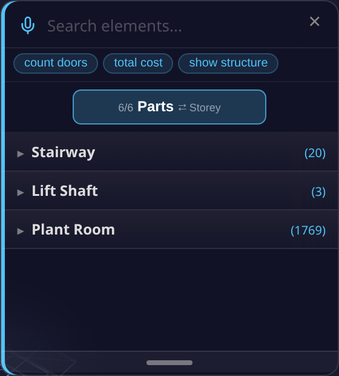

# BIM OOTB — Browser Viewer User Guide
*[← Back to the **User Guide**](USER_GUIDE.md) · [Home](index.md)*


> **See also:** [Clash Detection](CLASH_DETECTION.md) · [4D/5D Analysis](4D5DAnalysis.md)

---

## Quick Start — your first building

**Zero install.** Everything runs client-side in any browser; download a building once and it is
cached in IndexedDB, so the second visit is instant. Works on desktop and mobile.

You enter through the **Matrix front door** (`index.html`) — *not* `viewer/viewer.html` directly (that
bare URL opens an unrelated warehouse view). On the front door choose the **Buildings / IFC** door and
the **BUILDINGS & IFC hub** opens:

[**→ Front door (index.html)**](https://red1oon.github.io/bim-ootb/) → choose **Buildings / IFC**


**Three ways in — pick one:**

1. **Open a ready-made building.** Tap a card under **City Buildings** or **Landmark Buildings**
   (SampleHouse, Duplex, Clinic, Terminal, Hospital, …). It downloads that building's DB (0.5–177 MB),
   flies to it, and streams the geometry in the 3D viewer.
2. **Drop your own IFC.** Drag an `.ifc` / `.obj` / `.dae` / `.glb` file onto the centre **"Drop IFC /
   3D files here"** zone (or tap it to browse). The file is parsed in-browser and opens in the viewer.
3. **Add to an existing project.** When you drop a file that matches a building already loaded, a
   prompt offers **Merge** (combine disciplines — `Enter`) or **New** (a fresh building — `Escape`);
   two versions of the same building can be opened side-by-side with **Compare Versions**.

Once the viewer opens:

1. Watch the progress bar and element flicker as geometry streams in.
2. **Click any element** → the Info panel shows its IFC class, name, GUID, storey, discipline, material.
3. **Filter** by storey or discipline (bottom-left panels) to isolate part of the model.
4. **Alt+Z** for X-Ray, **☆** for white background, **✈** to fly around, **📷** for a screenshot.
5. Open another building → the first pauses; tap back to resume.

Full navigation, panels, and the keyboard cheat-sheet are below.

---

## Run it on your own machine

**Local setup (3 steps):**

```bash
# 1. Go to deploy folder
cd deploy

# 2. Start local server
python3 -m http.server 8080

# 3. Open the front door in your browser, then choose Buildings / IFC
# http://localhost:8080/index.html
```

Per-building DBs must be in `deploy/buildings/`:
- `{Name}_extracted.db` — metadata + transforms
- `{Name}_library.db` — geometry BLOBs (vertices + faces)

Then open `http://localhost:8080/index.html`, choose **Buildings / IFC**, and use the same three ways in as above.

**DB sizes:**

| Building | Elements | Download (ext+lib) |
|----------|----------|--------------------|
| SampleHouse | 65 | 0.5 MB |
| Duplex | 1,169 | 2.8 MB |
| Clinic | 16,480 | 31 MB |
| Terminal | 48,428 | 59 MB |
| Hospital | 63,917 | 88 MB |
| LTU AHouse | 125,698 | 177 MB |

---

## 3D Navigation

| Input | Action |
|-------|--------|
| **Drag** | Orbit camera |
| **Shift + Drag** | Pan camera |
| **Right-click drag** | Pan camera |
| **Scroll / Pinch** | Zoom |
| **Click** element | Identify — shows IFC class, name, GUID, storey, material |
| **Alt+Z** | X-Ray toggle (15% opacity) |
| **F11** | Fullscreen toggle |

**Toolbar buttons (top-right panel):**

| Button | Action |
|--------|--------|
| **Clear** | Remove all streamed meshes |
| **X-Ray** | Toggle 15% transparency on all elements |
| 📷 | Screenshot (saves PNG to Downloads/) |
| ⛶ | Fullscreen |
| ☆ / ☾ | Light/dark theme |
| ✈ | Fly around rendered buildings |

**Panels:**

| Panel | Position | Shows |
|-------|----------|-------|
| **BIM OOTB** | Top-left | Buildings, streaming progress, element flicker |
| **Tools** | Top-right | Filter, buttons, building list |
| **Info** | Bottom-right | Clicked element metadata (class, GUID, storey, disc, material) |
| **Storeys** | Bottom-left | Floor filter — click to isolate one storey |
| **Disciplines** | Bottom-left | Discipline toggle — show/hide ARC, STR, MEP etc. |
| **Status** | Bottom-centre | Current streaming state |

All panels collapse with **−/+**.

---

## Viewer Features

**All browsers (desktop + mobile):**

- 3D orbit, pan, zoom (mouse or touch)
- Click any element → IFC class, GUID, storey, discipline, material
- Fly-tour — auto-orbits rendered buildings, click to stop
- Indoor walk-through — follows IfcSpace/door graph through the building
- X-Ray mode (Alt+Z) — transparent view, see structure through walls
- Measure tool — tap two points, get distance in metres
- Section cut — horizontal clip plane, slider to cut through floors
- Storey filter — isolate a single floor
- Discipline toggle — show/hide ARC, STR, MEP, ELEC, etc.
- Screenshot — saves current view as PNG
- Deep-link URL — camera + building state encoded in hash, shareable
- IndexedDB cache — download once, instant on revisit
- City mode — 786 building bboxes, click to download + stream on demand

### Find panel — search, voice query, and axis lenses

The **Find** panel is the Viewer's search/navigate surface: a text or voice query box up top, and a
single axis toggle underneath that re-groups the whole element tree (by storey, discipline, room,
material, phase, or the newest axis, building **Parts**).

**How to open it** (with a building already loaded — see [Quick Start](#quick-start-your-first-building)):

1. On the right edge of the screen, find the toolbar rail (desktop) or the scrollable pill strip
   (mobile). Tap the **Navigate** icon — a sailboat glyph.
   
2. The **Navigate** drawer opens, listing: **Find / Navigate**, World History, Doc History, Home, Walk.
   Tap the **Find / Navigate** row (magnifying-glass icon).
   
3. The **Find panel** opens on the right side of the screen, with the search bar focused and ready to type.
   On desktop you can also press **F** to open it directly, from anywhere in the viewer.
   
4. Tap the **×** in the top corner of the panel, or press **F** again, to close it.

**The search / query box.** The input (placeholder *"Count doors, Total cost…"*) does two different
things depending on what you type:

- **Plain text** (e.g. a product name, or an IFC class like "door") filters the element tree live as
  you type — a normal name/class search.
- **A natural-language query** — anything starting with a recognized verb (`count`, `how many`,
  `number of`, `total`, `cost`, `show`, `list`, `what`, `find`, `search`) is detected as you type; the
  results list shows a *"Press Enter ↵"* hint instead of filtering live, and running it (press **Enter**)
  executes the query instead of a plain search. Recognized query shapes include:
  - `count doors` / `how many beams` / `number of windows` — element count by IFC class.
  - `total cost` — an indicative 5D cost breakdown by IFC class, using the active rate pack.
  - `cost of <discipline or class>` — cost narrowed to one discipline (e.g. "cost of electrical") or class.
  - `total area` / `total length` / `total volume` [`of <class>`] — element count as a proxy quantity
    (the loaded DB does not carry IFC quantity-takeoff dimensions, so this is a count, not a measured
    area/length/volume).
  - `floor area` — a slab count (same caveat: no measured floor-area dimension in the DB).
  - `show <discipline>` / `list <discipline>` — every element in that discipline, grouped by class.
  - `what disciplines` — every discipline present in the building, with element counts.
  - `find <term>` / `search <term>` — routes back into this same Find panel as a plain search for `<term>`.
  - `floor <n> <class>` / `ground floor <class>` — a storey-scoped count (e.g. "floor 2 beams").
  - A more general typed-language decoder is tried first and understands a broader range of phrasing;
    the patterns above are the documented fallback when that decoder doesn't recognize the phrase.
  - Three example chips below the box — **count doors**, **total cost**, **show structure** — run a
    query immediately when tapped, no typing required.
  
- **Voice search** — tap the microphone icon to the left of the text box and speak a query using the
  same phrasing as above (e.g. "count doors"). The recognized text fills the box live while you speak
  (shown in italics until finalized), and the finished phrase runs automatically — no need to press Enter.

**The axis toggle.** Below the search bar, one button shows the current axis and how many are
available (e.g. "1/4 Storey") — tap it to cycle to the next axis. Two axes are always present; up to
four more appear only when the loaded building actually has that kind of data (no data, no empty axis):

| Axis | Always shown? | What it shows |
|------|----------------|----------------|
| **Storey** | Always | Elements grouped by building level/storey. Expand a storey to see the rooms/spaces on it (or, if the building has no room data, its most common IFC classes). Tapping a storey or room isolates it in the 3D view. |
| **Discipline** | Always | Elements grouped by discipline (ARC/STR/MEP/ELEC, etc). Expand a discipline to see its IFC classes; tap a class to highlight just those elements. |
| **Room** | Only if the building has volumetric room (IfcSpace) data | A highlight lens: the model is X-rayed and a translucent box is drawn over each room; tap a room to zoom to it. Has its own **Storey / Type** sub-toggle to group rooms by floor or by room type. (On a building without volume data, this falls back to a plain isolate-by-room list instead.) |
| **Material** | Only if material data is present | Elements grouped by material name, or — via a **Material / Category** sub-toggle — by a derived construction category (Concrete, Metal, Wood, Glass, Drywall/Partition, Masonry, Insulation, Tile, Finish, Membrane, Flooring, Generic, Other). Categories are a keyword-derived heuristic, not an extracted IFC property, and are labelled accordingly in the panel. Highlight lens, same X-ray-and-box behavior as Room. |
| **Phase** | Only if a construction timeline can be generated for the building | Elements grouped by construction phase/task, generated on the fly (a short "Timeline generating…" message appears first). |
| **Parts** *(new)* | Only if the building has stairway, lift-shaft, or plant-room elements | Elements grouped into up to three building-part categories: **Stairway** (stair/ramp classes), **Lift Shaft** (elements named for lifts/elevators), **Plant Room** (HVAC-plant elements — vents, ducts, fans, AHUs, dampers, chillers, pumps). Each category is itself data-gated — it only appears if the building actually has a match. Tapping a category, or a single item inside it, isolates it in the 3D view (hides the rest of the model). |

  

> The Parts axis is the newest addition (bim-ootb `d04ddd5`) — see
> `prompts/VIEWER_FIND_PANEL_PARTS_VERIFICATION.md` for its live verification on Duplex/SampleCastle data.

*Not yet confirmed from source, flagged rather than guessed:* the exact on-screen wording of the axis
toggle's next-axis hint on narrow/mobile screens, and whether the typed-language decoder mentioned above
recognizes any further phrasing beyond the regex patterns documented — both would need a dedicated read of
`decoder.js`, which was out of scope for this pass.

<a id="find-lenses-tenancy"></a>
### FM / Operate lenses — HR_BIM_Asset  *(ALPHA)*

The viewer carries one **`FM / Operate`** toolbar pill (a building glyph) that opens a wake-aware drawer of
operate-phase lenses — **Occupancy** (incl. lease status) · **Presence** · **Unit class** · **Assets / IoT** ·
**Dashboard**. It appears only when the loaded building carries operate data, and each lens is enabled only when
*its* data exists (else greyed) — no data, no clutter.

→ **Full walkthrough (with screenshots): [HR / Tenancy / Operate Module guide](HRBIMAssetGuide.md).**

**Collaborate on the model — the Teams overlay.** One toolbar toggle overlays **who-did-what** on the building:
identity-coloured dots on elements and Find-panel rooms, a history/blame tree, a chat that **is** the signed log,
and dashboard graphs — off by default, pixel-identical until you turn it on.
→ **[Teams Overlay guide (with screenshots)](TeamsOverlayGuide.md).**

**Mobile-only (touch-optimised):**

- Site Camera — phone camera with GPS + compass + timestamp overlay
- BIM picture-in-picture — 3D snapshot composited into the photo
- Markup tools — arrow, circle, freehand draw, text annotations
- Share → WhatsApp (with BIM context baked into image)
- GPS Walk Mode — blue dot tracks position in the model
- Wall X-Ray — tap a wall in Walk Mode to see MEP behind it
- Issue log — capture site issues with photo + GPS + classification, export to Excel

---

## Keyboard & Mouse Cheat-Sheet

| Key / Gesture | Action |
|---------------|--------|
| **Drag** | Orbit camera |
| **Shift + Drag** / **Right-click drag** | Pan camera |
| **Scroll / Pinch** | Zoom |
| **Click** element | Identify — IFC class, name, GUID, storey, material |
| **Front / Back / Left / Right** | Elevation views |
| **Roof** | Roof plan view |
| **Alt+Z** | Toggle X-ray mode |
| **F11** | Toggle fullscreen |

> Authoring — editing the structural grid, sketching, extruding — lives in the **[DAGeVu Modeller](ModellerGuide.md)**, not the Viewer.

---

## Further Reading

| Doc | What |
|-----|------|
| [Kernel-ERP User Guide](ERPUserGuide.md) | iDempiere browser ERP — login → install → POS → reporting · [Tenancy](ERPUserGuide.md#hr-tenancy) |
| [DAGeVu Modeller Guide](ModellerGuide.md) | Author geometry — the editable 3D Grid |
| [Clash Detection](CLASH_DETECTION.md) | Clash detection engine |
| [4D/5D Analysis](4D5DAnalysis.md) | nD analytics (4D–8D) |

---

*Copyright (c) 2025-2026 Redhuan D. Oon. MIT Licensed.*
