# BIM OOTB — Browser Viewer User Guide
*[← Back to the **User Guide**](USER_GUIDE.md) · [Home](index.md)*


> **See also:** [Clash Detection](CLASH_DETECTION.md) · [4D/5D Analysis](4D5DAnalysis.md)

---

## Quick Start — your first building

**Zero install.** Everything runs client-side in any browser; download a building once and it is
cached in IndexedDB, so the second visit is instant. Works on desktop and mobile.

You enter through the **Matrix front door** (`index.html`) — *not* `viewer/viewer.html` directly (that
bare URL opens an unrelated warehouse view). On the front door choose the **Buildings / IFC** door and
the **BUILDINGS & IFC hub** opens:

[**→ Front door (index.html)**](https://red1oon.github.io/bim-ootb/) → choose **Buildings / IFC**

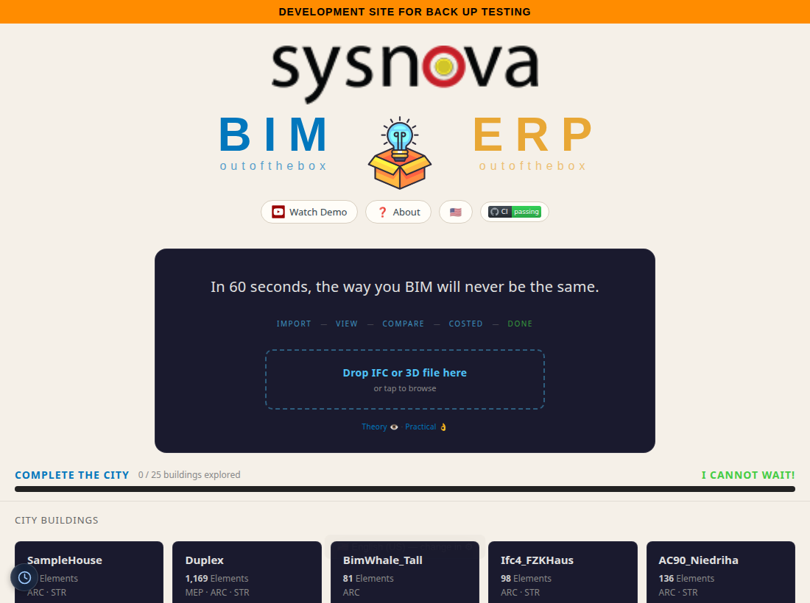

**Three ways in — pick one:**

1. **Open a ready-made building.** Tap a card under **City Buildings** or **Landmark Buildings**
   (SampleHouse, Duplex, Clinic, Terminal, Hospital, …). It downloads that building's DB (0.5–177 MB),
   flies to it, and streams the geometry in the 3D viewer.
2. **Drop your own IFC.** Drag an `.ifc` / `.obj` / `.dae` / `.glb` file onto the centre **"Drop IFC /
   3D files here"** zone (or tap it to browse). The file is parsed in-browser and opens in the viewer.
3. **Add to an existing project.** When you drop a file that matches a building already loaded, a
   prompt offers **Merge** (combine disciplines — `Enter`) or **New** (a fresh building — `Escape`);
   two versions of the same building can be opened side-by-side with **Compare Versions**.

Once the viewer opens:

1. Watch the progress bar and element flicker as geometry streams in.
2. **Click any element** → the Info panel shows its IFC class, name, GUID, storey, discipline, material.
3. **Filter** by storey or discipline (bottom-left panels) to isolate part of the model.
4. **Alt+Z** for X-Ray, **☆** for white background, **✈** to fly around, **📷** for a screenshot.
5. Open another building → the first pauses; tap back to resume.

Full navigation, panels, and the keyboard cheat-sheet are below.

---

## Run it on your own machine

**Local setup (3 steps):**

```bash
# 1. Go to deploy folder
cd deploy

# 2. Start local server
python3 -m http.server 8080

# 3. Open the front door in your browser, then choose Buildings / IFC
# http://localhost:8080/index.html
```

Per-building DBs must be in `deploy/buildings/`:
- `{Name}_extracted.db` — metadata + transforms
- `{Name}_library.db` — geometry BLOBs (vertices + faces)

Then open `http://localhost:8080/index.html`, choose **Buildings / IFC**, and use the same three ways in as above.

**DB sizes:**

| Building | Elements | Download (ext+lib) |
|----------|----------|--------------------|
| SampleHouse | 65 | 0.5 MB |
| Duplex | 1,169 | 2.8 MB |
| Clinic | 16,480 | 31 MB |
| Terminal | 48,428 | 59 MB |
| Hospital | 63,917 | 88 MB |
| LTU AHouse | 125,698 | 177 MB |

---

## 3D Navigation

| Input | Action |
|-------|--------|
| **Drag** | Orbit camera |
| **Shift + Drag** | Pan camera |
| **Right-click drag** | Pan camera |
| **Scroll / Pinch** | Zoom |
| **Click** element | Identify — shows IFC class, name, GUID, storey, material |
| **Alt+Z** | X-Ray toggle (15% opacity) |
| **F11** | Fullscreen toggle |

**Toolbar buttons (top-right panel):**

| Button | Action |
|--------|--------|
| **Clear** | Remove all streamed meshes |
| **X-Ray** | Toggle 15% transparency on all elements |
| 📷 | Screenshot (saves PNG to Downloads/) |
| ⛶ | Fullscreen |
| ☆ / ☾ | Light/dark theme |
| ✈ | Fly around rendered buildings |

**Panels:**

| Panel | Position | Shows |
|-------|----------|-------|
| **BIM OOTB** | Top-left | Buildings, streaming progress, element flicker |
| **Tools** | Top-right | Filter, buttons, building list |
| **Info** | Bottom-right | Clicked element metadata (class, GUID, storey, disc, material) |
| **Storeys** | Bottom-left | Floor filter — click to isolate one storey |
| **Disciplines** | Bottom-left | Discipline toggle — show/hide ARC, STR, MEP etc. |
| **Status** | Bottom-centre | Current streaming state |

All panels collapse with **−/+**.

---

## Viewer Features

**All browsers (desktop + mobile):**

- 3D orbit, pan, zoom (mouse or touch)
- Click any element → IFC class, GUID, storey, discipline, material
- Fly-tour — auto-orbits rendered buildings, click to stop
- Indoor walk-through — follows IfcSpace/door graph through the building
- X-Ray mode (Alt+Z) — a 3-state cycle: **Off → X-Ray → Bounding Boxes → Off**. X-Ray is the transparent
  see-through-walls view; Bounding Boxes swaps that for each element's envelope box instead — press again to cycle
- Measure tool — tap two points, get distance in metres
- Section cut — horizontal clip plane, slider to cut through floors
- Storey filter — isolate a single floor
- Discipline toggle — show/hide ARC, STR, MEP, ELEC, etc.
- Screenshot — saves current view as PNG
- Deep-link URL — camera + building state encoded in hash, shareable
- IndexedDB cache — download once, instant on revisit
- City mode — 786 building bboxes, click to download + stream on demand

### Find panel — search, voice query, and axis lenses

The **Find** panel is the Viewer's search/navigate surface: a text or voice query box up top, and a
single axis toggle underneath that re-groups the whole element tree (by storey, discipline, room,
material, phase, or the newest axis, building **Parts**).

**How to open it** (with a building already loaded — see [Quick Start](#quick-start-your-first-building)):

1. On the right edge of the screen, find the toolbar rail (desktop) or the scrollable pill strip
   (mobile) — tap the **···** button if the rail isn't already showing. Find the **Navigate** icon
   (a sailboat glyph) among the rail's icons.
   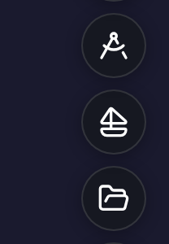
2. Tap **Navigate**. The **Navigate** drawer opens, listing **Find / Navigate**, **World History**,
   **Page History**, and **Home** (a fifth row, **Walk**, is mobile-only and won't appear on desktop).
   Tap the **Find / Navigate** row (magnifying-glass icon, shortcut **F**).
   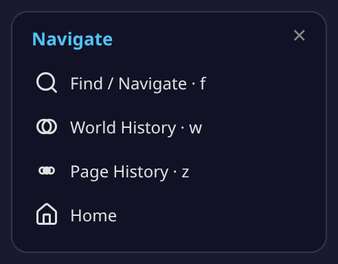
3. The **Find panel** opens on the right side of the screen, with the search bar focused and ready to
   type. On desktop you can also press **F** to open it directly, from anywhere in the viewer.
   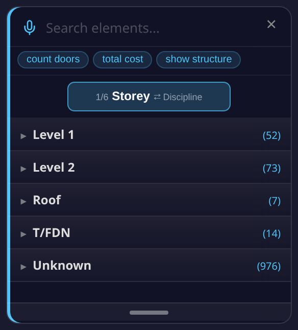
4. Tap the **×** in the top corner of the panel, or press **F** again, to close it.

**The search / query box.** The input (placeholder *"Search elements…"*) does two different things
depending on what you type:

- **Plain text** (e.g. a product name, or an IFC class like "door") filters the element tree live as
  you type — a normal name/class search.
- **A natural-language query** — anything starting with a recognized verb (`count`, `how many`,
  `number of`, `total`, `cost`, `show`, `list`, `what`, `find`, `search`) is detected as you type.
  Recognized phrases don't filter the tree live like a plain search does — type the phrase, then press
  **Enter** to run it. Recognized query shapes include:
  - `count doors` / `how many beams` / `number of windows` — element count by IFC class.
  - `total cost` — an indicative 5D cost breakdown by IFC class, using the active rate pack.
  - `cost of <discipline or class>` — cost narrowed to one discipline (e.g. "cost of electrical") or class.
  - `total area` / `total length` / `total volume` [`of <class>`] — element count as a proxy quantity
    (the loaded DB does not carry IFC quantity-takeoff dimensions, so this is a count, not a measured
    area/length/volume).
  - `floor area` — a slab count (same caveat: no measured floor-area dimension in the DB).
  - `show <discipline>` / `list <discipline>` — every element in that discipline, grouped by class.
  - `what disciplines` — every discipline present in the building, with element counts.
  - `find <term>` / `search <term>` — routes back into this same Find panel as a plain search for `<term>`.
  - `floor <n> <class>` / `ground floor <class>` — a storey-scoped count (e.g. "floor 2 beams").
  - A more general typed-language decoder is tried first and understands a broader range of phrasing;
    the patterns above are the documented fallback when that decoder doesn't recognize the phrase.
  - Three example chips below the box — **count doors**, **total cost**, **show structure** — run a
    query immediately when tapped, no typing required.
  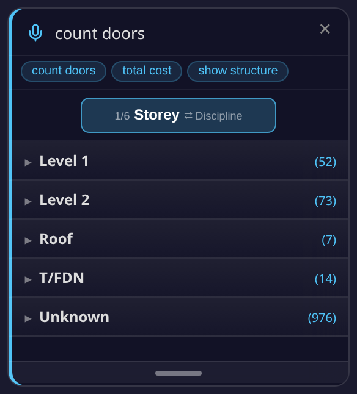
- **Voice search** — tap the microphone icon to the left of the text box and speak a query using the
  same phrasing as above (e.g. "count doors"). The recognized text fills the box live while you speak
  (shown in italics until finalized), and the finished phrase runs automatically — no need to press Enter.

**The axis toggle.** Below the search bar, one button shows the current axis and how many are
available (e.g. "1/6 Storey" on a building where all six axes are present) — tap it to cycle to the
next axis. Two axes are always present; up to four more appear only when the loaded building actually
has that kind of data (no data, no empty axis):

| Axis | Always shown? | What it shows |
|------|----------------|----------------|
| **Storey** | Always | Elements grouped by building level/storey. Expand a storey to see the rooms/spaces on it (or, if the building has no room data, its most common IFC classes). Tapping a storey or room isolates it in the 3D view. |
| **Discipline** | Always | Elements grouped by discipline (ARC/STR/MEP/ELEC, etc). Expand a discipline to see its IFC classes; tap a class to highlight just those elements. |
| **Room** | Only if the building has volumetric room (IfcSpace) data | A highlight lens: the model is X-rayed and a translucent box is drawn over each room. Has its own **Storey / Type / Path** sub-toggle: group rooms by floor, by the compiler's own confidence tier (see [Room health](#room-health-the-type-sub-toggle-verified-live-on-terminal) below), or route between two rooms the way a person walks. (On a building without volume data, this falls back to a plain isolate-by-room list instead.) |
| **Material** | Only if material data is present | Elements grouped by material name, or — via a **Material / Category** sub-toggle — by a derived construction category (Concrete, Metal, Wood, Glass, Drywall/Partition, Masonry, Insulation, Tile, Finish, Membrane, Flooring, Generic, Other). Categories are a keyword-derived heuristic, not an extracted IFC property, and are labelled accordingly in the panel. Highlight lens, same X-ray-and-box behavior as Room. |
| **Phase** | Only if a construction timeline can be generated for the building | Elements grouped by construction phase/task, generated on the fly (a short "Timeline generating…" message appears first). |
| **Parts** *(new)* | Only if the building has stairway, lift-shaft, or plant-room elements | Elements grouped into up to three building-part categories: **Stairway** (stair/ramp classes), **Lift Shaft** (elements named for lifts/elevators), **Plant Room** (HVAC-plant elements — vents, ducts, fans, AHUs, dampers, chillers, pumps). Each category is itself data-gated — it only appears if the building actually has a match. Tapping a category, or a single item inside it, isolates it in the 3D view (hides the rest of the model). |

  

**Room highlight, verified live on HHS Office.** Level 2 alone compiles 31 real rooms (105 across the
whole building) — tapping one X-rays the model and draws a clean, correctly-bounded translucent box
over just that room, confirming the room's geometry is well-formed and doesn't overlap its neighbours.
On a larger building, the biggest rooms on a floor stand in for a "hall"-scale space until a real
labelled corridor/hall example is captured (HHS's own rooms carry no such label yet — a future guide
pass).

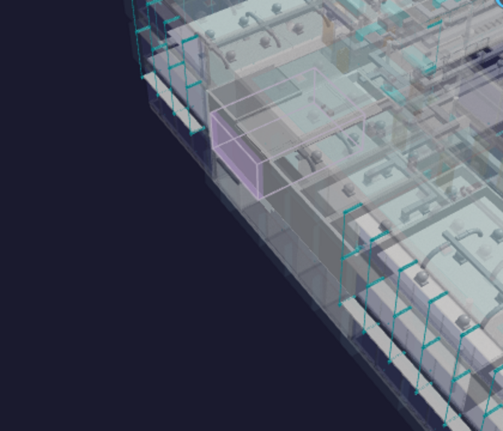

*Known gap, not glossed over:* tapping a room does not currently reframe the camera to it (confirmed
live, 2026-07-12) — the highlight is accurate, but you may need to manually orbit/zoom to see a small
room clearly on a large building. Tracked for a future fix.

> The Parts axis is the newest addition (bim-ootb `d04ddd5`) — see
> `prompts/VIEWER_FIND_PANEL_PARTS_VERIFICATION.md` for its live verification on Duplex/SampleCastle data.
> A false-positive/missing-class-gate bug found after that verification (`prompts/FIND_PANEL_PLANT_ROOM_GATE_FIX.md`)
> is now fixed (bim-ootb PR #740/#742) — Plant Room only shows on `complex`-class buildings (Terminal,
> Clinic, Hospital, HHS), never on residential ones, and its keyword match is word-boundary-checked to
> avoid substring false positives like "Backflow Preventer" matching "vent".

*Not yet confirmed from source, flagged rather than guessed:* the exact on-screen wording of the axis
toggle's next-axis hint on narrow/mobile screens, and whether the typed-language decoder mentioned above
recognizes any further phrasing beyond the regex patterns documented — both would need a dedicated read of
`decoder.js`, which was out of scope for this pass.

*Also discovered while capturing these screenshots (reported, not fixed here — this task is docs-only):*
the natural-language query hint text described above is written into the DOM by `navigate_find.js`
`_handleInput()`, but the panel's `results-expanded` CSS class (which gives `#find-results` its visible
height) is only added by the plain-search code path, not the NL-query path — so, live, no visible hint
actually appears while typing a recognized phrase; the query still runs correctly on **Enter**. The guide
text above describes the observed (silent) behavior, not an invented visible hint.

#### Room health — the Type sub-toggle (verified live on Terminal)

Switch the Room axis's grouping from **Storey** to **Type** and rooms are grouped by the compiler's
own confidence in them, not by a floor: **INTERNAL** / **INTERNAL_SMALL** (ordinary enclosed rooms,
split by size) and **SUSPECT_OPEN** / **SUSPECT_NO_DOOR** (rooms the compiler could bound
geometrically but flags for a human rather than silently accepting). This is the compile-with-honesty
principle made visible — a low-confidence room is *shown* as low-confidence, never quietly promoted
to "room" just because it fits inside walls.

**Terminal, the hard case, verified live.** A user-reported screenshot showed a stairwell counted as
a room — the compiler doesn't know "stairwell" as a concept, only geometry, and a tall vertical shaft
can look room-shaped from a single floor's footprint alone. The fix (**STAIRWELL-STACK reject**)
rejects a room candidate whose footprint recurs, stacked, through multiple storeys with a real stair
inside it — the signature of a shaft, not a room — checked against both compiler mirrors, 6/6 parity.
Reloading Terminal applies the healed patch over whatever the browser had cached already: **59 rooms →
40 rooms, 73 rects, no room anywhere near the shaft threshold** — the stairwell is gone from both the
Room list and the 3D view.

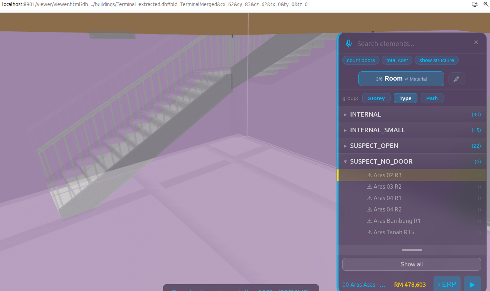

That SUSPECT_NO_DOOR pick is the demo frame: an empty pocket next to the stair, no door found
bounding it, so the compiler says exactly what it knows and stops — it doesn't invent a door to make
the room look finished.

*Known gap, named not hidden:* Type is a **health** taxonomy (how sure the compiler is this is a
room), not a **semantic** one — it doesn't yet know "corridor" from "office." Terminal's concourses
show no CORRIDOR band today because the only measured corridor template on file is Duplex's 10.4m²
hallway (n=2 samples), and stretching that onto a terminal concourse would be inventing, not
compiling. The room-path routing below already produces a building-relative, *measurable* definition
of a corridor — the elongated, many-doored room every route keeps passing through — scoped as a
future CIRCULATION_DISPLAY pass, not built yet.

#### Room-to-room paths & escape routes

With the **Room** axis selected, the **Path** sub-mode routes between any two rooms the way a
person actually walks — out the door, along the corridor or concourse, and up or down the stairs
when the two rooms are on different floors. The route draws as a line through the real doors and
stair flights it uses, and the rooms along the way stay highlighted.

*Verified live (2026-07-12):* a real route across Terminal's floors returns several stair-crossing
legs in sequence, not a single best-guess hop — each leg names the room and the door or stair flight
it passes through.

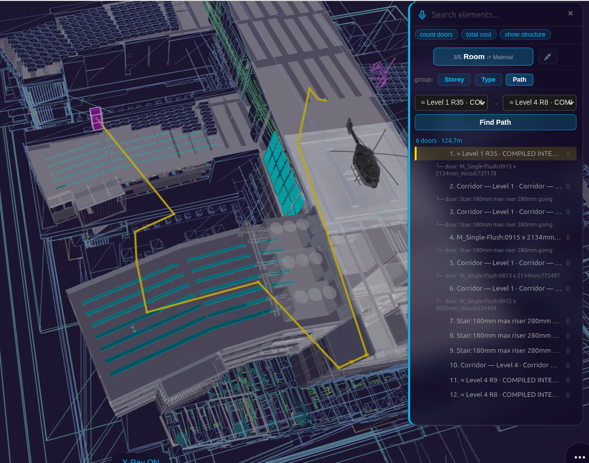

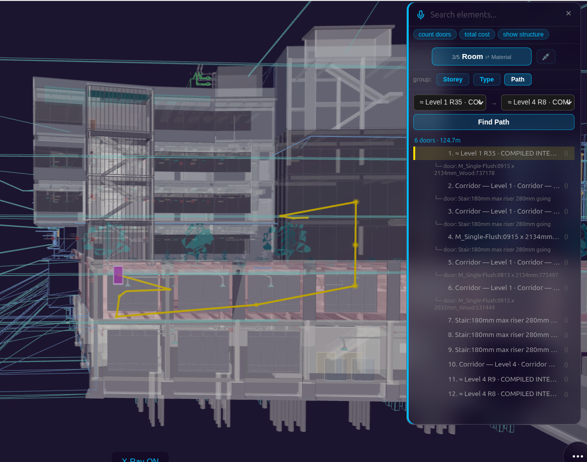

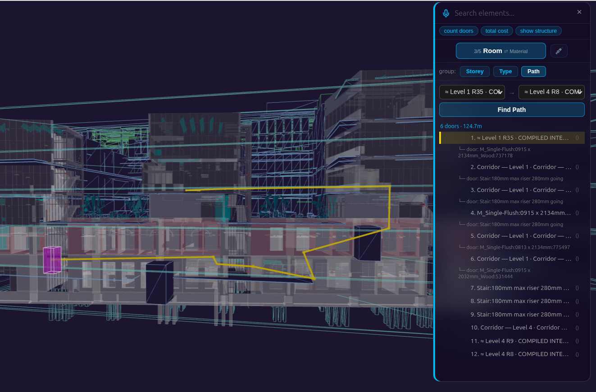

*Known limitation, reported not fixed (2026-07-26):* on some buildings — confirmed on Hospital — a
room-to-room path can currently draw as a straight line that cuts through open air or atrium space
instead of hugging the real walkable floor, and/or zigzag through a door pair it didn't need to use,
rather than the clean corridor-hugging route described above. A real route on Hospital
(`≈ Level 1 R35 → ≈ Level 4 R8`, 124.69m) reproduced this live: 5 of its 6 same-storey legality checks
failed to find a valid detour, which is why the drawn line doesn't hug the floor in the screenshots
above. This is a known, tracked issue, not newly discovered here — the full technical trail is in
`prompts/Modeller/DISC_Walker/VIEWER_FIND_PANEL_ROOM_ACCURACY.md` §9–§16 for anyone who wants it.

*Future feature — fire escape:* the same routing will pin a **Fire Escape** entry at the top of the
path list — one tap from any room to the nearest building exit.

*Future feature — mobile:* scan a QR code posted beside a door to fetch that building's lightweight
architecture model on your phone and see the escape route in Walk mode from exactly where you stand.

### The rest of the Navigate drawer — World History, Page History & Home

The **Navigate** drawer (sailboat icon — see [Find panel](#find-panel-search-voice-query-and-axis-lenses)
above for how to open it) has three more rows besides Find / Navigate:

- **World History** (shortcut **W**) — a cross-page timeline: every significant action across *every*
  page — Viewer, ERP, Gravity — in one place. Opens a card with a **Whole / This page** toggle, day-by-day
  navigation (**‹ day** / **day ›**), and one entry per action (what happened, where, and when).
  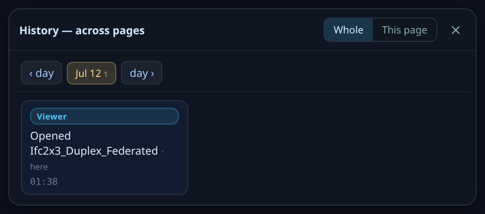
- **Page History** (shortcut **Z**) — this page's own compact dot-timeline, a small step-back/step-forward
  bar. It only lights up once you've made edits in this session — a fresh session shows an empty strip
  (the pair of arrows either side of a single dot), as captured here.
  
- **Home** — returns to the front-door hub (the same page the [Quick Start](#quick-start-your-first-building)
  walkthrough starts from). Installed as a standalone app (PWA), it opens the live hub online, or falls
  back to the cached hub offline.

### Inspect drawer — Measure, Clash, X-Ray, Section, Time Machine, 4D/5D, Fly Tour

The **Inspect** drawer (compass icon, next to Navigate on the toolbar rail) bundles seven tools behind
one icon:

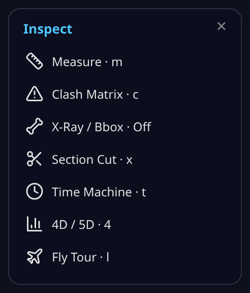

- **Measure**, **X-Ray / Bbox**, **Section Cut**, and **Fly Tour** are covered above, under
  [Viewer Features](#viewer-features).
- **Clash Matrix** (key **C**) opens the clash-detection engine (discipline-pair grid, tolerance, Review /
  Resolve / Accept status, HTML + CSV export) — full coverage: **[Clash Detection guide](CLASH_DETECTION.md)**.
- **Time Machine** (key **T**) opens the 4D construction timeline — author a schedule, play it back,
  try a What-if slip, share a `?tm=play` link. On a large building (100K+ elements), a box-cube pill
  in the panel header trims GPU cost by rendering already-built-but-out-of-view elements as lightweight
  wireframe boxes, keeping whatever you're actually looking at full LOD400.

  <figure style="margin: 12px 0;">
  <a href="https://youtu.be/juwOrpqKhFE" target="_blank"></a>
  <figcaption style="text-align:center; font-style:italic; color:#666; margin-top:6px;"><a href="https://youtu.be/juwOrpqKhFE">Watch on YouTube</a> — Time Machine playback on a large building with the box-cube proxy toggle.</figcaption>
  </figure>

  Full authoring/playback walkthrough already lives in
  **[Kernel-ERP User Guide → Time Machine](ERPUserGuide.md)** (not re-documented here — same building,
  same feature, reached from either app), including the
  **[ERP-side entry point](ERPUserGuide.md#author-the-4d5d-schedule--build-it-up-from-the-model-live)** —
  picking an element in 3D (or a red **Zoom Across** pill on an ERP record) jumps the Time Machine
  straight to that element's construction moment.
- **4D / 5D** (key **4**) opens the analytics dashboard (`boq_charts.html`) for the loaded building in a
  new tab — full coverage: **[4D/5D Analysis guide](4D5DAnalysis.md)**.

### Camera / View drawer

The **Camera / View** drawer (camera icon) bundles three camera-control toggles:

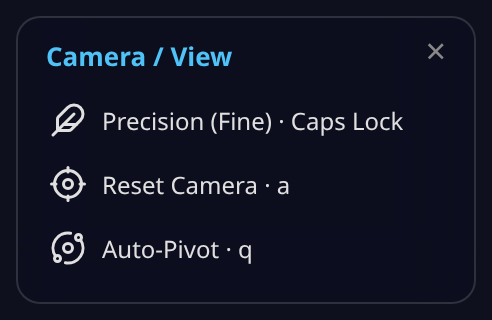

- **Precision (Fine)** (Caps Lock) — slows orbit/pan/zoom for fine, deliberate camera moves (e.g. lining
  up a screenshot or a measurement).
- **Reset Camera** (key **A**) — snaps the camera back to its default orbit position.
- **Auto-Pivot** (key **Q**) — toggles automatic pivot-point recentring as you orbit, so the camera keeps
  turning around whatever's in view instead of a fixed point.

### Display options — Palette, Night, Shadow + Ground, Background, Sound FX

The **Palette** pill (key **P**) opens one panel for every visual-appearance control — five lighting
sliders, plus four more toggles appended below them:

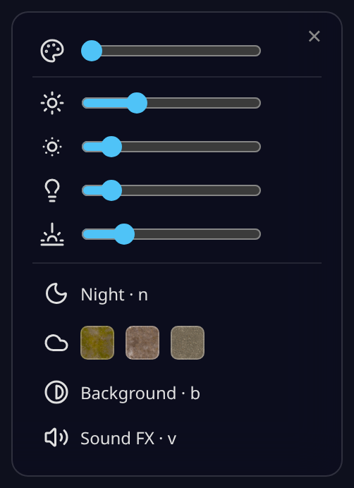

| Control | Shortcut | What it does |
|---|---|---|
| Ambience / Sun / Exposure / Ambient / Hemisphere | — | Five sliders — overall scene lighting, sun intensity, camera exposure, ambient fill light, and sky/ground hemisphere light. |
| **Night** | **N** | Toggles a night lighting preset. |
| **Shadow + Ground** | **H** | Cycles **Off → Grass → Earth → Paved** — a real ground-texture swatch under the building, with matching shadows. |
| **Background** | **B** | Reverses the background (dark ↔ light/white). |
| **Sound FX** | **V** | Toggles synthesized UI/Time-Machine/Fly-Tour sound cues — no audio files, off by default. |

### Settings

The **Settings** pill (key **=**) opens a panel with four sections:

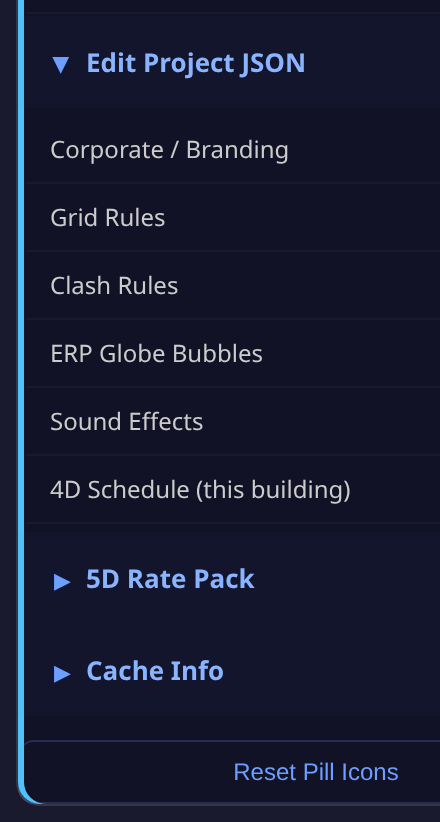

- **Pill Icons** — show/hide/reorder every toolbar action, and see each one's current shortcut key at a
  glance (this is also how a hidden action like a data-gated drawer row becomes visible once its data
  exists). A **Reset Pill Icons** button restores the defaults.
- **Edit Project JSON** — a power-user hub: open and edit any of the project's config files directly
  in-browser (auto-inferred form fields, not raw text), then **Download** the edited file to commit back
  to the repo, or **Reset** to discard the override. Six files are registered: **Corporate / Branding**,
  **Grid Rules**, **Clash Rules**, **ERP Globe Bubbles**, **Sound Effects** (the audio *parameters* file —
  distinct from the Display-options Sound FX on/off toggle above), and a **read-only** view of the
  **4D Schedule** captured for the currently-open building (the same data Time Machine authors).
- **5D Rate Pack** — pick which cost-rate pack is active (the same rate pack the Find panel's
  `total cost` query and the 4D/5D dashboard both price against).
- **Cache Info** — see how much this building's data is using in IndexedDB, and clear it.

  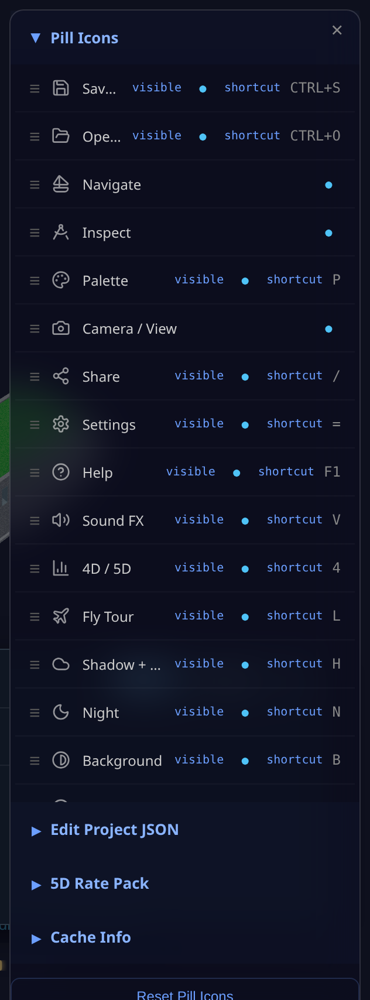

### Save & Open a building

Two toolbar pills, both native-dialog verbs — distinct from the Hub's building-open flow in
[Quick Start](#quick-start-your-first-building):


- **Save Building** (**Ctrl+S**) — saves the currently open building, including any session edits
  (clash resolutions, captured 4D schedule, etc.), to a `.db` file via the browser's native Save As dialog.
- **Open Building** (**Ctrl+O**) — opens a previously-saved `.db` file via a native Open dialog, replacing
  the current scene.

### Share

The **Share** pill (key **/**) is a step up from the plain deep-link URL: on mobile, it hands the current
view to the device's native share sheet with a snapshot photo attached; on desktop (no native share API),
it shows a preview card — a live snapshot, the building name, the same deep-link URL described above, and
**Copy Link** / **Cancel** buttons. If a clash is open when you tap Share, the shared text and photo are
about that specific clash instead of the general view.

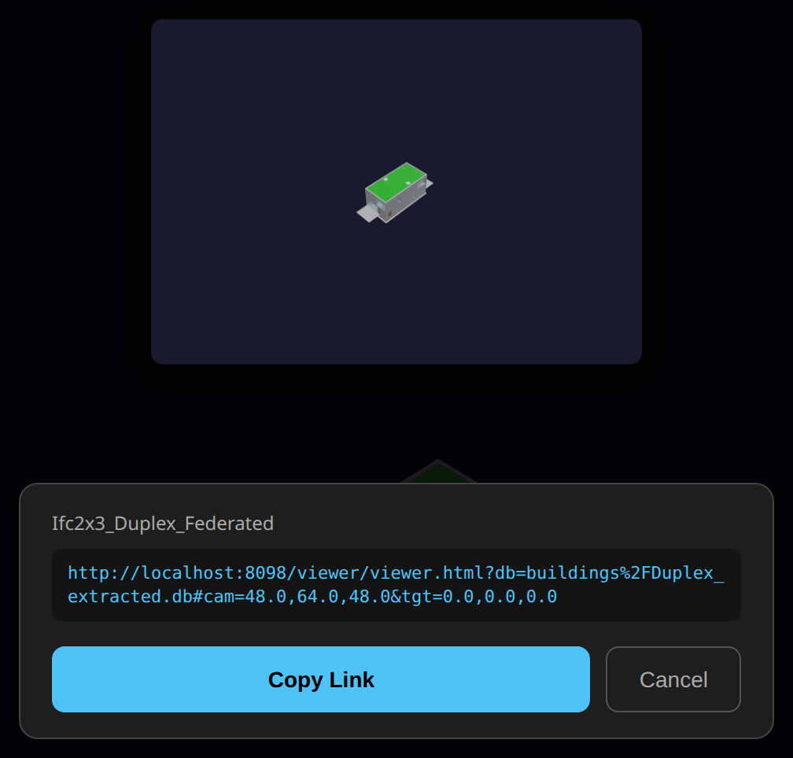

### Pick Walk — warehouse / logistics buildings

A data-gated pill (only appears when the loaded building carries locator-GUID bins, e.g. a warehouse
building like GardenWorld) that walks a picking route over the bins: fly to the next bin in order, scan
a bin's QR/type code, and record a signed pick group per bin. Not covered further here — it needs a
warehouse-class building loaded to demonstrate, outside this general viewer guide's scope.

<a id="find-lenses-tenancy"></a>
### FM / Operate lenses — HR_BIM_Asset  *(ALPHA)*

The viewer carries one **`FM / Operate`** toolbar pill (a building glyph) that opens a wake-aware drawer of
operate-phase lenses — **Occupancy** (incl. lease status) · **Presence** · **Unit class** · **Assets / IoT** ·
**Dashboard**. It appears only when the loaded building carries operate data, and each lens is enabled only when
*its* data exists (else greyed) — no data, no clutter.

→ **Full walkthrough (with screenshots): [HR / Tenancy / Operate Module guide](HRBIMAssetGuide.md).**

**Collaborate on the model — the Teams overlay.** One toolbar toggle overlays **who-did-what** on the building:
identity-coloured dots on elements and Find-panel rooms, a history/blame tree, a chat that **is** the signed log,
and dashboard graphs — off by default, pixel-identical until you turn it on.
→ **[Teams Overlay guide (with screenshots)](TeamsOverlayGuide.md).**

**Mobile-only (touch-optimised):**

- Site Camera — phone camera with GPS + compass + timestamp overlay
- BIM picture-in-picture — 3D snapshot composited into the photo
- Markup tools — arrow, circle, freehand draw, text annotations
- Share → WhatsApp (with BIM context baked into image)
- GPS Walk Mode — blue dot tracks position in the model
- Wall X-Ray — tap a wall in Walk Mode to see MEP behind it
- Issue log — capture site issues with photo + GPS + classification, export to Excel

---

## Keyboard & Mouse Cheat-Sheet

| Key / Gesture | Action |
|---------------|--------|
| **Drag** | Orbit camera |
| **Shift + Drag** / **Right-click drag** | Pan camera |
| **Scroll / Pinch** | Zoom |
| **Click** element | Identify — IFC class, name, GUID, storey, material |
| **Front / Back / Left / Right** | Elevation views |
| **Roof** | Roof plan view |
| **Alt+Z** | Toggle X-ray mode |
| **F11** | Toggle fullscreen |
| **F1** | Help — the full, live list of every toolbar action and its shortcut key |

> Authoring — editing the structural grid, sketching, extruding — lives in the **[DAGeVu Modeller](ModellerGuide.md)**, not the Viewer.

---

## Further Reading

| Doc | What |
|-----|------|
| [Kernel-ERP User Guide](ERPUserGuide.md) | iDempiere browser ERP — login → install → POS → reporting · [Tenancy](ERPUserGuide.md#hr-tenancy) |
| [DAGeVu Modeller Guide](ModellerGuide.md) | Author geometry — the editable 3D Grid |
| [Clash Detection](CLASH_DETECTION.md) | Clash detection engine |
| [4D/5D Analysis](4D5DAnalysis.md) | nD analytics (4D–8D) |

---

*Copyright (c) 2025-2026 Redhuan D. Oon. MIT Licensed.*
