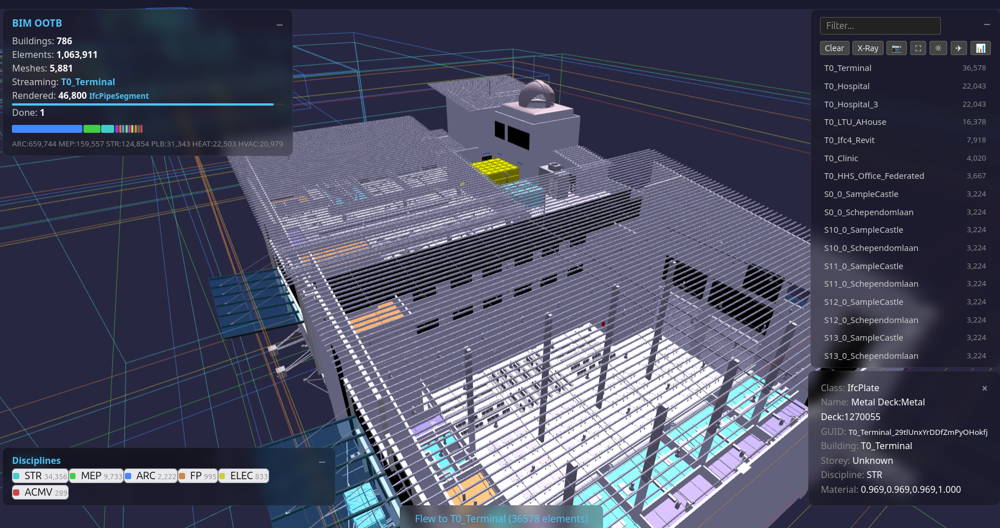
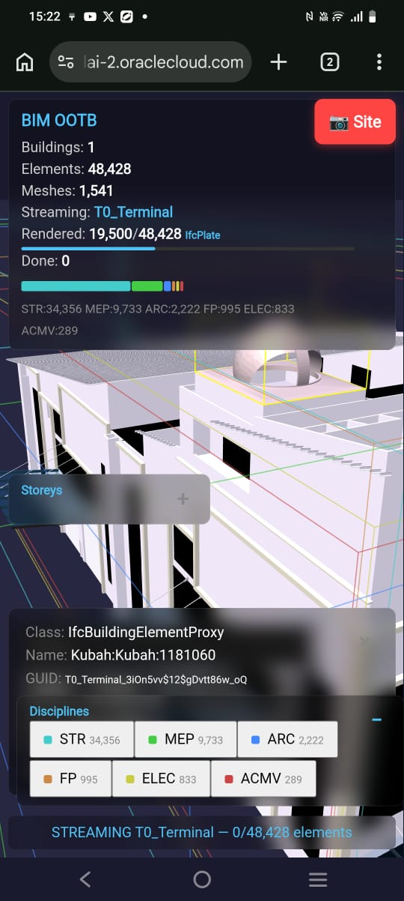
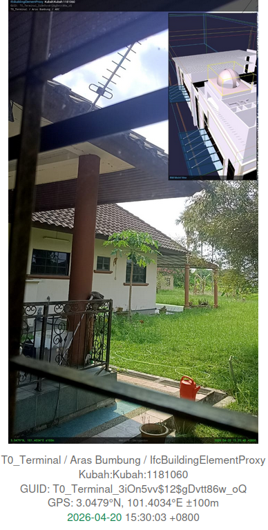
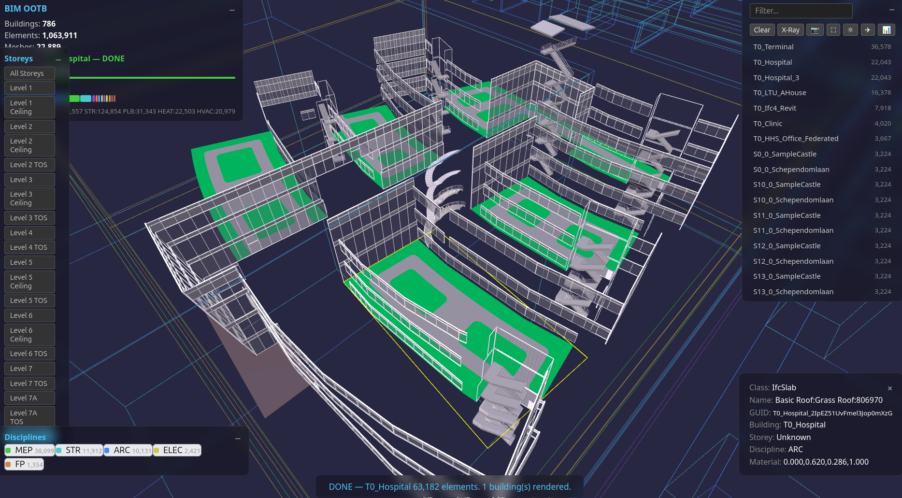

# BIM Designer — Browser Edition
> **Foundation:** [BIM_Designer.md](BIM_Designer.md) · [RTreeGuide.md](RTreeGuide.md) · [MANIFESTO.md](MANIFESTO.md) · [4D5DAnalysis.md](4D5DAnalysis.md)

<div class="bim-banner" markdown>
<b>BIM OOTB — Frictionless BIM. Two DBs. One browser. Zero install.</b> One HTML file. Two SQLite DBs. Zero server. 126K elements streaming in your browser — no install, no conversion, no vendor lock-in. The DB IS the application.
</div>

**Version:** 0.2 (2026-04-22)
**Status:** LIVE — modular sandbox viewer (S209 refactor)
**Depends on:** `deploy/sandbox/index.html` + 15 JS modules, per-building DBs in `deploy/buildings/`

<figure style="margin: 20px 0;">

<figcaption style="text-align:center; font-style:italic; color:#666; margin-top:8px;">BIM OOTB — 126K elements streaming in the browser. No install, no server, no conversion.</figcaption>
</figure>

---

## 1. What Changed — The S200 Proof

S200 proved that a single HTML file + two static DBs + sql.js (WASM SQLite)
renders IFC buildings in the browser with:
- Correct rotation, transparency, original IFC material colours
- Streaming from BLOB geometry (no intermediate format)
- 126K elements (LTU AHouse) renders to completion
- X-Ray mode (Alt+Z), trackpad orbit/pan, flat shading
- No server, no API, no backend

This breaks the client bottleneck. Every Bonsai feature that reads from the DB
(not Blender-specific) can be replicated in the browser. The DB schema IS the API.

### 1.0 The Technology Stack — WebAssembly (WASM)

The enabling technology is **WebAssembly (WASM)** — a binary instruction format
that runs native-speed code inside the browser sandbox. What matters for us:

**sql.js** compiles the entire SQLite C library (~250K lines) to WASM. The browser
downloads a ~1MB `.wasm` file from CDN, and from that point it has a full SQL
engine running locally — the same SQLite that powers every smartphone on earth.
When we call `db.exec("SELECT vertices FROM component_geometries WHERE ...")`,
that query runs inside the browser tab at near-native speed. No server round-trip.

**Three.js** is the 3D rendering library. It wraps WebGL (the browser's GPU API)
and gives us `BufferGeometry` — the ability to hand raw vertex/face arrays to the
GPU. When we unpack a BLOB from SQLite into a `Float32Array`, Three.js renders it
in microseconds. The GPU doesn't care where the data came from.

**The pipeline in the browser:**
```
sql.js (WASM)                    Three.js (WebGL/GPU)
     │                                │
     │  SELECT vertices, faces        │
     │  FROM component_geometries     │
     │  WHERE geometry_hash = ?       │
     ▼                                │
  Uint8Array (BLOB)                   │
     │                                │
     │  new Float32Array(blob)        │
     │  swap axes: IFC→Three.js       │
     ▼                                │
  Float32Array (positions)  ─────────▶ BufferGeometry
                                       │
                                       ▼
                                    GPU renders mesh
```

No intermediate file format. No glTF. No OBJ. No server-side conversion.
The BLOB in the DB IS the mesh. The browser IS the renderer.

### 1.1 What Changed — Honest Assessment

Individual components existed before. What's new is the **combination at scale**
and the elimination of server-side infrastructure.

| Component | Prior Art | What We Added |
|-----------|-----------|---------------|
| sql.js WASM | Existed since 2016. Could load large DBs if browser had RAM. | Per-building DB split + IndexedDB caching. Each building downloads in 1-2s, cached for instant revisit. No server needed. |
| Three.js BufferGeometry | Mature since 2015. Every web viewer uses it. | Nothing — we use it as-is. |
| DB-as-model | IFC.js (2020) parses IFC in WASM. Speckle (2019) serves objects via API. | Different architecture: we store **pre-tessellated BLOBs** in SQLite alongside metadata. No re-parsing, no API server. The browser queries the same DB for both geometry and properties. IFC.js re-parses geometry each time. Speckle requires a server. |
| Browser BLOB streaming | glTF/OBJ loading in browsers since 2015. IFC.js streams parsed geometry. | Streaming from **SQLite BLOBs** (not file formats) means geometry and metadata share one query layer. No export/import step — the BLOB is a column, not a file. |
| nD analytics (4D-8D) | SQL queries on element attributes — the operations themselves are standard relational algebra. | The novelty is the **template-driven engine** + **single-DB pipeline**: 5 dimensions from one `_extracted.db`, user-editable JSON templates, self-healing dependency chain, 8.7s at 1M elements. Commercial tools charge $60-180K/yr and silo each dimension behind separate vendors. |

**What's genuinely new:** the full pipeline — IFC → extracted DB → pre-tessellated BLOBs →
browser renders geometry AND runs analytics from the same SQL layer, with zero server
infrastructure. The components existed. The integration at 126K elements with 60fps did not.

---

## 2. Deployment Architecture

### 2.1 Static File Deployment (OCI / Any CDN)

```
┌──────────────────────────────────────────┐
│  OCI Object Storage (public bucket)      │
│                                          │
│  index.html (landing page)               │
│  rtree_browser_demo.html (viewer)        │
│  manifest.json (building catalogue)      │
│  buildings/                              │
│    city_index.db (324KB — 786 bboxes)    │
│    SampleHouse_extracted.db (0.1MB)      │
│    SampleHouse_library.db (0.4MB)        │
│    Hospital_extracted.db (28MB)          │
│    Hospital_library.db (59MB)            │
│    ... 30 archetypes × 2 DBs each       │
└──────────────┬───────────────────────────┘
               │  fetch() per building (1-2s)
               ▼
┌──────────────────────────────────────────┐
│  Browser (any modern browser)            │
│                                          │
│  sql.js (WASM) ← CDN                    │
│  Three.js      ← CDN                    │
│  OrbitControls ← CDN                    │
│                                          │
│  IndexedDB cache (bim_ootb_cache)        │
│    → first visit: download + cache       │
│    → repeat visit: instant from cache    │
│                                          │
│  DB in WASM → SQL queries → BLOBs       │
│  → BufferGeometry → GPU render           │
└──────────────────────────────────────────┘
```

**No server. No API. No Docker. No backend. Just files.**

### 2.2 Loading: Per-Building Direct Download + Cache

Each building is a separate DB pair (`{name}_extracted.db` + `{name}_library.db`).
Browser downloads the pair via `fetch()`, loads into sql.js (in-memory SQLite), renders with Three.js.
**IndexedDB cache** (`bim_ootb_cache`) stores downloads — second visit is instant (no network).

> **httpvfs (HTTP Range requests) was tried and retired.** Each SQLite page fetch = 130ms network
> round-trip. A single query on a 579MB DB needs 50-100 page fetches = 6-13 seconds of stalling.
> Direct download of per-building DBs (1-60MB each) completes in 1-2 seconds. See S203 prompt for details.

### 2.3 Per-Building DB Sizes

| Building | Elements | Unique Meshes | Download (ext+lib) |
|----------|----------|---------------|-------------------|
| SampleHouse | 65 | 51 | 0.5 MB |
| Duplex | 1,169 | 650 | 2.8 MB |
| HITOS | 2,593 | 1,706 | 5.9 MB |
| Clinic | 16,480 | 7,654 | 31 MB |
| Terminal | 48,428 | 7,150 | 59 MB |
| Hospital | 63,917 | 23,045 | 88 MB |
| LTU AHouse | 125,698 | 51,392 | 177 MB |

All 30 archetypes extracted. Extraction script: `scripts/extract_per_building.py`.

---

## 3. Feature Roadmap — What Goes In

### Phase 1: Viewer + Inspector (S200 — DONE)

- [x] Building bbox wireframes (city overview)
- [x] Click building → stream geometry from BLOBs
- [x] Per-element rotation (Euler XYZ)
- [x] Material transparency (alpha from material_rgba)
- [x] IFC material colours (discipline fallback for NULL)
- [x] Flat shading (crisp BIM edges)
- [x] Building list panel (clickable cards, sorted by size, filter input)
- [x] Fly-to building
- [x] HUD: building name, streaming progress bar, element flicker
- [x] Trackpad + mouse orbit/pan/zoom (Shift+drag = pan)
- [x] Collapsible panels (−/+ toggle)
- [x] Element picker (click → class, name, GUID, storey, discipline, material)
- [x] Yellow bbox highlight on selected element
- [x] Hover highlight (emissive glow + pointer cursor)
- [x] Discipline toggle (show/hide per discipline, strikethrough when OFF)
- [x] Storey filter (isolate floors, works with discipline filter)
- [x] X-Ray mode (Alt+Z, 15% opacity)
- [x] Fly-around rendered buildings (orbit + auto-transition between buildings)
- [x] Screenshot (camera icon, white flash, downloads PNG)
- [x] Fullscreen (icon + F11)
- [x] Light/dark theme (white background, bboxes hidden for print)
- [x] URL deep-link (hash encodes building + camera position)
- [x] Stream pause/resume (switch buildings, resume where left off)
- [x] Unrestricted orbit (full 360° top-to-bottom)

### Phase 2: Next

- [ ] **Property panel** — selected element's full attribute set from DB
- [ ] **Multi-building streaming** — stream nearest on camera move, shred distant

### Phase 3: Analysis — nD Engine in the Browser
Query-driven overlays — same DB, richer SQL. The **nD engine** ([4D5DAnalysis.md](4D5DAnalysis.md))
already produces 4D-8D tables from JSON templates + `elements_meta`. Phase 3 ports this
to JavaScript (same SQL queries, same templates, same `_extracted.db` via sql.js).
No server — the browser IS the analytics engine.

- [ ] **nD engine (JS port)** — port `scripts/nD_engine.py` (~800 LOC) to browser JS
  Same JSON templates (`templates/*.json`), same SQL, same output tables.
  User drags custom `5D_rates.json` onto page → browser re-runs 5D with local rates.
  Self-healing: request 6D → auto-generates 5D if missing (same as Python engine).
- [ ] **BOQ/Cost overlay** — colour-code elements by cost band (5D)
  Query: `simple_qto` table (generated by browser nD engine or pre-baked in DB)
- [ ] **4D timeline** — slider scrubs schedule, elements appear/disappear
  Query: `construction_schedule` table → show/hide meshes by `start_date`
- [ ] **6D carbon heatmap** — colour intensity by embodied carbon per element
  Query: `carbon_audit` table
- [ ] **7D asset register** — click element → warranty, service interval, replacement year
  Query: `asset_register` table
- [ ] **8D safety overlay** — risk-level colour coding (LOW=green → VERY HIGH=red)
  Query: `hazard_register` table
- [ ] **Measurement tool** — pick two points, show distance
- [ ] **Section plane** — Three.js clipping plane, slider to cut through floors
- [ ] **Excel export** — SheetJS generates XLSX from SQL query results in-browser
  Same BOQ/schedule/carbon/asset/safety reports as `nD_engine.py --all`
- [ ] **Template editor** — HTML form to load/validate/save JSON templates (5D rates, 6D carbon, etc.)
  QS edits rates in browser, re-runs 5D, downloads Excel. Zero install.

### Phase 4: Composer (future — preserves BIM Designer vision)
This is where the original BIM Designer's building composition returns.
**This is the only phase that needs a backend.**
Phases 1-3 are 100% client-side, zero server.

- [ ] **Grid editor** — drag grid lines on 2D plan overlay, snap-to-grid
- [ ] **Room editor** — drag room bboxes within grid cells
- [ ] **BOM browser** — collapsible tree panel from BOM hierarchy in DB
- [ ] **Product picker** — query component_library for alternative products
- [ ] **Route Walker config** — choose MEP routing strategy, the server generates pipes/ducts
- [ ] **Compile trigger** — send Work Order to backend, receive compiled DB, re-render

---

## 4. Phase 4 Deep Dive — The Modeller Bridge

### 4.1 Why It's Feasible

The compiler is already a pure function:

```
Work Order (JSON) → Java compiler → output.db → browser renders
```

The BIM Designer spec (§11.4) already defines the wire protocol:
```json
→ {"action":"compile","buildingId":"SampleHouse","bomDbPath":"..."}
← {"success":true,"elementCount":58,"compileTimeMs":847,"outputDbPath":"..."}
```

The browser just needs to:
1. Collect parameters (grid, rooms, MEP strategy) into a Work Order
2. POST it to the compiler
3. Receive the compiled DB (or a delta)
4. Re-render with the same streaming pipeline we already have

### 4.2 What the Browser Edits (Macro Level Only)

The browser is NOT a geometry modeller. It edits **parameters** that the compiler
turns into geometry. This is the BIM BOM philosophy — the GUI is a parameter
chooser that triggers compilation.

| Browser UI Control | What It Edits | Compiler Produces |
|--------------------|---------------|-------------------|
| Grid drag | C_OrderLine grid dimensions | Walls, columns at grid intersections |
| Room resize | C_OrderLine bounds (A1-B2) | Floor slabs, room boundaries |
| Room type dropdown | BOM recipe selection | Furniture, fixtures, finishes |
| Storey spinner | Number of storeys | Full floor duplication + stairs |
| Jurisdiction dropdown | AD_Val_Rule set | Compliance validation (UBBL etc.) |
| Route Walker toggle | MEP routing strategy | Pipes, ducts, cables (BIM COBOL verbs) |
| Product swap | M_Product_ID in BOM line | Different door/window/fitting |

**Key insight:** None of these require the browser to understand geometry.
The browser sends macro parameters. The Java compiler does the spatial maths.
The browser re-renders the result.

### 4.3 OCI Architecture for Modeller

```
┌─────────────────────────────────────────────────┐
│  Browser (same HTML + Three.js + sql.js)        │
│                                                 │
│  ┌──────────┐  ┌──────────┐  ┌──────────────┐  │
│  │ Viewer   │  │ Inspector│  │ Composer     │  │
│  │ (Phase 1)│  │ (Phase 2)│  │ (Phase 4)    │  │
│  │ renders  │  │ queries  │  │ edits params │  │
│  └──────────┘  └──────────┘  └──────┬───────┘  │
│                                      │ POST     │
└──────────────────────────────────────┼──────────┘
                                       │
                          ┌────────────▼───────────┐
                          │  OCI Container Instance │
                          │  (or Functions/Lambda)  │
                          │                         │
                          │  Java compiler (jar)    │
                          │  - receives Work Order  │
                          │  - compiles to output.db│
                          │  - returns DB or delta  │
                          │                         │
                          │  Cost: ~$0.01/compile   │
                          │  Time: SH=0.8s, TE=30s  │
                          └────────────┬────────────┘
                                       │
                          ┌────────────▼────────────┐
                          │  OCI Object Storage     │
                          │  (static files)         │
                          │                         │
                          │  component_library.db   │
                          │  compiled output DBs    │
                          │  HTML viewer             │
                          └─────────────────────────┘
```

### 4.4 The Bridge — Is It a Hindrance?

**No, and here's why:**

| Concern | Answer |
|---------|--------|
| Latency | SH compiles in <1s. Even TE at 30s is acceptable for a "redesign" action — user edits, clicks Compile, waits, sees result. Not real-time, but responsive. |
| Cost | OCI Container Instances: ~$0.01/compile. Serverless Functions: ~$0.001/compile. No idle cost if using Functions. |
| Complexity | One JAR file, one HTTP endpoint. The existing TCP protocol (§11.4) just wraps in HTTP POST. ~50 lines of servlet code. |
| DB transfer | Compiled output.db for SH = ~2MB. Even TE = ~50MB. Download + re-render = seconds. |
| Offline? | Phases 1-3 work offline. Phase 4 needs network for compile. Acceptable — editing implies saving. |

**The only real constraint:** the Java compiler needs `component_library.db` and
`BOM.db` on the server side. These are already static files — deploy them alongside
the JAR. No database server, no connection pool, just SQLite files.

### 4.5 Edit→Compile→View Loop

```
User drags grid line     →  browser updates Work Order JSON (local, instant)
User clicks [Compile]    →  POST Work Order to OCI endpoint (~1s for SH)
Server compiles           →  returns output.db URL (OCI Object Storage)
Browser fetches output.db →  clears scene, re-streams geometry (~2s for SH)
Total round-trip: ~3-5s for a small house
```

Compare this to Revit: change a wall → regenerate → wait 10-30s for the viewport
to catch up. Our loop is competitive, and the user gets a full BOM + BOQ + 4D
schedule with every compile — not just geometry.

### 4.6 What NOT to Put in the Browser Modeller

| Feature | Why Not | Where Instead |
|---------|---------|---------------|
| Vertex-level editing | Not a mesh editor | Bonsai / Blender |
| Custom BOM authoring | Complex tree editing | Desktop BOM editor |
| IFC import/export | Heavy parsing | Server-side extraction pipeline |
| Multi-user collaboration | Needs conflict resolution | Future phase — OT/CRDT on Work Orders |
| Undo history >1 level | Memory cost | Single undo = revert to previous Work Order |

### 4.7 2D Integration

The 2D Layout pipeline (`2D_Layout/`) produces floor plans from the same compiled DB.
In the browser:

- **2D overlay** — render 2D plan as SVG/Canvas overlay on the 3D view
- **Grid editing** — user drags on 2D plan, sees 3D update after compile
- **Dimension display** — room dimensions from DB, rendered as 2D annotations
- **Toggle** — button to switch between 3D perspective and 2D plan view

The 2D→3D link is the same DB. No separate 2D file — query `element_transforms`
filtered by storey, project to XZ plane, draw walls as lines.

---

## 4. What NOT to Put In (Performance Guards)

| Feature | Why Not | Alternative |
|---------|---------|-------------|
| Real-time shadows | GPU expensive, no value for review | Ambient + hemisphere light |
| Physics / collision | Not a game engine | Visual overlap is fine for review |
| Full IFC schema editor | Scope creep | Edit in Bonsai, view in browser |
| Modifier stacks / GN | Blender-specific | Pre-tessellated BLOBs only |
| Animation / keyframes | Not a timeline tool | 4D = show/hide by schedule |
| Texture maps | Large downloads, marginal value | Flat colour from material_rgba |
| Post-processing (SSAO, bloom) | GPU budget | Clean flat rendering is sufficient |

**Performance contract:** 60fps orbit with up to 50K rendered meshes.
Above 50K, implement shred-on-distance (same as Bonsai Direct Stream).

---

## 5. Relation to Existing Specs

| Spec | Role | Browser Edition Touch |
|------|------|----------------------|
| [BIM_Designer.md](BIM_Designer.md) | Architecture vision (Blender) | Phase 4 adapts composition UX to browser |
| `internal/BIM_Designer_SRS.md` | 50 testable requirements (archived) | Phase 2-3 implements subset (viewer + inspector) |
| [RTreeGuide.md](RTreeGuide.md) | Blender viewer user guide | Browser edition gets its own guide |
| [MANIFESTO.md](MANIFESTO.md) | DB-as-model philosophy | Browser edition IS the proof |
| [4D5DAnalysis.md](4D5DAnalysis.md) | nD engine spec (4D-8D) | Phase 3 ports engine to JS — same templates, same SQL, browser-native |

### 5.1 Does This Replace the Blender BIM Designer?

No. They serve different audiences:

| | Blender BIM Designer | Browser Edition |
|---|---|---|
| **Audience** | BIM authors, designers | Stakeholders, reviewers, site teams |
| **Capability** | Full composition + compilation | View + query + analyse |
| **Install** | Blender + addon | Just a URL |
| **Offline** | Yes | Yes (after download) |
| **Edit** | Yes (Work Orders, BOM) | Phase 4 only |
| **Backend** | Java compiler | None (Phases 1-3) |

---

## 6. Quick Start

### 6.0 Live Demo — Zero Install

Open in any browser (desktop or mobile). See also: [Mobile & Cloud Deployment](MOBILE_DEPLOY.md) for OCI setup, APK packaging, and offline strategy.

[**BIM OOTB — 25 buildings, 1M elements**](https://objectstorage.ap-kulai-2.oraclecloud.com/n/ax3cp6tzwuy2/b/bim-ootb-full/o/index.html)

Click any building → downloads its DB (1-60MB) → streams geometry in your browser.
Cached in IndexedDB — second visit is instant. Explore all 30 archetypes to unlock the full city (786 buildings).

Works on desktop and mobile. No install, no account, no server.

<figure style="margin: 20px 0;">

<figcaption style="text-align:center; font-style:italic; color:#666; margin-top:8px;">BIM OOTB on mobile — Terminal building (48K elements), element picker, discipline bars, and Site Camera button. Same URL, no app install.</figcaption>
</figure>

<figure style="margin: 20px 0;">

<figcaption style="text-align:center; font-style:italic; color:#666; margin-top:8px;">Site Camera — one tap captures site photo with BIM model view, element metadata, GPS coordinates, and timestamp. Share directly to WhatsApp.</figcaption>
</figure>

**Site Camera features (mobile only):**

- **BIM model PiP** — 3D view composited into the photo (top-right), auto-rotated to match compass
- **Compass-aligned model** — Three.js camera rotates to match phone heading using IFC TrueNorth (`project_metadata.true_north_angle`). The PiP shows the same face of the building you're physically looking at
- **Element metadata** — IFC class, name, GUID, building, storey, discipline (top bar)
- **GPS coordinates** — device position with Google Maps link in share text
- **Compass bearing** — direction you're facing (e.g. 127° SE), stamped on photo
- **Timestamp** — capture time with timezone
- **QR code** — scannable link back to the element in the viewer
- **Markup tools** — draw arrows, circles, freehand, and text annotations on the photo before sharing
- **Share** — Web Share API (WhatsApp, email, any app) with photo + metadata + Maps link
- **Undo** — step back through annotations

No native app. No account. Works offline after first load.

**TrueNorth alignment:** The IFC file contains `IfcGeometricRepresentationContext.TrueNorth` — a direction vector defining the building's orientation relative to geographic north. The extraction script stores this as `true_north_angle` in `project_metadata`. When the Site Camera opens, the viewer reads the phone compass and the building's TrueNorth, then rotates the 3D camera so the model snapshot matches the physical viewing direction. This is the same capability that Trimble SiteVision sells for $10K+ with proprietary hardware — delivered here in a browser, on any phone, for free.

### 6.1 Local Setup (3 steps)

```bash
# 1. Go to deploy folder
cd deploy

# 2. Start local server (no venv, no install — built-in Python)
python3 -m http.server 8080

# 3. Open in browser
# http://localhost:8080/landing.html
```

Per-building DBs must be in `deploy/buildings/`:
- `{Name}_extracted.db` — building metadata + transforms
- `{Name}_library.db` — geometry BLOBs (vertices + faces)

### 6.2 Extract Your Own IFC

**Prerequisites** (all platforms):
- Python 3.10+ — `python3 --version`
- IfcOpenShell — `pip install ifcopenshell`
- Java 17+ — `java --version` (for DAGCompiler geometry extraction)
- Maven 3.8+ — `mvn --version` (build only, one-time)

Works on **Linux, Mac, and Windows** (native Python or WSL).

```bash
# One-command onboarding (Linux/Mac)
./scripts/onboard_ifc.sh --prefix XX --type House --name 'My Building' --ifc path/to/model.ifc

# Or step-by-step (all platforms):
# 1. Extract metadata + transforms from IFC
python3 DAGCompiler/python/extractIFCtoDB.py path/to/model.ifc deploy/buildings/MyBuilding_extracted.db

# 2. Extract geometry BLOBs to library
mvn -q compile -pl DAGCompiler
java -cp DAGCompiler/target/classes com.bim.compiler.library.ComponentLibrary \
  path/to/model.ifc deploy/buildings/MyBuilding_library.db

# 3. Serve locally
cd deploy && python3 -m http.server 8080
# Open: http://localhost:8080/rtree_browser_demo.html?db=buildings/MyBuilding_extracted.db&lib=buildings/MyBuilding_library.db
```

Full guide: [IFC Onboarding Runbook](IFC_ONBOARDING_RUNBOOK.md) (8 steps, self-service).
Platform setup: [Systems Installer Guide](SYSTEMS_INSTALLER_GUIDE.md) §1-2.

### 6.2b All Features (Browser + Mobile)

**Browser (desktop + mobile):**
- 3D orbit, pan, zoom (mouse or touch)
- Click any element → IFC class, GUID, storey, discipline, material
- Fly-tour — auto-orbits rendered buildings, click to stop
- Indoor walk-through — follows IfcSpace/door graph through the building
- Walk speed control (1x / 2x / 4x)
- X-Ray mode (Alt+Z) — transparent view, see structure through walls
- Measure tool — tap two points, get distance in metres
- Section cut — horizontal clip plane, slider to cut through floors
- Storey filter — isolate a single floor
- Discipline toggle — show/hide ARC, STR, MEP, ELEC, etc.
- Screenshot — saves current view as PNG
- Fullscreen
- Light/dark theme
- Deep-link URL — camera + building state encoded in hash, shareable
- 4D/5D export — element schedule + cost estimate
- IndexedDB cache — download once, instant on revisit
- City mode — 786 building bboxes, click to download + stream on demand

**Mobile-only (touch-optimised, larger buttons):**
- Site Camera — opens phone camera with GPS + compass + timestamp overlay
- BIM PiP (picture-in-picture) — 3D snapshot in camera corner
- Markup tools — arrow, circle, freehand draw, text (on captured photo)
- Colour picker for markup
- Share → WhatsApp (with BIM context baked into image)
- Save to gallery
- GPS Walk Mode — blue dot tracks your position in the model
- Anchor prompt — set GPS origin at building entrance
- Compass heading → model azimuth (TrueNorth aligned)
- Issue log — capture site issues with photo + GPS + classification
- Export issues to Excel
- Wall X-Ray — tap a wall in Walk Mode to see MEP behind it

### 6.3 Controls

| Input | Action |
|-------|--------|
| **Drag** | Orbit camera |
| **Shift + Drag** | Pan camera |
| **Right-click drag** | Pan camera |
| **Scroll / Pinch** | Zoom |
| **Click** element | Identify — shows class, name, GUID, storey, material |
| **Alt+Z** | X-Ray toggle |
| **F11** | Fullscreen toggle |

### 6.4 Toolbar Buttons (top-right panel)

| Button | Action |
|--------|--------|
| **Clear** | Remove all streamed meshes |
| **X-Ray** | Toggle 15% transparency on all elements |
| 📷 | Screenshot (saves PNG to Downloads/) |
| ⛶ | Fullscreen |
| ☆ / ☾ | Light/dark theme (white bg hides bboxes for print) |
| ✈ | Fly around rendered buildings |

### 6.5 Panels

| Panel | Position | Shows |
|-------|----------|-------|
| **BIM OOTB** | Top-left | Buildings, elements, streaming progress bar, element flicker |
| **Tools** | Top-right | Filter, buttons, building list (clickable cards) |
| **Info** | Bottom-right | Clicked element metadata (class, GUID, storey, disc, material) |
| **Storeys** | Bottom-left | Floor filter — click to isolate one storey |
| **Disciplines** | Bottom-left | Discipline toggle — click to show/hide ARC, STR, MEP etc. |
| **Status** | Bottom-centre | Current streaming state |

All panels collapse with **−/+**.

### 6.6 Workflow

1. Open the URL → city of bounding boxes appears
2. Click a building in the list (right panel) → flies to it, streams geometry
3. Watch the progress bar and element flicker as it renders
4. Click any element → Info panel shows IFC metadata
5. Filter by storey or discipline (bottom-left panels)
6. Alt+Z for X-Ray, ☆ for white background
7. ✈ to fly around all rendered buildings
8. 📷 for screenshot
9. Switch to another building → first one pauses, click back to resume
10. Share the URL (includes building + camera position in hash)

---

## 7. Action Roadmap — OCI Deployment

### 7.1 Deployment Steps

| Step | Action | Status |
|------|--------|--------|
| 1 | Create OCI Object Storage bucket (public read) | **DONE** |
| 2 | Upload viewer HTML (with progress loader) | **DONE** |
| 3 | Upload per-building DBs (14 archetypes) | **DONE** |
| 4 | Auto-detect OCI base URL in HTML | **DONE** |
| 5 | Landing page with manifest (30 archetypes, 11.8KB) | **DONE** |
| 6 | Per-building split for ALL 30 archetypes (S203) | **DONE** |
| 7 | IndexedDB cache — download once, instant revisit | **DONE** |
| 8 | City mode — 786 bboxes from city_index.db (324KB) | **DONE** |
| 9 | "Complete the City" progress + LAUNCH CITY button | **DONE** |
| 10 | Deploy Java compiler container for Phase 4 modeller | Phase 4 |

### 7.2 OCI Resource Plan

| Resource | Current (Always Free) | Phase 4 (Modeller) |
|----------|----------------------|-------------------|
| Object Storage | 3 buckets, ~1.5GB used of 20GB free | Same + compiled output DBs |
| Compute | None | 1 Container Instance (Java JAR) |
| Network | CDN for JS libs, OCI for DBs | + REST endpoint for compile |
| Cost/month | **$0 (Always Free tier)** | ~$20 (+ container hours) |
| Domain | OCI URL (working) | Recommended |

### 7.3 Per-Building Deployment (Alternative)

For clients who only need one building:

```bash
# Extract single building to standalone DB
scripts/extract_building.sh T0_Hospital > deploy/Hospital_extracted.db
# Upload: bim_designer.html + Hospital_extracted.db + component_library.db
# Total: ~70MB instead of 1.1GB
```

### 7.4 Deliverables Checklist

- [x] Browser viewer with streaming geometry (S200)
- [x] Rotation, transparency, original IFC materials
- [x] X-Ray mode (Alt+Z), wireframe toggle
- [x] Click-to-identify (double-click → element metadata)
- [x] Storey isolator (floor filter buttons)
- [x] Collapsible panels (−/+ toggle)
- [x] Trackpad + mouse orbit/pan/zoom
- [x] HUD with building name, streaming progress
- [x] Per-building DB extraction (`scripts/extract_per_building.py`) — all 30 archetypes
- [x] OCI bucket setup + public URL (ap-kulai-2, bim-ootb-full)
- [x] IndexedDB cache (download once, instant revisit)
- [x] City mode (city_index.db, 786 bboxes, click-to-stream)
- [x] "Complete the City" gamification (progress bar, LAUNCH CITY button)
- [x] Modular refactor (rtree_browser_demo → sandbox/ with 16 JS modules, S209)
- [ ] Java compiler container for Phase 4

---

## 8. Implementation Notes

### 8.1 File Structure (S209 Modular Refactor)

The monolith (`rtree_browser_demo.html`) was split into 16 modules in S209.
Archived at `deploy/archive/rtree_browser_demo.html`.

```
deploy/
  landing.html                ← building catalogue (→ index.html on OCI)
  boq_charts.html             ← 4D/5D analytics (standalone, CDN-only)
  manifest.json               ← building metadata for landing page
  OCI_UPLOAD.md               ← deployment guide
  sandbox/                    ← *** LIVE VIEWER — source of truth ***
    index.html                ← viewer shell (CSS + HTML + script tags)
    loader.js                 ← progressive CDN loader (Three.js, sql.js, SheetJS)
    config.js                 ← constants, OCI base URL detection
    scene.js                  ← Three.js scene, camera, ground, IndexedDB cache
    streaming.js              ← DB streaming engine (BLOB → GPU)
    panels.js                 ← storey/discipline filter panels
    tools.js                  ← x-ray, wireframe, section cut, screenshot, 4D/5D
    picking.js                ← element selection (raycaster → info panel)
    tour.js                   ← fly-around camera animation
    measure.js                ← distance measurement tool
    sitecam.js                ← Site Camera (GPS, compass, markup, QR, share)
    issues.js                 ← issue log (IndexedDB CRUD, status toggle)
    excel.js                  ← Excel export (SheetJS, synchronous writeFile)
    walk.js                   ← walk mode (device orientation, GPS anchor)
    city.js                   ← city mode (786 bboxes, click-to-stream)
    main.js                   ← orchestrator (setup modules, render loop, window exports)
    test_all.js               ← 149 tests (syntax, wiring, z-index, OCI live+content, URL integrity, button audit, DB chart proof)
  buildings/
    city_index.db             ← 324KB city index (786 bboxes)
    {Name}_extracted.db       ← per-building metadata + transforms
    {Name}_library.db         ← per-building geometry BLOBs
    ... (30 archetypes × 2 files each)
  archive/
    rtree_browser_demo.html   ← retired monolith (kept for reference)
```

**Call chain:**
```
User → landing.html (OCI: index.html)
  → clicks building card
  → window.open("sandbox/index.html?db=...&lib=...")
    → loader.js loads CDN libs (Three.js, sql.js, SheetJS)
    → main.js calls setup*() for each module
    → streaming.js opens DBs, streams BLOBs to GPU
    → tools.js / issues.js / excel.js handle toolbar actions
```

### 8.1a OCI Bucket Layout

| Bucket | Purpose | Viewer path |
|--------|---------|-------------|
| `bim-ootb-full` | Landing + 30 buildings + city | `sandbox/index.html` → `sandbox/*.js` |
| `bim-ootb` | Duplex standalone demo | `index.html` → root `*.js` |

**⚠ DEPLOYMENT RULE:** All JS edits happen in `deploy/sandbox/`. Run `node deploy/sandbox/test_all.js` before AND after changes. Deploy only after all tests pass. Never overwrite OCI files without logged test output.

### 8.2 Key Technical Decisions

1. **No build step.** 16 plain JS modules, CDN dependencies. No npm, no webpack, no React.
   Rationale: matches the DB-as-model simplicity. Each module = one concern.

2. **sql.js over REST.** The browser IS the database client. No API layer to maintain.
   Per-building split + IndexedDB cache keeps downloads small (1-60MB each).

3. **Three.js r128 (stable).** Not latest — proven, small, well-documented.
   OrbitControls included. No module bundler needed.

4. **BufferGeometry from BLOBs.** Same pipeline as Blender's `from_pydata()`.
   Vertex swap: IFC (x,y,z) → Three.js (x,z,-y). Rotation: Euler (rx,rz,-ry).

### 8.3 IndexedDB Cache (S203)

```javascript
// cachedFetch() — try IndexedDB first, fall back to network, cache result
const buf = await cachedFetch(url);  // ArrayBuffer
const db = new SQL.Database(new Uint8Array(buf));
```

Cache store: `bim_ootb_cache` in IndexedDB. Each URL is a key, ArrayBuffer is the value.
Clear: F12 → Application → IndexedDB → Delete `bim_ootb_cache`, or click "Clear all cached data" on landing page.

### 8.4 City Mode (S203)

```
?city=buildings/city_index.db&bldbase=buildings/
```

`city_index.db` (324KB) contains:
- `building_summary`: 1,768 rows (786 buildings × disciplines) with pre-computed bboxes
- `building_archetype`: 786 rows mapping building name → archetype name

Click bbox → `cityLoadBuilding()` → downloads archetype's per-building DBs → applies position offset → streams into shared scene.

---

## 9. FAQ — Addressing Common Critiques

### 9.1 "Where's the property panel? Without it, this is just a pretty viewer."

**Already shipped in S200 (Phase 1).** Click any element → Info panel shows IFC class,
name, GUID, storey, discipline, and material. Storey filter isolates floors. Discipline
toggle shows/hides ARC, STR, MEP. All panels collapsible.

<figure style="margin: 20px 0;">

<figcaption style="text-align:center; font-style:italic; color:#666; margin-top:8px;">Storey filter (bottom-left), discipline toggle, and element property inspector (bottom-right) — all shipped in S200.</figcaption>
</figure>

### 9.2 "What's the workflow for getting new IFC files into this system?"

See §6.2 (Extract Your Own IFC). One-command onboarding, proven on 12+ buildings.
Full guide: [IFC Onboarding Runbook](IFC_ONBOARDING_RUNBOOK.md). Platform setup: [Systems Installer Guide](SYSTEMS_INSTALLER_GUIDE.md) §1-2.

The extraction scripts require Python 3 + IfcOpenShell — works on Linux, Mac, and Windows (WSL or native Python).

### 9.3 "1.1GB full download is a non-starter for mobile."

Solved (S203). Per-building split means each building downloads independently:
- SampleHouse = 0.5MB, Duplex = 2.8MB, Clinic = 31MB, Hospital = 88MB
- IndexedDB cache = download once, instant on revisit
- Most real-world use is single-building — a site supervisor reviews one building, not the whole city
- City mode uses 324KB index for bboxes, downloads individual buildings on demand

### 9.4 "Geometry dedup — wouldn't glTF instancing be more efficient?"

The DB already deduplicates at the `geometry_hash` level — same mesh BLOB stored once,
referenced N times by elements sharing that hash. The Three.js side currently creates
one `BufferGeometry` per element. Upgrading to `InstancedMesh` for repeated hashes
is a rendering optimization (~2x memory reduction for repetitive buildings like hospitals)
— it's an enhancement, not an architecture change. The instancing data is already in the DB.

### 9.5 "Schema changes require redeploying DBs. No versioning story."

The schema mirrors the IFC entity model, which moves slowly (IFC4 released 2013,
IFC4.3 released 2024). The `elements_meta` + `component_geometries` tables haven't
changed since the architecture stabilized. For nD analytics, the output tables
(`simple_qto`, `construction_schedule`, etc.) are generated on the fly by the nD engine
— they don't need to ship in the DB.

### 9.6 "Phase 4 is years away from Revit parity."

**Phase 4 is not trying to replace Revit.** Revit is a geometry modeller.
Phase 4 is a **parameter editor** that triggers compilation — grid drag, room resize,
BOM recipe swap, jurisdiction dropdown. The browser sends macro parameters, the Java
compiler does the spatial maths, the browser re-renders the result. See §4.2.

Different category, different audience: stakeholders, reviewers, site teams — not
CAD operators. For authoring-grade modelling, use [Bonsai/Blender](https://bonsaibim.org/).

### 9.7 "No collaboration story."

By design. This is a **review deliverable**, not a collaboration platform.
The workflow: author in Bonsai → compile → deploy URL → stakeholders review a frozen
snapshot. The URL includes building + camera position (deep-link hash). For multi-user
editing, the Phase 4 backend would accept Work Orders — conflict resolution via
last-write-wins on the compile endpoint (same as a CI pipeline). CRDT/OT is future scope,
spec'd in §4.6.

### 9.8 "The nD analytics (4D-8D) are speculative."

The nD engine is **working code** — `scripts/nD_engine.py`, proven at 1,063,563 elements
across 37 buildings + 1M-element sandbox city. 5 dimensions in 8.7 seconds.
Excel export (township-level BOQ with 30 archetype sheets) already ships.
See [4D5DAnalysis.md](4D5DAnalysis.md) for full results, test witnesses, and fleet report.

The browser port is ~800 lines of SQL queries + arithmetic + JSON template parsing.
Same templates, same DB, same output tables — just JavaScript instead of Python.
This is not speculative; it's a straightforward port of proven code.

---

## 10. Debug & Testing

### 10.0 Functional Flow — How the Viewer Works End-to-End

```
┌─────────────────────────────────────────────────────────────────────┐
│  USER opens landing page (OCI: index.html = deploy/landing.html)   │
│  ⚠ WARNING: Never overwrite index.html on OCI without testing      │
│    landing page locally first (python3 -m http.server 8080)        │
└──────────────────────────┬──────────────────────────────────────────┘
                           │ clicks building card
                           ▼
┌─────────────────────────────────────────────────────────────────────┐
│  window.open("sandbox/index.html?db=...&lib=...")                  │
│  ⚠ WARNING: db= and lib= are full OCI URLs. If you pass them to   │
│    another page via query string, you MUST encodeURIComponent()    │
│    or you get recursive URL nesting (see Trap 1 below).            │
└──────────────────────────┬──────────────────────────────────────────┘
                           │ new tab opens
                           ▼
┌─────────────────────────────────────────────────────────────────────┐
│  loader.js — Downloads CDN libraries with progress bars            │
│    1. Three.js (r128)         — 3D renderer                       │
│    2. OrbitControls           — camera orbit/pan (needs Three.js)  │
│    3. sql.js (WASM)           — SQLite in browser (parallel)       │
│    4. SheetJS                 — Excel export (parallel)            │
│  ⚠ WARNING: Three.js must load before OrbitControls (dependency).  │
│    sql.js and SheetJS load in parallel. Do not reorder.            │
│  On success → removes load overlay → calls initViewer()            │
└──────────────────────────┬──────────────────────────────────────────┘
                           │ all libs loaded
                           ▼
┌─────────────────────────────────────────────────────────────────────┐
│  main.js — initViewer() orchestrator                               │
│    Calls setup*() for each module IN ORDER:                        │
│      setupConfig → setupScene → setupStreaming → setupPanels →     │
│      setupTools → setupPicking → setupTour → setupMeasure →        │
│      setupSitecam → setupIssues → setupExcel → setupWalk →        │
│      setupCity                                                     │
│    Then: exposes window.* functions for HTML onclick handlers       │
│    Then: starts render loop (requestAnimationFrame)                │
│    Then: APP.init() — fetches DBs, bootstraps scene                │
│  ⚠ WARNING: Order matters. setupConfig must be first (URLs).       │
│    setupScene before setupStreaming (needs renderer/camera).        │
│    setupIssues before setupExcel (excel uses _cacheIssuesForExport)│
│    Every onclick="fn()" in HTML must have window.fn = APP.fn here. │
│    Missing export = silent failure on click.                       │
└──────────────────────────┬──────────────────────────────────────────┘
                           │ APP.init()
                           ▼
┌─────────────────────────────────────────────────────────────────────┐
│  config.js — Reads URL params, sets DB_URL, LIB_URL                │
│    ?db=  → extracted DB (metadata, transforms, elements)           │
│    ?lib= → library DB (geometry BLOBs, vertices + faces)           │
│    ?city= → city index DB (786 building bboxes)                    │
│  ⚠ WARNING: If ?lib= is missing, config.js falls back to          │
│    Duplex_library.db at bucket root. This is intentional for the   │
│    standalone Duplex demo. For multi-building, landing page must    │
│    pass both ?db= and ?lib= parameters.                            │
└──────────────────────────┬──────────────────────────────────────────┘
                           │
                           ▼
┌─────────────────────────────────────────────────────────────────────┐
│  scene.js — cachedFetch(DB_URL) and cachedFetch(LIB_URL)           │
│    IndexedDB cache: hit = instant, miss = network fetch + cache    │
│    Console: §CACHE_HIT or §CACHE_MISS with URL and size            │
│  ⚠ WARNING: Cache keys are full URLs. If URL changes (even query   │
│    string), it's a cache miss. "Clear all cached data" on landing  │
│    page deletes the IndexedDB store. Users must do this after DB   │
│    updates or they see stale data.                                 │
└──────────────────────────┬──────────────────────────────────────────┘
                           │ both DBs loaded
                           ▼
┌─────────────────────────────────────────────────────────────────────┐
│  streaming.js — §DB_LOADED → §BOOTSTRAP → §OFFSET → §GROUND       │
│    Opens extracted DB → reads building centres → computes offset    │
│    Opens library DB → reads component_geometries table             │
│    Streams BLOBs → Float32Array → BufferGeometry → GPU             │
│    Console: §BLOB_FETCH (success) or §BLOB_MISS (no geometry)     │
│  ⚠ WARNING: §BLOB_MISS means library DB has no matching hash.     │
│    If ALL are misses → wrong library DB or library not extracted.  │
│    §LIB_ERROR = library DB loaded but has no geometry table at all │
│    — check the ?lib= URL isn't pointing at an HTML file.           │
└──────────────────────────┬──────────────────────────────────────────┘
                           │ model visible
                           ▼
┌─────────────────────────────────────────────────────────────────────┐
│  USER INTERACTIONS (toolbar buttons)                               │
│                                                                    │
│  ☢ X-Ray      → tools.js    toggleXray()                          │
│  📷 Screenshot → tools.js    screenshot()                          │
│  ⛶ Fullscreen → tools.js    toggleFullscreen()                     │
│  ☼ Theme      → tools.js    toggleTheme()                          │
│  ✈ Fly Around → tour.js     toggleFlyAround()                     │
│  📊 4D/5D     → tools.js    export4D5D()                          │
│     ⚠ Opens boq_charts.html in new tab with ?db= (encoded).       │
│       boq_charts.html fetches the DB, runs SQL queries, renders    │
│       9 charts. "Save 5D BOQ" / "Save 4D Schedule" export Excel.  │
│       If new tab shows empty model → dbParam encoding bug (Trap 1) │
│  📋 Issues    → issues.js   toggleIssues()                         │
│     ⚠ Hides toolbar (#search-box) to prevent mobile tap overlap.  │
│       Inside panel: "Export Excel" → excel.js exportIssuesExcel()  │
│       Uses SheetJS XLSX.writeFile() — MUST be synchronous.         │
│       Do NOT make async — browser loses user gesture permission.   │
│  📐 Measure   → measure.js  toggleMeasure()                       │
│  ✂ Section    → tools.js    toggleSection()                        │
│  📸 Site Cam  → sitecam.js  openSiteCamera() (mobile only)        │
│  🚶 Walk Mode → walk.js     toggleWalkMode() (mobile only)         │
│                                                                    │
│  Element pick → picking.js  (raycaster → info panel)               │
│  Storey filter → panels.js  filterStorey()                         │
│  Disc toggle  → panels.js   toggleDisc()                           │
│  City mode    → city.js     (loads multiple buildings)             │
└─────────────────────────────────────────────────────────────────────┘
```

### 10.1 Test Suite

**Script:** [`deploy/sandbox/test_all.js`](../../deploy/sandbox/test_all.js)

```bash
node deploy/sandbox/test_all.js
```

149 tests across 11 sections:

| # | Section | What it checks |
|---|---------|---------------|
| 1 | JS Syntax | `node --check` on all 15 JS files |
| 2 | Script Tags → Files | Every `<script src="...">` in index.html has a matching file |
| 3 | Module Wiring | Every `setup*()` call in main.js has a matching function definition |
| 4 | onclick → window exports | Every `onclick="fn()"` in HTML has a matching `window.fn` in main.js |
| 5 | Z-Index Overlap Audit | Issues panel z > toolbar z, walk prompt z > toolbar z |
| 6 | No Stale References | No `index2.html`, `landing2.html`, or monolith references |
| 7 | Walk Math | 12 orientation/compass calculations |
| 8 | OCI Live (both buckets) | `curl` every deployed JS file in `bim-ootb-full/sandbox/` AND `bim-ootb/` root, expect HTTP 200 |
| 9 | S209b Overlap Fix | Toolbar hidden when issues open, encodeURIComponent on dbParam |
| 9b | OCI Content Match | `curl` critical JS from OCI, byte-compare to local — catches stale deploys |
| 10 | URL Integrity | Simulates real viewer URL with `?db=&lib=` params, proves greedy regex fix (82 chars not 302), downloads Duplex DB from OCI, opens with sqlite3, verifies tables and data for all 9 charts |
| 11 | Button Wiring Audit | 📊 calls export4D5D, Export Excel calls exportIssuesExcel, buttons in correct containers, z-index hierarchy (desktop + mobile), excel sync not async |

**Rule:** Run this before AND after any change. All 149 must pass. Save output to a log file. Never deploy at less than 100%.

### 10.2 Deployment Checklist

1. Edit files in `deploy/sandbox/` only
2. `node deploy/sandbox/test_all.js` → must be 149/149
3. Bump `?v=N` on changed `<script>` tags in `index.html` (cache bust)
4. Upload changed files to `bim-ootb-full` bucket (`sandbox/` prefix)
5. Upload changed files to `bim-ootb` bucket (root, no prefix)
6. `node deploy/sandbox/test_all.js` again → 9b (content match) must pass
7. Hard-refresh browser (Ctrl+Shift+R) and verify

### 10.3 Known Traps (S209b Post-Mortem)

**Trap 1 — Greedy regex matches /o/ in query string (THE S209b root cause)**
`export4D5D()` extracts the OCI bucket root using `location.href.match(/(.*\/o\/)/)`.
The viewer URL contains `?db=https://.../o/buildings/...&lib=https://.../o/buildings/...`.
The greedy `.*` matches the LAST `/o/` — which is inside the `?lib=` parameter, not the path.
Result: `base` = 302 chars (entire URL including query string) instead of 82 chars (bucket root).
The 📊 button reopens the viewer with corrupted params instead of opening boq_charts.html.
```
BROKEN: base = "https://.../o/sandbox/index.html?db=https://.../o/...&lib=https://.../o/"  (302 chars)
FIXED:  base = "https://.../o/"  (82 chars)
```
**Symptom:** New tab opens with empty model. Console shows `§CACHE_MISS .../boq_charts.html?db=...`,
`§LIB_LOADED size=0MB`, `§LIB_ERROR no geometry table found`, all `§BLOB_MISS`.
**Fix:** Strip query string before matching: `location.href.split('?')[0].match(/(.*\/o\/)/)`
Plus `encodeURIComponent(dbParam)` to prevent URL-in-URL nesting.
**Test:** Section 10 proves FIXED=82 chars vs BROKEN=302 chars with real viewer URL.

**Trap 2 — Mobile tap overlap (z-index not enough)**
On mobile, `#search-box` (toolbar, z:12) sits below `#issues-panel` (z:50) but NOT behind it.
The toolbar buttons are visually below the panel, so the user taps where "Export Excel" appears
but hits 📊 underneath. Higher z-index doesn't help because the elements don't overlap — the
toolbar is in the gap below the panel.
**Symptom:** Tapping "Export Excel" opens 4D/5D in new tab. Status bar shows "4D/5D analytics opened".
**Fix:** `toggleIssues()` in `issues.js` sets `#search-box` to `display:none` when issues panel
is active. Toolbar reappears when panel closes.

**Trap 3 — Two buckets, opposite structure**
`bim-ootb-full` serves from `sandbox/*.js`. `bim-ootb` serves from root `*.js`.
Both load the same code but from different paths. When deploying, upload to BOTH:
- `bim-ootb-full`: `--name sandbox/{file}.js`
- `bim-ootb`: `--name {file}.js`
Forgetting one bucket = one demo site runs stale code.

**Trap 4 — OCI has no versioning**
`--force` overwrites are irreversible. Always verify the local file is correct (tests pass)
before uploading. Never batch-delete bucket objects without checking each file is truly orphaned.

### 10.4 Console Log Tags

All viewer logs use bracketed session tags for grep-ability:

| Tag | Module | Meaning |
|-----|--------|---------|
| `[S192]` | streaming.js | DB loading, BLOB fetch, streaming progress |
| `[S200]` | streaming.js, tools.js | Material samples, x-ray, section cut |
| `[S203]` | scene.js | IndexedDB cache hit/miss |
| `[S205]` | issues.js, sitecam.js | Issue save/clear, section, site camera |
| `[S209]` | excel.js, issues.js | Excel export, issue status toggle |

**To diagnose:** Open F12 → Console → filter by tag (e.g. `[S209]`).
If clicking "Export Excel" produces `[S209] §EXCEL` lines → export is working.
If it produces no output but status bar says "4D/5D analytics opened" → overlap bug (Trap 2).
