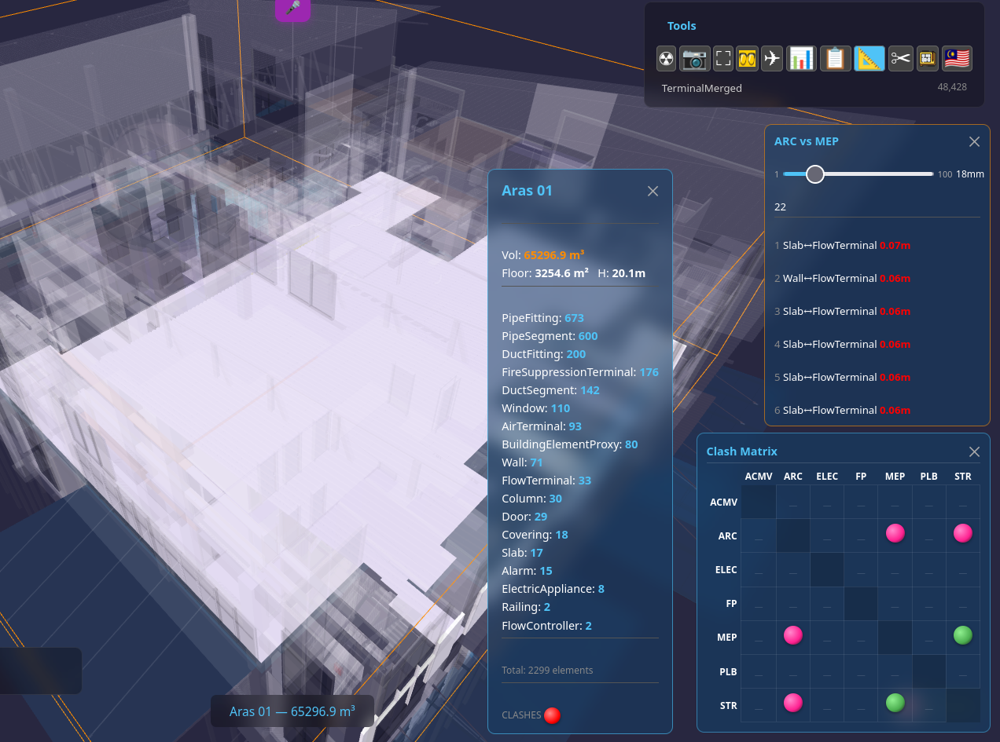
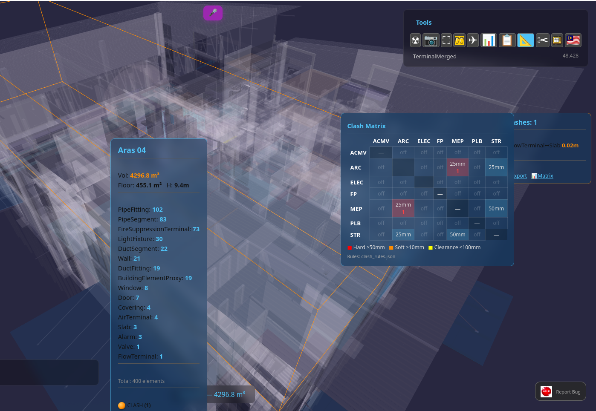
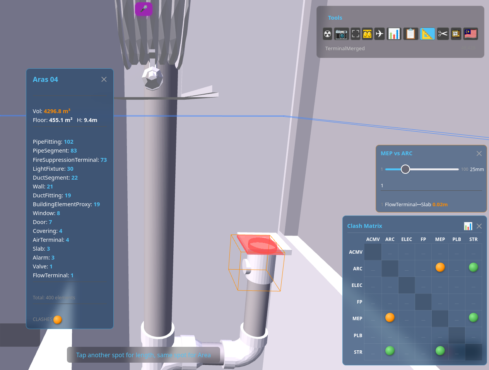
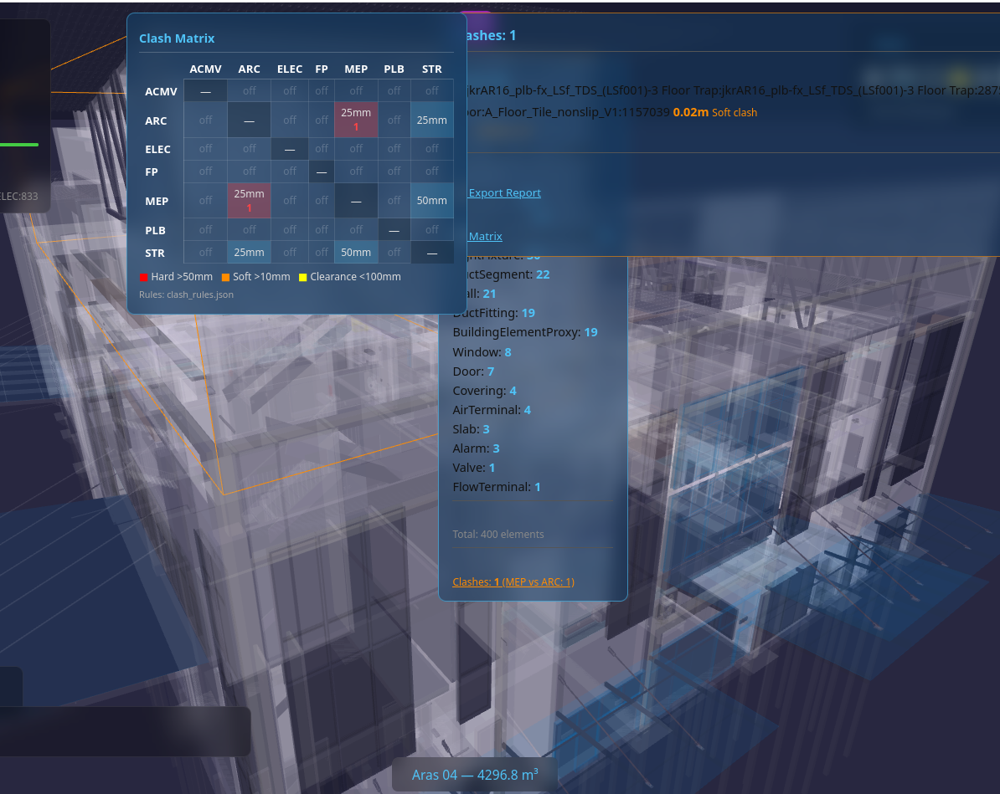

# Clash Detection — Browser-Native, Zero Install

> **Foundation:** [BIM_Designer_Browser.md](BIM_Designer_Browser.md) | [SQLite3D_Schema.md](SQLite3D_Schema.md) | [ROADMAP.md](ROADMAP.md) | [BIM_COBOL.md](BIM_COBOL.md) (CHECK CLASH verbs)

<div class="bim-banner" markdown>
<b>48,000 elements. 12 discipline-pair rules. One browser tab. Zero server.</b> Clash detection that runs entirely in the browser — SQL queries against a local SQLite database, bounding-box geometry rendered by the GPU, results in milliseconds. No Navisworks. No license. No desktop.
</div>

**Version:** 1.0 (2026-05-04)
**Status:** LIVE — storey-scoped progressive queries, discipline matrix, in-viewer review workflow
**Depends on:** `measure.js`, `clash_rules.json`, `rtree-sql.js` (WASM), Three.js

---

## 1. The Problem with Desktop Clash Detection

Every BIM coordination meeting plays the same scene: someone opens Navisworks, runs a clash test, and the team stares at **thousands of red dots** with no context, no priority, and no way to act on them without switching tools.

| Pain Point | Navisworks / Solibri | BIM OOTB |
|------------|---------------------|----------|
| Install | 8GB desktop app, Windows only | **Zero** — one browser tab |
| Cost | $3,570/yr (Navisworks) / $3,400/yr (Solibri) | **Free** |
| Clash review | Export HTML report, lose 3D context | **In-viewer** — click row, fly to clash |
| Tolerance | Set once, re-run entire test | **Live slider** — adjust and re-query instantly |
| Grouping | Manual (Navisworks) or basic (Solibri) | **Storey-scoped** — automatic, no N^2 explosion |
| Mobile | No (Navisworks/Solibri), partial (Revizto) | **Yes** — same URL, any device |
| Offline | Desktop only | **Yes** — PWA with cached DB |

---

## 2. The Technology: Why It Works in a Browser

Three technologies make this possible. None is new individually — the combination at this scale is.

### 2.1 sql.js (WASM SQLite) — The Query Engine

[sql.js](https://github.com/sql-js/sql.js) compiles the entire SQLite C library to WebAssembly. The browser downloads a ~1MB `.wasm` file and gains a full SQL engine running at near-native speed — the same SQLite that powers every smartphone on earth.

We use [rtree-sql.js](https://www.npmjs.com/package/rtree-sql.js), a build with `SQLITE_ENABLE_RTREE` compiled in, enabling R-tree spatial indexes for single-element lookups in O(log N).

```sql
-- Envelope overlap check: one GROUP BY, instant on 48K elements
SELECT discipline,
       MIN(center_x - bbox_x/2), MAX(center_x + bbox_x/2),
       MIN(center_y - bbox_y/2), MAX(center_y + bbox_y/2),
       MIN(center_z - bbox_z/2), MAX(center_z + bbox_z/2)
FROM element_transforms t
JOIN elements_meta m ON t.guid = m.guid
GROUP BY discipline
```

This single query computes the spatial envelope of every discipline — if two envelopes don't overlap, there are zero clashes between them. No geometry needed. Pure arithmetic.

### 2.2 Three.js (WebGL) — The Renderer

[Three.js](https://threejs.org/) wraps the browser's GPU API. When a clash is detected, we create clipped mesh geometry at the overlap zone — red for element A, blue for element B — rendered with `depthTest:false` so they're always visible through surrounding structure.

### 2.3 BLOB-to-GPU Pipeline — No Intermediate Format

```
SQLite DB (WASM)              Three.js (WebGL/GPU)
     |                              |
     |  SELECT vertices, faces      |
     |  FROM component_geometries   |
     |  WHERE geometry_hash = ?     |
     v                              |
  Uint8Array (BLOB)                 |
     |                              |
     |  new Float32Array(blob)      |
     v                              |
  Float32Array  ──────────────────> BufferGeometry ──> GPU
```

No glTF. No OBJ. No server-side conversion. The BLOB in the database IS the mesh. The browser IS the renderer. Clash detection queries the same database that renders the 3D model — geometry and metadata share one query layer.

---

## 3. How It Works

### 3.1 Right-Click: Info Card + Clash Sphere

Right-click any element to see its storey info card — element counts by IFC class, bounding box volume, floor area. At the bottom, a **clash sphere** lights up:

- **Green** — discipline envelopes don't overlap. Zero clashes guaranteed.
- **Orange** — envelopes overlap. Click to open the Clash Matrix.

<figure style="margin: 20px 0;">

<figcaption style="text-align:center; font-style:italic; color:#666; margin-top:8px;">Right-click a storey: element counts, volume, and clash sphere. Orange = possible clashes — click to open the matrix.</figcaption>
</figure>

Right-click empty space for **whole-building** analysis — same card, DB envelope instead of scene traversal (instant on any size building).

### 3.2 Clash Matrix — Discipline Grid

The matrix shows every discipline pair. Each cell is a sphere:

- **Green** = envelopes don't intersect — guaranteed clear
- **Orange** = envelopes overlap — clashes possible
- **Red** = hard clashes found (>50mm penetration)
- **Dash** = no rule defined for this pair

<figure style="margin: 20px 0;">

<figcaption style="text-align:center; font-style:italic; color:#666; margin-top:8px;">Whole-building clash matrix — 7 disciplines, 12 rules. Background check uses envelope overlap (instant). Click any orange/red cell to drill into individual clashes.</figcaption>
</figure>

### 3.3 Cell Click: Storey-Scoped Queries

Click a matrix cell to query clashes for that discipline pair. The query strategy avoids the N^2 trap:

1. **Find shared storeys** — two `GROUP BY` queries (instant)
2. **Query first storey** — cross-join scoped to one storey (200-4000 elements, fast)
3. **Show results immediately** — user sees clashes in <500ms
4. **Load remaining storeys progressively** — `setTimeout` yields between each storey query, results append to the list without blocking the UI
5. **COUNT in background** — lightweight `SELECT COUNT(*)` per storey, total shown in header

```
User clicks cell
      |
      v
  Query storey list (2 GROUP BYs, instant)
      |
      v
  Query FIRST storey (LIMIT 30, <100ms)
      |
      v
  RENDER LIST  <-- user sees results here
      |
      +---> async: query storey 2 (setTimeout yield)
      +---> async: query storey 3 ...
      +---> async: COUNT per storey (header updates)
```

This architecture means a 48,000-element building with 7 disciplines never hangs the browser. Each storey query is scoped to a few hundred elements — the cross-join is O(n^2) but n is small.

### 3.4 Fly-To + Mesh Overlap Visualization

Click any clash row to fly the camera to the overlap zone. The viewer shows:

- **Red mesh** — clipped geometry of element A at the overlap
- **Blue mesh** — clipped geometry of element B
- **Orange wireframe** — bounding box of the storey
- Camera distance based on overlap size, not element bbox — tight framing on the actual clash

<figure style="margin: 20px 0;">

<figcaption style="text-align:center; font-style:italic; color:#666; margin-top:8px;">MEP vs ARC clash: pipe penetrating slab. Red/blue mesh at overlap zone, tolerance slider (25mm), clash list with severity colours. All in the browser.</figcaption>
</figure>

### 3.5 Live Tolerance Slider

Drag the slider (1mm to 100mm) and the query re-runs instantly with the new tolerance. No need to close a dialog, re-configure, and re-run the entire test — the feedback loop is sub-second.

### 3.6 In-Viewer Review Workflow

Right-click or long-press any clash row to cycle its status:

| Status | Icon | Meaning |
|--------|------|---------|
| (none) | Row number | New — not yet reviewed |
| Reviewed | Yellow circle | Acknowledged, under investigation |
| Resolved | Green circle | Fix applied, pending verification |
| Accepted | White circle | Intentional — no action needed |

Statuses persist in `localStorage` per building. No server, no login, no export/import cycle.

---

## 4. Clash Rules — JSON Configuration

Rules are defined in `clash_rules.json` — 12 discipline pairs with per-pair tolerance and ignore lists:

```json
{
  "clash_rules": [
    {
      "name": "ARC vs STR",
      "source": { "discipline": "ARC" },
      "target": { "discipline": "STR" },
      "tolerance_m": 0.025,
      "ignore_classes": ["IfcOpeningElement", "IfcSpace", "IfcBuildingElementProxy"]
    },
    {
      "name": "MEP vs STR",
      "source": { "discipline": "MEP" },
      "target": { "discipline": "STR" },
      "tolerance_m": 0.050,
      "ignore_classes": ["IfcOpeningElement", "IfcSpace"]
    }
  ],
  "severity": {
    "hard":      { "min_overlap_m": 0.050, "color": "#ff0000", "label": "Hard clash" },
    "soft":      { "min_overlap_m": 0.010, "color": "#ff8c00", "label": "Soft clash" },
    "clearance": { "max_gap_m":     0.100, "color": "#ffff00", "label": "Clearance violation" }
  }
}
```

Currently 12 rules covering: ARC/STR, MEP/STR, MEP/ARC, ELEC/ARC, ELEC/STR, ELEC/MEP, FP/ARC, FP/STR, FP/MEP, ACMV/ARC, ACMV/STR, ACMV/MEP.

---

## 5. HTML Clash Report

Click the clipboard icon on the matrix to generate a full analytics report in a new tab:

<figure style="margin: 20px 0;">

<figcaption style="text-align:center; font-style:italic; color:#666; margin-top:8px;">HTML clash report — matrix snapshot, severity/status/discipline charts, radar, top offenders, editable action sheet, CSV export. Standalone HTML, no server.</figcaption>
</figure>

The report includes:

- **Matrix snapshot** — the discipline grid as rendered at time of export
- **6 charts** — severity distribution, status breakdown, discipline pair counts, IFC class pair frequency, radar overview, top offender elements
- **Editable action sheet** — assign responsibility, add notes, set due dates
- **CSV export** — one click to download for spreadsheet analysis
- **Standalone** — the entire report is one HTML file with embedded Chart.js. Email it, share it, open it offline.

---

## 6. Performance — 48K Elements, 7 Disciplines

Tested on **Terminal** (48,428 elements, 7 disciplines — the largest building in the test suite):

| Operation | Time | Technique |
|-----------|------|-----------|
| R-tree build | 1.2s | Async batches of 5000, `setTimeout` yields |
| Matrix background check | Instant | Discipline envelope overlap (one `GROUP BY`) |
| Cell click (first results) | <500ms | First storey only, LIMIT 30 |
| Remaining storeys | Progressive | One query per storey, async with UI yields |
| Total COUNT | Background | `SELECT COUNT(*)` per storey, no data columns |
| Fly-to camera | Instant | Camera distance from overlap size, not element bbox |

The key insight: **never cross-join the whole building**. Scope every query to a single storey (200-4000 elements) and the O(n^2) cross-join stays fast. The R-tree is built for future features (smart grouping, heatmap, clearance) where single-element lookups with constant bounds are the use case.

---

## 7. Architecture — Why SQLite Beats a Server

Traditional clash detection tools (Navisworks, Solibri, BIM Collab Zoom) require either a desktop install or a cloud server. We need neither.

```
Traditional:  IFC file ──> Server ──> Parse ──> Store ──> Query ──> Render
BIM OOTB:     IFC file ──> Extract ──> SQLite DB ──> Browser (WASM + GPU)
```

The SQLite database IS the application state:

- **Metadata** (`elements_meta`) — GUID, IFC class, discipline, storey, element name
- **Transforms** (`element_transforms`) — center XYZ, bbox dimensions
- **Geometry** (`component_geometries`) — pre-tessellated vertex/face BLOBs

One `SELECT` gives you clash candidates. Another `SELECT` gives you the mesh to render. Same database, same query layer, same browser tab. The DB file is the deployment artifact — upload it to any static hosting (OCI Object Storage, S3, GitHub Pages, a USB stick) and it works.

SQLite's advantages for this use case:

| Property | Benefit |
|----------|---------|
| Zero-configuration | No server process, no connection string |
| Single-file | One `.db` per building, trivial to distribute |
| Read-only WASM | Browser can't corrupt the source DB |
| SQL query optimizer | Indexes, joins, GROUP BY — decades of optimization |
| R-tree extension | Spatial indexing compiled into the WASM build |
| Portable | Same DB works in Node.js extraction, Blender bridge, or browser |

---

## 8. Roadmap — What's Next

### 8.1 Smart Grouping (R-tree powered)

Cluster nearby clashes into groups using R-tree constant-bounds lookups:
"Find all elements within 1m of this clash" — O(log N) per lookup.
Show cluster count on matrix spheres instead of raw totals. Click cluster to expand.

### 8.2 Clash Heatmap

R-tree range query: count clashes per zone per storey. Colour-code the 3D model by clash density. Red zones = high concentration = prioritize. Requires only counting queries, no geometry.

### 8.3 Clearance Violation Detection

Expanded-bounds R-tree query: "Find elements within 5cm of this pipe." Already defined in `clash_rules.json` severity levels. Navisworks calls this "near miss" and requires a separate test setup — here it's a parameter change.

### 8.4 Trend Tracking

Store clash counts per discipline pair per date in `localStorage`. Show delta: "Last check: 45 clashes. Now 32." Progress visible across sessions without any server.

### 8.5 BCF Export

Industry-standard clash exchange format ([BIM Collaboration Format](https://www.buildingsmart.org/standards/bsi-standards/bim-collaboration-format-bcf/)). One clash becomes one BCF topic with viewpoint, camera position, and element GUIDs. Interoperable with any BCF-compatible tool.

### 8.6 Scene Sync from Report

Click a clash row in the HTML report and the 3D viewer (if open) flies to that clash via `window.opener.postMessage`. Report becomes a live navigation tool, not a dead PDF.

### 8.7 Storey Heatmap Bar Chart

Horizontal bar chart showing clash density per storey — storey-scoped counts are instant (already proven). Visual priority map: "Floor 3 has 120 clashes, Floor 7 has 4."

---

## 9. Files

| File | Role |
|------|------|
| `deploy/dev/measure.js` | Clash detection engine — queries, matrix, visualization, report |
| `deploy/dev/clash_rules.json` | 12 discipline-pair rules with tolerances |
| `deploy/dev/loader.js` | CDN reference for rtree-sql.js@1.7.0 WASM |
| `deploy/dev/sw.js` | Service worker cache for WASM + DB files |

---

## 10. Try It

Open the [BIM OOTB viewer](https://objectstorage.ap-kulai-2.oraclecloud.com/n/ax3cp6tzwuy2/b/bim-ootb-live/o/index.html), load any multi-discipline building (Terminal recommended), activate the Measure tool, right-click any element or empty space, and click the clash sphere.

No install. No sign-up. No server. Just a browser.
