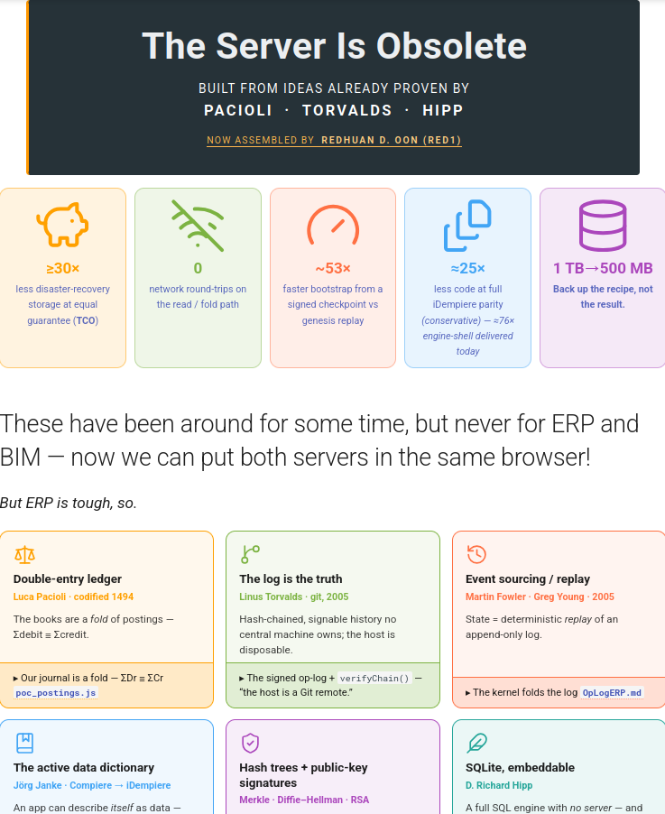
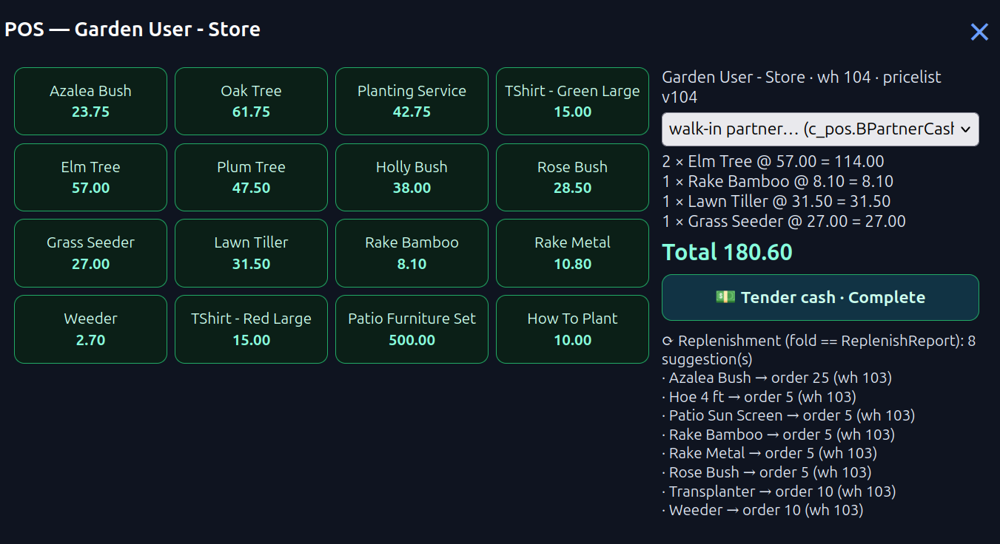
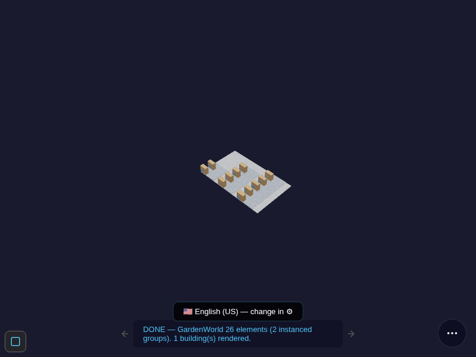
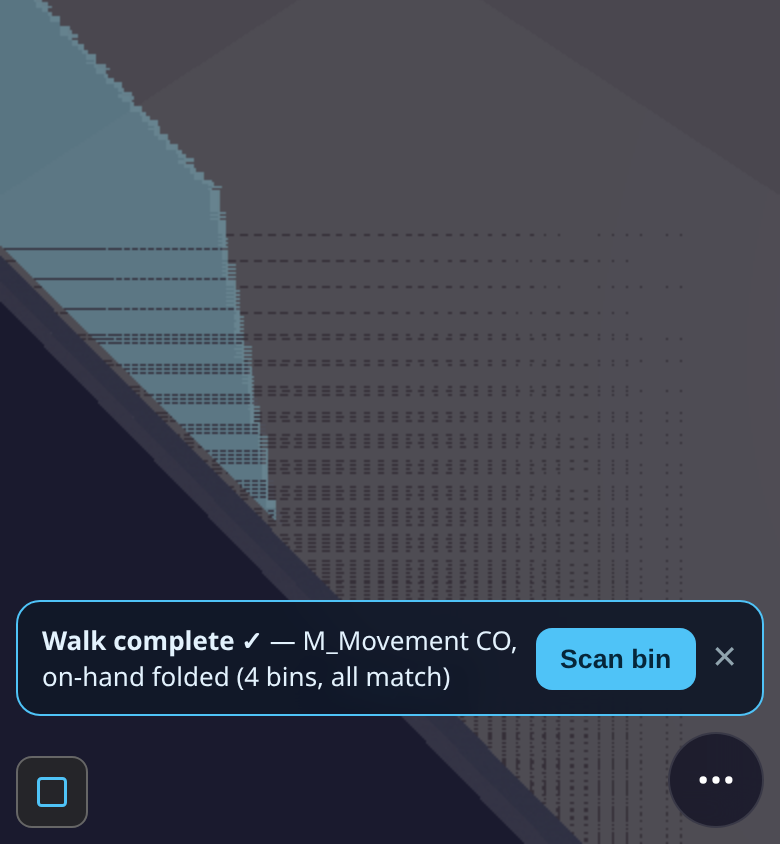

# iDempiere Browser ERP — User Guide

*The browser kernel renders the full iDempiere Application Dictionary from SQLite — no Java, no server,
no install. This guide walks from first load to POS sale to financial report.*

> **New here?** Start at the [BIM OOTB User Guide](USER_GUIDE.md) for the full picture.



> **Where to read the full concept:** the landing page links to
> [Migrate & Compare (ERP)](MigrateComparisonPaper.md) — start with the six pillars (double-entry
> ledger · log-is-truth · event-sourcing · active dictionary · hash-trees · SQLite embeddable), then
> the Roadmap section for POS and warehouse-walk. The paper is the architectural rationale; this guide
> is the operating manual.

---

## Quick start

Open **idempiere.html** (or follow the "iDempiere" link from the front door). A login card appears
immediately — no credentials, just pick a role.

---

## 1. Login

The login card lists all AD roles in the seed. Pick one and tap it:

| Role | Use |
|---|---|
| **GardenUser** | The default demo persona — access to Sales, Purchasing, Inventory, POS |
| **Admin** (GardenAdmin) | Full menu (294 / 332 windows); sees all process / form leaves |
| **WebService** | 0 windows — confirms the access-gate works (empty menu is correct) |

The menu is pruned immediately by real `AD_Window_Access` / `AD_Process_Access` grants from the seed —
if a window is absent for your role, that is correct, not a bug.

---

## 2. Install / Migrate (pick-your-ERP)

**Install** and **Migrate** both open the same pick-your-ERP dialog (reached from the **⋯ pill** or
the pre-login Install/Migrate pills). It lists five sources, detects what is running on your machine,
and routes honestly — nothing is ever faked:

| Source | Migrate (extract YOUR data) | Install (resident demo tenant) |
|---|---|---|
| **Odoo** | live delegate agent: download `odoo_agent.zip`, run it natively next to your Odoo, drop the `odoo_chain.json` it writes — the browser re-folds and verifies it | **Client 12** — live-extracted from odoodemo, books diffed to the cent |
| **iDempiere** | ShowMe + `migrate_agent.js` against your own Postgres (credentials never leave your machine) | **Client 13** — real PG-agent extraction, PKs re-banded |
| **SAP** | coming (no agent yet) | **Client 14 "SAP Flights"** — PoC: the documented **SFLIGHT** flight-booking reference model (carriers → Business Partners, connections → Products) |
| **Oracle** | coming | **Client 15 "Oracle Scott"** — PoC: the canonical **EMP/DEPT (SCOTT)** schema (departments → BP Groups, employees → Business Partners) |
| **MS Dynamics** | coming | **Client 16 "Dynamics Cronus"** — PoC: the Business Central **CRONUS** demo company (items → Products, customers → Business Partners) |

The three PoC tenants carry each vendor's *documented public demo model* — reference data labeled as
such in the dialog, proving the master-table mapping; a delegate agent (like Odoo's) is the production
path for real extractions.

**What Install leaves behind:** the tenant is merged into the resident seed in browser IndexedDB — it
survives a plain reload, re-install is a guarded no-op, and the install itself appears as a dot on the
**W** world-history timeline.

**Choosing a tenant at login:** the login card shows a "Select a tenant" step **only when two or more
login-able tenants exist**. On a fresh seed there is only GardenWorld, so the step auto-skips — if you
can't choose more clients, you haven't installed any yet. After installs the list fills (System,
GardenWorld, and every installed tenant). Each tenant is entered through its **own Admin user**
(e.g. *SAP Flights Admin*); the System user belongs to the System(0) client only.

---

## 3. The Bottom Pill Bar (cheat sheet)

The pill is the single entry point for every tool. Left-to-right:

| Icon | Pill ID | What it opens |
|---|---|---|
| ⌂ | `home` | Top-level AD menu (window list, role-pruned) |
| ⊙ | `toggle` / `settings` | Settings panel (language, theme) |
| 🔍 | `search` (red circle) | Record find / filter across the current window |
| ⟳ (ring) | `idmp` / Dictionary | The AD-model dictionary surface — browse AD tables live |
| **W** | `history` | World history overlay — scrub the op-log timeline (‹ dots ›) |
| ⋯ | `more` | Install · Migrate · About · Tour · ShowMe help badges |

**Tip:** long-press the **W** pill to open the Z+bomb drawer (undo / fold-back to a past state).

---

## 4. Navigating Windows

1. Tap **⌂** — the menu tree opens (role-pruned).
2. Browse by category (Sales, Purchasing, Inventory, …) or use the search leaf.
3. Tap a window — the record list loads from the seed db.
4. Tap a record row — the detail form opens with all AD tabs.
5. Breadcrumb at the top shows `Window › Record`. Tap any crumb to go back.

**Keyboard shortcuts** (desktop):

| Key | Action |
|---|---|
| `←` / `→` | Step back / forward in the history bar |
| `?` | Toggle help badges (ShowMe mode) |

---

## 5. Forms, Tabs, and Fields

- **DisplayLogic** is live: fields hide/show based on real `AD_Field.DisplayLogic` expressions (27 of
  60 Sales-Order fields hidden by the evaluator — `ad_evaluator.js`).
- **DocAction bar**: when a document is open the action chips at the top are the *legal* next actions
  for its current DocStatus, derived from `ad_docfsm.js`. Completed orders show Close / Void — never
  ReActivate unless the DocType allows it.
- **Editable fields**: tap a field to edit. Changes are staged in a CRUD overlay. Hit **Save** to
  commit as a signed sidecar op.

---

## 6. The Process Button

When a menu leaf or a form has a **▶ Process** button (type P/R in the menu), tapping it:

1. The `ad_process.js` dispatch spine resolves `AD_Process.classname` → a registered handler.
2. If the process has `AD_Process_Para` rows, a **parameter dialog** appears first — fields are
   validated (`§PROC_PARAM_VALIDATE`) before the handler fires.
3. The handler returns an op-group; `kernel_ops.commitGroup` writes it as a **signed op** to IDB.
4. The form re-reads and shows the updated status.

**Does the record persist?** Yes — every committed op is written to IDB as a signed op-log entry.
The op-log is append-only: every change has a timestamp, a hash chain, and a reversible trail.
No traditional row-update happens; the current state is the fold of all ops on that record.

**Unregistered classnames** show an honest "absent handler" card (the 333-falsifier) — 454 of the
476 `SvrProcess` handlers are named-deferred; the 5 registered ones cover the demo flows.

---

## 7. POS — Point of Sale

**Prerequisite:** log in as **GardenUser** (the POS station `c_pos_id=1` is scoped to that role).
Tap the **POS** pill in the bottom bar (it appears only when the loaded db has a `c_pos` station).

### POS screen layout (the killer-demo surface, sw v656 → panel lifecycle v658–v660)

- **Album cards** — the product grid is a photo album (`.pos-card`, `§POS-ALBUM cards=16`): each card
  from `c_poskey → m_product` (the sealed keylayout) shows its photo (full-res from the device images
  folder → ledger thumbnail → placeholder glyph, honestly tiered) and its master price from the
  station's pricelist — you ring the master, not a manual price.
- **Floating payment panel** — the cart pill summons a floating panel on its own layer
  (`#pos-float-panel`): tender, walk-in partner picker, receipt, replenishment suggestions. The album
  keeps scrolling underneath; payment never squeezes the grid.
- **Panel lifecycle** — drag it by the header; dismiss it with the **✕** button or a **swipe-down**
  on the header; and it **follows the cart**: when the cart empties — sale completed, or the last
  line removed — the panel dismisses itself (`§POS-FLOAT dispose=cart-empty`). The cart pill
  re-summons it anytime. Dismissing is pure UI: it never touches the cart contents or a committed
  sale (the sale is sealed atomically at Complete, before the panel ever moves).



### Making a sale

1. Tap a product card → it is added to the cart at the sealed price.
2. Tap again to increment qty, or edit qty in the line.
3. Review **Total** (BigDecimal fold of line amounts, never a posted figure yet).
4. Summon the payment panel (cart pill), pick the walk-in partner, tap **Tendered cash — Complete**
   (`§POS-SALE … newVerbs=[] chainOk=Y` — and the receipt card shows `signed=Y`).
5. The receipt opens in its own overlay (re-openable via the **receipt pill**) and the payment
   panel dismisses itself — the sale is already closed: one signed op-group, nothing left pending.

A **DEMO payment QR** renders in the panel (clearly watermarked DEMO — a display of the tender
amount, not a payment rail; no provider is wired, nothing is charged).

### Register a new product at the till — the Import pill (§P-9)

The **Import** pill opens the snap+scan+price flow: photograph the item (camera, downscaled to a
≤32KB ledger thumbnail; the full-res photo goes to the device images folder under a
`sha256:` content address — `§POS-IMGKEY`), scan or type its barcode, key the price. **Register**
commits ONE signed group of 4 CRUD_CREATE ops — M_Product, M_ProductPrice (station pricelist),
AD_Image, C_POSKey — every default EXTRACTED from the dictionary and the station's own rows
(`§POS-IMPORT registered productId=… gid=…`). The new card appears in the album and rings
immediately through the unchanged sale path. A duplicate barcode is refused and the existing
product handed back (propose-merge). Editing name/price/photo later rides the same signed path,
changed columns only (`W-POS-EDIT`).

### Hold / recall (§P-13)

**Hold** parks the in-progress cart as a real `DR` C_Order — the same ledger row the Sales Order
window and Kanban read, not a private store (`§POS-HOLD park order=… listed window=Y kanban=Y`).
**Recall** is a plain query of the held orders; completing a recalled sale completes THE held
order (never a duplicate — exactly one C_Order exists, witnessed).

The "Complete" creates ONE signed op-group:

```
CREATE_DOCUMENT  C_Order  (the POS sale order)
CREATE_LINE      C_OrderLine  (one per cart line)
SET_STATUS       C_Order → CO
CREATE_DOCUMENT  M_InOut  (shipment, policy-gated)
CREATE_LINE      M_InOutLine
SET_STATUS       M_InOut → CO
CREATE_DOCUMENT  C_Invoice  (invoice, policy-gated)
SET_STATUS       C_Invoice → CO
CONSUME          M_Transaction P−  (one per BOM leaf, the backflush)
```

### Backflush (§P-3)

If any product has a BOM (e.g. Patio Furniture Set), `erp_engine.explodeBOM` recursively
expands the recipe and adds a `CONSUME P−` op for every leaf component. The on-hand fold
(`qtyOnHand`) reflects the deduction immediately.

### Replenishment (§P-4)

After each sale, the panel runs `poc_replenish` — it folds `m_transaction` to find on-hand
per product and emits a reorder PO for anything that has fallen below `m_replenish.level_min`.
The suggestion list shows at the bottom of the cart panel.

---

## 8. Financial Reporting

Tap **⌂ → Performance Analysis → Financial Report** (or use the Statements pill from the Dictionary):

| Report | Status | Notes |
|---|---|---|
| **Balance Sheet** | ✅ oracle-equivalent | 108 cells, `maxDiff=0c` vs real GardenWorld `fact_acct` |
| **Income Statement** | ✅ oracle-equivalent | 148 cells |
| **Cash Flow** | ✅ oracle-equivalent | 140 cells |
| **Trial Balance** | ✅ oracle-equivalent | `ΣDr==ΣCr=46574.97` (GardenWorld real ledger) |
| **Invoice Print** | ✅ oracle-equivalent | 8/8 invoices, 48 cells, `foldPrint` W-PRINTFORMAT |

The **⎙ Print** button on an invoice form opens a single-page print view generated from the real
`AD_PrintFormat` metadata — not a template, a fold of the dictionary's print format rows.

### Excel Report — your workbook is the report (NinjaExcel)

Tap the **Excel Report** pill (grid icon ▦) on the iDempiere bottom bar. This lens turns any Excel
workbook into a live report over the open tenant — Excel stays the designer (layout, formatting,
subtotals, charts: zero learning curve, it *is* Excel); the lens is only the **binder** that fills
the data cells from the database. No Jasper, no print-format authoring, no server.

One workbook, three sheets:

| Sheet | Role | Who writes it |
|---|---|---|
| **BACKUP** | a *filled sample* of the finished report — design-by-example | you (keep a real filled copy) |
| **Input** | the layout with `@field_row_col@` holes where data goes, plus `#1/#2` parameter cells | scaffolded for you |
| **Process** | one row per data cell: `SELECT / TABLE / JOIN / WHERE / ADDRESS` — plain SQL in cells | scaffolded, **you finish it** |

The flow:

1. **Try the sample first** — the lens links a `ninja_sample.xlsx` (GardenWorld invoice summary),
   runnable as-is: drop it back in and it fills from the open tenant.
2. **MAKE** — drop a workbook holding only your filled **BACKUP** sheet. The lens detects the data
   grid by shape, proposes a SELECT for each cell from its column label, and hands back a scaffold.
   A proposal is not an answer — open the **Process** sheet in Excel and finish the `TABLE`/`WHERE`
   columns (this is where your SQL skill goes; everything else is already placed).
3. **RUN** — drop the finished workbook. Every Process row is folded over the loaded tenant db,
   values land in their addressed cells, and you download the filled workbook. Your own `=SUM(...)`
   subtotals are never computed by the engine — Excel recalculates them when you open the file.

**Verify-by-example** is the honesty gate: if the BACKUP sample travels with the workbook, every
folded value is compared against the sample **to the cent** — a wrong binding shows red, not
plausible. An incomplete workbook (empty `TABLE`, a `#2` parameter with no value, a data hole no
Process row addresses) is **refused before running** with the exact list of what's missing — never
silently skipped.

| Status | Notes |
|---|---|
| ✅ LIVE (sw v659) | sample runs 9 cells `maxDiff=0c` against the seed; works on any installed/migrated tenant (one SQL dialect — SQLite) |
| ✅ LIVE (sw v662) | RULE tier — the lens's **"Or describe a data point"** box: type a business phrase (`SUM GrandTotal of Invoices, completed, from 2002-01-01 to 2003-12-31`), it compiles to SQL from the tenant's own dictionary; the sample falsifies wrong candidates to the cent; a tie is yours to pick (radio), then **Apply & run** writes the row and re-verifies the whole workbook |
| Phase 2 | bidirectional cells (`<` direction: an edited cell appends a signed op) — designed, not built |

---

## 9. Warehouse Walk

The **Warehouse** pill (box icon ◫) on the iDempiere bottom bar opens the GardenWorld warehouse
as a live 3D spatial model — a new tab pointing at the short GH Pages URL
(`viewer/viewer.html?db=../buildings/warehouse_gardenworld.db`). No login required for the viewer;
the ⌂ home button in the top-left flies you back to iDempiere.

> **The warehouse db lives in the repo** (GH Pages `buildings/` — the old OCI bucket copy was
> retired). If your device ever opened the walk through the old OCI link, a bare viewer open used
> to resume that dead URL and show *"Failed to fetch …"*; since viewer sw **v647** it self-heals:
> the stale resume key is cleared and the viewer returns to the landing page once
> (`§PWA_RESUME_CLEAR`). Opening through the Warehouse pill always works directly.

### What you see

The warehouse is compiled from real `m_locator` records — 11 bins arranged in two rows on a
flat floor, each bin's position derived from the GardenWorld ERP inventory schema (not hand-drawn).
26 elements total: 11 bin boxes (IfcBuildingElementProxy, each GUID == `m_locator_id`) + ground slab.



**Controls (same as the BIM viewer):**
- **Orbit** — click-drag or one-finger drag
- **Zoom** — scroll wheel or pinch
- **Pan** — middle-drag or two-finger drag
- **Reset** — double-tap / double-click

### Warehouse Walk pill (inside the viewer)

The **Walk** pill (📦 bottom bar) appears only when the loaded db has locator-GUID bins — the §S-1
compile stamps both `m_bom_line` BIN rows and the element GUIDs with real `m_locator_id` values.
Any other building → the pill stays off the bar.

**Walk flow:**

1. **Open** — tap the Walk pill. The engine builds a draft `M_Movement` pick list from
   replenishment needs (`qtyOnHand` fold vs `m_replenish.level_min`).
2. **Fly** — the camera flies to the first bin; the target bin is highlighted bright blue; the rack
   group is shown as a solid overlay; all other geometry is ghosted (x-ray dim 0.1).
3. **Scan** — tap **Scan bin** to:
   - Use the device camera (`BarcodeDetector` / `getUserMedia`) to scan the bin's QR label, or
   - Type the locator ID in the fallback field.
   Wrong bin is refused ("wrong bin, expected …"). Correct bin moves to the next step.
4. **Complete** — after all bins the strip shows **Walk complete ✓**. A single signed
   `M_Movement CO` is committed through `KernelOps.commitGroup`; `qtyOnHand` is folded from the
   op-log (no direct DB write).



### Implementation status

| Step | Status | What |
|---|---|---|
| **§S-1** ✅ | Compiled | Bins map to real `m_locator_id`; render gate green (61 KB db, GH Pages) |
| **§S-2** ✅ | Route verb | `wh_route.js` sorts pick lines by spatial walk sequence (`m_bom_line.ordinal`) |
| **§S-3** ✅ | Walk UI | Phone-first fly-to strip; depth model (ghost/rack/bin); step strip + camera easing |
| **§S-4** ✅ | QR scan | `BarcodeDetector` + typed fallback; wrong-bin refusal gate |
| **§S-5** ✅ | Signed op | `M_Movement CO` via `KernelOps.commitGroup`; on-hand folded from op-log |
| **§S-2b** ✅ LIVE | POS→pick loop | Sell **deliver-later** at the POS → the walk offers that open shipment → pick it to completion (on-hand moves at the pick). bim-ootb PR #283, W-WH-POS-PICK-LIVE. See §7 → *Deliver later*. |

### Deliver later → pick at the warehouse (§S-2b)

The POS and the Warehouse Walk are **one ledger, two lenses**. When you ring a sale and choose
**Deliver later · pick at warehouse** (the payment panel's option beside Tender — shown only when the
tenant has a deliver-later sale doctype, seed `132`), the order completes (`C_Order → CO`) but the
shipment is born **`DR`** (not yet picked). That open shipment then appears as a **route source in the
Warehouse Walk** on the next open: walk to the bin, scan/confirm, and the shipment completes by the
**picked** quantity — on-hand moves *at the pick*, not at the sale. Short-picks leave the remainder open
on the document. Once picked, the walk writes the completion back to the shared ledger so the selector
never re-offers a picked shipment. The whole loop is witnessed live end-to-end (**W-WH-POS-PICK-LIVE**,
PR #283). A "with-pick QA confirm" doctype (148) routes completion through the warehouse-confirm gate first.

### Share

Tap the **⌂ share** route from the Warehouse pill action or the viewer share button to copy
the short GH Pages URL for this walk session. The URL is self-contained — opening it on a phone
immediately lands on the spatial model ready for the walk.

---

## 10. Clearing Cache / Resetting Demo Data

The app state lives in **IndexedDB** (key `bim_erp_db`, version 14). To reset to a clean demo:

**Chrome / Edge / Firefox:**
1. Open DevTools (`F12`) → **Application** (Chrome) or **Storage** (Firefox).
2. Find **IndexedDB → bim_erp_db** → right-click → **Delete database**.
3. Reload the page → the Install flow runs again from the bundled seed.

**Quick reset via the browser console:**

```js
indexedDB.deleteDatabase('bim_erp_db');
location.reload();
```

**Service Worker cache** (if the app served a stale version):

```
DevTools → Application → Service Workers → Unregister
DevTools → Application → Cache Storage → Delete All
```

Then hard-reload (`Ctrl+Shift+R`). The sw version is bumped on every deploy so this is only
needed if you see an old `CACHE_VERSION` number in the console.

---

## 11. Pending Roadmap — known gaps and on-demand conditions

### Data-gated (seed doesn't contain these yet)

| Gap | Condition | Fix |
|---|---|---|
| **Trial Balance shows 0 rows** on default `ad_seed.db` | `fact_acct` table not in seed (Postgres-only source) | Load `?db=preview_demo.db` or run `prompts/MIGRATE_POSTING_CONFIG.md` |
| **Posting Preview** empty | Same — acct linkage absent in default seed | Same fix |
| **POS live ring to the cent** | posting-config needed for the live ring | `MIGRATE_POSTING_CONFIG.md` |
| **T_Aging / T_ReportStatement** folds | 13 `T_*` temp-table folds not yet built | Phase B §H-7..§H-11 (future) |
| **Warehouse viewer: "Failed to fetch …oraclecloud…"** on a bare open | OCI-era `pwa_last_db` resumed the retired bucket URL | Fixed viewer sw v647 — self-heals to the landing (`§PWA_RESUME_CLEAR`); or clear site data once |

### Engine-gated (code exists, not yet wired to live UI)

| Gap | Engine status | UI status |
|---|---|---|
| `AD_Callout` derived fields on field-change | ✅ headless (W-CALLOUT-HARDEN) | Render-wiring parked |
| `AD_Val_Rule` picklist filter | ✅ headless (W-VALRULE-HARDEN) | Render-wiring parked |
| `AD_Workflow` node-walk | 🟡 `ad_workflow.js` built, no seed activity oracle | Parked |
| Column-level / Record-level access | `AD_Column_Access` / `AD_Record_Access` empty in seed | n/a |
| 454 SvrProcess handlers | 5 registered, 454 named-deferred | Honest absent-handler card shown |
| `stale fork`: `report_overlay.js` in bim-ootb | 256 vs 908 lines in build/erp — lacks foldStatement/foldPrint | Needs sync + sw bump |

### Coverage matrix summary (2026-06-12)

```
✅  7  (live UI witnesses)
🟡 32  (headless-green, render-wiring pending)
⛔  3  (n/a-in-seed: AD_Rule SQL + 2 empty *_Access)
```

The 🟡 ceiling means: every behaviourally interpretable surface that *has seed data* is exercised —
the remaining work is wiring headless-proven engines into live DOM.

---

## 12. Pill Quick-Reference (cheat sheet)

```
Bottom bar
  ⌂          Home — AD menu tree
  ⊙ / ▣      Settings
  🔍 (red)   Record search / filter
  ⟳ (teal)   Dictionary (AD model browser)
  W          History — world op-log scrubber
  ⋯          More: Install · Migrate · About · Tour · ShowMe

Inside a record form
  ▶ (Process) Run an AD_Process (parameter dialog if needed)
  DocAction chips  (Complete · Close · Void · …) — legal set only

Help
  ?            Toggle ShowMe badges
  Tap a badge  Context card with tip + screenshot
  ‹ · ›        Step through ShowMe sequence

History (W pill)
  Click a dot  Jump to that op in the log
  ← / →        Step back/forward one op
  Long-press W Open Z+bomb drawer (undo / fold-back)
```

---

*For architecture details see [ERP.md](ERP.md). For the coverage evidence see
[ERP_COVERAGE_MATRIX.md](ERP_COVERAGE_MATRIX.md). For the migration story see
[MigrateComparisonPaper.md](MigrateComparisonPaper.md).*
