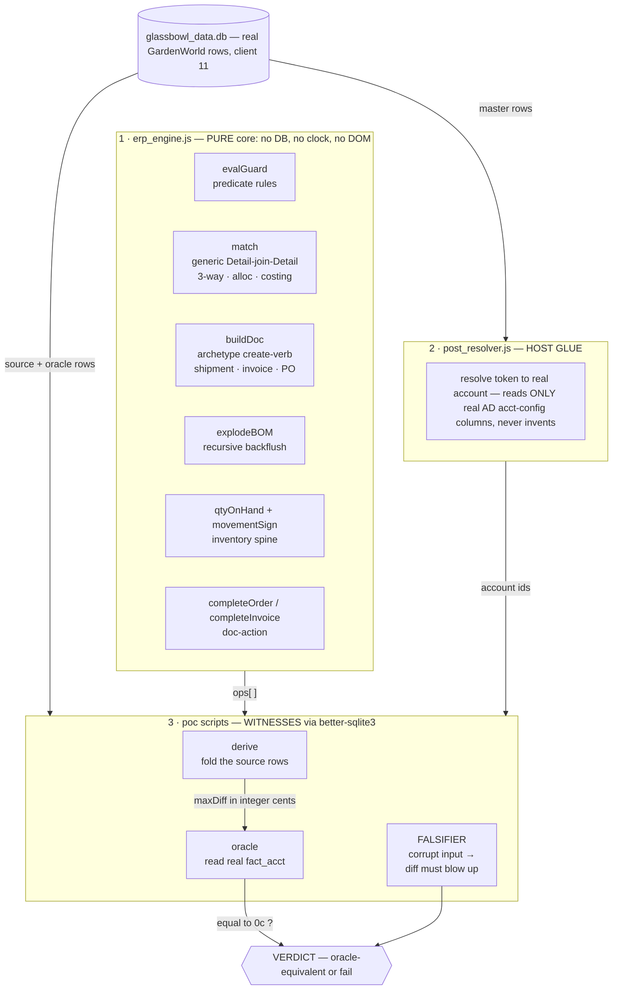

# Fold-Engine Code Quality — Stakeholder Scorecard

> **What this is.** An independent quality read of the recent **fold / oracle-equivalence** scripts
> (`scripts/erp_engine.js`, `scripts/post_resolver.js`, and the `poc_fold_*` / `poc_*` witness suite)
> that back the *“ERP folded into a browser”* claims in
> [`MigrateComparisonPaper.md`](MigrateComparisonPaper.md). It is written for reviewers and
> stakeholders who want to judge **how well the code is built**, not just that it runs.
>
> Snapshot: branch `feat/erp-substrate-phase012`, 2026-06-10. Every figure below is **measured from
> the source and from a live run** — nothing here is asserted without a witness.

---

## 1 · Executive scorecard

```
QUALITY DIMENSION              SCORE   ████████████████████  (0────10)
─────────────────────────────────────────────────────────────────────
Separation of concerns          9.5   ███████████████████░
Determinism / reproducibility  10.0   ████████████████████
Non-invention (traceability)   10.0   ████████████████████
Falsifiability (negative tests) 9.5   ███████████████████░
Oracle equivalence (vs real)    9.0   ██████████████████░░
Spec ↔ code ↔ witness tracing   9.5   ███████████████████░
DRY / fold-not-fork reuse       9.0   ██████████████████░░
Readability / maintainability   6.5   █████████████░░░░░░░
Robustness to data gaps         7.0   ██████████████░░░░░░
─────────────────────────────────────────────────────────────────────
OVERALL                         8.8   █████████████████░░░   STRONG
```

**One-line verdict:** *Research-grade, evidence-first code with unusually high proof discipline.*
The design (a pure engine + host-injected data + adversarial witnesses diffed to a real iDempiere
ledger) is excellent. The two soft spots are **readability** (very dense one-liners) and
**robustness** (a hard dependency on one captured database; the resolver still throws rather than
degrades when a column is genuinely absent — though the one case where that bit, `poc_matchinv`, is
now closed by re-capturing the fixture, so the risk is latent rather than active).

---

## 2 · The architecture being judged



**Every numbered box is real code** (branch `feat/erp-substrate-phase012`) — links per box below (the Mermaid boxes themselves aren't clickable under Material's strict render, so the source links live here):

- **1 · [`erp_engine.js`](https://github.com/red1oon/BIMCompiler/blob/feat/erp-substrate-phase012/scripts/erp_engine.js)** — the pure core:
  [`evalGuard`](https://github.com/red1oon/BIMCompiler/blob/feat/erp-substrate-phase012/scripts/erp_engine.js#L39) ·
  [`match`](https://github.com/red1oon/BIMCompiler/blob/feat/erp-substrate-phase012/scripts/erp_engine.js#L77) ·
  [`buildDoc`](https://github.com/red1oon/BIMCompiler/blob/feat/erp-substrate-phase012/scripts/erp_engine.js#L150) ·
  [`explodeBOM`](https://github.com/red1oon/BIMCompiler/blob/feat/erp-substrate-phase012/scripts/erp_engine.js#L178) ·
  [`qtyOnHand`](https://github.com/red1oon/BIMCompiler/blob/feat/erp-substrate-phase012/scripts/erp_engine.js#L211) ·
  [`reversePosting`](https://github.com/red1oon/BIMCompiler/blob/feat/erp-substrate-phase012/scripts/erp_engine.js#L231) ·
  [`completeOrder`](https://github.com/red1oon/BIMCompiler/blob/feat/erp-substrate-phase012/scripts/erp_engine.js#L244)
- **2 · [`post_resolver.js`](https://github.com/red1oon/BIMCompiler/blob/feat/erp-substrate-phase012/scripts/post_resolver.js)** — the host glue ([`resolve`](https://github.com/red1oon/BIMCompiler/blob/feat/erp-substrate-phase012/scripts/post_resolver.js#L60): token → real account)
- **3 · [full `scripts/poc_*.js` witness suite](https://github.com/red1oon/BIMCompiler/tree/feat/erp-substrate-phase012/scripts)** — per-file links in §3

**The iDempiere originals each verb folds** (upstream `release-12`) —
`completeOrder`/`completeInvoice` ← [`MOrder`](https://github.com/idempiere/idempiere/blob/release-12/org.adempiere.base/src/org/compiere/model/MOrder.java) / [`MInvoice`](https://github.com/idempiere/idempiere/blob/release-12/org.adempiere.base/src/org/compiere/model/MInvoice.java)`.completeIt()` ·
`buildDoc` ← [`MInOut`](https://github.com/idempiere/idempiere/blob/release-12/org.adempiere.base/src/org/compiere/model/MInOut.java) + [`MMovement`](https://github.com/idempiere/idempiere/blob/release-12/org.adempiere.base/src/org/compiere/model/MMovement.java) ·
`match` ← [`MMatchInv`](https://github.com/idempiere/idempiere/blob/release-12/org.adempiere.base/src/org/compiere/model/MMatchInv.java) + [`MAllocationHdr`](https://github.com/idempiere/idempiere/blob/release-12/org.adempiere.base/src/org/compiere/model/MAllocationHdr.java) ·
`explodeBOM` ← [`MPPProductBOM`](https://github.com/idempiere/idempiere/blob/release-12/org.adempiere.base/src/org/eevolution/model/MPPProductBOM.java) ·
`qtyOnHand` ← [`MStorageOnHand`](https://github.com/idempiere/idempiere/blob/release-12/org.adempiere.base/src/org/compiere/model/MStorageOnHand.java) + [`MTransaction`](https://github.com/idempiere/idempiere/blob/release-12/org.adempiere.base/src/org/compiere/model/MTransaction.java) ·
`evalGuard` ← [`MValRule`](https://github.com/idempiere/idempiere/blob/release-12/org.adempiere.base/src/org/compiere/model/MValRule.java) ·
posting/oracle ← [`Doc_Invoice`](https://github.com/idempiere/idempiere/blob/release-12/org.adempiere.base/src/org/compiere/acct/Doc_Invoice.java) · [`Doc_InOut`](https://github.com/idempiere/idempiere/blob/release-12/org.adempiere.base/src/org/compiere/acct/Doc_InOut.java) · [`Doc_Payment`](https://github.com/idempiere/idempiere/blob/release-12/org.adempiere.base/src/org/compiere/acct/Doc_Payment.java) · [`Doc_AllocationHdr`](https://github.com/idempiere/idempiere/blob/release-12/org.adempiere.base/src/org/compiere/acct/Doc_AllocationHdr.java).
*These are the classes the fold replaces — the engine reproduces their posted output (`fact_acct`) to the cent, not their code.*

**Why this shape is good.** The logic that *would have been* spread across hundreds of Java
`MDocument` subclasses is collected into **one pure module** (`erp_engine.js`, 274 LOC). It imports
no database — the host injects a `query(sql)→rows` / `bomOf(id)→lines` function — so the *identical*
core runs under `sql.js` in a browser and `better-sqlite3` in a Node witness. The witnesses are the
proof harness: each *derives* a result by folding real source rows, then *diffs it against the real
iDempiere General Ledger* (`fact_acct`) to the integer cent.

---

## 3 · Per-script scoreboard

Run live on 2026-06-10 (`node scripts/<file>.js`). “Falsifiers” = embedded negative tests that must
make the diff blow up when an input is corrupted. “Cents” = uses integer-cent / integer-unit math
(no float drift).

| Script | LOC | Role | Falsifiers | Int-cents | Live result |
|---|---:|---|:---:|:---:|---|
| [`erp_engine.js`](https://github.com/red1oon/BIMCompiler/blob/feat/erp-substrate-phase012/scripts/erp_engine.js) | 274 | Pure engine (shared core) | — | n/a | library — exercised by all below |
| [`post_resolver.js`](https://github.com/red1oon/BIMCompiler/blob/feat/erp-substrate-phase012/scripts/post_resolver.js) | 98 | Host glue: token→real account | — | n/a | library |
| [`poc_fold_complete.js`](https://github.com/red1oon/BIMCompiler/blob/feat/erp-substrate-phase012/scripts/poc_fold_complete.js) | 181 | **Keystone** — `completeIt(C_Order)` full chain | 1 | ✅ | 🟢 PASS |
| [`poc_money_post.js`](https://github.com/red1oon/BIMCompiler/blob/feat/erp-substrate-phase012/scripts/poc_money_post.js) | 94 | `Doc_Payment` receipt posting | ✅ | ✅ | 🟢 PASS |
| [`poc_backflush.js`](https://github.com/red1oon/BIMCompiler/blob/feat/erp-substrate-phase012/scripts/poc_backflush.js) | 102 | Recursive BOM backflush (AutoBOMOrder) | ✅ | — | 🟢 PASS |
| [`poc_alloc_post.js`](https://github.com/red1oon/BIMCompiler/blob/feat/erp-substrate-phase012/scripts/poc_alloc_post.js) | 182 | `Doc_AllocationHdr` + VAT tax-correction | ✅ | ✅ | 🟢 PASS |
| [`poc_qtyonhand.js`](https://github.com/red1oon/BIMCompiler/blob/feat/erp-substrate-phase012/scripts/poc_qtyonhand.js) | 113 | Inventory spine `Σ sign×|qty|` | 2 | ✅ | 🟢 PASS |
| [`poc_replenish.js`](https://github.com/red1oon/BIMCompiler/blob/feat/erp-substrate-phase012/scripts/poc_replenish.js) | 148 | Replenishment PO (rides qty spine) | ✅ | ✅ | 🟢 PASS |
| [`poc_invoice_complete.js`](https://github.com/red1oon/BIMCompiler/blob/feat/erp-substrate-phase012/scripts/poc_invoice_complete.js) | 146 | Standalone `completeIt(C_Invoice)` | ✅ | ✅ | 🟢 PASS |
| [`poc_invoice_post_ap.js`](https://github.com/red1oon/BIMCompiler/blob/feat/erp-substrate-phase012/scripts/poc_invoice_post_ap.js) | 133 | Vendor (purchase) invoice GL | ✅ | ✅ | 🟢 PASS |
| [`poc_alloc_fx.js`](https://github.com/red1oon/BIMCompiler/blob/feat/erp-substrate-phase012/scripts/poc_alloc_fx.js) | 169 | Foreign-currency allocation | ✅ | ✅ | 🟢 PASS |
| [`poc_movement.js`](https://github.com/red1oon/BIMCompiler/blob/feat/erp-substrate-phase012/scripts/poc_movement.js) | 139 | Inter-org `M_Movement` + intercompany | ✅ | ✅ | 🟢 PASS |
| [`poc_movement_fx.js`](https://github.com/red1oon/BIMCompiler/blob/feat/erp-substrate-phase012/scripts/poc_movement_fx.js) | 143 | `M_Movement` EUR schema-200000 (per-schema cost) | 2 | ✅ | 🟢 PASS |
| [`poc_matchinv.js`](https://github.com/red1oon/BIMCompiler/blob/feat/erp-substrate-phase012/scripts/poc_matchinv.js) | 147 | `M_MatchInv` posting + avg-cost IPV split (18/18) | 2 | ✅ | 🟢 PASS |
| [`poc_matchinv_fx.js`](https://github.com/red1oon/BIMCompiler/blob/feat/erp-substrate-phase012/scripts/poc_matchinv_fx.js) | 173 | `M_MatchInv` EUR schema-200000 (per-leg FX, 18/18) | 2 | ✅ | 🟢 PASS |
| [`poc_post_harden.js`](https://github.com/red1oon/BIMCompiler/blob/feat/erp-substrate-phase012/scripts/poc_post_harden.js) | 138 | Per-document GL derivation (H-1 keystone) | ✅ | ✅ | 🟢 PASS |
| [`poc_reverse.js`](https://github.com/red1oon/BIMCompiler/blob/feat/erp-substrate-phase012/scripts/poc_reverse.js) | 204 | `reverseCorrect`/void — oracle-anchored negation | 2 | ✅ | 🟢 PASS |
| [`poc_gljournal.js`](https://github.com/red1oon/BIMCompiler/blob/feat/erp-substrate-phase012/scripts/poc_gljournal.js) | 128 | Manual `GL_Journal` + inter-org balancing | 2 | ✅ | 🟢 PASS |
| [`poc_production.js`](https://github.com/red1oon/BIMCompiler/blob/feat/erp-substrate-phase012/scripts/poc_production.js) | 132 | `MProduction` movement (rule-consistent †) | 2 | ✅ | 🟢 PASS |
| [`poc_inventory.js`](https://github.com/red1oon/BIMCompiler/blob/feat/erp-substrate-phase012/scripts/poc_inventory.js) | 144 | `MInventory` physical count (rule-consistent †) | 2 | ✅ | 🟢 PASS |

**All 18 witnesses PASS green.** Of these, **16 diff against the real iDempiere `fact_acct` to the cent**
(*oracle-equivalent*); `poc_backflush` is *recipe-equivalent* (engine vs. an independent path-enumeration —
no production GL in the seed); **† `poc_production` / `poc_inventory` are *rule-consistent*** — they enact a
document GardenWorld never posted (no seed oracle to diff), so they verify against the ALREADY-PROVEN qty/cost
rules + a balance check + a falsifier (the same honest tier as backflush) and are explicitly **not** claimed
`== iDempiere`. `poc_reverse` is *oracle-anchored* (the reversal negates a real posting and must net it to zero).
The last formerly-in-progress fold, `poc_matchinv`, closed at commit `34dc5433` (18/18; see §6).

---

## 4 · What the code does *right* (the load-bearing strengths)

1. **Non-invention, enforced in code — not just intended.** Every posted account is *read* from a
   real master column by `post_resolver.resolve`; an absent `(master, acctschema)` pair falls back to
   the schema default and, if still absent, is reported `absent` — **never synthesized**. This is the
   project's Prime Directive made executable.

2. **Determinism is total.** No `Date.now`, no `Math.random`, no network, no DOM anywhere in the
   engine. Money and quantity are accumulated in **integer cents / centi-units**, so there is zero
   floating-point drift — the diffs are exact (`maxDiff=0c`), not “close enough.”

3. **Oracle equivalence, not self-agreement.** The witnesses don't check that the engine agrees with
   itself; they diff the fold against the **real iDempiere `fact_acct` General Ledger** captured from
   GardenWorld (client 11). Where no GL exists (e.g. backflush — no production docs in seed), the
   author uses **two independent implementations** (engine vs. a separate DFS path-enumeration) and
   proves they agree — explicitly avoiding a tautology.

4. **Adversarial falsifiers.** Almost every witness deliberately **corrupts an input** (drops a
   posting line, flips a movement polarity, flattens the BOM recursion) and asserts the diff *must*
   blow up. This proves the equality check is **load-bearing**, not a balance trick that would pass on
   garbage. This is rare discipline and the single most credibility-building feature of the suite.

5. **Fold-not-fork (genuine DRY).** `createShipment`, `createInvoice`, and the replenishment PO are
   **the same `buildDoc` archetype verb**, table-parameterised — not three copies. The paper's
   *“MOrder + ~25 deltas”* thesis is literally visible in the code: new document types add **a spec
   row, not a new function** (the witnesses report `newVerbs=0`).

6. **Clean separation = portability.** Because the engine takes an injected `query`, the exact same
   logic ships to the browser. This is the whole product claim, and the code structure honours it.

7. **Honesty about gaps is built into the output.** Deferred work is *named in the log*
   (`§FOLD-DEFERRED`, `§SOURCE-DEFERRED`, `AMT-DRIFT` for post-posting edits) rather than hidden.
   A reviewer can trust the green because the author marks the not-green.

---

## 5 · Where it is weaker (the honest risks)

| # | Risk | Evidence | Suggested remedy |
|---|---|---|---|
| R1 | **Extreme line density hurts readability.** Multi-clause ternaries and 200-char one-liners are the house style. Correct, but hard for a new reviewer to audit or safely modify. | `erp_engine.js:88–91` (nested comparator ternary); most `maxDiff`/`agg` helpers are single lines. | Light reformatting of the hot paths; the dense logic is sound, only its *presentation* costs review time. |
| R2 | **Brittle to schema gaps (now latent).** `post_resolver` issues `SELECT <col>` for a hard-coded column; if the captured DB lacks it, the script **throws** instead of degrading. | `poc_matchinv.js` *used to* abort with `no such column: p_averagecostvariance_acct`; **resolved** at commit `34dc5433` by re-capturing the fixture with that column + adding the token — but the throw-not-degrade pattern remains for any future missing column. | Guard token columns against `PRAGMA table_info` and report `absent` (the resolver already has an `absent` channel — wire missing columns into it). |
| R3 | **Single-fixture dependency.** All equivalence rests on one captured `glassbowl_data.db`. Coverage gaps (no production docs, no cost details, drifted `m_cost`) are *named* but still limit breadth. | `§FOLD-DEFERRED` / `§SOURCE-DEFERRED` notes across the suite. | The `extract_fact_acct.sh` re-capture (already planned) widens the fixture; track which deltas it unblocks. |
| R4 | **No aggregate test runner.** Each witness is standalone; there is no one command that runs all 16 and reports a roll-up, so a regression in one isn't surfaced suite-wide. | 16 separate `node scripts/poc_*.js` invocations. | A 10-line `run_folds.sh` that runs each, greps PASS/FAIL, and exits non-zero on any red. |

None of these touch *correctness* of the green witnesses — they are **maintainability and breadth**
concerns, which is the right category of risk for research-grade proof code.

---

## 6 · Recently closed — `poc_matchinv.js` (was the one in-progress stub)

**Status:** 🟢 **18 / 18 oracle-equivalent** (commit `34dc5433`). Green — no longer a stub.

**What it took:** the M_MatchInv posting needed the average-cost-variance clearing account. Earlier
(commit `b4e678fb`, 17/18) the captured fixture's `m_product_category_acct` did not carry
`p_averagecostvariance_acct`, so `post_resolver` threw on the 18th case. The close (per
`prompts/HARDEN_MATRIX.md §H-2` / `FOLD_MODEL_LOGIC.md §F-2`) re-captured the fixture with that column
(`extract_fact_acct.sh`), added the `{Product.AverageCostVariance}` resolver token, and implemented
the **avg-cost IPV split** — when PO price ≠ invoice price, the variance splits between
`{Product.Asset}` for qty still on hand at match time and `{Product.AverageCostVariance}` for the
rest. 17 equal-price matches + 1 variance match (doc 100: IPV 100, 7 of 10 on hand → 70 asset / 30
variance), both `§FALSIFIER` and `§FALSIFIER-IPV` firing.

*Kept as a worked record because it shows the methodology resolving its own honestly-named gap — the
17/18 stub became 18/18 by re-capturing real data and adding one declarative token, not by inventing
the missing account.*

---

## 7 · Methodology — how to reproduce this scorecard

```bash
# all 18 witnesses, from the repo root — every one exits 0:
for f in poc_fold_complete poc_money_post poc_backflush poc_alloc_post \
         poc_qtyonhand poc_replenish poc_invoice_complete poc_invoice_post_ap \
         poc_alloc_fx poc_movement poc_movement_fx poc_matchinv poc_matchinv_fx \
         poc_post_harden poc_reverse poc_gljournal poc_production poc_inventory; do
  node scripts/$f.js >/dev/null 2>&1 && echo "🟢 $f" || echo "🔴 $f"
done
```

Each script also `tee`s a witness log under `build/erp/poc_*.log`; read the log, not the exit code
alone (project Log Mandate). Falsifier lines are tagged `§FALSIFIER` and equivalence lines
`§FOLD-COMPLETE … maxDiff=…c`.

---

*Generated 2026-06-10 · branch `feat/erp-substrate-phase012` · linked from the code-sample section of
[`MigrateComparisonPaper.md`](MigrateComparisonPaper.md).*
