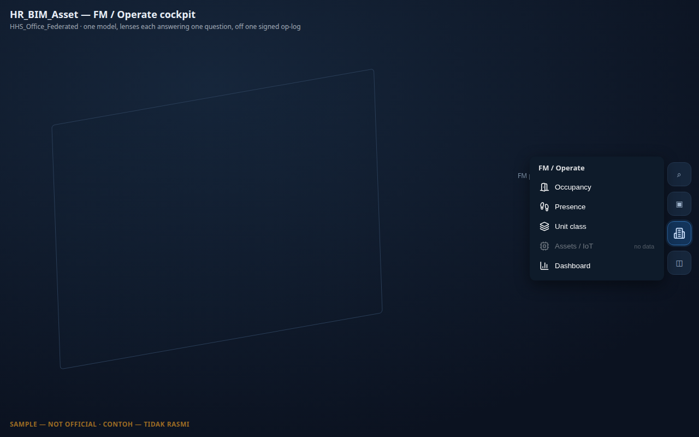
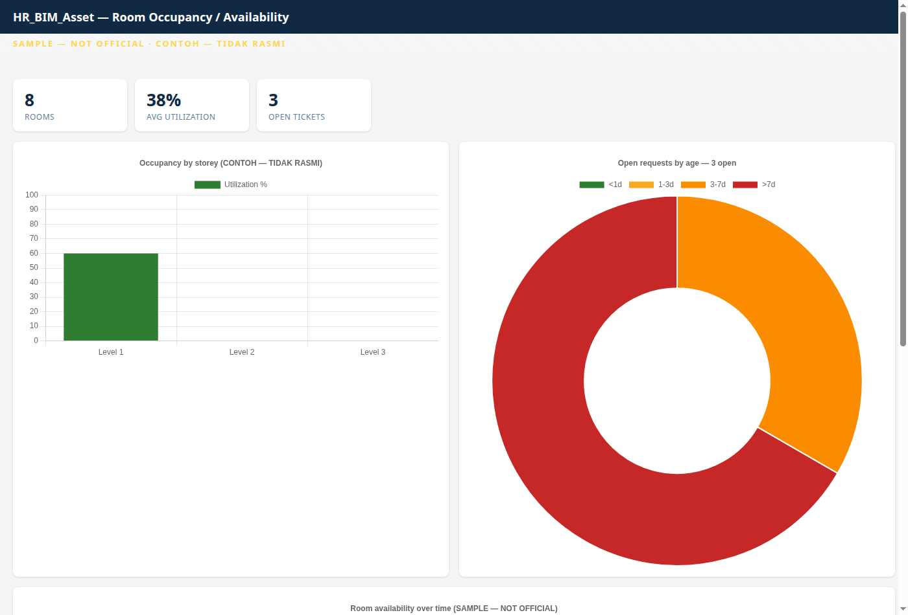

# HR_BIM_Asset — HR / Tenancy / Operate Module  *(ALPHA)*

> **⚠ DEMONSTRATOR — NOT OFFICIAL.** Every screen and every generated output (payslip, invoice, report, export,
> print) carries the **`CONTOH — TIDAK RASMI` / `SAMPLE — NOT OFFICIAL`** watermark. Demo values only — this is a
> demonstrator and a policy counter-proposal, **not** a certified/compliant production system.

**HR_BIM_Asset turns the building into the operate-phase (7D) cockpit.** The idea in one line:

> **One model · a few lenses, each answering exactly one operational question · all off one signed op-log.**

It is a **peer module** alongside the Viewer, Modeller and ERP — it boots and runs standalone on its own seed
(no ERP/`ad_full` required), and lights up two **dotted-line** adapters when ERP *is* present (GL posting and
`C_BPartner.isEmployee`). The same generic *periodic RUN* engine serves four profiles — **payroll · tenancy ·
strata · maintenance** — so tenancy is "payroll inverted" (cash-in, not cash-out), not a new build.

---

## The FM / Operate pill — one entry, a wake-aware drawer

All of the module's spatial lenses live behind **one toolbar pill — `FM / Operate`** (a building glyph). Tapping
it opens a small drawer. This keeps the viewer toolbar uncluttered: one icon instead of six.

The drawer is **wake-aware**. The `FM` pill itself only appears when the loaded building carries *some* operate
data, and inside the drawer **each lens is enabled only when its own data exists** in *this* building — otherwise
it is **greyed and labelled "no data"** (above, *Assets / IoT* is greyed because the sample building has no
asset/IoT records). No data → no clutter, and nothing is ever faked to fill a lens.

| Lens | The question it answers | Colour meaning |
|---|---|---|
| **Occupancy** | "Is this unit occupied — and what's its lease status?" | occupied (green) · expiring (amber) · vacant (grey) · unavailable (purple, a maintenance/renovation blackout) |
| **Presence** | "Who is physically here *right now*?" | live headcount density — 1 (light) · 2–4 (mid) · 5+ (deep blue) |
| **Unit class** | "What *is* this space?" | residential · commercial · office · unclassified (grey) |
| **Assets / IoT** | "What equipment needs service?" | ok (green) · due (amber) · overdue (red) |
| **Dashboard** | "Give me the numbers." | opens an extra charts pane (below) |

Every lens **lights only units bound to a real `IfcSpace`/element guid** in the loaded building; a non-matching
guid is honestly left un-linked, never a faked tint. Toggling a lens **off** restores the model fully (zero
residue) — the overlays never disturb the 3D scene or any other panel.

> **Occupancy includes lease status.** Earlier alphas had a separate *Tenancy* lens; it is now folded into
> **Occupancy**, which is the superset — it replays the room's signed booking log (`ASSIGN`/`RELEASE`/`UNAVAIL`),
> so a vacant room reads vacant from the *absence* of a booking, never a faked tenant.

### What "unit class" sources (non-invent)
A unit's class is resolved with a strict priority and **never guessed**: (1) a *real* `IfcSpace` `predefined_type`
from the model when the building carries one; else (2) the **declared class on the lease record** (a business
datum, watermarked sample); else (3) **unclassified**. The sample building (an office) carries no IFC space-type,
so its demo leases declare their class — the room guids are real, the class labels are sample lease declarations.

---

## The occupancy dashboard

The **Dashboard** entry opens an additive charts pane (it never touches the 3D scene). It is a pure read-only
fold of the same signed op-log — per-storey utilization, availability-over-time, and open-ticket aging, with KPIs.

---

## How a unit binds to the model

A lease/asset record carries a **guid** (the `IfcSpace` room guid the Outliner already derives from
`rel_contained_in_space`). The lens activates only when that guid **resolves to a real mesh** in the loaded
building — the same join Items↔ProjectOrder use. The blue **active band** is the user toggling a lens *on*;
**detection** (the join hitting real data) is what makes the icon appear at all.

---

## The money + contract side (when ERP is loaded)

The **deal and money** half of a tenancy — the lease as a signed **agreement**, the **rent run → AR**
(`C_Invoice → C_Payment → allocation → GL`), the **Request/ticket** workflow, and the product catalog (rental vs
purchase, installment schedules) — lives in the **[Kernel-ERP guide → Tenancy](ERPUserGuide.md#hr-tenancy)**. HR
supplies the **people + access** (party = `C_BPartner`, signed check-in, capability tokens); the Viewer supplies
the **spatial** view above; ERP supplies the **money**. One lease threads all three over the shared BIM model and
the one signed op-log.

---

*Spec: `prompts/RESUME_HR_BIM_ASSET.md` (§FM-FAMILY · §SPATIAL-VIEW · §BINDING · §CLASS · §PILLAR 1–4).
Back to the [BIM Viewer Guide](BIMUserGuide.md).*
