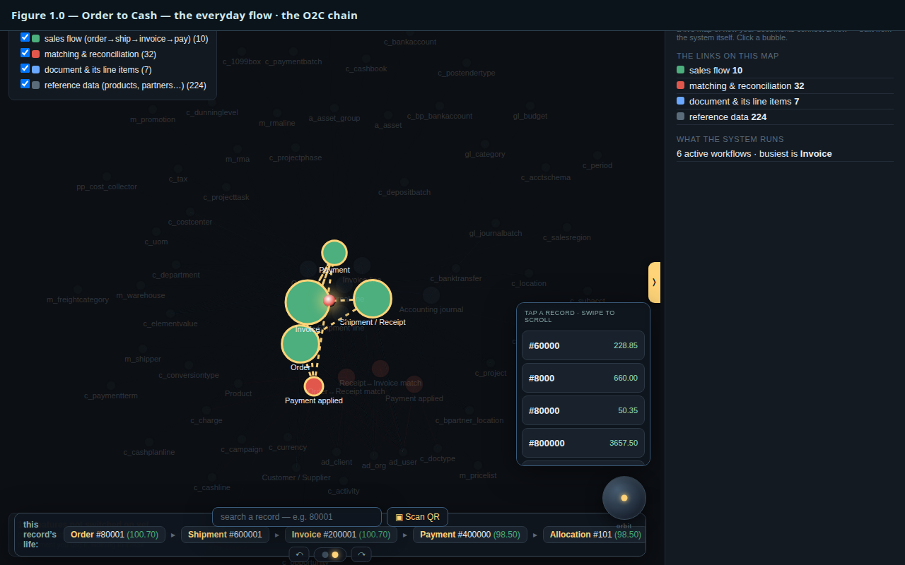
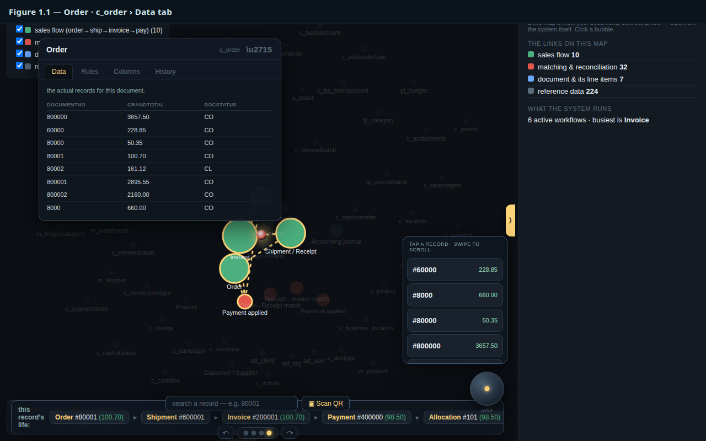
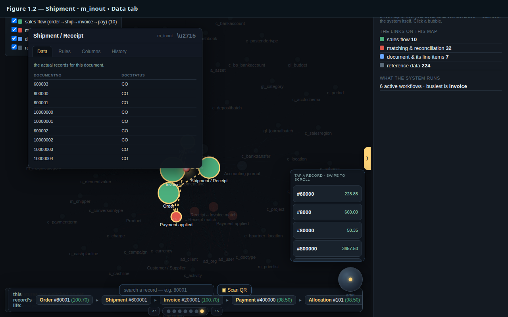
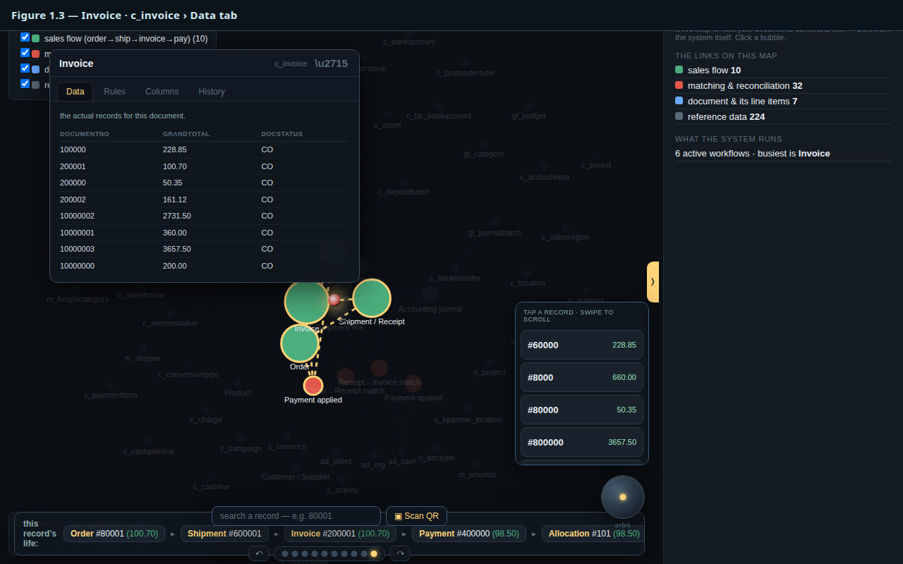
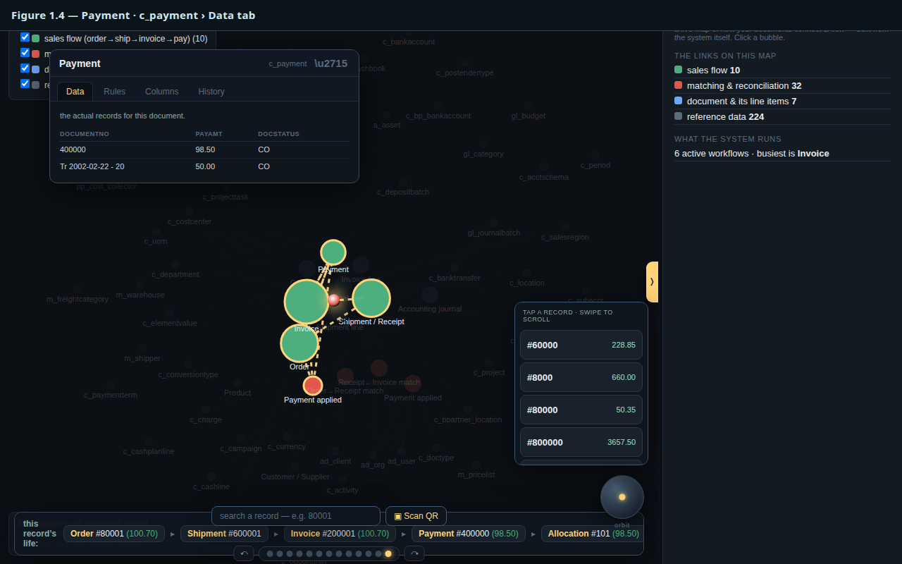
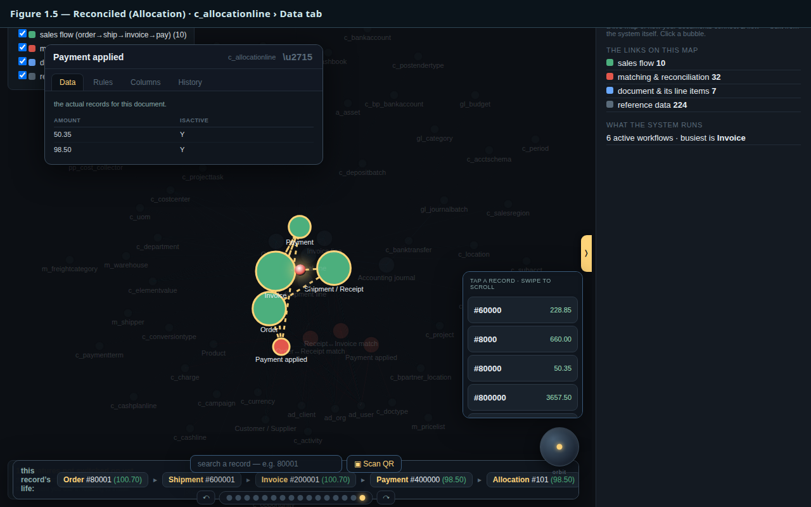

# Order to Cash — ReadMe (Help steps)

> Step-by-step help for the Order-to-Cash flow. The **numbered bubble** beside each step is the same one you see on the [Glassbowl explorer](glassbowl.html): tick **NeedHelp?**, click a numbered `?` bubble, then **ShowMe** to be taken to it. One real order — Sales Order **#80001** ($100.70) — traced end to end from the actual data.

## ▶ Order to Cash

*Figure 1.0 — the whole lit O2C chain on the map*

The most common journey in any business: a customer <b>orders</b>, you <b>ship</b>, you <b>invoice</b>, they <b>pay</b>, and the payment is <b>reconciled</b> to the invoice. Below, one real order &mdash; Sales Order <b>#80001</b> ($100.70) &mdash; is traced end to end from the actual data.

[↑ back to the flow](#order-to-cash-readme-help-steps)

## 1 Order

*Figure 1.1 — the Order bubble focused, Data tab showing #80001*

The <b>Order</b> records what the customer committed to buy. Here it is Sales Order <b>#80001</b>, total <b>$100.70</b>. Everything downstream &mdash; shipment, invoice, payment &mdash; references this one document. It needs no server: the order is a single signed entry appended at the edge.

[↑ back to the flow](#order-to-cash-readme-help-steps)

## 2 Shipment

*Figure 1.2 — the Shipment bubble focused, Data tab*

The <b>Shipment</b> (Material In/Out) is the goods leaving the warehouse against the order. It points back at the order it fulfils, so the link lives in the data &mdash; not in a session.

[↑ back to the flow](#order-to-cash-readme-help-steps)

## 3 Invoice

*Figure 1.3 — the Invoice bubble focused, Data tab showing $100.70*

The <b>Invoice</b> bills the customer &mdash; <b>$100.70</b>, the same figure as the order: what was ordered, shipped and billed all agree. The amount is <i>derived</i> by replaying the log, not stored twice.

[↑ back to the flow](#order-to-cash-readme-help-steps)

## 4 Payment

*Figure 1.4 — the Payment bubble focused, Data tab*

The <b>Payment</b> is the customer settling up. It is recorded as its own document, ready to be matched against the invoice.

[↑ back to the flow](#order-to-cash-readme-help-steps)

## 5 Reconciled (Allocation)

*Figure 1.5 — the Allocation bubble focused, Data tab showing $98.50*

The <b>Allocation</b> reconciles the payment to the invoice &mdash; here <b>$98.50</b>. This is the careful step a bookkeeper double-checks, and it is the <i>one matcher</i> that folds receivable against receipt for every kind of match.

[↑ back to the flow](#order-to-cash-readme-help-steps)
