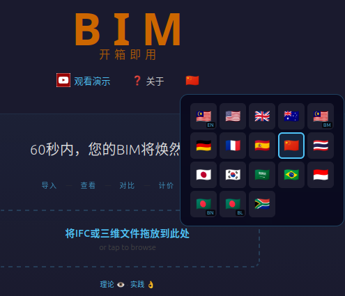

# BIM OOTB — Localization Guide

## Why This Matters in BIM

The BIM industry has standardized geometry (IFC/ISO 16739) but **not costing**. Every country has its own cost book, its own labour rates, its own currency, its own professional terminology. Today's BIM tools translate their UI but leave the cost data US/UK-centric — a Malaysian QS using Revit still manually applies CIDB rates. The tool speaks Malay but the BOQ speaks American.

BIM OOTB solves this with **project-level locales** — inspired by [iDempiere](https://www.idempiere.org/)'s `AD_Window_Trl` pattern, proven at enterprise scale across 50+ countries for 20+ years.

### What makes this different

| Approach | BIM OOTB | Autodesk/Trimble | Procore/PlanGrid |
|----------|----------|------------------|------------------|
| UI labels | Localized via `_TRL` | Localized | Localized |
| Cost rates | **Per-locale rate books** | US/UK only | No BOQ |
| Currency | **Locale-driven** | Manual config | USD only |
| Rate attribution | **CIDB / RS Means / DIN 276 / Spon's per locale** | None | None |
| Deployment | `?lang=ms_MY` in URL | Server config | Enterprise license |
| Project override | Copy locale file, edit rates | Not possible | Not possible |

The key insight: **a locale is not just a language — it's a complete cost context.** Same language, different rate books:
- `en_MY` — English + CIDB Malaysia rates + RM
- `en_US` — English + RS Means rates + USD
- `en_AU` — English + Rawlinsons rates + AUD
- `en_MY_JKR` — English + JKR Schedule of Rates + RM (government projects)

---

## Architecture

```
rates.js              → _RATES_DEFAULTS (runtime globals, loaded by all pages)
locales/{code}.js     → _TRL_LOCALE (full override: labels + rates + currency)
                         loaded by locale_loader, deep-merged over defaults
```

### Override priority (highest wins)
1. **URL params** — `?cur=USD&rate=4.45&h_labour=Labor` (any `_TRL` key)
2. **Project locale** — `MyProject_TRL.js` (custom file, any name)
3. **Country locale** — `locales/{code}.js`
4. **Base defaults** — `_TRL_DEFAULTS` in `rates.js` (en_MY)

### Load order
```
<script src="rates.js">          ← defaults + helper functions
<script src="locale_loader.js">  ← reads ?lang= or localStorage, loads locale file
<script src="boq_charts.html">   ← uses _TRL.* for every label, CUR for currency
```

---

## Available Locales

| Code | Language | Flag | Currency | Rate Source |
|------|----------|------|----------|-------------|
| `en_MY` | English (Malaysia) | 🇲🇾 | RM / USD | CIDB Malaysia 2024 / BCISM |
| `en_US` | English (US) | 🇺🇸 | $ / RM | RS Means 2024 |
| `en_GB` | English (UK) | 🇬🇧 | £ / USD | Spon's 2024 |
| `en_AU` | English (Australia) | 🇦🇺 | A$ / USD | Rawlinsons 2024 |
| `ms_MY` | Bahasa Melayu | 🇲🇾 | RM / USD | CIDB Malaysia 2024 |
| `de_DE` | Deutsch | 🇩🇪 | EUR / USD | DIN 276 / BKI 2024 |
| `fr_FR` | Français | 🇫🇷 | EUR / USD | Bordereau UNTEC 2024 |
| `es_ES` | Español | 🇪🇸 | EUR / USD | CYPE Base de Precios 2024 |
| `zh_CN` | 简体中文 | 🇨🇳 | ¥ / USD | GB/T 50500-2013 |
| `th_TH` | ภาษาไทย | 🇹🇭 | ฿ / USD | BOQ Thailand Standard |
| `ja_JP` | 日本語 | 🇯🇵 | ¥ / USD | JBCI Cost Index 2024 |
| `ko_KR` | 한국어 | 🇰🇷 | ₩ / USD | KICT Standard 2024 |
| `ar_SA` | العربية | 🇸🇦 | ﷼ / USD | Saudi Aramco Rates |
| `pt_BR` | Português | 🇧🇷 | R$ / USD | SINAPI/TCPO 2024 |
| `id_ID` | Bahasa Indonesia | 🇮🇩 | Rp / USD | SNI BOQ Standard |
| `bn_BD` | বাংলা (Bengali) | 🇧🇩 `BN` | ৳ / USD | PWD Bangladesh 2024 |
| `bl_BD` | Banglish (Romanized) | 🇧🇩 `BL` | ৳ / USD | PWD Bangladesh 2024 |
| `af_ZA` | Afrikaans | 🇿🇦 | R / USD | ASAQS / RICS Southern Africa 2024 |

---

## For Developers: Creating a New Locale

### Step 1: Copy the base

```bash
cp deploy/dev/locales/en_MY.js deploy/dev/locales/xx_YY.js
```

`en_MY.js` is the base — it contains **every key** so you can see the full set.

### Step 2: Edit identity and currency

```js
var _TRL_LOCALE = {
  iso: 'YY',              // ISO 3166-1 alpha-2 (drives flag emoji)
  lang: 'xx',             // ISO 639-1 language code
  locale: 'xx_YY',

  cur: 'CUR',             // primary currency symbol
  cur2: 'USD',            // secondary currency symbol
  cur_rate: 1.00,         // 1 cur2 = cur_rate × cur
  cur_name: 'Your Currency',
  cur2_name: 'US Dollar',
```

### Step 3: Set rate source attribution

Every country has its own cost book. This is the **single most important** part — it's what appears on the cover sheet of every Excel BOQ export.

```js
  rate_source:       'Your Country Rate Book 2024',
  rate_mat_source:   'National Construction Cost Centre 2024',
  rate_lab_source:   'Labour Wage Survey 2024',
  rate_eq_source:    'Equipment Hire Rates 2024',
```

### Step 4: Translate labels

Only override what differs from the base. Construction terms that are ISO standards stay in English.

```js
  // Column headers
  h_material: 'Material',      // translate this
  h_labour: 'Labour',          // en_US: 'Labor'
  h_equipment: 'Equipment',    // translate this
  h_storey: 'Storey',          // en_US: 'Story'

  // Chart titles
  t_cost_by_disc: '5D — Cost by Discipline',  // translate after the dash
  t_gantt: '4D — Gantt Timeline (Strategic Tasks by Phase)',
```

### Step 5: Set your country's rates

This is what makes `_TRL` a **project locale**, not just a language pack. The rates are engineering data from your country's cost book.

```js
  rates: {
    IfcWall:  {rate: 145, unit: 'M2', desc: 'Blockwork Wall 150mm'},
    IfcBeam:  {rate: 680, unit: 'M',  desc: 'Structural Steel I-Beam'},
    IfcSlab:  {rate: 285, unit: 'M2', desc: 'RC Slab 250mm'},
    // ... all IFC classes your cost book covers
  },

  labor_rates: {
    MASON: {rate_per_day: 155, crew_size: 3, trade: 'Mason (Skilled)',
            productivity: {IfcWall: 12, IfcWallStandardCase: 12}},
    // ... your labour trades
  },

  equipment_rates: {
    MOBILE_CRANE_20T: {rate_per_day: 1850, desc: 'Mobile Crane 20 Tonne'},
    // ... your equipment hire rates
  },
```

### Step 6: Test

Load with `?lang=xx_YY` and check the auto-downloaded `.log` file:

```
§TRL_VERIFY  — TRL_COMPLETE: all keys populated
§TRL_VERIFY  — TRL_CUR_MATCH: CUR=CUR _TRL.cur=CUR
§TRL_VERIFY  — TRL_SHEET_NAMES: 5/5 sheets match
§TRL_VERIFY  — TRL_CHART_TITLES: 9/9 charts match
§TRL_VERIFY  — TRL_NO_HARDCODE: no RM/USD leaks
§MATHS_VERIFY — MATHS_CUR_CONV: conversion correct
```

All tests auto-run on every Excel save (5D or 4D button). No manual verification needed.

---

## Translation Rules

### DO translate
- Column headers (`Material`, `Labour`, `Equipment`, `Storey`, etc.)
- Chart titles (the part after `5D —` or `4D —`)
- Excel sheet names (`Cover Sheet`, `Executive Summary`, etc.)
- Section titles (`COMPREHENSIVE BILL OF QUANTITIES`, etc.)
- Status messages and UI labels
- Rate source attribution (use your country's actual cost book name)
- Trade names (`Mason`, `Electrician`, `Plumber` → your language)
- Equipment descriptions (`Mobile Crane 20 Tonne` → your language)

### DO NOT translate
- **IFC class names** — `IfcWall`, `IfcBeam`, `IfcSlab` are ISO 16739 identifiers
- **nD dimension codes** — `5D —`, `4D —` are universal industry prefixes
- **Technical acronyms** — BIM, BOQ, WBS, MEP, HVAC, GPS, IFC
- **Units** — M, M2, EA, KG (ISO standard)
- **Brand name** — `BIM OOTB — Frictionless BIM` (stays in `source_app`)
- **Compass directions** — N, S, E, W (universal)
- **Axis labels** — X, Y, Z (universal)

### DO NOT change in locale files
- Rate **values** for IFC classes you don't have local data for — keep the base value
- Productivity numbers unless you have local trade data
- Equipment allocation factors unless your construction practice differs
- `RATES`, `LABOR_RATES`, `EQUIPMENT_RATES` in `rates.js` — those are the defaults

---

## Project-Level Override

For a specific project (e.g., a JKR government contract in Malaysia):

```bash
cp deploy/dev/locales/en_MY.js deploy/dev/locales/MyProject_TRL.js
```

Edit `MyProject_TRL.js`:
- Swap CIDB rates for JKR Schedule of Rates
- Adjust productivity for your project's constraints
- Set `rate_source` to `'JKR Schedule of Rates 2024'`

Load with `?lang=MyProject_TRL` — your entire 4D/5D output uses project-specific rates.

---

## _TRL Key Reference

### Currency (5 keys)
`cur`, `cur2`, `cur_rate`, `cur_name`, `cur2_name`

### Rate Attribution (12 keys)
`rate_source`, `rate_year`, `rate_mat_source`, `rate_mat_ref`, `rate_mat_includes`, `rate_lab_source`, `rate_lab_basis`, `rate_lab_prod`, `rate_lab_crew`, `rate_eq_source`, `rate_eq_alloc`, `rate_eq_basis`

### Column Headers (22 keys)
`h_discipline`, `h_ifc_class`, `h_quantity`, `h_uom`, `h_description`, `h_storey`, `h_phase`, `h_item`, `h_material`, `h_labour`, `h_equipment`, `h_total`, `h_unit_rate`, `h_mat_rate`, `h_lab_rate`, `h_rate_day`, `h_trade`, `h_crew_size`, `h_man_days`, `h_duration`, `h_grand_total`, `h_subtotal`

### 4D Labels (14 keys)
`h_wbs`, `h_task_name`, `h_productivity`, `h_gangs`, `h_start_date`, `h_finish_date`, `h_labor_resource`, `h_status`, `h_pct_complete`, `h_day_offset`, `h_date`, `h_milestone`, `h_task`, `h_task_count`, `h_total_days`, `h_total_man_days`, `h_week`, `h_cumulative_pct`

### Chart Titles (10 keys)
`t_cost_by_disc`, `t_cost_components`, `t_task_dist_phase`, `t_task_count_disc`, `t_phase_duration`, `t_resource_workload`, `t_s_curve`, `t_milestone`, `t_gantt`, `t_vo_impact`

### Excel Sheet Names (10 keys)
`s_cover`, `s_exec_summary`, `s_material`, `s_labour`, `s_equipment`, `s_boq`, `s_prov`, `s_schedule`, `s_proj_summary`, `s_dashboard`

### Section Titles (11 keys)
`t_comp_boq`, `t_cost_method`, `t_mat_summary`, `t_lab_summary`, `t_equip_summary`, `t_prov_sums`, `t_phase_dur_analysis`, `t_resource_analysis`, `t_s_curve_progress`, `t_milestone_timeline`, `t_gantt_timeline`

### Rate Data (in locale files)
`rates` (object), `rates_default`, `labor_rates` (object), `equipment_rates` (object), `equipment_allocation` (object)

### Misc
`not_started`, `source_app`, `iso`, `lang`, `locale`

---

## iDempiere Pattern Mapping

For developers familiar with iDempiere ERP:

| iDempiere | BIM OOTB | What |
|-----------|----------|------|
| `AD_Window` | `_TRL_DEFAULTS` in `rates.js` | Base entity (en_MY) |
| `AD_Window_Trl` | `locales/{code}.js` | Per-language override |
| `AD_Client` / `AD_Org` | Project locale file | Per-tenant/org override |
| `AD_Language` | `iso` + `lang` fields | Language identity |
| `AD_Element` | `h_*` keys | Shared column names |
| `AD_Message` | `ui_*` keys | UI messages |
| `C_Currency` | `cur`, `cur_rate` | Currency conversion |
| `M_Product_PO` | `rates` object | Per-vendor (per-country) pricing |

The pattern: one master record contains every field. Translation records override what differs. Deep merge at runtime. URL params override everything (like iDempiere's `#AD_Language` context variable).

---

## Files

| File | Purpose |
|------|---------|
| `deploy/dev/rates.js` | Default rates + helper functions (calcLabor, calcEquipment, getRate) |
| `deploy/dev/locales/en_MY.js` | Base locale — English (Malaysia), CIDB 2024 |
| `deploy/dev/locales/{code}.js` | Country locale — 18 locales shipped |
| `deploy/dev/boq_charts.html` | 4D/5D analytics — uses `_TRL.*` for all labels |
| `deploy/dev/variation_order.js` | VO Excel — uses shared `rates.js` |
| `deploy/dev/nlp.js` | Voice/text queries — uses `getRate()` from `rates.js` |
| `prompts/S226_localisation.md` | Implementation spec — per-file audit, UI keys, phases |
| `deploy/dev/locale_loader.js` | Runtime: detect locale, fetch, cache, apply to DOM |

---

## Flag Picker (User-Facing)

Users switch locale via a **flag button** in the header bar (landing page and viewer). Clicking it opens a popup grid of 18 country flags. Selecting a flag:

1. Saves choice to `localStorage` (`bim_ootb_config`)
2. Reloads the page
3. All text, currency, and rates switch instantly

The current locale's flag is highlighted with a blue border. Dual-country locales (e.g. two Malaysian flags for `en_MY` and `ms_MY`) show small badges (`EN` / `BM`) to distinguish them.

No settings dialog, no gear icon — just click the flag.

<figure style="margin: 20px 0;">

<figcaption style="text-align:center; font-style:italic; color:#666; margin-top:8px;">Country picker to apply rates — later will separate language from region, even industry rates.</figcaption>
</figure>

---

## How locale_loader.js Works (Developer Reference)

### Detection order
1. URL param `?lang=xx_YY`
2. `localStorage` key `bim_ootb_config` → `{ locale: 'xx_YY' }`
3. `navigator.language` mapped to closest available locale
4. Fallback: `en_US`

### Fetch + cache
```
locale_loader.js
  ├── Check localStorage cache: key = 'bim_ootb_locale_{code}'
  │   └── Valid if: exists && version matches LOCALE_VERSION && age < 7 days
  ├── If cache miss → fetch from OCI: sandbox/locales/{code}.js
  │   └── Fallback: relative path locales/{code}.js (local dev)
  ├── Parse: new Function(text + '; return _TRL_LOCALE;')
  ├── Deep-merge over window._TRL (from _TRL_DEFAULTS if present)
  ├── Apply URL param overrides (?cur=USD, ?h_labour=Labor, etc.)
  └── applyTrlToDOM()
        ├── [data-trl="key"]       → el.textContent = _TRL[key]
        ├── [data-trl-title="key"] → el.title = _TRL[key]
        └── [data-trl-placeholder="key"] → el.placeholder = _TRL[key]
```

### Cache invalidation
`LOCALE_VERSION` constant in `locale_loader.js`. Bump it when locale files change — any cached entry with a different version is re-fetched.

### Landing page integration
The landing page loads `locale_loader.js` at the bottom. All translatable text uses `data-trl` attributes. JS-generated text (card buttons, progress bar) uses `_TRL.key || 'fallback'` pattern.

---

## Open Issues

| # | File | Issue | Status |
|---|------|-------|--------|
| I-1 | `deploy/dev/index.html` | Tooltip visibility confirmed working for locales that have `ui_tt_*` keys. Deploy all updated locale files to OCI bucket to activate. | Deploy needed |
| I-5 | `deploy/dev/navigate.js` | `_TRL` applied to panel strings at build time. If locale loads AFTER panel builds, re-open panel to see translated text. To fix fully: listen to `trl-ready` event and rebuild panel. | Low priority |

**CLOSED:**
- I-2: boq_charts.html locale_loader confirmed working
- I-3: All 6 incomplete locales now have 14 `ui_tt_*` keys (af_ZA, ar_SA, bl_BD, bn_BD, id_ID, pt_BR, th_TH)
- I-4: `ui_saved_excel` + `ui_vo_label` added to all 18 locale files

### Tooltip architecture note
- Native `title` attribute: works desktop hover only, not mobile
- `#ootb-tip` JS bubbles: appended to `<body>` (bypasses `overflow:hidden` on `.panel-body`), shows on `mouseover` + `touchstart` (1.8s)
- boq_charts.html toolbar: buttons now have `title` + `data-trl-title` — locale_loader.js applies translations via `applyTrlToDOM()`
- If still not showing: check browser console for `§TRL_LOADED` log line; if absent, locale_loader.js fetch failed

---

## Current Status (POC)

- Language and currency/rates are **bundled per flag** — selecting Japanese gives you Japanese UI + JPY currency + Japanese rate sources
- A future version will separate language preference from currency/rate selection (e.g. English UI with Malaysian Ringgit rates)
- Rate data is illustrative — not authoritative for production cost estimation
- 18 locales ship with ~300 keys each (UI + BOQ + 4D/5D + landing)

*Copyright (c) 2025-2026 Redhuan D. Oon. MIT Licensed.*
