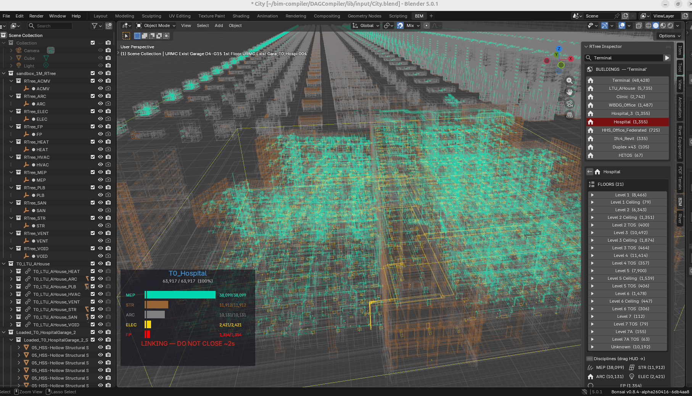

# The ERP World View — Why Construction Is Manufacturing
*[← Back to the **User Guide**](USER_GUIDE.md) · [Home](index.md)*


> **Read this first.** Before any spec, any code, any schema. This is the lens
> through which every design decision in this project makes sense.

<div class="bim-banner" markdown>
<b>A building is a manufactured product with coordinates.</b> ERP already knows how to explode a BOM, track orders, and validate rules. This project applies that 30-year-old pattern to construction — same tables, same logic, spatial output instead of shop-floor output.
</div>

---

## The Three Concerns

iDempiere separates documents into header (C_Order) and lines (C_OrderLine),
with its BOM spatiality validated against Validation Rules.
We inherit the same separation:

| Concern | iDempiere | BIM Compiler | Table |
|---------|-----------|-------------|-------|
| **WHAT** to build | Orders, Categories, Products | Which products, classified by M_Product_Category + AD_Org | c_orderline |
| **HOW** to validate | BOMs, AttributeSets, Validation | Spatial rules propose, regulatory rules gate — by discipline and jurisdiction | ad_val_rule |
| **WHERE** it lands | Output.db for 4D–8D | Compiled placements + ASIs — the single source of truth downstream | output.db |

These three concerns are **never merged**. A change to WHAT (swap a product)
does not require changes to HOW (rules are independent — swap jurisdiction
without touching products) or WHERE (compiled output recalculates automatically). This is the architectural invariant that makes exception-based
ordering possible: override one concern, inherit the others.

**The downstream payoff:** output.db with its ASIs (per-instance attributes) is
what every downstream dimension reads — 4D scheduling,
5D cost,
6D carbon, 7D facility management, and
8D ERP integration. One compiled output, seven queries.

### WHAT: M_Product_Category (Classification) + AD_Org (Discipline)

The WHAT concern has two orthogonal axes — **what kind of thing** and **who is responsible**.

**M_Product_Category — Product classification (WHAT kind of thing).**
The same entity iDempiere uses to group products into swap pools. Categories
form a [BOM](https://en.wikipedia.org/wiki/Bill_of_materials) cascade — a
[Bill of Materials](https://wiki.idempiere.org/en/Manufacturing#Bill_of_Materials)
is a recipe: one parent product, N child products, each with a quantity. The magic
is that each child can itself be a BOM — a building contains floors, a floor
contains rooms, a room contains furniture, recursively. Each level is atomic
and self-contained:

```
Level       M_Product_Category    Examples
─────       ──────────────────    ────────
Building    RE (Residential)      SH, DX, DM, FK
  Floor     GF, L1, RF            ground, first, roof
    Room    LIVING, KITCHEN        swap pool — replace one LIVING layout for another
      Leaf  IFC_WALL, IFC_DOOR     element classification (→ component library geometry)
```

The category at each level defines the **swap pool** — you can replace one
LIVING room layout with another LIVING layout, but you can't swap a LIVING
room for a KITCHEN. This is iDempiere's Configure-to-Order constraint
applied to spatial BOMs.

**AD_Org — Discipline (WHO is responsible).** In iDempiere, `AD_Org` partitions
data by business unit. Here, 16 engineering disciplines partition the BOM
validation space — from architecture to rail infrastructure. Each has its
own rules, its own AD_Val_Rule set, its own validation pass — but sharing
the same product catalog. See the [full AD_Org table](#the-application-dictionary-heritage) below for all 16
disciplines with IFC class mappings and Terminal element counts.

**The distinction matters.** Disciplines cut ACROSS the category tree — they
don't appear AS levels within it. Three products in the same room (same
category path) can have three different AD_Orgs:

```
Category cascade:     RE → GF → LIVING → SOFA_001       ← AD_Org = ARC
Category cascade:     RE → GF → LIVING → SPRINKLER_001  ← AD_Org = FP
Category cascade:     RE → GF → LIVING → LIGHT_001      ← AD_Org = ELEC
```

M_Product_Category answers "what kind of thing?" AD_Org answers "who installs it?"

### The Category Cascade — One Pattern, Three Domains

The cascade is universal. The same parent→child→grandchild pattern governs
residential, infrastructure, and commercial buildings. Only the category
names change:

**Residential:**
```
RE (Residential)
  └─ M_Product: SH (IsBOM=Y)              ← the building IS a product
       └─ GF (Ground Floor, IsBOM=Y)       ← floor is a product
            └─ LIVING (Room, IsBOM=Y)       ← room is a product
                 ├─ SOFA_001 (IsBOM=N)      ← leaf — geometry from component library
                 └─ TABLE_001 (IsBOM=N)     ← leaf — geometry from component library
```

**Infrastructure:**
```
IN (Infrastructure)
  └─ M_Product: BR (Bridge, IsBOM=Y)
       └─ SUP (Support, IsBOM=Y)           ← segment is a product
            └─ PILE_001 (IsBOM=N)           ← leaf — geometry from component library
```

**Commercial:**
```
CO (Commercial)
  └─ M_Product: WA (Warehouse A, IsBOM=Y)
       └─ L1 (Level 1, IsBOM=Y)            ← floor is a product
            └─ OFFICE (Space, IsBOM=Y)      ← space type — same swap-pool logic
                 └─ DOOR_001 (IsBOM=N)      ← leaf — geometry from component library
```

### Category Population — Current State

| M_Product_Category | Buildings | Sub-Categories |
|-------------------|-----------|----------------|
| **RE** (Residential) | SH, DM, DX, FK, AC | LIVING, KITCHEN, BEDROOM, BATHROOM, DINING, MASTER, CORRIDOR, OFFICE + floor-level (GF, RF, L1, L2) |
| **RE** (Residential, floor-only) | BA, BH, BS, CA, CE, CH, CL, CP, CS, ES, GH, HI, JE, JS, MO, NI, RA, RM, RS, SC, WB, WI | Floor-level categories only (GF, L1, L2, ROOF, FDN, MISC) — no room categories yet |
| **IN** (Infrastructure) | BR, RD, RL | SUP, DCK, ABT, TRK, ROAD, RAIL, GEO — segment types |
| **CO** (Commercial) | WA, WL, WT, TE | LOBBY, OFFICE, PLANT_ROOM, LOADING + floor-level (L1–L5) + discipline-driven (ARC, STR, FP, ACMV, ELEC, CW, SP, LPG) |
| **IP** (Industrial Plant) | IP | PROCESS, UTILITY, CONTROL, MISC + floor-level |

**Gaps:** 22 residential buildings have only floor-level categories (GF, L1, L2)
but no room-level categories (LIVING, KITCHEN, BEDROOM). These buildings were
extracted before room-level classification was implemented. Re-extraction with
the current pipeline would populate room categories automatically.

**Self-describing BOM tree:** The hierarchy is whatever the products make it
(BBC.md §1 — no fixed `UNIT/FLOOR/ROOM/SET/ITEM` vocabulary). Root = `getParentBOM()` returns null.
Leaf = `getChildren()` returns empty. M_Product_Category determines the grouping at each level.

---

## The Insight

In 2006, we built ADempiere's manufacturing BOM module. In 2010, we rebuilt it
for iDempiere. After two decades of watching M_Product, M_BOM, and C_Order
handle everything from circuit boards to patio furniture sets, the realisation
was unavoidable:

**A building is just a very large manufactured product with spatial coordinates.**

Every wall panel is an M_Product. Every floor plan is an M_BOM (assembly recipe).
Every construction project is a C_Order. The only thing manufacturing MRP lacks
is the *where* — the (x, y, z) coordinates that turn a flat bill of materials
into a three-dimensional building.

Manufacturing solved procurement, scheduling, cost control, and quality decades
ago. Construction never had a Bill of Materials. This project provides one.
The rest follows from that foundation.

---

## The Pattern: A Product IS a BOM

In iDempiere/Libero Manufacturing, there is one universal entity: **M_Product**.

A Patio Furniture Set is an M_Product. Set `IsBOM=Y` and it has children:
4 chairs, 1 table, 1 optional shade — each an M_Product in its own right.
The chairs are leaf products (`IsBOM=N`): they have no children, they reference
inventory directly. The set is a BOM product: it has a recipe (M_BOM) with
lines (M_BOM_Line) that point to its children.

**This is the entire model.** Products all the way down. BOMs are not a
separate entity — they are a property of a product. A building is a product.
A floor is a product. A room is a product. A door is a product. A bridge
span is a product. A road segment is a product. The tree is universal.

The root product has no parent. Every other product is a child of something.
M_Product_Category determines what kind of thing it is — not a hardcoded
type string, but the category cascade. The tree structure tells you
nesting. The category tells you domain meaning. The compiler doesn't need
to know if it's walking a building or a bridge — it walks products.

```
Residential:
  SH (M_Product, IsBOM=Y, M_Product_Category=RE)       ← root (no parent)
    └─ GF (M_Product, IsBOM=Y, M_Product_Category=GF)   ← child of root
         └─ LIVING (M_Product, IsBOM=Y, M_Product_Category=LIVING)
              ├─ WALL_PANEL (M_Product, IsBOM=N → geometry from component library)
              ├─ DOOR (M_Product, IsBOM=N → geometry from component library)
              └─ FURNITURE_SET (M_Product, IsBOM=Y, M_Product_Category=FR)
                   ├─ TABLE (M_Product, IsBOM=N → leaf)
                   └─ CHAIR × 4 (M_Product, IsBOM=N → leaf)

Infrastructure (same model, different categories):
  BR (M_Product, IsBOM=Y, M_Product_Category=IN)        ← root (no parent)
    └─ SPAN_01 (M_Product, IsBOM=Y, M_Product_Category=SPAN)
         └─ PILE_001 (M_Product, IsBOM=N → leaf)
```

When the compiler encounters a BOM product, it **explodes** (recurses into
children). When it encounters a leaf product, it **resolves** (looks up geometry
in the component library). This is the same operation an ERP system performs
when it explodes a manufacturing BOM into work orders. The walker doesn't
branch on domain vocabulary — it follows the tree.

---

## The Order — Configure-to-Order

In iDempiere, there is **one C_DocType per document purpose**: SOO (Sales Order),
POO (Purchase Order), MOP (Manufacturing Order). Product classification lives
on M_Product → M_Product_Category — never on the document type.

**This project has exactly one document purpose: "Construction Order."** That is
the C_DocType. Classification lives where it belongs — on the product's
M_Product_Category, not on the order.

The BOM cascade gives you the FULL product tree (SH → floors → rooms → furniture →
thousands of leaves). But the C_Order does NOT repeat that tree. This is
iDempiere's Configure-to-Order pattern: the order carries only the EXCEPTIONS.

```
M_Product SH (BOM template):     1099 elements (full cascade)
C_Order "Build me SH":           0 lines (no exceptions — use template as-is)
C_Order "SH but no sofa":        1 line  (qty=0 at locator_ref RE.GF.LI.SOFA_001)
C_Order "SH Solar Premium":      6 lines (inherits from SH Solar, adds overrides)
C_Order "200 houses, 6 variants": 200 × ~3 lines = 600 lines (not 200 × 1099)
```

The BOM template is the PRODUCT (M_Product + M_BOM + M_BOM_Line cascade).
The Order is just the delta — Remove (qty=0), Compress (reference class × N),
Replace (swap product at locator_ref), Add (new line). Inheritance chains
(Ref_Order_ID) let you stack deltas: SH_BASE → SH_SOLAR → SH_SOLAR_PREMIUM.

The category at each level constrains what the thin order can override.
You can Replace a LIVING room layout with another LIVING layout, but you
can't swap it for a KITCHEN. M_Product_Category is the swap-pool guard.

---

## The Entity-Relationship Model

Every table in this project maps to a proven iDempiere entity. No invented
abstractions. No BIM-specific data models.

### The ERD

```
M_Product_Category (RE, IN, CO)          ← WHAT kind of thing (cascade level)
  └─ M_Product (SH, DX, BR)             ← the thing itself (IsBOM=Y or N)
       ├─ M_BOM + M_BOM_Line            ← children (cascade down, dx/dy/dz tack offsets)
       ├─ M_AttributeSet                ← WHICH attributes vary (BIM_Pipe, BIM_Component)
       │    └─ M_AttributeSetInstance   ← per-instance values (length=3200mm)
       └─ AD_Org                        ← WHO installs it (ARC, FP, ELEC) — tag, not level

C_DocType ("Construction Order")         ← ONE document type, always
  └─ C_Order ("Build me SH")            ← references M_Product
       ├─ C_OrderLine                   ← exceptions only (thin order)
       │    ├─ locator_ref              ← WHERE in the tree
       │    └─ M_Product_Category       ← swap pool constraint
       ├─ Ref_Order_ID                  ← inheritance chain
       └─ C_Campaign                    ← design theme (orthogonal)

AD_Val_Rule                              ← jurisdiction rules (MY/UBBL, US/IBC)
AD_ChangeLog                             ← full provenance (undo/redo stack)
```

### The Mapping: iDempiere → BIM

| iDempiere Manufacturing | BIM Compiler | What It Does |
|------------------------|-------------|-------------|
| **M_Product** | Building element or assembly | The universal entity. Everything is a product |
| **M_Product_Category** | RE, IN, CO, GF, LIVING, IFC_WALL... | Classifies products at every cascade level. WHAT kind of thing |
| **AD_Org** | ARC, STR, FP, ELEC, ACMV... | Discipline = organisational unit. WHO is responsible |
| **M_BOM + M_BOM_Line** | Assembly recipe + children | BOM explosion. Each line has dx/dy/dz tack offset |
| **C_Order** | Construction project | One order = one building. Carries exceptions only |
| **C_OrderLine** | Exception line | Deviation from BOM template (swap, remove, compress, add) |
| **C_DocType** | "Construction Order" | ONE document type. Classification lives on M_Product_Category |
| **DocAction lifecycle** | DR → IP → CO → AP | Draft → In Progress → Complete → Approved |
| **AD_Val_Rule** | Validation by jurisdiction | Same rule engine, construction codes instead of tax codes |
| **C_Campaign** | Design theme | Bali, Scandinavian, Industrial — marketing drives variant |
| **AD_PrintFormat** | Output selection | Which elements to render, which to hide |
| **M_AttributeSet** | Instance variation | Per-element customization (pipe length, colour, finish) |
| **C_Project** | Site development | 200 houses under one project. Groups C_Orders |

**The extension:** Manufacturing MRP has product + quantity + sequence.
We add three columns to M_BOM_Line: `dx`, `dy`, `dz` — parent-relative
tack offsets in millimetres. That is the entire difference between a flat
BOM and a spatial BOM. Three integers turn procurement into construction.

### Orthogonal Dimensions

Seven dimensions cut ACROSS the product category cascade. None of them
appear AS levels within the tree:

| Dimension | iDempiere Entity | What It Controls | Orthogonal To |
|-----------|-----------------|------------------|---------------|
| **Classification** | M_Product_Category | What kind of thing (swap pool) | — (this IS the cascade) |
| **Discipline** | AD_Org | Who installs it | Category |
| **Design theme** | C_Campaign | Bali, Scandinavian, Industrial | Category, Discipline |
| **Jurisdiction** | AD_Val_Rule | MY/UBBL, US/IBC rules | Category, Discipline, Theme |
| **Costing** | M_PriceList | Unit cost by region/contract | All above |
| **Instance variation** | M_AttributeSetInstance | Pipe length, colour, finish | All above |
| **Site grouping** | C_Project | 200 houses under one project | Everything |

### M_AttributeSet — Why Product Count Stays Small

Without AttributeSets, TE (Terminal) with 48,428 elements would need 48,428
separate M_Products. That's wrong. In iDempiere, a shirt comes in S/M/L/XL —
that's ONE M_Product with an M_AttributeSet (size) and 4 M_AttributeSetInstances.
Not 4 products.

Same pattern for construction. An FP (Fire Protection) route has:
- START (pipe segment)
- MID (pipe segment — different length)
- JOINT (elbow, tee, reducer — fixed geometry)
- DEVICE (sprinkler head, valve — fixed geometry)
- END (cap, terminal)

These are ~5 abstract M_Products, not thousands. The VARIABLE part (pipe length)
lives on M_AttributeSetInstance. The FIXED part (elbow geometry) has no instance
attributes — it's the same product everywhere.

```
M_Product: PIPE_CW_50MM (IsBOM=N, M_AttributeSet = BIM_Pipe)
  └─ Instance 1: {length_mm: 3200}    ← segment in corridor
  └─ Instance 2: {length_mm: 4800}    ← segment in main run
  └─ Instance 3: {length_mm: 1200}    ← branch to sprinkler

M_Product: ELBOW_90_50MM (IsBOM=N, M_AttributeSet = BIM_Component)
  └─ No instances — fixed geometry, same everywhere

M_Product: SPRINKLER_UPRIGHT_K80 (IsBOM=N, M_AttributeSet = BIM_Component)
  └─ No instances — placement varies, product doesn't
```

The ROUTE verb assembles these into a BOM tree with per-segment instance
attributes. TE's 9,345 FP/CW/SP/LPG pipe elements → ~20 abstract products
× many instances. Without this, the product table explodes.

---

## The Application Dictionary Heritage

Compiere introduced the Application Dictionary (AD) in 2000 — metadata that
defines the system itself. ADempiere inherited it. iDempiere perfected it.
This project leans on it heavily. If you've administered an iDempiere instance,
every pattern below will feel familiar.

*iDempiere references: [wiki.idempiere.org](https://wiki.idempiere.org) ·
[Application Dictionary](https://wiki.idempiere.org/en/Application_Dictionary) ·
[Manufacturing](https://wiki.idempiere.org/en/Manufacturing) ·
[Validation Rules](https://wiki.idempiere.org/en/Validation_Rules) ·
[DocAction](https://wiki.idempiere.org/en/Document_Process)*

**AD_Val_Rule — Validation rules as data, not code.**
In iDempiere, `AD_Val_Rule` restricts field values (e.g., "only active Business
Partners"). Here, the same table enforces building codes: sprinkler spacing
>= 3000mm, emergency light within 6m of exit, fire door on every corridor.
Jurisdiction-scoped — MY/UBBL rules fire for Malaysian buildings, US/IBC for
American ones. Exactly like tax rules scoped by `C_Country`.
→ DocValidate.md · DocAction_SRS.md §5

**Column Callout — Reactive field logic.**
In iDempiere, a Callout fires when a user changes a field value (e.g., selecting
a Business Partner auto-fills the address). Here, `DiffVerb + Callout` means:
drag a wall in the viewport → cascading consequences fire (room AABB recalculates,
furniture re-validates, MEP re-routes). Same pattern, spatial domain.
→ ProjectOrderBlueprint.md §9

**ModelValidator — Event-driven hooks.**
iDempiere's `ModelValidator` fires before/after save, before/after delete. Our
`processIt()` orchestration follows the identical lifecycle: `prepareIt()` →
`completeIt()` → `approveIt()`. Each discipline routes through DocEvent — the
validation engine discovers applicable rules and fires them. No hardcoded logic.
→ DocAction_SRS.md §1

**C_Project — Multi-order grouping.**
Any ERP person recognises `C_Project` instantly: project accounting, milestone
tracking, cross-order budgets. Here, a housing development IS a C_Project.
200 houses = 200 C_Orders under one C_Project. Site layout = C_ProjectLine
per plot. The same entity that manages a manufacturing program manages a
construction site.
→ ProjectOrderBlueprint.md §2

**AD_Org — Discipline as organisational unit.**
In iDempiere, `AD_Org` partitions data by business unit. Here, engineering
disciplines partition the BOM validation space. Each discipline is an
organisational concern with its own rules, its own AD_Val_Rule set, its
own validation pass — but sharing the same product catalog.

**AD_Window_Trl — Locale-driven cost localisation.**
In iDempiere, `AD_Window_Trl` provides per-language translations for every
window. Here, `_TRL` locale files (`locales/{code}.js`) provide per-country
translations + per-country rate books: labels, currency, material rates, labour
rates, equipment rates, rate source attribution — all in one file per locale.
15 countries shipped. Same pattern: one master record (en_MY base), N locale
overrides, deep-merged at runtime. Project-level override supported (copy locale
file, edit rates for your contract). See → Localization.md

The Terminal building (TE, 48,428 elements) exercises all active disciplines
and proves the partitioning scales to commercial-institutional complexity:

| AD_Org_ID | Code | Name | IFC Classes | TE Elements | Role |
|-----------|------|------|-------------|-------------|------|
| 0 | * | Shared | — | — | Shared infrastructure visible to all trades |
| 1 | **ARC** | Architecture | IfcWall, IfcDoor, IfcWindow, IfcSlab, IfcPlate, IfcRoof, IfcStair, IfcFurniture, IfcRailing, IfcCovering | 34,724 | Building envelope, internal fit-out, finishes |
| 2 | **STR** | Structural | IfcColumn, IfcBeam, IfcMember, IfcFooting, IfcElementAssembly | 1,429 | Load-bearing frame, foundations |
| 3 | **FP** | Fire Protection | IfcFireSuppressionTerminal, IfcAlarm, IfcSensor, IfcController + pipe network | 6,863 | Sprinklers, alarms, risers (NFPA 13) |
| 4 | **ELEC** | Electrical | IfcLightFixture, IfcElectricAppliance | 1,172 | Lighting, outlets, switches, cable trays |
| 5 | **ACMV** | HVAC | IfcAirTerminal, IfcDuctSegment, IfcDuctFitting | 1,621 | Ducts, diffusers, AHUs |
| 6 | **CW** | Cold Water | IfcPipeSegment, IfcPipeFitting, IfcValve, IfcFlowTerminal | 1,431 | Water supply piping |
| 7 | **SP** | Sanitary/Plumbing | IfcSanitaryTerminal, IfcPipeSegment, IfcPipeFitting | 979 | Waste pipes, fixtures, drainage |
| 8 | **LPG** | Gas Piping | IfcPipeSegment, IfcPipeFitting, IfcValve | 209 | Gas supply piping, meters |
| 9 | **REB** | Reinforcement | IfcReinforcingBar | *(removed)* | Rebar, mesh — generated by Bonsai addon, not construction BOM |
| 10 | **MEP** | MEP (Generic) | IfcFlowTerminal, IfcFlowSegment, IfcFlowFitting | — | Resolves to FP/ELEC/ACMV/CW/SP/LPG at placement |
| 11 | **ROAD** | Road | IfcCourse, IfcSurfaceFeature | — | IFC4X3 road infrastructure |
| 12 | **GEO** | Geotechnical | IfcEarthworksFill | — | Earthworks, cut-and-fill |
| 13 | **RAIL** | Rail | IfcTrackElement, IfcRail | — | IFC4X3 rail infrastructure |
| 14 | **LAND** | Landscape | IfcGeographicElement | — | Geographic, landscape elements |
| 15 | **SIGN** | Signage | IfcSign | — | Signs and signals |

**Key design principles:**

- Disciplines cut ACROSS the category tree — they don't appear AS levels.
  Three products in the same room can have three different AD_Orgs (ARC
  sofa, FP sprinkler, ELEC light).
- MEP (ID 10) is a routing placeholder — the BOM assigns MEP to pipe
  elements generically; `BomDropper.resolveDiscipline()` resolves to
  the specific trade (FP/CW/SP/LPG) based on `system_type` at placement.
- REB (ID 9) was removed from the TE pipeline — rebar is generated
  dynamically by the Bonsai Python addon, not extracted from the IFC
  construction BOM.
- IDs 11-15 (ROAD, GEO, RAIL, LAND, SIGN) are IFC4X3 infrastructure
  disciplines — proven on 3 Rosetta Stones (BR, RD, RL).

→ DISC_VALIDATION_DB_SRS.md · TerminalAnalysis.md

**AD_ChangeLog — Full provenance and UNDO/REDO.**

iDempiere's `AD_ChangeLog` records every field change on every record: who
changed it, when, old value, new value, which transaction. This is Configure-to-Order's
audit trail — the record that proves a BOM recipe was built correctly.

Our `ChangelogDAO` applies the identical pattern to spatial operations. Every
PLACE, DELETE, MOVE, and RESIZE is logged with full before/after state. The
schema (`bim_changelog` table, migration V011) stores:

| Column | Content |
|--------|---------|
| building_id | Which building |
| entity_type + entity_id | What changed (M_BOM, M_BOM_Line, C_OrderLine) |
| action | SAVE / PLACE / DELETE / MOVE / RESIZE / PROMOTE / UNDO |
| field_name | Which field |
| old_value / new_value | Before and after |
| user_id | Who did it |
| timestamp | When |

This gives us a complete **UNDO/REDO stack**. Replay the log forward to
reconstruct any past state. Replay in reverse to undo. Like Wikipedia's edit
history: every BOM state that ever existed can be reconstructed from the
changelog, and every change is attributed to a user.

**Multi-user conflict detection** follows the iDempiere pattern: `AD_Session`
identifies the editing session, `user_id` identifies the author. Two users
editing the same BOM line produce two changelog entries — the system detects
the conflict at save time by comparing timestamps.

**Current status:** ChangelogDAO is fully implemented and tested (TIER1_SRS.md §3).
The `bim_changelog` table lives in the per-building output database (output.db). Wire protocol supports
`changelog` (query history) and `undoChanges` (revert N steps). Not yet
integrated into BOM databases — the audit trail currently covers design
edits in the viewport session.
→ TIER1_SRS.md §3 · ProjectOrderBlueprint.md §10

**EntityType (D/U/A) — Dictionary vs User vs Application.**
iDempiere protects shipped dictionary records from user modification. Our
`X_M_BOM` enforces the same: Dictionary records (shipped BOM templates) are
read-only. User records (verb-created BOMs) are fully mutable. GodMode
bypass for migrations only. Three-tier protection at the ORM layer.
→ BBC.md §1 · [AUDIT Appendix O.7](https://github.com/red1oon/BIMCompiler/blob/master/internal/AUDIT_S51_FOCUSED.md)

**AD_PrintFormat — Output selection.**
In iDempiere, `AD_PrintFormat` controls which columns appear on a printed
document. Here, the same concept controls which elements render in the
viewport, which disciplines show in the HTML UI, and which BOM levels
expand in the tree view. Presentation is configuration, not code.

**Configure-to-Order — Exception-based ordering.**
iDempiere's BOM Configurator lets a sales rep exclude optional components
or set quantities at order time. Our exception-based ordering (qty=0 removes
a subtree, reference class compresses N copies) is the identical pattern
applied to buildings. 200 houses, 6 lines of exceptions each.
→ ProjectOrderBlueprint.md §1

---

## Why This Matters

**For construction:** The industry reportedly loses billions annually to the gap between
design tools (geometry) and ERP tools (data). This compiler addresses one vector of that
gap: given a building design, it answers deterministically — what do I need to buy,
where does each piece go, and can I prove it?

**For iDempiere:** The manufacturing module, proven over two decades on discrete
products, turns out to handle the world's largest product — a building — with
minimal extension. This extends the iDempiere architecture to building scale — a validation
of the original design that its scope never anticipated.

**For the project:** Every decision traces to an iDempiere pattern. When we face
a design question, we ask: *how does iDempiere handle this for manufacturing?*
In our experience, these patterns often fit spatial problems directly:

- **Exception-based ordering** is iDempiere's Configure-to-Order. 200 houses, 6 lines of exceptions each — not 200 × 1099 elements. The BOM template is the product; the order is just the delta.
- **Two kinds of rules** work in symbiosis: *spatial rules* mined from 35 real buildings tell the compiler where things go; *regulatory rules* (UBBL, NFPA 13, IBC) tell it what the law requires. Spatial proposes, regulatory validates — the Three Concerns in action.
- **4D scheduling** is a topological sort of the BOM tree. Basic phase logic comes free from the BOM structure. Material logistics follow via M_InOut — iDempiere's goods receipt applied to construction deliveries.
- **5D cost** is inherent in the data model. Every M_Product has a price. The cost of a building is `SUM(price × qty)` — a query, not a feature.
- **Design themes** are C_Campaign — Bali, Scandinavian, Industrial. Marketing drives variant selection, orthogonal to product category and discipline.
- **Site developments** are C_Project. 200 houses under one project, each a C_Order on a plot. The same entity that manages a manufacturing program manages a construction site.

**The test:** 21 real buildings compiled. 48,428 elements in the largest.
9 verification gates. 116/157 PASS, 4 ALL GREEN. Browser viewer streams
126K elements with 729 draw calls on mobile (95% reduction via geometry
merge). A working R&D compiler with witness verification at every step —
functionally complete for the tested scope, not yet production-hardened
across all building types.

---

---

## The Viewer — DB Is the Model

The same philosophy that separates WHAT / HOW / WHERE in the compiler applies
to the viewer. The DB is the model. The viewer — whether browser or Blender —
is a display context that loads only what is asked for.

**Browser (BIM OOTB)** is the primary viewer and designer. sql.js WASM +
Three.js, zero install. Imports IFC and 6 mesh formats (OBJ, STL, DAE, GLB,
FBX, 3DS) via Drop Zone, classifies with a guided wizard, exports back to IFC.
DB BLOBs stream directly to GPU — no glTF, no server, no conversion pipeline.
See **SQLite3D_Schema.md** for the full byte-level schema spec.
GPU instancing (InstancedMesh) and mobile geometry merge deliver 126K elements
at 60fps on desktop and usable frame rates on phone hardware, from two static
SQLite files. Commercial BIM viewers (APS, iTwin, Trimble Connect) require
server-side tiling infrastructure to achieve comparable scale.

**Blender (Federation addon)** is the city-scale path. R-tree spatial queries,
direct DB streaming from SQLite BLOBs, 1M elements.

Both read the same SQLite schema:

```
DB (always consistent — extraction, compilation, modelling all write here)
    ↓  O(log n) spatial query
Browser (Three.js)  — zero install, 126K elements, IFC round-trip
Blender (R-tree)    — city scale, 1M elements, discipline phasing
```

**Every writer uses the same DB:**
- IFC / mesh import → geometry_hash + transforms + metadata
- BIM Designer compiler → new element placements, BOMs
- RouteWalker → routing paths as element_transforms

**The viewer does not care who wrote the element.** A RouteWalker duct appears
as MEP discipline. A BIM Designer wall appears as ARC. The spatial index finds
it in the next query.

This is the same "configure-to-order" pattern applied to the viewport:
load only exceptions (what the user asked for), inherit the rest (wireframes from DB).
No "sync", no reload, no waiting for things you did not ask for.

An earlier approach explored **Geometry Nodes** (GN) to instance meshes via point
clouds (S175–S184). At 500+ modifier trees the GN evaluation overhead reached
8 minutes — unviable at city scale. The RTree GPU path resolved the speed
problem: wireframes from the spatial index cost zero mesh RAM, and the Stingy
Mesh Loader delivers exact IFC geometry on demand in under one second. GN
instancing remains available for small-scale scenes but is not part of the
production pipeline.

<figure style="margin: 24px 0; text-align: center;">
  
  <figcaption style="font-size: 0.75em; color: #666; margin-top: 4px;">
    1,061,736 elements across 786 buildings. Hospital (63K) drilled in — cyan MEP wireframes,
    yellow building envelope, discipline bars in HUD. Tiled suburb stretching 1.73km into background.
    Bake-all running: 4 parallel subprocesses converting BLOB geometry to linked .blend files.
    Viewport fully interactive throughout.
  </figcaption>
</figure>

### The Backend — Why No Framework

The bake pipeline that converts compiled geometry into viewable `.blend` files
uses no task framework, no message queue, no thread pool. The entire concurrency
engine is `subprocess.Popen` + a 5-second timer poll.

**How it works:**

1. Bake-all queries the DB for all buildings, sorts smallest-first
2. Spawns up to 4 `blender --background` OS processes (one per CPU core)
3. A Blender timer polls every 5 seconds — if a process finished, pop the next
   building from the queue and spawn a replacement
4. Always 4 running until the queue is empty

Each subprocess is a **fully independent OS process** — separate Python interpreter,
separate Blender scene graph, separate memory space. No shared state. No locks.
No IPC. The operating system handles scheduling, memory isolation, and CPU
affinity. One crash cannot affect another.

**Why this beats a framework:**

| Approach | Failure mode | Recovery |
|----------|-------------|----------|
| Celery/Redis/RabbitMQ | Broker dies → all jobs lost | Restart broker, replay |
| ThreadPoolExecutor | GIL contention + shared memory corruption | Restart process |
| Kubernetes jobs | Cluster config, networking, pod scheduling | DevOps team |
| **Popen + poll** | One subprocess exits non-zero | Log it, pop next, continue |

The key insight: **the OS is the best job scheduler ever written.** It has been
solving process isolation, memory management, and CPU scheduling for 50 years.
Any framework built on top adds complexity without adding capability — at this
scale, `fork()` is the only primitive needed.

**Performance at city scale (1,061,736 elements, 786 buildings):**

- 4 parallel workers, ~5s per small building, ~35s per large building
- Full city baked in ~15 minutes, ~1.4GB total
- RAM self-regulates: OS throttles subprocesses under memory pressure
- Zero crashes, zero data loss, viewport stays fully interactive throughout

The baked `.blend` files use Blender's native **library linking** — each building
is a linked reference, not a copy. The session file stays under 5MB while
managing a million elements. Mesh data lives in the source files; the scene
holds only transforms and collection pointers. This is the same architecture
VFX studios use for feature films with hundreds of linked assets.

**The compile-once principle applied end-to-end:**

```
IFC file (authored once)
  → extract to SQLite (tessellated once, stored as BLOBs)
    → bake to .blend (subprocess, reads BLOBs, writes linked file)
      → link into viewport (zero mesh copy, transform pointers only)
        → query via R-tree (O(log n), instant)
```

Every stage is **write-once, read-many.** No re-parsing, no re-tessellation,
no re-evaluation. The geometry was computed once during extraction. Everything
downstream is reading receipts.

---

## Reading Order

After this manifesto:

1. **BBC.md §1** — the entity mapping table and technical detail
2. **DATA_MODEL.md** — schema, 4-DB architecture
2a. **SQLite3D_Schema.md** — browser viewer schema, BLOB encoding, instancing pipeline
3. **TestArchitecture.md** — verification gates, tamper seal
4. **ProjectOrderBlueprint.md** — what's next (exception ordering, inheritance, C_Project)
5. **SourceCodeGuide.md** — where the code is

For the full academic treatment: **[BIMERPPaper.md](BIMERPPaper.md)**

For market positioning and competitive landscape: **[StrategicIndustryPositioning.md](StrategicIndustryPositioning.md)**

---

## The Open BIM Question — Where the Community Got Stuck

The open-source AEC community has been wrestling with a genuine identity crisis since at least 2023. Understanding it is important, because this project's approach was shaped in reaction to it — and now positions itself as a third direction.

### Two Incompatible Visions

The IfcOpenShell/Bonsai project holds two visions in tension that its community cannot resolve:

**Vision A — The Complete Authoring Platform.** Dion Moult and the Bonsai core team are building a professional-grade BIM authoring suite inside Blender. The 2024 rebrand from BlenderBIM to Bonsai was a deliberate signal: the project's ambition exceeds "a Blender plugin." Bonsai v0.8.0 shipped clash detection, 4D sequencing, cost schedules, and quantity takeoff. The thesis is that IFC is already a full project management data model — it contains `IfcCostSchedule`, `IfcTask`, `IfcWorkSchedule` — and the problem is that no tool actually writes those entities. Moult's 2024 talk was titled *"IFC as a database is the future of the Built Environment."*

**Vision B — The Neutral Library Ecosystem.** Thomas Krijnen, who wrote most of the C++ core starting in 2011, and a significant part of the community want IfcOpenShell to remain a platform-agnostic library. A 2023 osArch thread explicitly argued for a repo split: the monorepo conflates library and application, leaving users "with other use cases out — ones which do not need BlenderBIM as a GUI." The Blender dependency is a structural barrier that the rebrand cannot dissolve.

Neither vision is wrong. Together they are unsustainable. The Open Collective shows ~$26K annual budget, two principal maintainers, and an explicit funding target of a second sponsored developer at $50K/year that has not been reached. The community knows this. The thread "How can the community better support IfcOpenShell/Bonsai development?" is a symptom of structural fragility, not a funding campaign.

### The Format War

Underneath the identity tension is a deeper strategic fault line: **IFC vs. USD as the future of AEC data.**

Major firms — HOK, ARUP — are lobbying within buildingSMART for OpenUSD adoption. Autodesk has effectively replaced IFC internally with SVF/SVF2 (proprietary USD predecessors). In October 2024, buildingSMART signed a liaison agreement with the Alliance for OpenUSD (AOUSD — Nvidia, Apple, Hexagon, Trimble). IFC5 in JSON is buildingSMART's response: modular, component-based, explicitly incorporating USD concepts. Whether IFC5 ships in production form before USD wins the default position in major tools is an open question.

The community's reaction ranges from principled resistance to anxious pragmatism. The structural argument for USD is not unreasonable: IFC's BREP-plus-semantics monolith conflates geometry and data. USD + triangulated mesh handles the geometry; JSON/SQL handles the data. The argument *against* USD is equally principled: it has no cost, schedule, or asset management entities — it is a geometry exchange format, not a building data model.

**Neither side addresses the fundamental gap.** The geometry-ERP disconnect — the fact that a construction budget is separated from a 3D model by a human with a spreadsheet — is not solved by IFC5, not solved by USD, and not addressed by any current open-source tool. The osArch thread "OpenConstructionERP — QTO, BOQ and AI estimating with IFC and Revit" appeared in May 2026, acknowledging the gap and attempting to bridge it. It is very early work.

### The Browser Problem

The community's desire for browser-native IFC is explicit. The AECO.DEV "BIM Jailbreak" framing states it directly: remove the server dependency, remove the desktop dependency, run IFC in the browser. The practical options in 2025–2026:

- **web-ifc (That Open Company):** Fast geometry parsing in WASM, MIT licensed, but focused on visualization — not the full IFC semantic model. The company's commercial wrapper and "openwashing" accusations (documented in osArch discussions) created a values conflict with the community.
- **IfcOpenShell WASM via Pyodide:** Theoretically possible, practically too heavy. The 2026 Google Summer of Code project is funded to replace Pyodide with a direct C++ to WASM build. This work is not yet available.

The browser path is aspirational for the community, not yet production-ready for authoring.

### What Nobody Has Answered

After mapping the debates, three questions remain open in the osArch community as of 2026:

1. **Where does the ERP data live?** IFC has cost and schedule entities. Nobody authors them. The gap between geometry and construction management data is still a spreadsheet.
2. **How does open BIM run without Blender, without a server, and without a heavy WASM bundle?** The community wants this but does not have a production answer.
3. **What is the data model?** IFC provides a schema. USD provides a scene graph. Neither provides a *business logic layer* — the rules that govern what goes where, who orders what, what validates against which jurisdiction code.

### The Third Direction

This project's answer does not compete with IfcOpenShell or Bonsai. It occupies a different space, shaped by a question the community has not asked: **what if the data model was ERP, and IFC was just the import format?**

The consequences of that question, taken seriously:

**IFC becomes an exchange format, not the model.** `extractIFC2DB.js` runs web-ifc once, pre-compresses tessellation and placement into SQLite BLOBs, and the viewer never touches IFC again. IfcOpenShell handles the cases that exceed web-ifc's envelope (> 200MB merged models). Both are inputs. Neither is the architecture.

**The database is the model.** Dion Moult argued that IFC should be a database. This project took him literally — except the database is SQLite (query-optimised, browser-native, zero-install) rather than IFC-SPF (unordered IDs, full-file parse, no lazy loading). The `elements_meta` + `element_transforms` + `component_geometries` schema is a projection of IFC into a form that a browser can query at 60fps.

**The ERP layer fills the geometry-ERP gap.** `M_Product`, `M_BOM`, `C_Order`, `AD_Val_Rule` — thirty years of manufacturing ERP patterns applied to spatial data. The cost of a building is `SUM(price × qty)` — a query, not a feature. 4D scheduling is a topological sort of the BOM tree. These are not features bolted onto a geometry viewer; they are the native output of the data model.

**The browser proves the architecture is technology-agnostic.** The 2026 RouteWalker migration is the concrete demonstration: `RouteWalker.java` ran MEP pipe routing on a JVM, reading from iDempiere tables, writing to output.db. `routewalker.js` runs the same routing logic in a Web Worker, reading from `mep_rw.db` (SQLite sidecar), writing `RW2D-` prefixed elements into the building DB. Same data contract. Different runtime. The compiler is not a Java program — it is a data architecture.

**The browser is a modelling computer, not a viewer.** The community's "BIM Jailbreak" aspiration treats the browser as a delivery mechanism for read-only geometry. This project treats it as the primary working environment. `measure.js` runs two-point distance measurement, area calculation, and full clash detection (R-tree spatial index, rule-driven from `clash_rules.json`) directly against the SQLite DB — no server, no plugin, no desktop app. The 2D grid overlay adds interactive section cuts, scissors-driven adaptive grids, and saved section planes. The compiler's rules — BBC.md BOM placement verbs, discipline validation AD_Val_Rule sets — are not separate documents that an architect must consult separately. They are the logic the browser is executing against the same DB the user is editing. The modelling environment and the specification are the same thing.

**Sustainability through ERP heritage.** The osArch community's sustainability crisis is partly a problem of contributor scope: C++/Python BIM specialists are rare. iDempiere developers are not. The ERP pattern means the data layer is legible to any developer who has administered an iDempiere instance — without understanding IFC schema, Blender Python, or OpenCascade geometry kernels.

This is not a claim that this project is more capable than Bonsai or IfcOpenShell. It is a claim that it answers a different question — and in answering that question, it resolves several of the tensions the community has been unable to resolve: the browser deployment problem, the server dependency, the ERP gap, and the WASM weight. Not by building better BIM tools, but by recognising that the problem was never primarily a geometry problem.

---

## The Modelling Inversion

> *"A modeller is not a program that writes files. It is an interactive log of operations applied to a database. The browser is the ideal runtime for this log because the database lives in the same memory space as the UI, the worker can evaluate geometry without blocking, and the network can sync deltas without a server. Exporting to IFC is rendering to a format, not saving your work. This is not incremental. This is inverting the modelling stack."*

The browser is a better modelling environment than Revit, Bonsai, or ArchiCAD — for a structural reason, not a feature reason. The geometry kernel and the data model are the same runtime. A two-click length measurement in `measure.js` is the proof: six lines of code, a raycaster, and `p1.distanceTo(p2)` — because the GPU scene and the SQLite DB share the same IFC world-space coordinates from the moment of extraction. Place, constrain, clash, and undo are each a short SQL query away from that same coordinate.

**Full theoretical framework and technical specification: [BIM Modeller OOTB](BIM_Modeller_OOTB.md)**

---

## Postscript: The Browser Corollary *(Added 2026-05-08)*

Three weeks before this postscript was written, this manifesto assumed a backend. `M_Product` lived in PostgreSQL. `C_Order` required a server. The browser was a viewer — not a participant.

Then a working proof-of-concept proved otherwise.

**What changed:** sql.js (WASM SQLite) + Three.js + IndexedDB = the entire ERP data model runs in a browser tab. The same `elements_meta`, `element_transforms`, and `component_geometries` tables that serve the compiler also serve the viewport. No server. No API. No translation layer.

### What This Means for the Manifesto

| Original assumption | Browser reality |
|---|---|
| ERP backend required | SQLite in WASM is the backend |
| `AD_Val_Rule` executes server-side | Same rules, same SQL, runs in a Web Worker thread |
| `C_Project` groups orders | IndexedDB caches per-building DBs; `city_index.db` covers 786 buildings |
| `AD_ChangeLog` for audit | `bim_changelog` table survives page reload, syncs on DB export |
| `AD_ChangeLog` → transactional | [`kernel_ops` log](BIM_Modeller_OOTB.md#the-modelling-inversion) — every grid drag is a committed transaction, undo/redo/replay built in. First proof: 2026-05-09 |
| `AD_PrintFormat` for output | Print sheet + `corporate.json`, browser-native canvas capture |

### What This Does NOT Change

The architectural invariants are untouched:

- The Three Concerns (WHAT / HOW / WHERE) remain the invariant
- `M_Product` with `IsBOM=Y/N` remains the universal entity
- BOM cascade + exception-based ordering remains the pattern
- `AD_Org` (discipline) cuts across the category tree — unchanged
- Deterministic compilation remains the goal — no probabilistic AI in the compiler

### What This Enables (New)

- **Offline-first BIM** — load once, use forever (Service Worker + IndexedDB)
- **Zero-install 4D/5D** — schedule and cost run in browser, no license fees, no cloud account
- **Git-like versioning** — GUID-based diff between DBs, variation order export to Excel
- **Multi-format import** — OBJ / STL / GLTF / FBX / 3DS → classify via wizard → IFC export
- **2D grid overlay as spatial BOM editor** — scissors plane + bay spans = user edits parameters, compiler places geometry
- **Java → JS compiler migration** — `RouteWalker.java` (MEP pipe routing, reads `ad_space_type` / `ad_mep_pattern` recipes from `mep_rw.db`, writes `RW2D-` prefixed elements into the building DB) has been ported to `routewalker.js`. The same routing logic that ran server-side in the Java compiler now runs in a browser Web Worker, reading from a sidecar SQLite DB with no server, no JVM, no build step. This is the pattern in action: the compiler is not a Java program — it is a data architecture. The language is incidental.

### The Synthesis

This manifesto was never about backend technology. It was about data architecture.

The browser proved the architecture is technology-agnostic. The same patterns that work for manufacturing ERP work for browser-based BIM — because buildings are manufactured products, regardless of where the query runs.

The next step is the spatial BOM editor: the 2D Layout specification rebuilds the editing layer using grid overlays, not backend services. The ERP patterns are still there — they are just running in your browser tab.

---

*Copyright (c) 2025-2026 Redhuan D. Oon. MIT Licensed.*
