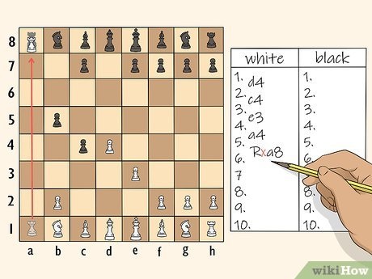

<style>
/* drop the MkDocs auto-injected nav-title H1 — the banner below IS the title */
.md-typeset h1{display:none}
/* side-by-side architecture A/B — network divide is the star */
.arch{display:flex;gap:16px;flex-wrap:wrap;margin:20px 0 6px;align-items:stretch}
.arch .col{flex:1 1 320px;border-radius:12px;border:1px solid;display:flex;flex-direction:column;overflow:hidden}
.arch .leg{border-color:rgba(239,83,80,.45);background:rgba(239,83,80,.05)}
.arch .our{border-color:rgba(124,179,66,.5);background:rgba(124,179,66,.06)}
.arch .hd{padding:9px 13px;font-size:11.5px;font-weight:800;letter-spacing:.5px;text-transform:uppercase;display:flex;justify-content:space-between;align-items:center;gap:8px;border-bottom:1px solid rgba(128,128,128,.18)}
.arch .leg .hd{color:#ef5350}
.arch .our .hd{color:#7cb342}
.arch .badge{font-size:10px;font-weight:800;padding:2px 8px;border-radius:20px;letter-spacing:.2px;white-space:nowrap}
.arch .leg .badge{background:rgba(239,83,80,.16);color:#ef5350;border:1px solid rgba(239,83,80,.4)}
.arch .our .badge{background:rgba(124,179,66,.18);color:#7cb342;border:1px solid rgba(124,179,66,.45)}
.arch .zone{padding:12px 13px;display:flex;flex-direction:column;gap:6px;align-items:center}
.arch .local{min-height:172px}
.arch .remote{background:rgba(128,128,128,.05);justify-content:center;min-height:96px}
.arch .znote{font-size:9.5px;text-transform:uppercase;letter-spacing:.6px;opacity:.5;font-weight:800;align-self:flex-start}
.arch .node{font-size:12.5px;line-height:1.32;text-align:center;border-radius:8px;padding:6px 11px;border:1px solid;width:100%;max-width:240px}
.arch .leg .node{border-color:rgba(239,83,80,.35);background:rgba(239,83,80,.07)}
.arch .our .node{border-color:rgba(124,179,66,.4);background:rgba(124,179,66,.09)}
.arch .node.truth{font-weight:800;border-width:2px}
.arch .node small{display:block;opacity:.7;font-weight:400;font-size:11px;margin-top:1px}
.arch .arr{font-size:13px;line-height:.5;opacity:.5}
.arch .leg .arr{color:#ef5350}.arch .our .arr{color:#7cb342}
.arch .net{padding:6px 13px;text-align:center;font-size:9.5px;font-weight:800;letter-spacing:2px;text-transform:uppercase;border-top:2px dashed;border-bottom:2px dashed}
.arch .leg .net{color:#ef5350;border-color:rgba(239,83,80,.6);background:rgba(239,83,80,.11)}
.arch .our .net{color:#9e9e9e;border-color:rgba(128,128,128,.4);background:rgba(128,128,128,.06)}
.arch .cross{display:flex;justify-content:center;gap:16px;margin-top:3px;font-size:12px;letter-spacing:.3px}
.arch .leg .cross b{color:#ef5350}
.arch .our .cross b{color:#bdbdbd;font-weight:600}
/* Kill-points comparison table — color the three lanes, accent the verdict */
.killtable table{border-collapse:separate;border-spacing:0;width:100%;display:table;margin:14px 0}
.killtable td,.killtable th{border:0;padding:9px 12px;vertical-align:top;font-size:12.5px;line-height:1.42}
.killtable thead th{font-size:10.5px;text-transform:uppercase;letter-spacing:.5px;border-bottom:2px solid rgba(128,128,128,.25);font-weight:800}
.killtable thead th:nth-child(2){color:#ef5350}
.killtable thead th:nth-child(3){color:#7cb342}
.killtable thead th:nth-child(4){color:#ffa000}
.killtable tbody tr:nth-child(even) td{background:rgba(128,128,128,.04)}
.killtable td:nth-child(1){font-weight:700}
.killtable td:nth-child(2){color:#c62828;background:rgba(239,83,80,.06)}
.killtable td:nth-child(3){background:rgba(124,179,66,.07)}
.killtable td:nth-child(4){font-weight:800;color:#ef8e00;border-left:2px solid rgba(255,160,0,.4)}
[data-md-color-scheme="slate"] .killtable td:nth-child(2){color:#ef9a9a}
[data-md-color-scheme="slate"] .killtable td:nth-child(4){color:#ffb74d}
/* shared data-table polish — used across the vitals / DR / conversion tables */
.dtbl table{border-collapse:separate;border-spacing:0;width:100%;display:table;margin:14px 0;font-size:12.5px}
.dtbl td,.dtbl th{border:0;padding:8px 11px;vertical-align:top;line-height:1.42}
.dtbl thead th{font-size:10.5px;text-transform:uppercase;letter-spacing:.5px;font-weight:800;border-bottom:2px solid rgba(128,128,128,.25)}
.dtbl tbody tr:nth-child(even) td{background:rgba(128,128,128,.04)}
.dtbl td:first-child{font-weight:700}
/* highlight the winning "Ours" column when it is the last column */
.hl-last thead th:last-child{color:#7cb342}
.hl-last td:last-child{background:rgba(124,179,66,.08)!important;border-left:2px solid rgba(124,179,66,.35)}
/* DR backup table: col 2 = ours (green) · col 3 = ratio (amber) */
.hl23 thead th:nth-child(2){color:#7cb342}
.hl23 thead th:nth-child(3){color:#ffa000}
.hl23 td:nth-child(2){background:rgba(124,179,66,.08)!important}
.hl23 td:nth-child(3){font-weight:800;color:#ef8e00;border-left:2px solid rgba(255,160,0,.4)}
[data-md-color-scheme="slate"] .hl23 td:nth-child(3){color:#ffb74d}
/* highlight the win column when it is column 2 (3-col "what a server used to do") */
.hl-2 thead th:nth-child(2){color:#7cb342}
.hl-2 td:nth-child(2){background:rgba(124,179,66,.08)!important;border-left:2px solid rgba(124,179,66,.35)}
/* deleted-server fan-out — one dead node redistributes to four owners-of-nothing */
.fan{margin:18px 0;text-align:center}
.fan .dead{display:inline-block;border:3px dashed rgba(211,47,47,.7);background:rgba(239,83,80,.10);color:#ef5350;font-weight:800;font-size:13px;padding:9px 18px;border-radius:10px;line-height:1.25;letter-spacing:.3px}
.fan .dead small{display:block;font-weight:700;font-size:9.5px;letter-spacing:1.5px;text-transform:uppercase;opacity:.85;margin-top:1px}
.fan .redist{font-size:9.5px;text-transform:uppercase;letter-spacing:1.5px;opacity:.5;font-weight:800;margin:9px 0 2px}
.fan .spokes{display:grid;grid-template-columns:repeat(auto-fit,minmax(165px,1fr));gap:11px;margin-top:6px}
.fan .spoke{border:1px solid rgba(128,128,128,.25);border-top:3px solid var(--sc);background:rgba(128,128,128,.04);border-radius:9px;padding:10px 12px;line-height:1.3;text-align:center}
.fan .spoke b{color:var(--sc);display:block;font-size:12.5px;font-weight:800}
.fan .spoke small{display:block;opacity:.7;font-weight:400;font-size:11px;margin-top:3px}
.fan .spoke .jobs{list-style:none;margin:9px 0 0;padding:9px 0 0;border-top:1px solid rgba(128,128,128,.2);text-align:left}
.fan .spoke .jobs li{font-size:11.5px;line-height:1.34;margin:0 0 8px;padding-left:13px;position:relative;font-weight:400}
.fan .spoke .jobs li:last-child{margin-bottom:0}
.fan .spoke .jobs li::before{content:"";position:absolute;left:0;top:6px;width:5px;height:5px;border-radius:50%;background:var(--sc);opacity:.75}
.fan .spoke .jobs b{font-weight:700}
.fan .spoke .jobs a{font-size:10.5px;font-weight:700;color:var(--sc);text-decoration:none;border-bottom:1px dotted var(--sc);white-space:nowrap}
.fan .spoke .jobs .off{opacity:.5;font-style:italic}
/* git ∷ ours parallel — same shape, one addition */
.gitmap{margin:16px 0;border:1px solid rgba(124,179,66,.4);border-radius:12px;overflow:hidden}
.gitmap .gm-h,.gitmap .row{display:grid;grid-template-columns:1fr 34px 1fr;align-items:center}
.gitmap .gm-h{background:rgba(128,128,128,.06);border-bottom:1px solid rgba(128,128,128,.18);font-size:11px;font-weight:800;text-transform:uppercase;letter-spacing:.5px}
.gitmap .gm-h>div{padding:9px 13px}
.gitmap .gm-h .l{color:#78909c;text-align:right}
.gitmap .gm-h .r{color:#7cb342}
.gitmap .row{font-size:12.5px;line-height:1.35;border-top:1px solid rgba(128,128,128,.1)}
.gitmap .row>div{padding:8px 13px}
.gitmap .row .l{text-align:right;opacity:.72}
.gitmap .eq{text-align:center;color:#7cb342;font-size:14px;padding:0!important}
.gitmap .row .eq{opacity:.3;font-size:12px}
.gitmap .row .r{background:rgba(124,179,66,.06);font-weight:600}
.gitmap .gm-add{padding:9px 14px;background:rgba(255,160,0,.12);border-top:2px solid rgba(255,160,0,.4);font-size:12px;line-height:1.4;text-align:center}
.gitmap .gm-add b{color:#ef8e00}
[data-md-color-scheme="slate"] .gitmap .gm-add b{color:#ffb74d}
@media (max-width:520px){.gitmap .gm-h,.gitmap .row{grid-template-columns:1fr}.gitmap .eq{display:none}.gitmap .gm-h .l,.gitmap .row .l{text-align:left}.gitmap .row .r{border-top:1px dashed rgba(124,179,66,.3)}}
.gitline{margin:14px 0;padding:11px 16px;border-left:4px solid #7cb342;background:rgba(124,179,66,.08);border-radius:0 8px 8px 0;font-size:13px;line-height:1.5}
.gitline b{color:#7cb342;letter-spacing:.3px}
.gitline a{color:#7cb342;font-weight:700;text-decoration:none;border-bottom:1px dotted #7cb342;white-space:nowrap}
/* foldable later chapters */
details.fold{border:1px solid rgba(128,128,128,.25);border-radius:10px;margin:7px 0;background:rgba(128,128,128,.02)}
details.fold>summary{cursor:pointer;padding:12px 16px;font-weight:800;font-size:15px;list-style:none;display:flex;align-items:center;gap:10px;user-select:none;border-radius:10px}
details.fold[open]>summary{border-bottom:1px solid rgba(128,128,128,.18);border-radius:10px 10px 0 0}
details.fold>summary::-webkit-details-marker{display:none}
details.fold>summary::before{content:"▸";color:#7cb342;font-size:13px;transition:transform .15s ease;display:inline-block}
details.fold[open]>summary::before{transform:rotate(90deg)}
details.fold>summary:hover{background:rgba(124,179,66,.07)}
details.fold>summary .hint{font-weight:400;font-size:12px;opacity:.55;margin-left:auto}
details.fold .fbd{padding:6px 16px 14px}
/* "At a glance" stat cards — whole card is a link */
.glance-card{flex:1 1 150px;border-radius:12px;padding:10px 8px;text-align:center;text-decoration:none;color:inherit;display:block;transition:transform .12s ease,box-shadow .12s ease}
.glance-card:hover{transform:translateY(-3px);box-shadow:0 6px 18px rgba(0,0,0,.18)}
/* "Proven ideas" pillar cards — one per row of the old table */
.pillars{display:grid;grid-template-columns:repeat(auto-fit,minmax(240px,1fr));gap:14px;margin:18px 0}
.pillar{border:1px solid var(--pc);border-radius:12px;background:var(--pcbg);display:flex;flex-direction:column;overflow:hidden}
.pillar .bd{padding:14px 16px 6px}
.pillar svg{width:28px;height:28px;color:var(--pc);margin-bottom:8px;display:block}
.pillar .title{font-size:15px;font-weight:800;line-height:1.2}
.pillar .by{font-size:12px;color:var(--pc);font-weight:700;margin:3px 0 9px}
.pillar .proved{font-size:13px;line-height:1.45;opacity:.85}
.pillar .use{margin-top:auto;padding:9px 16px;border-top:1px solid var(--pc);background:var(--pcft);font-size:12.5px;line-height:1.45}
.pillar .use b{color:var(--pc)}
.pillar .use a{color:var(--pc);font-weight:700;text-decoration:none;border-bottom:1px dotted var(--pc)}
.pillar .use code{font-size:11px}
</style>

<div style="max-width:760px;margin:24px auto 8px;padding:30px 40px;background:#263238;border-left:4px solid #ff9800;text-align:center;border-radius:4px" markdown="0">
<span style="font-size:2.4em;font-weight:800;line-height:1.15;color:#eceff1;letter-spacing:0.3px">The Server Is Obsolete</span>
<br><span style="font-size:0.8em;letter-spacing:1.5px;text-transform:uppercase;color:#ffffff;margin-top:14px;display:inline-block">built from ideas already proven by<br><b style="font-size:1.2em;letter-spacing:2.5px;color:#ffffff">Pacioli &nbsp;·&nbsp; Torvalds &nbsp;·&nbsp; Hipp</b></span>
<br><span style="font-size:0.6em;letter-spacing:1.4px;text-transform:uppercase;color:#ffb74d;margin-top:12px;display:inline-block"><a href="https://red1oon.github.io/bim-ootb/" title="Try It Live." style="color:inherit;text-decoration:underline;text-underline-offset:3px">Now assembled by &nbsp;<b style="letter-spacing:2px;color:#ffcc80">Redhuan D. Oon (red1)</b></a></span>
</div>

 

<div style="display:flex;gap:10px;flex-wrap:wrap;margin:16px 0" markdown="0">
  <a class="glance-card" href="#dr-tco" style="background:rgba(255,160,0,.12);border:1px solid rgba(255,160,0,.5)">
    <svg viewBox="0 0 24 24" fill="none" stroke="currentColor" stroke-width="1.5" stroke-linecap="round" stroke-linejoin="round" aria-label="cost savings" role="img" style="width:100%;height:72px;color:#ffa000;display:block;margin:0 auto 6px"><path d="M11 17h3v2a1 1 0 0 0 1 1h2a1 1 0 0 0 1-1v-3a3.16 3.16 0 0 0 2-2h1a1 1 0 0 0 1-1v-2a1 1 0 0 0-1-1h-1a5 5 0 0 0-2-4V3a4 4 0 0 0-3.2 1.6l-.3.4H11a6 6 0 0 0-6 6v1a5 5 0 0 0 2 4v3a1 1 0 0 0 1 1h2a1 1 0 0 0 1-1z"/><path d="M16 10h.01"/><path d="M2 8v1a2 2 0 0 0 2 2h1"/></svg>
    <div style="font-size:19px;font-weight:800;line-height:1.1;color:#ffa000">≥30×</div>
    <div style="font-size:12px;margin-top:6px;opacity:.85">less disaster-recovery storage at equal guarantee (<b>TCO</b>)</div>
  </a>
  <a class="glance-card" href="#no-server" style="background:rgba(124,179,66,.12);border:1px solid rgba(124,179,66,.45)">
    <svg viewBox="0 0 24 24" fill="none" stroke="currentColor" stroke-width="1.5" stroke-linecap="round" stroke-linejoin="round" aria-label="zero network round-trips" role="img" style="width:100%;height:72px;color:#7cb342;display:block;margin:0 auto 6px"><path d="M12 20h.01"/><path d="M8.5 16.429a5 5 0 0 1 7 0"/><path d="M5 12.859a10 10 0 0 1 5.17-2.69"/><path d="M19 12.859a10 10 0 0 0-2.007-1.523"/><path d="M2 8.82a15 15 0 0 1 4.177-2.643"/><path d="M22 8.82a15 15 0 0 0-11.288-3.764"/><path d="m2 2 20 20"/></svg>
    <div style="font-size:19px;font-weight:800;line-height:1.1;color:#7cb342">0</div>
    <div style="font-size:12px;margin-top:6px;opacity:.85">network round-trips on the read / fold path</div>
  </a>
  <a class="glance-card" href="#speed" style="background:rgba(255,112,67,.12);border:1px solid rgba(255,112,67,.45)">
    <svg viewBox="0 0 24 24" fill="none" stroke="currentColor" stroke-width="1.5" stroke-linecap="round" stroke-linejoin="round" aria-label="speed" role="img" style="width:100%;height:72px;color:#ff7043;display:block;margin:0 auto 6px"><path d="m12 14 4-4"/><path d="M3.34 19a10 10 0 1 1 17.32 0"/></svg>
    <div style="font-size:19px;font-weight:800;line-height:1.1;color:#ff7043">~53×</div>
    <div style="font-size:12px;margin-top:6px;opacity:.85">faster bootstrap from a signed checkpoint vs genesis replay</div>
  </a>
  <a class="glance-card" href="#realistic-conversion-estimate-loc" style="background:rgba(66,165,245,.12);border:1px solid rgba(66,165,245,.45)">
    <svg viewBox="0 0 24 24" fill="none" stroke="currentColor" stroke-width="1.5" stroke-linecap="round" stroke-linejoin="round" aria-label="code bloat" role="img" style="width:100%;height:72px;color:#42a5f5;display:block;margin:0 auto 6px"><path d="M11 21a1 1 0 0 1-1 1H4a1 1 0 0 1-1-1v-8a1 1 0 0 1 1-1"/><path d="M16 16a1 1 0 0 1-1 1H9a1 1 0 0 1-1-1V8a1 1 0 0 1 1-1"/><path d="M21 6a2 2 0 0 0-.586-1.414l-2-2A2 2 0 0 0 17 2h-3a1 1 0 0 0-1 1v8a1 1 0 0 0 1 1h6a1 1 0 0 0 1-1z"/></svg>
    <div style="font-size:19px;font-weight:800;line-height:1.1;color:#42a5f5">≈25×</div>
    <div style="font-size:12px;margin-top:6px;opacity:.85">less code at full iDempiere parity <i>(conservative)</i> — <i>≈76× engine-shell delivered today</i></div>
  </a>
  <a class="glance-card" href="#dr-tco" style="background:rgba(171,71,188,.12);border:1px solid rgba(171,71,188,.45)">
    <svg viewBox="0 0 24 24" fill="none" stroke="currentColor" stroke-width="1.5" stroke-linecap="round" stroke-linejoin="round" aria-label="database backup" role="img" style="width:100%;height:72px;color:#ab47bc;display:block;margin:0 auto 6px"><ellipse cx="12" cy="5" rx="9" ry="3"/><path d="M3 5V19A9 3 0 0 0 21 19V5"/><path d="M3 12A9 3 0 0 0 21 12"/></svg>
    <div style="font-size:19px;font-weight:800;line-height:1.1;color:#ab47bc">1 TB→500 MB</div>
    <div style="font-size:12px;margin-top:6px;opacity:.85"><b>Back up the recipe, not the result.</b></div>
  </a>
</div>
 
## These have been around for some time, but never for ERP and BIM — now we can put both servers in the same browser!

*But ERP is tough, so.*

<div class="pillars" markdown="0">

  <div class="pillar" style="--pc:#ffa000;--pcbg:rgba(255,160,0,.07);--pcft:rgba(255,160,0,.16)">
    <div class="bd">
      <svg viewBox="0 0 24 24" fill="none" stroke="currentColor" stroke-width="1.6" stroke-linecap="round" stroke-linejoin="round" aria-hidden="true"><path d="M12 3v18"/><path d="m19 8 3 8a5 5 0 0 1-6 0zV7"/><path d="M3 7h1a17 17 0 0 0 8-2 17 17 0 0 0 8 2h1"/><path d="m5 8 3 8a5 5 0 0 1-6 0zV7"/><path d="M7 21h10"/></svg>
      <div class="title">Double-entry ledger</div>
      <div class="by">Luca Pacioli · codified 1494</div>
      <div class="proved">The books are a <i>fold</i> of postings — Σdebit ≡ Σcredit.</div>
    </div>
    <div class="use">▸ Our journal is a fold — ΣDr ≡ ΣCr <a href="https://github.com/red1oon/BIMCompiler/blob/master/scripts/poc_postings.js"><code>poc_postings.js</code></a></div>
  </div>

  <div class="pillar" style="--pc:#7cb342;--pcbg:rgba(124,179,66,.08);--pcft:rgba(124,179,66,.16)">
    <div class="bd">
      <svg viewBox="0 0 24 24" fill="none" stroke="currentColor" stroke-width="1.6" stroke-linecap="round" stroke-linejoin="round" aria-hidden="true"><path d="M15 6a9 9 0 0 0-9 9V3"/><circle cx="18" cy="6" r="3"/><circle cx="6" cy="18" r="3"/></svg>
      <div class="title">The log is the truth</div>
      <div class="by">Linus Torvalds · git, 2005</div>
      <div class="proved">Hash-chained, signable history no central machine owns; the host is disposable.</div>
    </div>
    <div class="use">▸ The signed op-log + <code>verifyChain()</code> — “the host is a Git remote.”</div>
  </div>

  <div class="pillar" style="--pc:#ff7043;--pcbg:rgba(255,112,67,.08);--pcft:rgba(255,112,67,.16)">
    <div class="bd">
      <svg viewBox="0 0 24 24" fill="none" stroke="currentColor" stroke-width="1.6" stroke-linecap="round" stroke-linejoin="round" aria-hidden="true"><path d="M3 12a9 9 0 1 0 9-9 9.75 9.75 0 0 0-6.74 2.74L3 8"/><path d="M3 3v5h5"/><path d="M12 7v5l4 2"/></svg>
      <div class="title">Event sourcing / replay</div>
      <div class="by">Martin Fowler · Greg Young · 2005</div>
      <div class="proved">State = deterministic <i>replay</i> of an append-only log.</div>
    </div>
    <div class="use">▸ The kernel folds the log <a href="OpLogERP.md"><code>OpLogERP.md</code></a></div>
  </div>

  <div class="pillar" style="--pc:#42a5f5;--pcbg:rgba(66,165,245,.08);--pcft:rgba(66,165,245,.16)">
    <div class="bd">
      <svg viewBox="0 0 24 24" fill="none" stroke="currentColor" stroke-width="1.6" stroke-linecap="round" stroke-linejoin="round" aria-hidden="true"><path d="M10 2v8l3-3 3 3V2"/><path d="M4 19.5v-15A2.5 2.5 0 0 1 6.5 2H19a1 1 0 0 1 1 1v18a1 1 0 0 1-1 1H6.5a1 1 0 0 1 0-5H20"/></svg>
      <div class="title">The active data dictionary</div>
      <div class="by">Jörg Janke · Compiere → iDempiere</div>
      <div class="proved">An app can describe <i>itself</i> as data — tables, windows, rules.</div>
    </div>
    <div class="use">▸ The 925-table AD rides as <b>data</b>, folded through 5 relations + verbs.</div>
  </div>

  <div class="pillar" style="--pc:#ab47bc;--pcbg:rgba(171,71,188,.09);--pcft:rgba(171,71,188,.17)">
    <div class="bd">
      <svg viewBox="0 0 24 24" fill="none" stroke="currentColor" stroke-width="1.6" stroke-linecap="round" stroke-linejoin="round" aria-hidden="true"><path d="M20 13c0 5-3.5 7.5-7.66 8.95a1 1 0 0 1-.67-.01C7.5 20.5 4 18 4 13V6a1 1 0 0 1 1-1c2 0 4.5-1.2 6.24-2.72a1.17 1.17 0 0 1 1.52 0C14.51 3.81 17 5 19 5a1 1 0 0 1 1 1z"/><path d="m9 12 2 2 4-4"/></svg>
      <div class="title">Hash trees + public-key signatures</div>
      <div class="by">Merkle · Diffie–Hellman · RSA</div>
      <div class="proved">A fact can carry its own integrity <i>and</i> authenticity anywhere.</div>
    </div>
    <div class="use">▸ ECDSA-P256 signed ops; tamper caught on replay <a href="https://github.com/red1oon/BIMCompiler/blob/master/scripts/poc_sign.js"><code>poc_sign.js</code></a> · <a href="https://github.com/red1oon/BIMCompiler/blob/master/scripts/poc_chain.js"><code>poc_chain.js</code></a></div>
  </div>

  <div class="pillar" style="--pc:#26a69a;--pcbg:rgba(38,166,154,.09);--pcft:rgba(38,166,154,.17)">
    <div class="bd">
      <svg viewBox="0 0 24 24" fill="none" stroke="currentColor" stroke-width="1.6" stroke-linecap="round" stroke-linejoin="round" aria-hidden="true"><path d="M12.67 19a2 2 0 0 0 1.416-.588l6.154-6.172a6 6 0 0 0-8.49-8.49L5.586 9.914A2 2 0 0 0 5 11.328V18a1 1 0 0 0 1 1z"/><path d="M16 8 2 22"/><path d="M17.5 15H9"/></svg>
      <div class="title">SQLite, embeddable</div>
      <div class="by">D. Richard Hipp</div>
      <div class="proved">A full SQL engine with <i>no server</i> — and now WASM.</div>
    </div>
    <div class="use">▸ Folds the log locally, inside the browser tab.</div>
  </div>

</div>

---

## Thesis — ERP as git

A classic ERP is a **server of record**: every read, write and posting is a round-trip to a machine that *owns the truth*. We keep the accounting and the document flow but **delete that server**. The truth becomes a *signed, hash-chained op-log*; the live numbers are a deterministic **fold** of it, replayed by a SQLite-WASM kernel **in the browser**. The host turns disposable (a Git remote); the user owns the log; period-end **compaction** is a *signed checkpoint* carrying balances forward — not a batch job with a down-window (the close *postings* are themselves folds, still being built).

A claim about **substrate and delivery**, not features — the legacy stacks have vastly more. What we show: the *architecture* folds the same transactions with **zero network on the read/fold path** — proven by folding a **live Odoo**, **iDempiere's own flows** (it's the AD we render), and a **SAP Business One** flow (mock export) into the same six verbs. S/4HANA is still pending a real oracle.

<div class="gitline" markdown="1">**ERP as git** — what git did to source code, we do to transactions: the log is the truth, every client folds the whole history, and the host is a *disposable remote*. The one thing git lacks — invariant enforcement (no double-spend) — we add. [See the full git ∷ ours parallel ↓](#erp-as-git)</div>

---

## What a *fold* is — the chess scoresheet

You don't store the chessboard — you store the **move list**, and replay it. The position is a deterministic *fold* of those moves: lose the board, keep the sheet, rebuild it exactly; anyone who replays the same moves reaches the same position. Our ERP is identical — the **signed op-log is the move list, the live balances are the board.** A fold, never a stored snapshot.

<figure style="text-align:center;margin:18px 0">
  
  <figcaption style="font-size:0.85em;opacity:.8;margin-top:6px">The scoresheet (the log) folds back into the position (the state) — lose the board, keep the sheet, rebuild it exactly.</figcaption>
</figure>

---

## The kill points — what the architecture actually deletes

> **The shocker, in one line:** there is **no server of record.** The browser holds the kernel; a signed,
> hash-chained log holds the truth; the host (if any) is a disposable relay. Every row below follows from that.

<div class="killtable" markdown="1">

| What changes | Legacy ERP | Our WASM event-source | The cut |
|---|---|---|---|
| **The server of record** | a machine that *owns the truth* — JVM + Postgres + 3.7 GB build [^bloat] | **✗ none** — the browser runs the kernel; the signed log is the truth [^own] | **the whole tier is deleted** |
| **Read / fold round-trips** | 1 network hop per interaction [^arch] | **0** — the kernel answers locally [^noround] | network off the hot path |
| **Ownership / trust** | the server DB owns your record [^arch] | **you own a signed op-log**; the host is disposable [^own] | trust model inverted |
| **Document schema** | ≈925 AD tables, each a hand-written model class [^bloat2] | **5 core relations** (containers · items · documents · document_lines · journal) + verbs — the rest of the AD rides as **data** [^reduce] | hardcoded schema, *not* ERP scope (the AD is unchanged — it's the seed) |
| **Runtime code** | 1,427,147 Java LOC / 4,465 files [^bloat] | **18,614 JS LOC / 60 files** (the engine shell + flows folded so far) [^bloat] | ≈76× built-so-far · **~25× at conservative full parity** [below](#realistic-conversion-estimate-loc) |
| **Bootstrap** (open the books) | re-query the server [^arch] | **signed checkpoint** — 0.90 ms vs 47.70 ms genesis [^drive] | ≈53× |
| **Seed DB** | 45.2 MB dump [^bloat] | **12.7 MB** self-describing AD [^bloat] | ≈3.5× |
| **Live DB → SQLite** | 143 MB Postgres [^bloat2] | **43 MB** SQLite (gzip 11.7 MB) [^bloat2] | ≈3.3× |
| **Backup / DR** | backup rotation, 30–50 copies = many× the state; restore = down-window [^tco] | **the recipe is the backup** — one signed log ×3 replicas, restore = replay, unbounded restore points [^tco][^blackout] | at least 30× less DR storage (strategy-dependent); **0 branch downtime** |

</div>

## How it differs — the architecture

<div class="arch" markdown="0">

  <div class="col leg">
    <div class="hd"><span>Legacy · server of record</span><span class="badge">≥1 round-trip / gesture</span></div>
    <div class="zone local">
      <div class="znote">browser · thin client</div>
      <div class="node">user gesture</div>
      <div class="arr">▼</div>
      <div class="node">renders only the row it’s sent back</div>
    </div>
    <div class="net">— network —<div class="cross"><b>▼ request</b><b>▲ rendered row</b></div></div>
    <div class="zone remote">
      <div class="znote">server of record · owns the truth</div>
      <div class="node">app server</div>
      <div class="arr">▼</div>
      <div class="node truth">database<small>owns the truth</small></div>
      <div class="arr">▼</div>
      <div class="node">posting / validation</div>
    </div>
  </div>

  <div class="col our">
    <div class="hd"><span>Ours · the browser is the server</span><span class="badge">0 round-trips · read/fold</span></div>
    <div class="zone local">
      <div class="znote">browser · local &amp; complete</div>
      <div class="node">user gesture → op</div>
      <div class="arr">▼</div>
      <div class="node truth">local WASM kernel<small>commit · hash-chain · sign — the log is the truth</small></div>
      <div class="arr">▼</div>
      <div class="node">replay / fold <small>SQLite-WASM, in-memory → paint · 0 network</small></div>
    </div>
    <div class="net">— network · crossed only later —<div class="cross"><b>⇣ async · disposable</b></div></div>
    <div class="zone remote">
      <div class="znote">owns nothing</div>
      <div class="node">dumb facilitator<small>disposable host</small></div>
    </div>
  </div>

</div>

**Legacy:** every read & write is a network round-trip; the DB owns the truth; period close is a server batch
job with a down-window. **Ours:** state = a deterministic fold of the signed op-log — **0 network on the
read/fold path**; the host is disposable (Git-like), the log is the truth; period close is a *signed checkpoint*.
Source: `docs/DistributedERP.md` §0 (lines 53–85, server→serverless table) + §10 (lines 467–468).

---

## But where's the server? — what replaced each job {#no-server}

*If you deleted the server, who does its work?* "Serverless" doesn't mean no machine ever talks to another — it means **no server of record, no machine that owns the truth.** Every job the server did still happens; each moved onto the **signed log**, the **kernel on each client**, the **user's own channel**, or a **dumb facilitator that owns nothing**.

*Every job the server did still happens — it just moves to one of four owners that own nothing, each proven by a POC in* `scripts/`[^poc]. *For an independent read of how well those proof scripts are built — separation, determinism, non-invention, adversarial falsifiers, and a per-script PASS scoreboard — see the* **[Fold-Engine code-quality scorecard](FoldEngineQuality.md)** *(all 18 witnesses green).*

<div class="fan" markdown="0">
  <div class="dead">✗ server of record<small>deleted</small></div>
  <div class="redist">▾ &nbsp; every job redistributes to four things that own nothing &nbsp; ▾</div>
  <div class="spokes">
    <div class="spoke" style="--sc:#7cb342"><b>the signed op-log</b>
      <ul class="jobs">
        <li>Hold the authoritative state <a href="https://github.com/red1oon/BIMCompiler/blob/master/scripts/poc_distributed.js">poc_distributed.js</a></li>
        <li>Merge concurrent edits <a href="https://github.com/red1oon/BIMCompiler/blob/master/scripts/poc_distributed.js">poc_distributed.js</a></li>
        <li>Reconcile discrepancies <a href="https://github.com/red1oon/BIMCompiler/blob/master/scripts/poc_postings.js">poc_postings.js</a></li>
      </ul>
    </div>
    <div class="spoke" style="--sc:#42a5f5"><b>the kernel on each client</b>
      <ul class="jobs">
        <li>Run / validate business logic <a href="https://github.com/red1oon/BIMCompiler/blob/master/scripts/poc_kernel.js">poc_kernel.js</a></li>
        <li>Mint record IDs <a href="https://github.com/red1oon/BIMCompiler/blob/master/scripts/poc_distributed.js">poc_distributed.js</a></li>
        <li>Prevent double-write <a href="https://github.com/red1oon/BIMCompiler/blob/master/scripts/poc_distributed.js">poc_distributed.js</a></li>
      </ul>
    </div>
    <div class="spoke" style="--sc:#ab47bc"><b>signatures + hash-chain</b>
      <ul class="jobs">
        <li>Detect tampering <a href="https://github.com/red1oon/BIMCompiler/blob/master/scripts/poc_chain.js">poc_chain.js</a></li>
        <li>Authenticate / authorise <a href="https://github.com/red1oon/BIMCompiler/blob/master/scripts/poc_sign.js">poc_sign.js</a></li>
      </ul>
    </div>
    <div class="spoke" style="--sc:#ff7043"><b>user’s channel + dumb facilitator</b>
      <ul class="jobs">
        <li>Durably store / back up <a href="https://github.com/red1oon/BIMCompiler/blob/master/scripts/poc_persist.js">poc_persist.js</a></li>
        <li>Sequence multi-party order <a href="https://github.com/red1oon/BIMCompiler/blob/master/scripts/poc_remote_pos.js">poc_remote_pos.js</a></li>
        <li><span class="off">Be always-on — nothing; work offline</span></li>
      </ul>
    </div>
  </div>
</div>

<span id="erp-as-git"></span>

**The analogy: git.** No central machine owns your code history — every clone has it all, verifies it, rebuilds from it; GitHub is a *convenience*, not the truth. **We do to transactions what git did to source code** — the same shape, line for line:

<div class="gitmap" markdown="0">
  <div class="gm-h"><div class="l">git · source code</div><div class="eq">≅</div><div class="r">ours · ERP transactions</div></div>
  <div class="row"><div class="l">hash-chained, signed commit history</div><div class="eq">≅</div><div class="r">hash-chained, signed op-log</div></div>
  <div class="row"><div class="l">every clone holds the whole history</div><div class="eq">≅</div><div class="r">every client folds the whole log</div></div>
  <div class="row"><div class="l">verifies it · rebuilds from it</div><div class="eq">≅</div><div class="r"><code>verifyChain()</code> · folds the live state</div></div>
  <div class="row"><div class="l">GitHub = a convenience, not the truth</div><div class="eq">≅</div><div class="r">the host = a disposable relay, not the truth</div></div>
  <div class="gm-add"><b>+ the one thing git lacks, we add:</b> invariant enforcement — no double-spend — via the owner-gate + a single compare-and-set op-class</div>
</div>

Full doctrine + the hard multi-writer cases (shared stock, credit limits, client version skew): [DistributedERP.md](DistributedERP.md) §0, §9.

---

<details class="fold" markdown="1"><summary>Vitals — by theme <span class="hint">speed · footprint · migration — measured</span></summary>
<div class="fbd" markdown="1">

Three tables, not one wall. Columns are **architecture**, not a feature scorecard; numbers measured on *this* box / browser unless marked. **"n/a — architectural"** = the legacy stack has no comparable number because the property is structural (it always needs a server).

### A · Speed & latency {#speed}

<div class="dtbl hl-last" markdown="1">

| Vital | iDempiere | Odoo | SAP | Our WASM event-source |
|---|---|---|---|---|
| **Period-end carry-forward** | server batch job + down-window (per-row `saveEx` ≈ ~1M round-trips on a 40-yr depreciation run) [^dep] | server batch job [^arch] | server batch job [^arch] | **signed checkpoint = balance b/f** (the compaction step — accrual/FX/depreciation postings are themselves folds), no down-window; 40k-op close-fold ≈ **2.68 s**, archived 40000→live 1, reconcile **maxDiff=0c** [^pclose][^drive] |
| **Server round-trip** (read/fold) | round-trip per interaction [^arch] | round-trip per interaction [^arch] | round-trip per interaction [^arch] | **0 — the kernel answers locally** [^noround] |
| **Bootstrap** (open the books) | re-query the server [^arch] | re-query the server [^arch] | re-query the server [^arch] | **~53× faster from checkpoint** — 0.90 ms vs 47.70 ms genesis replay, same result [^drive] |
| **Commit throughput** (5000 ops) | n/a — architectural [^arch] | n/a [^arch] | n/a [^arch] | batch `commitGroup` **~22,492 ops/s = 2.4× naive** [^sync] |
| **Fold/append ceiling** | n/a — architectural [^arch] | n/a [^arch] | n/a [^arch] | **linear to 20,000,000 ops** (~437 B/op; fold ~40M ops/s hot) [^ceiling] |
| **Storage primitive** (1000 ops, 1 commit) | Postgres WAL+fsync **5.24 ms** (0.0052 ms/op) [^bench] | (same engine) [^arch] | n/a [^arch] | sql.js +sha256 chain **208.45 ms** — slower per-op, buys **no server**; Postgres durability/concurrency DEFERRED to the install [^bench] |

</div>

> **Where we actually beat them: the network.** The storage-primitive row above is *on-box*, where durable Postgres wins per-op — and we say so. But an ERP is never on-box: every interaction crosses a network to the server of record, which pays a round-trip **per interaction** (RTT-bound — and it **blocks when offline**). Our kernel answers locally (~0.01 ms/op) and relays asynchronously — **0 round-trips on the read/fold path.** That is the whole win: not faster storage, **no network on the hot path.** A remote-POS drive puts numbers on it — locals measured, network leg modelled, legacy excludes iDempiere ORM/OSGi so it's a *floor* [^rpos]: per sale, legacy is RTT-bound — **~256–674× at 0.5 ms LAN, ~8,500–50,000× at 50 ms cross-region** — while ours stays flat at local speed. The iDempiere 40-year depreciation run shows where that cost really sits: per-row `saveEx` ≈ **~1M round-trips** [^dep].

### B · Footprint & bloat

<div class="dtbl hl-last" markdown="1">

| Vital | iDempiere | Odoo | SAP | Our WASM event-source |
|---|---|---|---|---|
| **DB seed** | `Adempiere_pg.dmp` **45.2 MB** [^bloat] | n/a — diff schema [^arch] | n/a [^arch] | `erp/ad_seed.db` **12.7 MB** (≈**3.5× smaller**); the 12.7 MB IS the self-describing AD [^bloat] |
| **Runtime LOC** | **1,427,147 Java LOC** / 4,465 files + JVM + Postgres + 3.7 GB build [^bloat] | n/a — diff codebase [^arch] | n/a [^arch] | **18,614 JS LOC** / 60 files, static + SQLite-WASM, offline (≈**76× fewer** built-so-far; **~25× at conservative full parity**, zero server/JVM/DB) [^bloat] |
| **Live DB → SQLite** | Postgres **143 MB** on-disk (GardenWorld) [^bloat2] | n/a [^arch] | n/a [^arch] | **43 MB SQLite** (925 tables, 187,133 rows ≈ **3.3×**); gzip 11.7 MB (3.7×) [^bloat2] |

</div>

### C · Migration & ownership

<div class="dtbl hl-last" markdown="1">

| Vital | iDempiere | Odoo | SAP | Our WASM event-source |
|---|---|---|---|---|
| **Migration fold** (does the legacy flow fold into our verbs?) | **native** — it renders this AD; handlers diffed cell-by-cell vs an iDempiere oracle (`diff_oracle.log`; one GL cell needs live docker) | **PROVEN vs LIVE Odoo 17** — SO S00023, 5/5 hops, newVerbs=[], GL ΣDr==ΣCr 5002.50 [^odoo] | **B1 PROVEN vs a MOCK export** (5/5, journal 770.00); **S/4HANA NOT-RUN — gated on a real oracle** [^b1][^sap] | every hop maps to `CREATE_DOCUMENT / CREATE_LINE / SET_STATUS / POST / ALLOCATE` [^odoo][^b1] |
| **Data ownership / durability** | server DB owns the record [^arch] | server DB owns the record [^arch] | server DB owns the record [^arch] | **user-owned signed op-log**; host disposable (Git analogy); tamper caught by `verifyChain()`, forgery by ECDSA-P256 sig [^own][^pclose] |

</div>

</div>
</details>

<details class="fold" markdown="1"><summary>Disaster recovery &amp; TCO <span class="hint">apple-to-apple — a range, not one number</span></summary>
<div class="fbd" markdown="1">
<span id="dr-tco"></span>

The fair comparison holds the **durability guarantee constant** — *restore to any of the last 50 days · RPO ≤ 24 h · survive primary loss* — and asks only: **what does it cost to meet it**, amortised over a year of 50-branch ops? Unit costs are **measured** on the real kernel (314 B/op uncompacted snapshot; fold, restore-to-arbitrary-op, and per-branch additivity all witnessed); the year-level figures are **derived** over modelled constants for the traditional side (no Postgres on the bench), each chosen **conservative for us** — `230 B/row` and `5 rows/op` are *low* versus Postgres+index and real iDempiere, so the real gap is wider, not narrower (constants named in GAPS #7 below). [^tco]

**Durable storage to meet the 50-day SLA** (Retail, 1k sales/branch/day, one durable copy each):

<div class="dtbl hl23" markdown="1">

| Backup strategy | Traditional | Ours (50-day op-log) | ratio |
|---|---|---|---|
| weekly full + daily incremental (standard DBA) | 192 GB | 0.78 GB | **244×** |
| minimal: 1 full + 50 diffs (storage-min, replay-heavy restore) | 24 GB | 0.78 GB | 30× |

</div>

Incremental backup barely shrinks the gap — the **weekly fulls dominate.** Only the storage-minimal scheme reaches ~30×, and *its* restore is replay-heavy. The structural reason: a snapshot scheme must periodically re-store the **whole database**; the op-log **never stores a base image** (the deltas *are* the system). And the advantage **grows with business age** — their fulls grow yearly while the op-log's 50-day window stays constant (`§VOL`).

**Per-device storage — does every device carry the whole log? No.**

<div class="dtbl" markdown="1">

| Role | Stores | Resident | Bounded by |
|---|---|---|---|
| **Edge / branch** | engine shard + own open-period ops + last checkpoint | **~13 MB** | period-close + gravity shard ([DistributedERP §13](DistributedERP.md)) |
| **Facilitator / relay** | open-period union (ordering only) | ~16 MB/day, disposable | reconstructible from the edges |
| **Full-replica (bucket)** | the whole compacted recipe | ~0.8 GB (50-day) – ~5.7 GB/yr | **one per business, not per device** |

</div>

**Recovery and the honest trades** — all witnessed [^blackout][^tco]:

- **Total relay loss, no backup** rebuilds consolidated state from the branches' *own* slices — `§BLACKOUT-RESUME`: 50 branches, a fresh empty relay, an **identical signed tip**, books to the cent, idempotent re-push. The only loss is a bounded, ledger-reconciled CAS-arbitration sliver (the one shared op-class, §5); `§ORDER-HONEST` shows disjoint folds commute but cross-branch CAS order is *not* reconstructible from signed logs alone (honest correction to "total order is reconstructible").
- **Consolidated restore is additive** — per-branch folds combine (`maxDiff=0c`), so 12.5M ops at 5k/branch/day restore in **~0.5 s 50-way-parallel**; only the contended op-class needs merge logic.
- **0 branch downtime trades against a double-sale risk** — but only for stock that is *not* physically partitioned (≤0.1% of ops; located stock can't double-sell — the scan is possession), and it is value-tier-bounded (high-value blocked → 0, low-value → a receivable). Traditional avoids it only by **requiring connectivity** (then the branch stops when the link drops — the very downtime we removed) or by **allowing offline POS** (carrying the same risk).
- **"0 always-on server-hours" is 0 always-on compute-VM, not 0 cost** — object storage, the CAS touch, and the intermittent relay remain, itemised: storage-priced + pay-per-invocation, no OS / patch / licence. An illustrative annual bill (public list prices, volatile; **excluding** DB licence + DBA labour, which widen it) runs **>10× cheaper**, compute-dominated.

</div>
</details>

<details class="fold" markdown="1"><summary>Method &amp; honesty <span class="hint">what's measured vs. architectural — read the honesty</span></summary>
<div class="fbd" markdown="1">

**What is measured (real, on this box / browser):**
- Period-close fold, balance-b/f, reconcile-to-0c, tamper/forgery rejection, determinism — on the
  **real kernel** ([`scripts/test_kernel_period_close.js`](https://github.com/red1oon/BIMCompiler/blob/master/scripts/test_kernel_period_close.js)) and against **real double-entry POST ops**
  ([`scripts/test_integ_postings_reconcile.js`](https://github.com/red1oon/BIMCompiler/blob/master/scripts/test_integ_postings_reconcile.js)).
- Browser-measured 40k-op close-fold timing, bootstrap 53× speedup, reconcile maxDiff=0
  (`build/erp/period_close_drive.log`, an in-browser drive).
- Storage primitive sql.js-vs-Postgres (`build/erp/bench_oplog_pg.log`), batch throughput
  (`build/erp/sync_poc_smoke.log`), volume ceiling to 20M ops (`build/erp/poc_volume_ceiling.log`).
- Bloat figures `du`/`wc`/sqlite-measured 2026-06-06 (`internal/BLOAT_MEASUREMENT.md`, summarised in
  the bloat memory).
- The Odoo fold is against a **running Odoo 17** instance (`build/erp/odoo_fold_live.log`,
  `§ODOO-FOLD-LIVE PASS`).
- **Engine output == real iDempiere output — 20 surfaces oracle-diffed, not asserted** ([`ERP_COVERAGE_MATRIX.md`](ERP_COVERAGE_MATRIX.md) §Equivalence, [`FoldEngineQuality.md`](FoldEngineQuality.md)): **16 fold real GardenWorld `fact_acct`/qty postings to the cent** (`maxDiff=0c` — the order→ship→invoice→match→pay→allocate trade loop + the movement→on-hand→replenish inventory loop + inter-org `M_Movement`/`GL_Journal` + `reverseCorrect`/void, in **both** USD & EUR accounting schemas) and **4 declarative engines diff the *live* iDempiere Postgres to `diff=0`** (`AD_Val_Rule` SQL-where membership, `AD_Ref_Table` FK resolution+membership over the 26,519-row `ad_column` set, `MRole` access maps, `AD_Column.Callout` derivation). Each witness carries a **load-bearing §FALSIFIER** (corrupt the rule → the diff *must* go non-zero), so a passing diff isn't a tautology. **3 more** are *rule-consistent* (enacted docs GardenWorld never posted — BOM backflush, `MProduction`, `MInventory` — checked against the already-proven qty/cost rules + balance + falsifier, explicitly **not** claimed `== iDempiere`).

**What is architectural (a property, not a number):**
- "0 round-trip" — *structural* (no server of record on the read/fold path), not a benchmark. Honest counter: server-removal only wins over a network; on-box, durable Postgres is *faster* per-op (it buys durability + concurrency we defer).
- Most ERP cells are *n/a — architectural*: the legacy stack exposes no comparable single number (throughput ceiling, batch-vs-naive) — server-bound by design.

**NOT feature parity — plainly.** iDempiere, Odoo and SAP have *vastly* more features, localisations and integrations. The 18.6K LOC renders the dictionary and folds the paths built so far (the order→ship→invoice→match→pay→allocate trade loop, inventory movement→on-hand→replenish, GL posting incl. inter-org + FX + `reverseCorrect`/void, signed rule-edit, period-close — **20 surfaces now oracle-equivalent to real iDempiere**) — it does **not** re-implement the full transactional server. **Only ~0.2% of the M-class business logic is ported** (the `M*.java` model logic = 104,940 code-LOC; we've folded ~205) — the engine is the *host*, the M-class logic is the work still ahead. The win is **delivery/definition**: the AD-interpreter is lean because the AD is self-describing, and the whole server/build stack is gone. Each transactional verb still has to be folded deterministically. See `feedback_erp_perf_claims`.

</div>
</details>

<details class="fold" markdown="1"><summary>Realistic conversion estimate (LOC) <span class="hint">76× engine-shell built-so-far · ~25× conservative full parity</span></summary>
<div class="fbd" markdown="1">
<span id="realistic-conversion-estimate-loc"></span>

76× is honest for the engine **shell** folded today — but it measures the *thinnest, highest-compression* slice (order-to-cash + posting), where iDempiere is mostly generated boilerplate and ZK UI that collapse to ~0. It does **not** extrapolate to a full port: only **~0.2% of the `M*` business logic (104,940 code-LOC) is actually ported**. **We headline the *conservative* ~25× to avoid overclaiming.**

> **Exhaustive coverage map → [ERP Coverage Matrix](ERP_COVERAGE_MATRIX.md).** Every rule/process surface in *both* homes (Java code + the AD as data) enumerated, each count from a real `ad_full.db` query: **0 covered / 37 partial / 3 gap** of 40 surfaces (the interpreter-coverage ladder, now closed for every seed-data surface) **+ a second *equivalence* axis: 20 surfaces now match the real iDempiere oracle** — **16 fold real GardenWorld `fact_acct`/qty postings to the cent (`maxDiff=0c`)** (the whole order→ship→invoice→match→pay→allocate trade loop, the movement→on-hand→replenish inventory loop, inter-org `M_Movement` + `GL_Journal`, the `reverseCorrect`/void family, all in **both** accounting schemas USD + EUR), **+ 4 declarative engines diffed against the *live* iDempiere Postgres to `diff=0`** (AD_Val_Rule SQL-where membership, AD_Ref_Table FK resolution+membership, MRole window/process/form access, AD_Column.Callout derivation) — **plus 3 rule-consistent** (enacted docs with no seed oracle: BOM backflush, `MProduction`, `MInventory` — verified against the proven qty/cost rules + balance + falsifier). Each carries a load-bearing §FALSIFIER. ([ERP_MODEL_ARCHETYPE.md](ERP_MODEL_ARCHETYPE.md) is the M-class denominator: MOrder archetype + ~25 deltas — **the deepest deltas now fold `maxDiff=0c`**.) The buckets below are measured, not asserted.

Splitting all 1,427,147 Java LOC by fate [^split]:

<div class="dtbl" markdown="1">

| Fate | ~LOC | Share | What |
|---|---|---|---|
| **Deleted outright** | ~490K | 34% | ZK web UI (190K), tests (78K), server-side HTML lib (44K), print/report + Jasper (38K), import/migration (25K), webservices, app-server daemon, installer, JDBC drivers, OSGi/HTTP plumbing |
| **Generic-replaced** by the interpreter | ~735K | 52% | generated models `X_*`/`I_*` (573K) + PO / dictionary / runtime core (`Env`, `DB`, `GridField`, util… ~162K) — a new table is *data*, not code |
| **Irreducible — must be folded** | ~200K **(~6.2 MB src)** | 14% | `M*` model logic, `Doc_*` posting, the acct / costing / tax / payment / allocation / matching engines, callouts, validators, document `process/` |

</div>

**Read it:** ~86% is UI, boilerplate, or server plumbing the browser deletes outright. Even the irreducible 14% is ceremony-heavy — in the `M*` models a third is blank/comment/signatures and most of the rest is generic accessor/lifecycle code the dictionary already handles; the *behavioural* logic (state transitions, posting math, tax rounding) is a minority.

Folding that behavioural core into declarative verbs compresses ~5–8× (no Java/OSGi ceremony, no per-field getters) — though **costing and MRP fold least cleanly** (stateful cost rollups, landed cost), pulling toward the conservative end:

<div class="dtbl hl-last" markdown="1">

| Scenario | irreducible folded | ÷ ratio | full JS (+ engine 18,614) | overall |
|---|---|---|---|---|
| Optimistic | 150K | 8× | **~37K** | ~38× |
| Mid | 175K | 6.5× | **~46K** | ~31× |
| **Conservative (headline)** | 200K | ~5× | **~56K** | **~25×** |

</div>

**Realistic full parity — we headline the *conservative* ≈ 56K JS LOC ≈ ~25×** (mid ~46K/~31×, optimistic ~37K/~38×) — vs 76× for the engine shell folded so far. Leading with the conservative bound is the point: it does not overclaim. The fold ratio is the one estimated input (GAPS #6); every LOC count is measured (incl. the M-class denominator — `M*.java` 104,940 code-LOC, ~0.2% folded).

??? note "Full breakdown by iDempiere module (org.adempiere.base, org.adempiere.ui.zk, …) — expand"

    Measured 2026-06-08 [^split]. Fate = **DELETED** (no equivalent in a browser substrate) · **GENERIC** (the interpreter renders it from the dictionary) · **FOLD** (re-expressed as verbs / handlers). Buckets are disjoint and sum to 1,427,147.

    | iDempiere module / package | LOC | Fate |
    |---|---:|---|
    | **org.adempiere.base** | **959,659** | *mixed — split below* |
    | &nbsp;&nbsp;`X_*` generated models | 345,490 | GENERIC |
    | &nbsp;&nbsp;`I_*` interfaces | 227,100 | GENERIC |
    | &nbsp;&nbsp;`M*` business models | 198,679 | FOLD (behavioural subset) |
    | &nbsp;&nbsp;`Doc_*` posting | 12,789 | FOLD |
    | &nbsp;&nbsp;acct · wf · process engines | 28,686 | FOLD |
    | &nbsp;&nbsp;PO · GridField · Env · DB · util · OSGi core | 116,302 | GENERIC |
    | &nbsp;&nbsp;print · report · impexp · db-conn | 30,613 | DELETED |
    | **org.adempiere.ui.zk** — ZK web client | 189,786 | DELETED |
    | **org.idempiere.test** | 78,389 | DELETED |
    | **org.apache.ecs** — server-side HTML lib | 43,816 | DELETED |
    | **org.adempiere.ui** — shared UI base | 18,349 | DELETED |
    | **org.adempiere.pipo** + .handlers — 2-way migration | 16,713 | DELETED |
    | **org.idempiere.webservices** — SOAP/REST | 11,572 | DELETED |
    | **org.adempiere.server** — scheduler / daemon | 11,285 | DELETED |
    | **org.adempiere.install** — installer | 10,366 | DELETED |
    | **org.adempiere.base.callout** | 8,997 | FOLD |
    | **org.compiere.db.{oracle,postgresql}.provider** — JDBC | 7,185 | DELETED |
    | **org.adempiere.replication[.server]** | 3,410 | DELETED |
    | **org.adempiere.report.jasper** | 3,354 | DELETED |
    | **org.idempiere.printformat.editor** | 2,752 | DELETED |
    | **org.adempiere.eclipse.equinox.http.servlet** — OSGi HTTP | 2,677 | DELETED |
    | tablepartition · hazelcast · keikai · felix.webconsole · sso.oidc · plugin.utils · payment.processor · event.test | 5,144 | DELETED |
    | … + ~40 smaller modules (UI widgets, adapters, gateways) | 53,693 | mostly DELETED |
    | **Total** | **1,427,147** | |

</div>
</details>

<details class="fold" markdown="1"><summary>GAPS <span class="hint">vitals lacking a measured source — do not claim a number</span></summary>
<div class="fbd" markdown="1">

1. **SAP S/4HANA fold** — BLOCKED. `build/erp/sap_fold.log` says `§SAP-FOLD NOT-RUN (skeleton ready;
   gated on oracle access)`. No real SAP O2C+FI export has been folded; only **SAP Business One (B1)
   against a hand-authored MOCK** has (`build/erp/b1_fold.log`). The "SAP" column is therefore
   *partly mock, partly not-run* — never present S/4HANA as proven.
2. **Odoo / SAP server-side period-close timing & down-window** — no measured number; marked
   *architectural*. We have our own 2.68 s/40k-op figure but no head-to-head legacy batch-close time.
3. **Odoo / SAP server round-trip latency (ms)** — not measured here. The closest real datum is the
   iDempiere depreciation run (`DepreciationPerf.md`: per-row `saveEx` ≈ ~1M round-trips), and the
   `feedback_erp_perf_claims` matrix (REMOTE per-txn 2–5 orders, RTT-bound) — both iDempiere-flavoured,
   not Odoo/SAP. Cite as illustrative, not as an Odoo/SAP measurement.
4. **Postgres per-op floor vs our per-op** is a *primitive-only* comparison (no callouts/posting/JVM on
   either side) — `bench_oplog_pg.log` states this explicitly; do not extrapolate to whole-document cost.
5. **Live-DB → SQLite (143 MB → 43 MB)** was measured on a static dump + repo (Docker Postgres was NOT
   running at measure time) — see the bloat memory caveat.
6. **Full-conversion LOC (~43K / ~30×)** — the per-bucket LOC are *measured* (`find`/`wc` on
   `~/idempiere-dev-setup/idempiere`, 2026-06-08), but the **5–8× fold-compression ratio** on the irreducible
   business core — and the share of `M*` that is real logic vs accessor/lifecycle ceremony — are **estimates** (no
   full port exists to measure them). Headline the **conservative ~25×** forecast (range ~25–38×); 76× is the
   *measured built-so-far* engine shell, a high-compression slice (~0.2% of the M-class logic) that does not extrapolate.
7. **DR / TCO model constants** — the unit costs (314 B/op snapshot; fold, restore-to-op, per-branch additivity)
   are **measured**; the year-level storage/compute/bill figures are **derived** over modelled constants for the
   traditional side (no Postgres on the bench): `DB_BYTES_PER_ROW=230` (SQLite, no index — Postgres+index ≈ 1.5–3×
   higher), `ROWS_PER_OP=5` (real iDempiere order-complete ≈ 10–20), `IO_RESTORE=200 MB/s`, `3 always-on VMs`. All
   chosen **conservative for us** (a higher real value widens the gap, not narrows it). The illustrative bill uses
   **public list prices (~Jan-2026, volatile)** and **excludes DB licence + DBA labour**. The ratios use the
   **uncompacted** 314 B/op (no shorthand) — the compression ladder (~90 B/op) widens them ~3.5×. Witness:
   `build/erp/poc_tco_skeptic.log`.

</div>
</details>

<details class="fold" markdown="1"><summary>Roadmap — where migration leads <span class="hint">the two ERP objectives migration unlocks</span></summary>
<div class="fbd" markdown="1">

Migration is the on-ramp, not the destination. **Once migration from both iDempiere *and* Odoo is
stable on the signed op-log**, the kernel folds forward into two new op-log-native apps — the same
ledger, no new server:

1. **uniCenta POS** — a browser rebuild of the POS, driven by **replenishment**: the point-of-sale
   lifecycle expressed as folds over the same ledger (the backflush + on-hand spine witnessed in
   [`FoldEngineQuality.md`](FoldEngineQuality.md) is the groundwork).
2. **Warehouse mobile walk** — a phone-first pick / put-away *"walk the aisles"* app over the same
   tenant, riding the same on-hand fold.

These are the two ERP objectives stated in the [bim-ootb README](https://github.com/red1oon/bim-ootb#roadmap);
both are **downstream of the migration this paper measures** — they become possible precisely because the
kernel is the same fold whether it is migrating an existing ERP or running a new app on it. (The wider
roadmap also carries one BIM objective — a 2D grid *editor* — and one shared objective — a single
parallel op|view history timeline across the BIM building and the ERP context.)

</div>
</details>

<details class="fold" markdown="1"><summary>Further reading — go deeper <span class="hint">the deep papers behind each claim</span></summary>
<div class="fbd" markdown="1">

The on-ramp ends here. To see *how* each claim is built:

- **[ERP.md](ERP.md)** — the **"AD-in-a-browser" blueprint**: how the iDempiere Application Dictionary is
  folded from SQLite and rendered as a live client, the six verbs (`CREATE_DOCUMENT / CREATE_LINE /
  SET_STATUS / POST / ALLOCATE / MATCH`) every document flow reduces to, and the full engine reference.
  *Start here if you want the whole architecture.*
- **[HolyGrail.md](HolyGrail.md)** — the **end-state vision and its "hard parts"**: multi-site sync, durability
  on disposable hosts, and compaction = the period-close *signed checkpoint = balance b/f* you just saw.
  *Read this for where the whole effort is converging and why these were the hard problems.*
- **[OpLogERP.md](OpLogERP.md)** — the **event-sourcing model in one page**: why the authoritative state is a
  *signed, hash-chained op-log* and the current numbers are a deterministic **fold** of it — not a row in a
  server DB. *The shortest explanation of "the log is the truth."*
- **[DistributedERP.md](DistributedERP.md)** — the **serverless / secured doctrine + adversarial contention map**:
  the server→serverless table behind the "0 round-trip" claim, the Git-remote "host is disposable" analogy,
  and the honest counter-arguments. *Read this for the distributed-systems reasoning and the proof scripts.*
- **[BIMERPPaper.md](BIMERPPaper.md)** — the **"why / provenance" piece** (Redhuan Oon, 30 years of ERP):
  the motivation, the lineage from iDempiere/Adempiere/Compiere, and what problem this is really solving.

</div>
</details>

<details class="fold" markdown="1"><summary>Worked example — New <code>MOrder.completeIt()</code> version</summary>
<div class="fbd" markdown="1">

This is the *irreducible — must be folded* row made concrete: one real `M*` document action, re-expressed on the
deterministic kernel. The **primitives are shipped** (linked below); the **orchestration that wires them is the fold
itself** — the `MOrder.completeIt()` body — which is the bulk of the [HARDEN_MATRIX H-1](ERP_MODEL_ARCHETYPE.md) work,
mostly still to-do. *The fold/oracle-equivalence scripts that back this are graded in the* **[Fold-Engine code-quality scorecard](FoldEngineQuality.md)**. Block-for-block against `org.compiere.model.MOrder.completeIt()`:

```js
// MOrder.completeIt() folded onto the signed op-log. Java: MOrder.completeIt (~250 LOC, getX/setX/saveEx/SQL).
// Every effect is an OP appended to the log; status & books are a FOLD of those ops. Commits WHOLE or NONE.
async function completeIt(db, order) {
  const lines = getLines(db, order);                                   // C_OrderLine rows — DATA (the X_ layer)
  const entry = descriptorFor('c_order');                             // crud_ops.json field descriptor — DATA

  // [Java] "Just prepare" / re-check → CO iff prereqs met, else InProgress
  const out = CrudOverlay.docActionOutcome(entry, order);            // {action,from,to,outcome,unmet}
  if (out.to !== 'CO') return { status: out.to, unmet: out.unmet };

  // [Java] fireDocValidate(TIMING_BEFORE_COMPLETE) — real MOrder.hasLines / total≥0, first error aborts
  let v = AdModelVal.fireHooks('BEFORE_COMPLETE', { table: 'C_Order', record: order, lineCount: lines.length });
  if (!v.ok) return { status: 'IN', blocked: v.blocked, msg: v.error };

  // [Java] implicit approval
  if (order.IsApproved !== 'Y') order.IsApproved = 'Y';

  // [Java] CO must be legal for this C_DocType at this status, then DR/IP → CO
  if (!AdDocFsm.legalActions(db, order.C_DocType_ID, order.DocStatus).includes('CO'))
    return { status: 'IN', msg: 'CO not legal from ' + order.DocStatus };
  const toStatus = AdDocFsm.transition('CO', order.DocStatus);       // → 'CO'

  // [Java] createCounterDoc / createShipment / createInvoice — the archetype RECURSES (buildDoc = the same verb)
  const childOps = [];
  // TODO (H-1): if (autoGenerateInOut(dt, order))   childOps.push(...(await buildDoc(db,'M_InOut', order,lines,true)).ops);
  // TODO (H-1): if (autoGenerateInvoice(dt, order)) childOps.push(...(await buildDoc(db,'C_Invoice',order,lines)).ops);

  // [Java] posting (Doc_Order at post time): derive DR/CR; accounts resolved from AD acct-config (DATA); ΣDR==ΣCR
  const acct = acctSchema(db, order.AD_Client_ID);
  const post = postRecipe('C_Order', order, lines).map(l => ({
    account_id: post_resolver.resolve(db, l.token, order.id, acct),   // account-token → real account
    amtacctdr:  l.dr || 0, amtacctcr: l.cr || 0 }));

  // [Java] setDocStatus(Completed) + the implicit Postgres txn → ONE signed, hash-chained op-group
  const action = CrudOverlay.buildOp('process', entry, { ...order, DocStatus: toStatus }, order, { id: order.id });
  const group  = CrudOverlay.buildDocActionGroup(action);            // [DOC_ACTION, …]
  group.push({ op_type: 'POST', parameters: { id: order.id, lines: post } }, ...childOps);
  const res = await KernelOps.commitGroup(db, group, { baseTs: order.ts });   // all-or-none
  if (!res.committed) return { status: 'IN', msg: 'torn group: ' + res.reason };

  // [Java] fireDocValidate(TIMING_AFTER_COMPLETE)
  v = AdModelVal.fireHooks('AFTER_COMPLETE', { table: 'C_Order', record: order, lineCount: lines.length });
  if (!v.ok) return { status: 'IN', msg: v.error };

  return { status: 'CO', gid: res.gid, tip: res.tip };               // Completed, signed, replayable
}
```

**Shipped primitives it stands on** (real source — feat/erp-substrate-phase012):
- `KernelOps.commitGroup` — atomic all-or-none, hash-chained, signed op-group → [build/erp/kernel_ops.js](https://github.com/red1oon/BIMCompiler/blob/feat/erp-substrate-phase012/build/erp/kernel_ops.js)
- `AdModelVal.fireHooks` — BEFORE/AFTER_COMPLETE validators (port of `fireDocValidate`) → [build/erp/ad_modelval.js](https://github.com/red1oon/BIMCompiler/blob/feat/erp-substrate-phase012/build/erp/ad_modelval.js)
- `AdDocFsm.legalActions` / `transition` — the legal-action FSM (port of `DocumentEngine`) → [build/erp/ad_docfsm.js](https://github.com/red1oon/BIMCompiler/blob/feat/erp-substrate-phase012/build/erp/ad_docfsm.js)
- `post_resolver.resolve` — account-token → real account from AD acct-config → [scripts/post_resolver.js](https://github.com/red1oon/BIMCompiler/blob/feat/erp-substrate-phase012/scripts/post_resolver.js)
- `CrudOverlay.docActionOutcome` / `buildOp` / `buildDocActionGroup` — prepare outcome + op-group staging → [build/erp/crud_overlay.js](https://github.com/red1oon/BIMCompiler/blob/feat/erp-substrate-phase012/build/erp/crud_overlay.js)

**Still the fold-TODO** (named, not built — the H-1 work): `buildDoc('M_InOut'/'C_Invoice', …)` auto-ship/auto-invoice recursion, `createCounterDoc` (intercompany), reservation edge cases, landed cost. Tracked in `prompts/HARDEN_MATRIX.md`.

**Code quality — independent scorecard:** for a reviewer's read of *how well* these fold/oracle-equivalence scripts are built (separation, determinism, non-invention, adversarial falsifiers, the per-script PASS scoreboard, and the honest risks), see [**`FoldEngineQuality.md`**](FoldEngineQuality.md) — all 18 witnesses green.

**Three things it makes concrete:** (1) **~50 JS vs ~250 Java** — the `getX/setX/saveEx`/SQL/try-catch ceremony drops; only the decisions survive. (2) **"MOrder + deltas" is right here** — `createShipment`/`createInvoice` are `buildDoc('M_InOut'/'C_Invoice')`, the *same* archetype verb recursing one level down; MInOut's only real delta is `reserveStock`+locator. (3) **Both folds in one function** — the body is *code* (Fold B: Java→compact verbs); what it *emits* is *ops* = *data*; `DocStatus` and the trial balance are *Fold A* over that data.

</div>
</details>

<details class="fold" markdown="1"><summary>Status <span class="hint">draft state &amp; provenance</span></summary>
<div class="fbd" markdown="1">

DRAFT (2026-06-08). The evaluator-facing companion to the deep papers ([ERP.md](ERP.md) · [DistributedERP.md](DistributedERP.md) · [BIMERPPaper.md](BIMERPPaper.md)). Every number here traces to a real source file (path cited per cell); where no head-to-head number exists, the cell says so — nothing is invented.

</div>
</details>

---

## Footnote sources

[^pclose]: `build/erp/test_kernel_period_close.log` — `§PCLOSE-FOLD` archived=15→live=1, `§PCLOSE-RECONCILE … maxDiff=0c`, tamper/forgery/determinism all PASS on the real kernel.
[^drive]: `build/erp/period_close_drive.log` — in-browser drive: `close N=20000 closeFold=2681.8ms archived=40000 live=1`; `bootstrap fromCkpt=0.90ms fromGenesis=47.70ms speedup=53.0x same=true`; `reconcile maxDiff=0c`.
[^tco]: `build/erp/poc_tco_skeptic.log` — `W-TCO-HARDENED` (`scripts/poc_tco_skeptic.js`): measured 314 B/op snapshot + fold/restore; two backup strategies (Retail) weekly-incremental **244×** / minimal 30×; per-branch-fold additivity `maxDiff=0c`; billable-resource inventory (>10× cheaper excl. licence + labour); double-sale trade bounded to the ≤0.1% shared op-class, value-tiered. Model constants per GAPS #7 (conservative for us).
[^blackout]: `build/erp/poc_blackout_resume.log` — `W-BLACKOUT` (`scripts/poc_blackout_resume.js`): 50 branches, total blackout + relay drive lost (no backup), rebuilt from each branch's own slice to an **identical signed tip**, books `maxDiff=0c`, idempotent re-push (`acc=0`); the CAS-arbitration sliver is named + ledger-routed; `§ORDER-HONEST` — disjoint folds commute, cross-branch CAS order is not reconstructible from signed logs alone.
[^noround]: `docs/DistributedERP.md` §0 (server→serverless table, lines 53–85) + §10 lines 467–468 ("no per-interaction network round-trip (the kernel answers locally)").
[^bench]: `build/erp/bench_oplog_pg.log` — N=1000 ops, one atomic commit: sql.js 208.45 ms (0.2084 ms/op, incl. sha256 chain); Postgres durable WAL+fsync 5.24 ms (0.0052 ms/op). Explicitly "NOT a head-to-head".
[^rpos]: `build/erp/poc_remote_pos.log` — `§RPOS`: local op-group fold **0.01 ms/sale** (167,219 sales/s). Networked legacy per sale = RTT + measured Postgres per-doc; **locals MEASURED, the network leg is a transparent model**, and legacy EXCLUDES iDempiere ORM/OSGi so it is a *floor*: LAN 0.5 ms → 256–674×, metro 10 ms → 1,844–10,205×, cross-region 50 ms → 8,533–50,338×, intercontinental 150 ms → 25,255–150,669×.
[^dep]: `docs/DepreciationPerf.md` — iDempiere 40-year asset depreciation: per-row `saveEx` through the PO layer ≈ ~2 DB round-trips × ~480 periods/asset ≈ ~960/asset → a base of thousands of assets ≈ **~1M round-trips** (recalled ~20 min). The cost is the round-trips, not the maths.
[^sync]: `build/erp/sync_poc_smoke.log` — 5,000 events: naive 9,390 ops/s; batch commitGroup 22,492 ops/s = 2.4× (corroborated `sync_poc_prod_smoke.log`).
[^ceiling]: `build/erp/poc_volume_ceiling.log` — append/fold stay LINEAR; largestFit=20,000,000 ops, ~437 B/op retained; fold ~40.8M ops/s hot at 5M.
[^bloat]: bloat memory (`reference_bloat_reduction.md`, measured 2026-06-06 from `~/idempiere-dev-setup/idempiere`) — seed 45.2 MB → 12.7 MB (≈3.5×); 1,427,147 Java LOC → 18,614 JS LOC engine shell (≈76× built-so-far; ~25× at conservative full parity, ~56K JS). Full evidence `internal/BLOAT_MEASUREMENT.md`.
[^bloat2]: same memory — LIVE GardenWorld DB Postgres 143 MB on-disk → 43 MB SQLite (925 tables, 187,133 rows, ≈3.3×); gzip 11.7 MB (3.7×).
[^odoo]: `build/erp/odoo_fold_live.log` — `§ODOO-FOLD-LIVE PASS`: live odoodemo (Odoo 17, :8069) SO S00023, 5/5 hops mapped, newVerbs=[], total 5002.50 == oracle, GL ΣDr==ΣCr.
[^b1]: `build/erp/b1_fold.log` — `§B1-FOLD PASS`: SAP Business One O2C + OJDT/JDT1, 5/5 hops, journal 770.00==770.00. Source = a hand-authored MOCK Service-Layer shape (user-authorized 2026-06-05), NOT a real export.
[^sap]: `build/erp/sap_fold.log` — `§SAP-FOLD NOT-RUN` / `BLOCKED — awaiting a REAL SAP oracle. No fold claimed.` (S/4HANA).
[^own]: `docs/DistributedERP.md` §0 lines 74–80 (the Git analogy — log is truth, host disposable) + the signed-checkpoint/tamper proofs in [^pclose].
[^arch]: Architectural property of a server-of-record ERP — no comparable single measured number in this repo; stated as structure, not benchmarked. Honest-caveat doctrine: `feedback_erp_perf_claims`.
[^poc]: The server→serverless mapping + per-line proofs: `docs/DistributedERP.md` §0 ("From server to serverless — what moved where"). POCs live in `scripts/poc_*.js` ([`poc_distributed.js`](https://github.com/red1oon/BIMCompiler/blob/master/scripts/poc_distributed.js), [`poc_kernel.js`](https://github.com/red1oon/BIMCompiler/blob/master/scripts/poc_kernel.js), [`poc_chain.js`](https://github.com/red1oon/BIMCompiler/blob/master/scripts/poc_chain.js), [`poc_sign.js`](https://github.com/red1oon/BIMCompiler/blob/master/scripts/poc_sign.js), [`poc_persist.js`](https://github.com/red1oon/BIMCompiler/blob/master/scripts/poc_persist.js), [`poc_remote_pos.js`](https://github.com/red1oon/BIMCompiler/blob/master/scripts/poc_remote_pos.js), [`poc_postings.js`](https://github.com/red1oon/BIMCompiler/blob/master/scripts/poc_postings.js)); witnessed logs under `build/erp/`.
[^reduce]: The ≈925-table → 5-relation reduction: `docs/DistributedERP.md` §"domain reduction" ("iDempiere AD (925 tables, `M*` classes) → 5 tables + deterministic verbs") + `docs/OpLogERP.md` ("≈925 tables reduce to five relations plus verbs") + `docs/ERP.md` §12 (the 5 core tables) + `docs/FeatureComparison.md` ("5 core tables: containers, items, documents, document_lines, journal").
[^split]: iDempiere swept 2026-06-08 via `find … -exec cat {} + | wc -l` over `~/idempiere-dev-setup/idempiere` (4,465 files, 1,427,147 LOC; same tree as [^bloat]). Key buckets: generated `X_*`=345,490, `I_*`=227,100; ZK web UI=189,786; tests=78,389; base `M*` models=198,679; `Doc_*` posting=12,789; acct engine=21,443; tree-wide `process/`=69,782; costing=22,056; payment=7,359; tax=2,507; matching=1,959; allocation=1,472; callouts=10,340; validators=3,336; plus server-side HTML lib 43,816, print/report+Jasper ~21K, import/migration ~25K, webservices/server/installer/JDBC/OSGi. Disjoint buckets sum to 1,427,147. The 5–8× fold ratio and the ceremony fraction of `M*` are estimates (GAPS #6), not measured.
