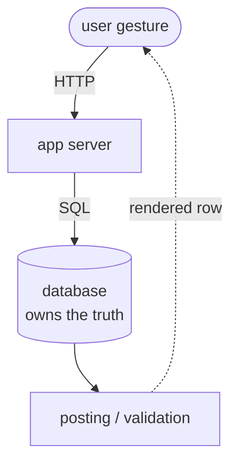
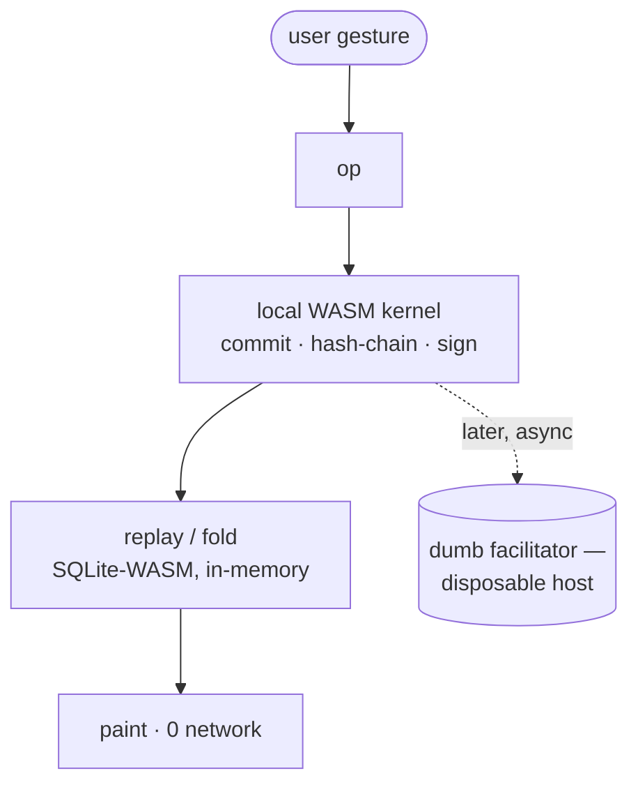
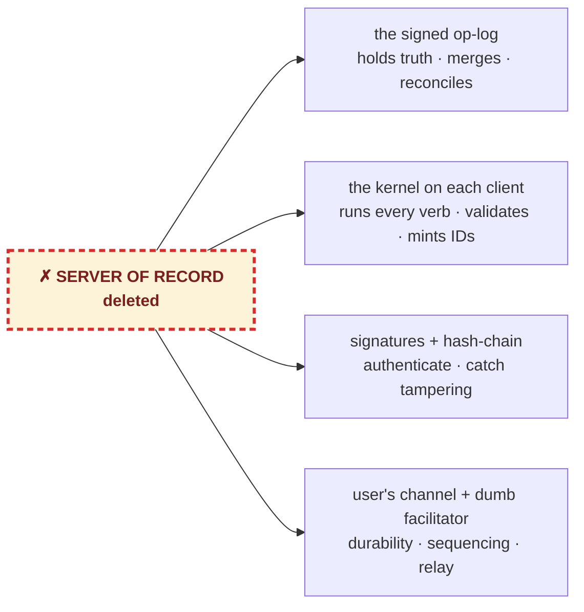

The ERP Server Is Obsolete
 built from ideas already proven by <b style="font-size:1.2em;letter-spacing:2.5px;color:#ffffff">Pacioli &nbsp;·&nbsp; Torvalds &nbsp;·&nbsp; Hipp</b>

 

  

    
    
<a href="#dr-tco" style="color:#ffa000;text-decoration:none;border-bottom:1px dotted #ffa000">≈30–244×</a>

    
less disaster-recovery storage at equal guarantee — the always-on server tier deleted (<b>TCO</b>)

  

  

    
    
<a href="#no-server" style="color:#7cb342;text-decoration:none;border-bottom:1px dotted #7cb342">0</a>

    
network round-trips on the read / fold path

  

  

    
    
<a href="#speed" style="color:#ff7043;text-decoration:none;border-bottom:1px dotted #ff7043">~53×</a>

    
faster bootstrap from a signed checkpoint vs genesis replay

  

  

    
    
<a href="#realistic-conversion-estimate-loc" style="color:#42a5f5;text-decoration:none;border-bottom:1px dotted #42a5f5">≈30×</a>

    
less code at full iDempiere parity — <i>≈89× delivered today</i>

  

  

    
    
1 TB→500 MB

    
<b><a href="#fn-backup" style="color:#ab47bc;text-decoration:none;border-bottom:1px dotted #ab47bc">Back up the recipe, not the result.</a></b>

  

 
## These have been around for some time, but never for ERP, until now.

*Every pillar below is a proven, decades-old idea from a named creator. Thus we can now put the ERP server in the browser!*

| Concept | Created By | What they proved | Where we use it |
|---|---|---|---|
| **Double-entry ledger** (codified 1494) | **Luca Pacioli** | the books are a *fold* of postings; Σdebit ≡ Σcredit | our journal is a fold — ΣDr ≡ ΣCr ([`poc_postings.js`](https://github.com/red1oon/BIMCompiler/blob/master/scripts/poc_postings.js)) |
| **The log is the truth** (git, 2005) | **Linus Torvalds** | hash-chained, signable history no central machine owns; host disposable | the signed op-log + `verifyChain()`; "the host is a Git remote" |
| **Event sourcing / replay** (2005) | **Martin Fowler · Greg Young** | state = deterministic *replay* of an append-only log | the kernel folds the log ([OpLogERP.md](OpLogERP.md)) |
| **The active data dictionary** | **Jörg Janke** — Compiere → iDempiere | an app can describe *itself* as data — tables, windows, rules | the 925-table AD rides as **data**, folded through 5 relations + verbs |
| **Hash trees + public-key signatures** | **Merkle · Diffie–Hellman · RSA** | a fact can carry its own integrity *and* authenticity anywhere | ECDSA-P256 signed ops; tamper caught on replay ([`poc_sign.js`](https://github.com/red1oon/BIMCompiler/blob/master/scripts/poc_sign.js), [`poc_chain.js`](https://github.com/red1oon/BIMCompiler/blob/master/scripts/poc_chain.js)) |
| **SQLite, embeddable** | **D. Richard Hipp** | a full SQL engine with *no server* — and now WASM | folds the log locally, inside the browser tab |

---

## Thesis

A classic ERP is a **server of record**: every read, write and posting is a round-trip to a machine that *owns the truth*. We keep the accounting and the document flow but **delete that server**. The truth becomes a *signed, hash-chained op-log*; the live numbers are a deterministic **fold** of it, replayed by a SQLite-WASM kernel **in the browser**. The host turns disposable (a Git remote); the user owns the log; period-end **compaction** is a *signed checkpoint* carrying balances forward — not a batch job with a down-window (the close *postings* are themselves folds, still being built).

A claim about **substrate and delivery**, not features — the legacy stacks have vastly more. What we show: the *architecture* folds the same transactions with **zero network on the read/fold path** — proven by folding a **live Odoo**, **iDempiere's own flows** (it's the AD we render), and a **SAP Business One** flow (mock export) into the same six verbs. S/4HANA is still pending a real oracle.

---

## What a *fold* is — the chess scoresheet

You don't store the chessboard — you store the **move list**, and replay it. The position is a deterministic *fold* of those moves: lose the board, keep the sheet, rebuild it exactly; anyone who replays the same moves reaches the same position. Our ERP is identical — the **signed op-log is the move list, the live balances are the board.** A fold, never a stored snapshot.

<figure style="text-align:center;margin:18px 0">
  
  <figcaption style="font-size:0.85em;opacity:.8;margin-top:6px">The scoresheet (the log) folds back into the position (the state) — lose the board, keep the sheet, rebuild it exactly.</figcaption>
</figure>

---

## The kill points — what the architecture actually deletes

> **The shocker, in one line:** there is **no server of record.** The browser holds the kernel; a signed,
> hash-chained log holds the truth; the host (if any) is a disposable relay. Every row below follows from that.

| What changes | Legacy ERP | Our WASM event-source | The cut |
|---|---|---|---|
| **The server of record** | a machine that *owns the truth* — JVM + Postgres + 3.7 GB build [^bloat] | **✗ none** — the browser runs the kernel; the signed log is the truth [^own] | **the whole tier is deleted** |
| **Read / fold round-trips** | 1 network hop per interaction [^arch] | **0** — the kernel answers locally [^noround] | network off the hot path |
| **Ownership / trust** | the server DB owns your record [^arch] | **you own a signed op-log**; the host is disposable [^own] | trust model inverted |
| **Document schema** | ≈925 AD tables, each a hand-written model class [^bloat2] | **5 core relations** (containers · items · documents · document_lines · journal) + verbs — the rest of the AD rides as **data** [^reduce] | hardcoded schema, *not* ERP scope (the AD is unchanged — it's the seed) |
| **Runtime code** | 1,427,147 Java LOC / 4,465 files [^bloat] | **16,068 JS LOC / 39 files** (flows folded so far) [^bloat] | ≈89× — *built-so-far; full-port forecast [below](#realistic-conversion-estimate-loc)* |
| **Bootstrap** (open the books) | re-query the server [^arch] | **signed checkpoint** — 0.90 ms vs 47.70 ms genesis [^drive] | ≈53× |
| **Seed DB** | 45.2 MB dump [^bloat] | **12.7 MB** self-describing AD [^bloat] | ≈3.5× |
| **Live DB → SQLite** | 143 MB Postgres [^bloat2] | **43 MB** SQLite (gzip 11.7 MB) [^bloat2] | ≈3.3× |
| **Backup / DR** | backup rotation, 30–50 copies = many× the state; restore = down-window [^tco] | **the recipe is the backup** — one signed log ×3 replicas, restore = replay, unbounded restore points [^tco][^blackout] | ≈30–244× less DR storage (strategy-dependent); **0 branch downtime** |

## How it differs — the architecture

#### Legacy ERP — server of record

#### Ours — the browser is the server

**Legacy:** every read & write is a network round-trip; the DB owns the truth; period close is a server batch
job with a down-window. **Ours:** state = a deterministic fold of the signed op-log — **0 network on the
read/fold path**; the host is disposable (Git-like), the log is the truth; period close is a *signed checkpoint*.
Source: `docs/DistributedERP.md` §0 (lines 53–85, server→serverless table) + §10 (lines 467–468).

---

## But where's the server? — what replaced each job {#no-server}

*If you deleted the server, who does its work?* "Serverless" doesn't mean no machine ever talks to another — it means **no server of record, no machine that owns the truth.** Every job the server did still happens; each moved onto the **signed log**, the **kernel on each client**, the **user's own channel**, or a **dumb facilitator that owns nothing**.

*The server's jobs don't vanish — they redistribute to four things that own nothing.* Each line below is proven by a POC in `scripts/` [^poc]:

| What a server used to do | Now done — without a server of record | Proven in |
|---|---|---|
| Hold the authoritative state | the **signed op-log**; state = its deterministic *fold*, recomputable by anyone | [`poc_distributed.js`](https://github.com/red1oon/BIMCompiler/blob/master/scripts/poc_distributed.js) |
| Mint internal record IDs | **edge-minted UUID** — unique, no coordination (legal gapless `DocumentNo` deferred to a facilitator-assigned sequence) | [`poc_distributed.js`](https://github.com/red1oon/BIMCompiler/blob/master/scripts/poc_distributed.js) |
| Run / validate business logic | the **deterministic kernel on every client** — same verbs both sides, no server re-run | [`poc_kernel.js`](https://github.com/red1oon/BIMCompiler/blob/master/scripts/poc_kernel.js) |
| Merge concurrent edits | **union the signed logs → total-order → replay** → identical state everywhere | [`poc_distributed.js`](https://github.com/red1oon/BIMCompiler/blob/master/scripts/poc_distributed.js) |
| Prevent double-write | **owner-gate** + **compare-and-set** on the one shared op-class, enforced on replay | [`poc_distributed.js`](https://github.com/red1oon/BIMCompiler/blob/master/scripts/poc_distributed.js) |
| Detect tampering | the log **hash-chains itself**; `verifyChain()` finds the altered op | [`poc_chain.js`](https://github.com/red1oon/BIMCompiler/blob/master/scripts/poc_chain.js) |
| Authenticate / authorise | **edge ECDSA-P256 signature** — wrong key fails anywhere; a holder can present, never forge | [`poc_sign.js`](https://github.com/red1oon/BIMCompiler/blob/master/scripts/poc_sign.js) |
| Durably store / back up | the **user's own channel** (email/social) + export; the local copy is disposable | [`poc_persist.js`](https://github.com/red1oon/BIMCompiler/blob/master/scripts/poc_persist.js) |
| Sequence multi-party order | a **dumb facilitator** — accept · order · persist · relay — itself rebuildable from the signed logs | [`poc_remote_pos.js`](https://github.com/red1oon/BIMCompiler/blob/master/scripts/poc_remote_pos.js) |
| Reconcile discrepancies | the **double-entry ledger** (since 1494) — the balance is a fold here too | [`poc_postings.js`](https://github.com/red1oon/BIMCompiler/blob/master/scripts/poc_postings.js) |
| Be always-on | **nothing** — work offline; sync at business-time | — |

**The analogy: git.** No central machine owns your code history — every clone has it all, verifies it, rebuilds from it; GitHub is a *convenience*, not the truth. **We do to ERP transactions what git did to source code:** the log is the truth, the host disposable, history chained and signed. The one thing git lacks, we add — *invariant enforcement* (no double-spend), via the owner-gate + a single compare-and-set op-class. Full doctrine + the hard multi-writer cases (shared stock, credit limits, client version skew): [DistributedERP.md](DistributedERP.md) §0, §9.

---

## Vitals — by theme

Three tables, not one wall. Columns are **architecture**, not a feature scorecard; numbers measured on *this* box / browser unless marked. **"n/a — architectural"** = the legacy stack has no comparable number because the property is structural (it always needs a server).

### A · Speed & latency {#speed}

| Vital | iDempiere | Odoo | SAP | Our WASM event-source |
|---|---|---|---|---|
| **Period-end carry-forward** | server batch job + down-window (per-row `saveEx` ≈ ~1M round-trips on a 40-yr depreciation run) [^dep] | server batch job [^arch] | server batch job [^arch] | **signed checkpoint = balance b/f** (the compaction step — accrual/FX/depreciation postings are themselves folds), no down-window; 40k-op close-fold ≈ **2.68 s**, archived 40000→live 1, reconcile **maxDiff=0c** [^pclose][^drive] |
| **Server round-trip** (read/fold) | round-trip per interaction [^arch] | round-trip per interaction [^arch] | round-trip per interaction [^arch] | **0 — the kernel answers locally** [^noround] |
| **Bootstrap** (open the books) | re-query the server [^arch] | re-query the server [^arch] | re-query the server [^arch] | **~53× faster from checkpoint** — 0.90 ms vs 47.70 ms genesis replay, same result [^drive] |
| **Commit throughput** (5000 ops) | n/a — architectural [^arch] | n/a [^arch] | n/a [^arch] | batch `commitGroup` **~22,492 ops/s = 2.4× naive** [^sync] |
| **Fold/append ceiling** | n/a — architectural [^arch] | n/a [^arch] | n/a [^arch] | **linear to 20,000,000 ops** (~437 B/op; fold ~40M ops/s hot) [^ceiling] |
| **Storage primitive** (1000 ops, 1 commit) | Postgres WAL+fsync **5.24 ms** (0.0052 ms/op) [^bench] | (same engine) [^arch] | n/a [^arch] | sql.js +sha256 chain **208.45 ms** — slower per-op, buys **no server**; Postgres durability/concurrency DEFERRED to the install [^bench] |

> **Where we actually beat them: the network.** The storage-primitive row above is *on-box*, where durable Postgres wins per-op — and we say so. But an ERP is never on-box: every interaction crosses a network to the server of record, which pays a round-trip **per interaction** (RTT-bound — and it **blocks when offline**). Our kernel answers locally (~0.01 ms/op) and relays asynchronously — **0 round-trips on the read/fold path.** That is the whole win: not faster storage, **no network on the hot path.** A remote-POS drive puts numbers on it — locals measured, network leg modelled, legacy excludes iDempiere ORM/OSGi so it's a *floor* [^rpos]: per sale, legacy is RTT-bound — **~256–674× at 0.5 ms LAN, ~8,500–50,000× at 50 ms cross-region** — while ours stays flat at local speed. The iDempiere 40-year depreciation run shows where that cost really sits: per-row `saveEx` ≈ **~1M round-trips** [^dep].

### B · Footprint & bloat

| Vital | iDempiere | Odoo | SAP | Our WASM event-source |
|---|---|---|---|---|
| **DB seed** | `Adempiere_pg.dmp` **45.2 MB** [^bloat] | n/a — diff schema [^arch] | n/a [^arch] | `erp/ad_seed.db` **12.7 MB** (≈**3.5× smaller**); the 12.7 MB IS the self-describing AD [^bloat] |
| **Runtime LOC** | **1,427,147 Java LOC** / 4,465 files + JVM + Postgres + 3.7 GB build [^bloat] | n/a — diff codebase [^arch] | n/a [^arch] | **16,068 JS LOC** / 39 files / 884 KB, static + SQLite-WASM, offline (≈**89× fewer**, zero server/JVM/DB) [^bloat] |
| **Live DB → SQLite** | Postgres **143 MB** on-disk (GardenWorld) [^bloat2] | n/a [^arch] | n/a [^arch] | **43 MB SQLite** (925 tables, 187,133 rows ≈ **3.3×**); gzip 11.7 MB (3.7×) [^bloat2] |

### C · Migration & ownership

| Vital | iDempiere | Odoo | SAP | Our WASM event-source |
|---|---|---|---|---|
| **Migration fold** (does the legacy flow fold into our verbs?) | **native** — it renders this AD; handlers diffed cell-by-cell vs an iDempiere oracle (`diff_oracle.log`; one GL cell needs live docker) | **PROVEN vs LIVE Odoo 17** — SO S00023, 5/5 hops, newVerbs=[], GL ΣDr==ΣCr 5002.50 [^odoo] | **B1 PROVEN vs a MOCK export** (5/5, journal 770.00); **S/4HANA NOT-RUN — gated on a real oracle** [^b1][^sap] | every hop maps to `CREATE_DOCUMENT / CREATE_LINE / SET_STATUS / POST / ALLOCATE` [^odoo][^b1] |
| **Data ownership / durability** | server DB owns the record [^arch] | server DB owns the record [^arch] | server DB owns the record [^arch] | **user-owned signed op-log**; host disposable (Git analogy); tamper caught by `verifyChain()`, forgery by ECDSA-P256 sig [^own][^pclose] |

---

## Disaster recovery & TCO — apple-to-apple (a range, not one number) {#dr-tco}

The fair comparison holds the **durability guarantee constant** — *restore to any of the last 50 days · RPO ≤ 24 h · survive primary loss* — and asks only: **what does it cost to meet it**, amortised over a year of 50-branch ops? Unit costs are **measured** on the real kernel (314 B/op uncompacted snapshot; fold, restore-to-arbitrary-op, and per-branch additivity all witnessed); the year-level figures are **derived** over modelled constants for the traditional side (no Postgres on the bench), each chosen **conservative for us** — `230 B/row` and `5 rows/op` are *low* versus Postgres+index and real iDempiere, so the real gap is wider, not narrower (constants named in GAPS #7 below). [^tco]

**Durable storage to meet the 50-day SLA** (Retail, 1k sales/branch/day, one durable copy each):

| Backup strategy | Traditional | Ours (50-day op-log) | ratio |
|---|---|---|---|
| daily full × 50 | 1,049 GB | 0.78 GB | 1,338× |
| weekly full + daily incremental (standard DBA) | 192 GB | 0.78 GB | **244×** |
| minimal: 1 full + 50 diffs (storage-min, replay-heavy restore) | 24 GB | 0.78 GB | 30× |

Incremental backup barely shrinks the gap — the **weekly fulls dominate.** Only the storage-minimal scheme reaches ~30×, and *its* restore is replay-heavy. The structural reason: a snapshot scheme must periodically re-store the **whole database**; the op-log **never stores a base image** (the deltas *are* the system). And the advantage **grows with business age** — their fulls grow yearly while the op-log's 50-day window stays constant (`§VOL`).

**Per-device storage — does every device carry the whole log? No.**

| Role | Stores | Resident | Bounded by |
|---|---|---|---|
| **Edge / branch** | engine shard + own open-period ops + last checkpoint | **~13 MB** | period-close + gravity shard ([DistributedERP §13](DistributedERP.md)) |
| **Facilitator / relay** | open-period union (ordering only) | ~16 MB/day, disposable | reconstructible from the edges |
| **Full-replica (bucket)** | the whole compacted recipe | ~0.8 GB (50-day) – ~5.7 GB/yr | **one per business, not per device** |

**Recovery and the honest trades** — all witnessed [^blackout][^tco]:

- **Total relay loss, no backup** rebuilds consolidated state from the branches' *own* slices — `§BLACKOUT-RESUME`: 50 branches, a fresh empty relay, an **identical signed tip**, books to the cent, idempotent re-push. The only loss is a bounded, ledger-reconciled CAS-arbitration sliver (the one shared op-class, §5); `§ORDER-HONEST` shows disjoint folds commute but cross-branch CAS order is *not* reconstructible from signed logs alone (honest correction to "total order is reconstructible").
- **Consolidated restore is additive** — per-branch folds combine (`maxDiff=0c`), so 12.5M ops at 5k/branch/day restore in **~0.5 s 50-way-parallel**; only the contended op-class needs merge logic.
- **0 branch downtime trades against a double-sale risk** — but only for stock that is *not* physically partitioned (≤0.1% of ops; located stock can't double-sell — the scan is possession), and it is value-tier-bounded (high-value blocked → 0, low-value → a receivable). Traditional avoids it only by **requiring connectivity** (then the branch stops when the link drops — the very downtime we removed) or by **allowing offline POS** (carrying the same risk).
- **"0 always-on server-hours" is 0 always-on compute-VM, not 0 cost** — object storage, the CAS touch, and the intermittent relay remain, itemised: storage-priced + pay-per-invocation, no OS / patch / licence. An illustrative annual bill (public list prices, volatile; **excluding** DB licence + DBA labour, which widen it) runs **>10× cheaper**, compute-dominated.

---

## Method & honesty

**What is measured (real, on this box / browser):**
- Period-close fold, balance-b/f, reconcile-to-0c, tamper/forgery rejection, determinism — on the
  **real kernel** ([`scripts/test_kernel_period_close.js`](https://github.com/red1oon/BIMCompiler/blob/master/scripts/test_kernel_period_close.js)) and against **real double-entry POST ops**
  ([`scripts/test_integ_postings_reconcile.js`](https://github.com/red1oon/BIMCompiler/blob/master/scripts/test_integ_postings_reconcile.js)).
- Browser-measured 40k-op close-fold timing, bootstrap 53× speedup, reconcile maxDiff=0
  (`build/erp/period_close_drive.log`, an in-browser drive).
- Storage primitive sql.js-vs-Postgres (`build/erp/bench_oplog_pg.log`), batch throughput
  (`build/erp/sync_poc_smoke.log`), volume ceiling to 20M ops (`build/erp/poc_volume_ceiling.log`).
- Bloat figures `du`/`wc`/sqlite-measured 2026-06-06 (`internal/BLOAT_MEASUREMENT.md`, summarised in
  the bloat memory).
- The Odoo fold is against a **running Odoo 17** instance (`build/erp/odoo_fold_live.log`,
  `§ODOO-FOLD-LIVE PASS`).

**What is architectural (a property, not a number):**
- "0 round-trip" — *structural* (no server of record on the read/fold path), not a benchmark. Honest counter: server-removal only wins over a network; on-box, durable Postgres is *faster* per-op (it buys durability + concurrency we defer).
- Most ERP cells are *n/a — architectural*: the legacy stack exposes no comparable single number (throughput ceiling, batch-vs-naive) — server-bound by design.

**NOT feature parity — plainly.** iDempiere, Odoo and SAP have *vastly* more features, localisations and integrations. The 16K LOC renders the dictionary and folds the paths built so far (order-to-cash, journal/posting, signed rule-edit, period-close) — it does **not** re-implement the full transactional server. The win is **delivery/definition**: the AD-interpreter is lean because the AD is self-describing, and the whole server/build stack is gone. Each transactional verb still has to be folded deterministically. See `feedback_erp_perf_claims`.

---

## Realistic conversion estimate (LOC)

89× is honest for what's folded today — but it measures the *thinnest, highest-compression* slice (order-to-cash + posting), where iDempiere is mostly generated boilerplate and ZK UI that collapse to ~0. It does **not** extrapolate to a full port.

Splitting all 1,427,147 Java LOC by fate [^split]:

| Fate | ~LOC | Share | What |
|---|---|---|---|
| **Deleted outright** | ~490K | 34% | ZK web UI (190K), tests (78K), server-side HTML lib (44K), print/report + Jasper (38K), import/migration (25K), webservices, app-server daemon, installer, JDBC drivers, OSGi/HTTP plumbing |
| **Generic-replaced** by the interpreter | ~735K | 52% | generated models `X_*`/`I_*` (573K) + PO / dictionary / runtime core (`Env`, `DB`, `GridField`, util… ~162K) — a new table is *data*, not code |
| **Irreducible — must be folded** | ~200K | 14% | `M*` model logic, `Doc_*` posting, the acct / costing / tax / payment / allocation / matching engines, callouts, validators, document `process/` |

**Read it:** ~86% is UI, boilerplate, or server plumbing the browser deletes outright. Even the irreducible 14% is ceremony-heavy — in the `M*` models a third is blank/comment/signatures and most of the rest is generic accessor/lifecycle code the dictionary already handles; the *behavioural* logic (state transitions, posting math, tax rounding) is a minority.

Folding that behavioural core into declarative verbs compresses ~5–8× (no Java/OSGi ceremony, no per-field getters) — though **costing and MRP fold least cleanly** (stateful cost rollups, landed cost), pulling toward the conservative end:

| Scenario | irreducible folded | ÷ ratio | full JS (+ engine 16,068) | overall |
|---|---|---|---|---|
| Optimistic | 150K | 8× | **~35K** | ~41× |
| Mid | 175K | 6.5× | **~43K** | ~33× |
| Conservative | 200K | 5× | **~56K** | ~25× |

**Realistic full parity ≈ 35–56K JS LOC (~43K mid) ≈ ~30× overall** (range 25–41×) — vs 89× for the flows folded so far. The fold ratio is the one estimated input (GAPS #6); every LOC count is measured.

??? note "Full breakdown by iDempiere module (org.adempiere.base, org.adempiere.ui.zk, …) — expand"

    Measured 2026-06-08 [^split]. Fate = **DELETED** (no equivalent in a browser substrate) · **GENERIC** (the interpreter renders it from the dictionary) · **FOLD** (re-expressed as verbs / handlers). Buckets are disjoint and sum to 1,427,147.

    | iDempiere module / package | LOC | Fate |
    |---|---:|---|
    | **org.adempiere.base** | **959,659** | *mixed — split below* |
    | &nbsp;&nbsp;`X_*` generated models | 345,490 | GENERIC |
    | &nbsp;&nbsp;`I_*` interfaces | 227,100 | GENERIC |
    | &nbsp;&nbsp;`M*` business models | 198,679 | FOLD (behavioural subset) |
    | &nbsp;&nbsp;`Doc_*` posting | 12,789 | FOLD |
    | &nbsp;&nbsp;acct · wf · process engines | 28,686 | FOLD |
    | &nbsp;&nbsp;PO · GridField · Env · DB · util · OSGi core | 116,302 | GENERIC |
    | &nbsp;&nbsp;print · report · impexp · db-conn | 30,613 | DELETED |
    | **org.adempiere.ui.zk** — ZK web client | 189,786 | DELETED |
    | **org.idempiere.test** | 78,389 | DELETED |
    | **org.apache.ecs** — server-side HTML lib | 43,816 | DELETED |
    | **org.adempiere.ui** — shared UI base | 18,349 | DELETED |
    | **org.adempiere.pipo** + .handlers — 2-way migration | 16,713 | DELETED |
    | **org.idempiere.webservices** — SOAP/REST | 11,572 | DELETED |
    | **org.adempiere.server** — scheduler / daemon | 11,285 | DELETED |
    | **org.adempiere.install** — installer | 10,366 | DELETED |
    | **org.adempiere.base.callout** | 8,997 | FOLD |
    | **org.compiere.db.{oracle,postgresql}.provider** — JDBC | 7,185 | DELETED |
    | **org.adempiere.replication[.server]** | 3,410 | DELETED |
    | **org.adempiere.report.jasper** | 3,354 | DELETED |
    | **org.idempiere.printformat.editor** | 2,752 | DELETED |
    | **org.adempiere.eclipse.equinox.http.servlet** — OSGi HTTP | 2,677 | DELETED |
    | tablepartition · hazelcast · keikai · felix.webconsole · sso.oidc · plugin.utils · payment.processor · event.test | 5,144 | DELETED |
    | … + ~40 smaller modules (UI widgets, adapters, gateways) | 53,693 | mostly DELETED |
    | **Total** | **1,427,147** | |

---

## GAPS (vitals lacking a measured source — do not claim a number)

1. **SAP S/4HANA fold** — BLOCKED. `build/erp/sap_fold.log` says `§SAP-FOLD NOT-RUN (skeleton ready;
   gated on oracle access)`. No real SAP O2C+FI export has been folded; only **SAP Business One (B1)
   against a hand-authored MOCK** has (`build/erp/b1_fold.log`). The "SAP" column is therefore
   *partly mock, partly not-run* — never present S/4HANA as proven.
2. **Odoo / SAP server-side period-close timing & down-window** — no measured number; marked
   *architectural*. We have our own 2.68 s/40k-op figure but no head-to-head legacy batch-close time.
3. **Odoo / SAP server round-trip latency (ms)** — not measured here. The closest real datum is the
   iDempiere depreciation run (`DepreciationPerf.md`: per-row `saveEx` ≈ ~1M round-trips), and the
   `feedback_erp_perf_claims` matrix (REMOTE per-txn 2–5 orders, RTT-bound) — both iDempiere-flavoured,
   not Odoo/SAP. Cite as illustrative, not as an Odoo/SAP measurement.
4. **Postgres per-op floor vs our per-op** is a *primitive-only* comparison (no callouts/posting/JVM on
   either side) — `bench_oplog_pg.log` states this explicitly; do not extrapolate to whole-document cost.
5. **Live-DB → SQLite (143 MB → 43 MB)** was measured on a static dump + repo (Docker Postgres was NOT
   running at measure time) — see the bloat memory caveat.
6. **Full-conversion LOC (~43K / ~30×)** — the per-bucket LOC are *measured* (`find`/`wc` on
   `~/idempiere-dev-setup/idempiere`, 2026-06-08), but the **5–8× fold-compression ratio** on the irreducible
   business core — and the share of `M*` that is real logic vs accessor/lifecycle ceremony — are **estimates** (no
   full port exists to measure them). Treat ~25–41× as a *forecast*; 89× is the *measured built-so-far*, and a
   high-compression slice that does not extrapolate.
7. **DR / TCO model constants** — the unit costs (314 B/op snapshot; fold, restore-to-op, per-branch additivity)
   are **measured**; the year-level storage/compute/bill figures are **derived** over modelled constants for the
   traditional side (no Postgres on the bench): `DB_BYTES_PER_ROW=230` (SQLite, no index — Postgres+index ≈ 1.5–3×
   higher), `ROWS_PER_OP=5` (real iDempiere order-complete ≈ 10–20), `IO_RESTORE=200 MB/s`, `3 always-on VMs`. All
   chosen **conservative for us** (a higher real value widens the gap, not narrows it). The illustrative bill uses
   **public list prices (~Jan-2026, volatile)** and **excludes DB licence + DBA labour**. The ratios use the
   **uncompacted** 314 B/op (no shorthand) — the compression ladder (~90 B/op) widens them ~3.5×. Witness:
   `build/erp/poc_tco_skeptic.log`.

---

## Further reading — go deeper

The on-ramp ends here. To see *how* each claim is built:

- **[ERP.md](ERP.md)** — the **"AD-in-a-browser" blueprint**: how the iDempiere Application Dictionary is
  folded from SQLite and rendered as a live client, the six verbs (`CREATE_DOCUMENT / CREATE_LINE /
  SET_STATUS / POST / ALLOCATE / MATCH`) every document flow reduces to, and the full engine reference.
  *Start here if you want the whole architecture.*
- **[HolyGrail.md](HolyGrail.md)** — the **end-state vision and its "hard parts"**: multi-site sync, durability
  on disposable hosts, and compaction = the period-close *signed checkpoint = balance b/f* you just saw.
  *Read this for where the whole effort is converging and why these were the hard problems.*
- **[OpLogERP.md](OpLogERP.md)** — the **event-sourcing model in one page**: why the authoritative state is a
  *signed, hash-chained op-log* and the current numbers are a deterministic **fold** of it — not a row in a
  server DB. *The shortest explanation of "the log is the truth."*
- **[DistributedERP.md](DistributedERP.md)** — the **serverless / secured doctrine + adversarial contention map**:
  the server→serverless table behind the "0 round-trip" claim, the Git-remote "host is disposable" analogy,
  and the honest counter-arguments. *Read this for the distributed-systems reasoning and the proof scripts.*
- **[BIMERPPaper.md](BIMERPPaper.md)** — the **"why / provenance" piece** (Redhuan Oon, 30 years of ERP):
  the motivation, the lineage from iDempiere/Adempiere/Compiere, and what problem this is really solving.

---

## Status

DRAFT (2026-06-08). The evaluator-facing companion to the deep papers ([ERP.md](ERP.md) · [DistributedERP.md](DistributedERP.md) · [BIMERPPaper.md](BIMERPPaper.md)). Every number here traces to a real source file (path cited per cell); where no head-to-head number exists, the cell says so — nothing is invented.

---

<strong>Back up the recipe, not the result.</strong> The signed op-log is the only thing stored — balances, postings (<code>Fact_Acct</code>) and every derived table are a deterministic <em>fold</em> of it, recomputed on load, never saved; period-close compaction keeps only the open period live. So a transaction-heavy <strong>1 TB ERP backs up as ~500 MB</strong>. Method &amp; basis: <a href="../HolyGrail/#backup-recipe">HolyGrail § back up the recipe, not the result</a>.

## Footnote sources

[^pclose]: `build/erp/test_kernel_period_close.log` — `§PCLOSE-FOLD` archived=15→live=1, `§PCLOSE-RECONCILE … maxDiff=0c`, tamper/forgery/determinism all PASS on the real kernel.
[^drive]: `build/erp/period_close_drive.log` — in-browser drive: `close N=20000 closeFold=2681.8ms archived=40000 live=1`; `bootstrap fromCkpt=0.90ms fromGenesis=47.70ms speedup=53.0x same=true`; `reconcile maxDiff=0c`.
[^tco]: `build/erp/poc_tco_skeptic.log` — `W-TCO-HARDENED` (`scripts/poc_tco_skeptic.js`): measured 314 B/op snapshot + fold/restore; three backup strategies (Retail) daily-full 1,338× / weekly-incremental **244×** / minimal 30×; per-branch-fold additivity `maxDiff=0c`; billable-resource inventory (>10× cheaper excl. licence + labour); double-sale trade bounded to the ≤0.1% shared op-class, value-tiered. Model constants per GAPS #7 (conservative for us).
[^blackout]: `build/erp/poc_blackout_resume.log` — `W-BLACKOUT` (`scripts/poc_blackout_resume.js`): 50 branches, total blackout + relay drive lost (no backup), rebuilt from each branch's own slice to an **identical signed tip**, books `maxDiff=0c`, idempotent re-push (`acc=0`); the CAS-arbitration sliver is named + ledger-routed; `§ORDER-HONEST` — disjoint folds commute, cross-branch CAS order is not reconstructible from signed logs alone.
[^noround]: `docs/DistributedERP.md` §0 (server→serverless table, lines 53–85) + §10 lines 467–468 ("no per-interaction network round-trip (the kernel answers locally)").
[^bench]: `build/erp/bench_oplog_pg.log` — N=1000 ops, one atomic commit: sql.js 208.45 ms (0.2084 ms/op, incl. sha256 chain); Postgres durable WAL+fsync 5.24 ms (0.0052 ms/op). Explicitly "NOT a head-to-head".
[^rpos]: `build/erp/poc_remote_pos.log` — `§RPOS`: local op-group fold **0.01 ms/sale** (167,219 sales/s). Networked legacy per sale = RTT + measured Postgres per-doc; **locals MEASURED, the network leg is a transparent model**, and legacy EXCLUDES iDempiere ORM/OSGi so it is a *floor*: LAN 0.5 ms → 256–674×, metro 10 ms → 1,844–10,205×, cross-region 50 ms → 8,533–50,338×, intercontinental 150 ms → 25,255–150,669×.
[^dep]: `docs/DepreciationPerf.md` — iDempiere 40-year asset depreciation: per-row `saveEx` through the PO layer ≈ ~2 DB round-trips × ~480 periods/asset ≈ ~960/asset → a base of thousands of assets ≈ **~1M round-trips** (recalled ~20 min). The cost is the round-trips, not the maths.
[^sync]: `build/erp/sync_poc_smoke.log` — 5,000 events: naive 9,390 ops/s; batch commitGroup 22,492 ops/s = 2.4× (corroborated `sync_poc_prod_smoke.log`).
[^ceiling]: `build/erp/poc_volume_ceiling.log` — append/fold stay LINEAR; largestFit=20,000,000 ops, ~437 B/op retained; fold ~40.8M ops/s hot at 5M.
[^bloat]: bloat memory (`reference_bloat_reduction.md`, measured 2026-06-06 from `~/idempiere-dev-setup/idempiere`) — seed 45.2 MB → 12.7 MB (≈3.5×); 1,427,147 Java LOC → 16,068 JS LOC (≈89×). Full evidence `internal/BLOAT_MEASUREMENT.md`.
[^bloat2]: same memory — LIVE GardenWorld DB Postgres 143 MB on-disk → 43 MB SQLite (925 tables, 187,133 rows, ≈3.3×); gzip 11.7 MB (3.7×).
[^odoo]: `build/erp/odoo_fold_live.log` — `§ODOO-FOLD-LIVE PASS`: live odoodemo (Odoo 17, :8069) SO S00023, 5/5 hops mapped, newVerbs=[], total 5002.50 == oracle, GL ΣDr==ΣCr.
[^b1]: `build/erp/b1_fold.log` — `§B1-FOLD PASS`: SAP Business One O2C + OJDT/JDT1, 5/5 hops, journal 770.00==770.00. Source = a hand-authored MOCK Service-Layer shape (user-authorized 2026-06-05), NOT a real export.
[^sap]: `build/erp/sap_fold.log` — `§SAP-FOLD NOT-RUN` / `BLOCKED — awaiting a REAL SAP oracle. No fold claimed.` (S/4HANA).
[^own]: `docs/DistributedERP.md` §0 lines 74–80 (the Git analogy — log is truth, host disposable) + the signed-checkpoint/tamper proofs in [^pclose].
[^arch]: Architectural property of a server-of-record ERP — no comparable single measured number in this repo; stated as structure, not benchmarked. Honest-caveat doctrine: `feedback_erp_perf_claims`.
[^poc]: The server→serverless mapping + per-line proofs: `docs/DistributedERP.md` §0 ("From server to serverless — what moved where"). POCs live in `scripts/poc_*.js` ([`poc_distributed.js`](https://github.com/red1oon/BIMCompiler/blob/master/scripts/poc_distributed.js), [`poc_kernel.js`](https://github.com/red1oon/BIMCompiler/blob/master/scripts/poc_kernel.js), [`poc_chain.js`](https://github.com/red1oon/BIMCompiler/blob/master/scripts/poc_chain.js), [`poc_sign.js`](https://github.com/red1oon/BIMCompiler/blob/master/scripts/poc_sign.js), [`poc_persist.js`](https://github.com/red1oon/BIMCompiler/blob/master/scripts/poc_persist.js), [`poc_remote_pos.js`](https://github.com/red1oon/BIMCompiler/blob/master/scripts/poc_remote_pos.js), [`poc_postings.js`](https://github.com/red1oon/BIMCompiler/blob/master/scripts/poc_postings.js)); witnessed logs under `build/erp/`.
[^reduce]: The ≈925-table → 5-relation reduction: `docs/DistributedERP.md` §"domain reduction" ("iDempiere AD (925 tables, `M*` classes) → 5 tables + deterministic verbs") + `docs/OpLogERP.md` ("≈925 tables reduce to five relations plus verbs") + `docs/ERP.md` §12 (the 5 core tables) + `docs/FeatureComparison.md` ("5 core tables: containers, items, documents, document_lines, journal").
[^split]: iDempiere swept 2026-06-08 via `find … -exec cat {} + | wc -l` over `~/idempiere-dev-setup/idempiere` (4,465 files, 1,427,147 LOC; same tree as [^bloat]). Key buckets: generated `X_*`=345,490, `I_*`=227,100; ZK web UI=189,786; tests=78,389; base `M*` models=198,679; `Doc_*` posting=12,789; acct engine=21,443; tree-wide `process/`=69,782; costing=22,056; payment=7,359; tax=2,507; matching=1,959; allocation=1,472; callouts=10,340; validators=3,336; plus server-side HTML lib 43,816, print/report+Jasper ~21K, import/migration ~25K, webservices/server/installer/JDBC/OSGi. Disjoint buckets sum to 1,427,147. The 5–8× fold ratio and the ceremony fraction of `M*` are estimates (GAPS #6), not measured.
