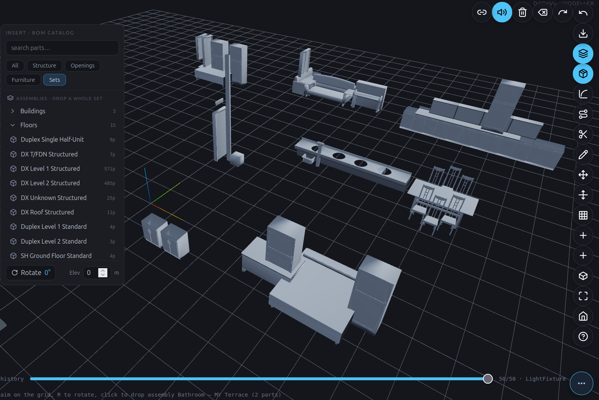

# DAGeVu Modeller — User Guide

> **Work in progress.** The DAGeVu modeller is an early, spine-proven authoring surface — this guide is
> deliberately a short intro plus an index of the toolbar icons. Expect it to grow as the modeller does.

## What it is

DAGeVu is a **browser BIM authoring** surface that sits beside the read-only viewer. Instead of editing a file,
you apply **operations** — insert a component, sketch a profile, extrude, sweep, fillet — and the model is a
**deterministic fold** of that signed operation log. The op-log *is* the feature tree: every action is
recorded, replayable, and reversible, and the same signed-log idea drives the Kernel-ERP engine.

**Open it:** [red1oon.github.io/bim-ootb/viewer/modeller.html](https://red1oon.github.io/bim-ootb/viewer/modeller.html)
(desktop — the B-rep kernel is heavy). The **Home** button returns to the Matrix landing.

## Your first insert — the BOM catalog

The fastest way to build is to **assemble, not draw**. Tap the **Insert** tool (the cube icon in the
toolbar — open the **⋯** pill rail at the bottom‑right if the pills are collapsed) to open the
**INSERT · BOM CATALOG** panel on the left:

1. **Find a component.** Type in **search parts…**, or narrow with the filter chips —
   **All · Structure · Openings · Furniture · Sets**. The catalog is extracted from the real
   component library (`component_library.db` plus the per-building BOMs), so what you see are actual
   parts and pre-built assemblies.
2. **Pick a part — or a whole set.** Single parts drop one element. **Sets** are *assemblies* (whole
   BOM sets) grouped by level — **Buildings · Floors · Rooms · Sets · Items** — each collapsible, with a
   part-count badge (e.g. *Duplex Single Half-Unit*, *DX Level 1 Structured*). Pick one to drop the
   entire recipe at once.
3. **Aim and place.** The status line prompts **"aim on the grid, R to rotate, click to place"**. Move
   the cursor over the grid to position the ghost preview; press **R** to rotate (the **Rotate** angle
   in the panel footer updates); set **Elev** (metres) to lift it to a storey height; then **click** to
   drop it.
4. **It's a signed op.** The placement lands as one operation in the op-log — visible on the history
   scrubber at the bottom and fully **undoable** (`Ctrl+Z`). An assembly drops as a single grouped op
   of *N* parts, each seated and oriented from the recipe — e.g. **doors and windows take their host
   wall's facing automatically**, rotating with the wall rather than landing flat.

From there, use the toolbar pills to refine: move/rotate a placed object, sketch and extrude new geometry,
cut, sweep an MEP run, or bump a component's level of detail. The **Outliner** panel (left) lists the
placed elements; collapse it with its chevron to free up the canvas.

## The toolbar — icon index

The toolbar is a **⋯ pill rail** at the bottom-right: tap **⋯** to fan the icon-only glass pills up,
and hover any pill for its name. The **? Help** pill opens the **TOOLBAR · PILL REGISTRY** — the live
list of every tool's icon, name, and keyboard shortcut (`Esc` always cancels the current mode).

| Icon | Does |
|------|------|
| **⋯ Toolbar** | Fan the toolbar pills open / closed (bottom-right) |
| **? Help** | Toolbar & shortcuts — the live pill registry |
| **Home** | Back to the Matrix landing |
| **Fit** | Zoom to fit — frames the selection, or the whole scene (`F`) |
| **Iso** | Cycle the view: Iso ⇄ Top |
| **Wall** | Draw a wall |
| **Opening** | Place an opening (door / window) in a wall |
| **Grid** | Show / add a construction grid |
| **Move Grid** | Drag a gridline — attached walls recompose with it |
| **Move** | Move the selected object — drag an axis handle or nudge with the arrow keys (`M`) |
| **Sketch** | Start a 2D sketch |
| **Extrude** | Push a sketch profile into a solid |
| **Axis** | Set the constraint intent the solver enforces on the sketch |
| **Cut** | Boolean-cut one solid with another |
| **Route** | Define a route to sweep a profile along (e.g. an MEP run) |
| **Sweep Run** | Sweep the profile along the route |
| **Fillet** | Round a selected solid's picked edges |
| **Apply** | Commit the pending fillet / chamfer |
| **Insert** | Insert a library component — assemble, don't draw (catalog + BOM-assembly drop) |
| **LOD 200** | Refine the selected component's level of detail (same signed row) |
| **IFC** | Export the authored model as IFC4 |
| **Undo** | Undo the last operation (`Ctrl+Z`) |
| **Redo** | Redo (`Ctrl+Shift+Z`) |
| **Delete** | Delete the selection (`Del`) |
| **Clear** | Empty the scene |
| **Sound** | Toggle authoring sound feedback |
| **Connect** | Connect Scene — share selection / timeline with the Viewer & ERP (opt-in; surfaces stay separate) |

---

*Part of [BIM OOTB](USER_GUIDE.md). Copyright (c) 2025–2026 Redhuan D. Oon. MIT Licensed.*
