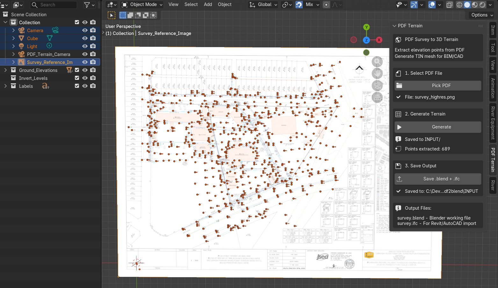

# PDF Terrain — Survey to 3D Terrain Generator

> **Part of:** [FederatedModel Spatial Database](https://github.com/red1oon/IfcOpenShell/tree/feature/IFC4_DB/src/bonsai/bonsai/bim/module/federation) ·
> [Bonsai](https://bonsaibim.org/) addon for [Blender](https://www.blender.org/)

**Status:** POC complete. 689 elevation points extracted from real civil survey.

---

## What It Does

Converts survey drawings (PDF/PNG) into 3D terrain for BIM workflows:

```
PDF survey → Google Vision OCR → elevation points → 3D point cloud → IFC + DXF
```

A civil engineer's survey plan — the paper document with handwritten elevation
numbers — becomes a 3D terrain mesh that the [BIM Compiler](index.md) can place
buildings on. This is the bridge between land survey and spatial MRP.

<figure style="text-align: center; margin: 24px 0;">
  
  <figcaption style="font-size: 0.75em; color: #666; margin-top: 8px;">689 elevation points extracted from real civil survey. 294m × 229m site. Rendered in Blender/Bonsai.</figcaption>
</figure>

<div style="text-align: center; margin-bottom: 24px;">
  <a href="https://youtu.be/PiTl1ANmGBo" style="font-size: 1.1em;">▶ Watch the PDF Terrain demo</a>
</div>

## Why It Matters for the ERP Paradigm

In iDempiere, a [C_Project](ProjectOrderBlueprint.md#2-c_project-site-as-bom)
groups C_Orders on a site. But a site is not flat — it has topology (slopes,
ridges, drainage paths). The terrain mesh provides the physical surface that
[M_Locator](https://wiki.idempiere.org/en/M_Locator) plots sit on. Without
terrain, plot placement is 2D grid arithmetic. With terrain, it becomes
real-world site engineering:

- **Cut-and-fill volumetrics** — how much earth to move
- **Grading strategy** — which plots need fill, which need cut
- **Infrastructure routing** — drainage follows terrain slope
- **[4D scheduling](ProjectOrderBlueprint.md#51-4d-schedule-topological-sort-of-bom-tree)** — earthworks before foundations

## Key Features

- Automatic elevation point extraction via Google Vision API
- API caching — one-time call per survey, no repeat charges
- IFC export (IfcGeographicElement per point, under IfcSite)
- DXF export for AutoCAD/Civil 3D compatibility
- Orthographic camera view for technical review
- Reference image overlay in Blender viewport

## Proof of Concept

| Metric | Value |
|--------|-------|
| Points extracted | 689 from real civil survey |
| Survey area | 294m × 229m |
| Elevation band | 20m (40m–60m) |
| Coordinate accuracy | Affine-transformed from pixel to world |
| Exports | IFC + DXF verified in Revit and AutoCAD |

## How It Connects

| Dimension | Role |
|-----------|------|
| **3D** | Terrain mesh — the physical site surface |
| **[4D](ProjectOrderBlueprint.md#51-4d-schedule-topological-sort-of-bom-tree)** | Earthworks sequencing (cut before fill, grade before foundations) |
| **[5D](ProjectOrderBlueprint.md#52-5d-cost-inherent-in-the-data-model)** | Cut-and-fill volumes × earth-moving rates = site preparation cost |
| **[Infrastructure](INFRA_DESIGNER_SRS.md)** | Road/rail alignment follows terrain topology |

## Source

**Repository:** [red1oon/IfcOpenShell](https://github.com/red1oon/IfcOpenShell/tree/feature/IFC4_DB/src/bonsai/bonsai/bim/module/federation/pdf_terrain)
(branch: `feature/IFC4_DB`)

See [INFRA_DESIGNER_SRS.md](INFRA_DESIGNER_SRS.md) for the infrastructure
designer that consumes terrain data (4 snap modes: ON_SURFACE, ABOVE, BELOW, PIER).
