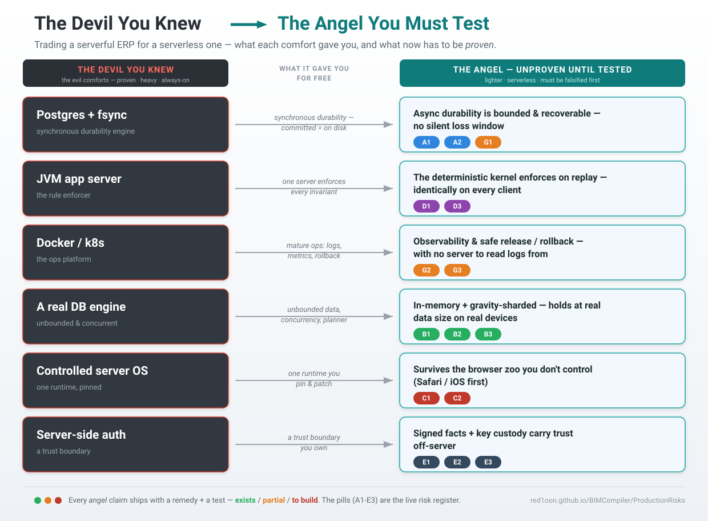

# Production Readiness — Risk Register & Test Plan

> *"The Angel Must Be Tested First."*
> We left the devil we knew — a Postgres container, a JVM app server, Docker's operational maturity, fsync durability, a server that enforces every rule. Those were *evil comforts*: heavy, costly, always-on — but battle-proven, and their failure modes are a generation old and well-charted. This architecture trades them for something lighter and, on paper, better: no server of record, compute on the client, durability in a signed log ([DistributedERP §0](DistributedERP.md)). **That trade is only real once each comfort we removed has a replacement we have *tested to failure*.** This document is that test list. It is a pre-mortem, not a brochure.

## How this document is disciplined

Per the project's prime rule (*deterministic, non-invent, extract*) and its testing law (*every test names the issue it proves or disproves*), every risk below carries a **test plan**, and every test is tagged with its honest status:

- **✅ EXISTS** — a named witness already proves/disproves it (cite the `poc_*.js` / `W-*` / `§`-log).
- **🟡 PARTIAL** — a witness covers part of it; the production-grade case is not yet exercised.
- **🔴 TO BUILD** — *this is a gap*. No test exists. Until it does, the risk is **unverified** and the feature is **not production-ready** on that axis.

**The 🔴 rows are the real output of this document.** A green register is the goal; today's reds are the work-to-zero before a paying tenant. We do not ship an axis whose test is 🔴.

## What we gave up, and what now must replace it

| The devil we knew (old stack) | What it gave us *for free* | The angel must now prove (this doc) |
|---|---|---|
| **Postgres + fsync** | synchronous durability — a committed row is on disk before `COMMIT` returns | async durability is bounded and recoverable — no silent loss window (**A1, A2, G1**) |
| **JVM app server** | one place that *enforces* every invariant, server-side | the deterministic kernel enforces on replay, on every client, identically (**D1, D3**) |
| **Docker / k8s** | mature ops: logs, metrics, health checks, rollback | observability + release/rollback without a server to read logs from (**G2, G3**) |
| **A real DB engine** | unbounded dataset, concurrency, query planner | the in-memory + sharded model holds at real data size on real devices (**B1, B2, B3**) |
| **A controlled server OS** | one runtime you pin and patch | survival across the browser zoo you do *not* control (**C1, C2**) |
| **Server-side auth + access control** | a trust boundary you own | signed facts + key custody carry trust off-server (**E1, E2, E3**) |

The thesis is that each replacement is *better* (cheaper, offline-capable, more auditable). The job here is to **falsify that thesis on every axis before a customer does.**

---

## Severity & status legend

- **S1 — Integrity / data loss** (silent wrong number, or lost committed work). The unforgivable class.
- **S2 — Availability** (can't work, can't recover).
- **S3 — Performance / UX** (too slow, too heavy, degrades on real devices).
- **S4 — Security / compliance** (forgery, key loss, GDPR).

Likelihood: **H/M/L**. Mitigation: **in place / partial / design-only**.

## Master register (read this, then drill)

| ID | Risk | Class | Sev | Likelihood | Mitigation | Test status |
|---|---|---|---|---|---|---|
| **A1** | Eviction × async-durability loss window | Durability | **S1** | **H** (Safari) | in place | 🟡 PARTIAL |
| **A2** | Lost sequencer / relay (rebuild books) | Durability | S1 | M | in place | ✅ EXISTS |
| **A3** | Lost signing key (the floor) | Durability | S1/S4 | M | partial | 🟡 PARTIAL |
| **B1** | In-memory RAM ceiling | Capacity | **S2/S3** | **H** at scale | partial | 🔴 TO BUILD |
| **B2** | First-load cold start (WASM + DB hydrate) | Capacity | S3 | M | partial | 🔴 TO BUILD |
| **B3** | IndexedDB ~1GB cap / OPFS gated by COOP-COEP | Capacity | S2 | M | in place (detect) | 🟡 PARTIAL |
| **C1** | Safari/iOS heterogeneity & eviction | Environment | **S1/S2** | **H** | partial | 🔴 TO BUILD |
| **C2** | Browser/library API drift | Environment | S2 | M | partial | 🟡 PARTIAL |
| **D1** | Nondeterminism creep → replay divergence | Correctness | **S1** | M | in place | ✅ EXISTS |
| **D2** | Schema migration to N offline clients | Correctness | **S1** | **H** (on 1st breaking change) | design-only | 🔴 TO BUILD |
| **D3** | CAS sliver / cross-branch arbitration | Correctness | S1 | L | in place | ✅ EXISTS |
| **D4** | Relay equivocation | Correctness | S1 | L | in place | ✅ EXISTS |
| **E1** | Key custody / rotation / revoke / recovery | Security | **S4** | M | partial | 🟡 PARTIAL |
| **E2** | Right-to-erasure on an immutable log | Compliance | S4 | M | in place | ✅ EXISTS |
| **E3** | Bearer-token forwarding (credit) | Security | S4 | M | in place | 🟡 PARTIAL |
| **F1** | web-ifc import fidelity | Integration | S3 | M | partial | 🟡 PARTIAL |
| **G1** | Relay operation: idempotency / retry / DR | Operations | S2 | M | in place | ✅ EXISTS |
| **G2** | Observability without a server to read | Operations | **S2** | **H** | design-only | 🔴 TO BUILD |
| **G3** | Release / rollback (`sw.js` cache, versioning) | Operations | S2 | M | partial | 🟡 PARTIAL |

**Headline:** the 🔴 set — **B1, B2, C1, D2, G2** — is the production gate. Three are *capacity/environment* (does it survive a real phone and a real Safari?), one is the category-wide hard problem (*schema migration offline*), and one is *can you even see production?* These five are the pre-launch backlog.

---

## A. Durability & data loss — replacing fsync

### A1 — Eviction × async-durability loss window  · S1 · 🟡 PARTIAL

- **Old paradigm gave you:** `COMMIT` returns only after the row is on disk. Loss requires disk failure.
- **Now you must prove:** a committed op survives the *gap* between local append and the moment its signed log reaches a second location — even if the browser **evicts** the origin's storage (Safari ITP ~7 days; low-disk eviction; user clears data) inside that gap.
- **Failure scenario:** a foreman records 40 snags offline on an iPhone; closes the PWA; iOS evicts storage on day 8 before the device ever reached Wi-Fi. The ops are gone, and *nothing told anyone*.
- **Severity / likelihood:** S1 / **H** on Safari-iOS, M elsewhere. This is the single most dangerous row.
- **Mitigation in place:** self-securing log + email/social durability ([§5.2b](DistributedERP.md)); `navigator.storage.persist()` requested on first load; clipboard/relay export (`poc_oplog_clipboard.js`); per-node email-DR (`§14`).
- **Remedy steps:**
  1. **Make durability *visible*, not implicit.** A per-record state badge: `local → syncing → durable@N` (durable only after the op reaches ≥1 replica/the user's channel). The user must be able to *see* unsynced work.
  2. **Block-on-critical:** for high-value ops (a posted invoice, a certified claim), refuse to mark "done" until at least one durable replica acks — the offline-card-decline pattern (`§5(3)`).
  3. **Aggressive opportunistic flush:** on every `visibilitychange`/`online` event, push the un-acked tail to the relay and emit the signed-email snapshot (`§14` checkpoint+deltas).
  4. **Eviction early-warning:** check `navigator.storage.estimate()` + `persisted()` on load; if `persisted=false` or quota is tight, surface a "back up now" prompt and auto-emit a snapshot.
  5. **Recovery drill in-product:** a one-tap "restore from my inbox" that reads the latest signed snapshot and replays (`§9.A`).
- **Test plan:**

  | Test | Proves / disproves | Status |
  |---|---|---|
  | export → wipe → import → `replay-hash == pre-export hash` | a wiped device recovers to byte-identical state | ✅ EXISTS (`poc_persist.js`) |
  | inbox snapshot → new PWA → count restored | lost-phone recovery from the user's own channel | ✅ EXISTS (`poc_email_dr`, W-POS-WAN-SCALE **B6**) |
  | **real-Safari-iOS eviction soak**: append N ops offline → force ITP eviction (7-day clock or devtools) → assert auto-snapshot fired *before* eviction, and recovery replays N ops | the *window itself* is closed on the device we don't control | **🔴 TO BUILD** |
  | **durability-badge invariant**: an op shown `durable@N` is provably on ≥1 replica; one shown `local` is never counted as safe | the UI never lies about safety | **🔴 TO BUILD** |
  | block-on-critical: high-value op cannot reach "done" offline | no silent high-value loss | **🔴 TO BUILD** |
- **Leading indicators:** % sessions that emit a durable snapshot before close; median time-to-first-durable; count of devices with `persisted=false`; age of oldest un-acked op in the field.
- **Residual after mitigation:** email-account loss is a risk the user *already* carries; we inherit it, never manufacture a new one. But the **soak test must be green** before this is anything but a hope.
- **🔬 Discovery spike (S1, MEASURED 2026-06-24 — `scripts/spike_s1_discovery.js`, log `logs/spike_s1_discovery_20260624_101214.log`):** `§SPIKE-A1 unackedAtEvict=20 snapshotFiredBefore=N recoveredOps=30 lostOps=20 evictHooks=none`. **Verdict — the window is OPEN, exactly as the failure scenario predicts.** Of 50 ops appended offline, the 30 that reached the relay (server-durable) recover byte-for-byte; the **20 un-acked tail ops are lost with no warning.** Crucially, **no auto-snapshot fires before eviction** — a precise scan for an eviction/unload handler that snapshots the *op-log* (not crud_overlay's localStorage form-draft) finds **none**. Today's mitigation is **resist-only** (`navigator.storage.persist()` in `battery_aware.js`) + relay-ack durability; neither closes the gap on Safari ITP, which evicts regardless of `persist()`. Severity stays **S1/H** — now *measured*, not estimated. **Remedy** = step 3 (opportunistic flush on `visibilitychange`) + step 4 (eviction early-warning auto-snapshot); both tenant-gated, out of this spike's scope.

### A2 — Lost sequencer / relay  · S1 · ✅ EXISTS

- **Old paradigm gave you:** the DB *is* the book; lose it and you restore a backup.
- **Now you must prove:** the **net books** are reproducible from the union of signed edge logs even if the central relay is destroyed — because disjoint per-branch folds commute.
- **Mitigation in place + test:** 50-branch blackout rebuilt from the edges → `maxDiff=0c`, identical tip (`poc_blackout_resume.js §ORDER-HONEST`). ✅
- **Remedy steps:** (1) keep relay state itself snapshot+replicated (it's an *optimization*, the logs are the truth); (2) document the rebuild runbook (collect edges → verify sigs → total-order → replay) as an operational procedure, not just a witness.
- **Residual:** the **cross-branch CAS arbitration order** is the one thing *not* reconstructible from logs alone → see **D3**.
- **Test plan addition:** 🟡 add a *scheduled* "rebuild-from-edges" drill (quarterly) that runs the witness against a snapshot of *real* field logs, not a fixture — **🔴 TO BUILD** (the witness exists; the recurring drill on real data does not).

### A3 — Lost signing key (the floor)  · S1/S4 · 🟡 PARTIAL

- **Now you must prove:** key loss degrades to *recoverable*, not *catastrophic* — facts are recoverable given the key; the key itself has a recovery path for consumer nodes.
- **Mitigation in place:** the key is the single anchor; secure-enclave custody; rotation/revoke witnessed (`poc_rotate.js`). Consumer recovery anchors enumerated in `poc_email_dr` (k-of-n across one's own channels, platform passkey, employer escrow, `§14`).
- **Remedy steps:** (1) ship at least one concrete consumer recovery path end-to-end (passkey-bound key is the strongest default); (2) make "you are responsible for the *key*, not the data" an explicit onboarding step; (3) for org nodes, escrow with split custody.
- **Test plan:**

  | Test | Proves / disproves | Status |
  |---|---|---|
  | rotate → past valid under old key, post-rotation old-key op rejected, revoked key loses future not past | key lifecycle is real, not hand-waved | ✅ EXISTS (`poc_rotate.js`) |
  | **k-of-n key recovery end-to-end** on a wiped consumer device | a real human can get their key back | **🔴 TO BUILD** |
- **Residual:** key *theft* is irreducible — true for every system (you can steal a server's key too). We don't claim to solve it; we witness and consequence it.

---

## B. Capacity & performance — replacing the DB engine

### B1 — In-memory RAM ceiling  · S2/S3 · 🔴 TO BUILD (the top capacity gap)

- **Old paradigm gave you:** Postgres streams from disk; dataset size is bounded by disk, not RAM.
- **Now you must prove:** sql.js is **in-memory**, so RAM bounds the working set. The headline buildings (122K elements) and the AD engine must fit and stay smooth on a **mid-tier phone**, not just a dev laptop. ETT names this as *the* real scaling axis (Memory64 is still FUTURE/pending).
- **Failure scenario:** a customer's 300K-element hospital opens fine on the demo MacBook and **crashes the tab on the site foreman's Android**.
- **Mitigation in place / design:** geometry DLOD + split-DB streaming (S285 city); the **gravity-sharding spec** for the engine (`§13`) — *spec only, no code yet*. So the ceiling is *designed for* but not *enforced*.
- **Remedy steps:**
  1. **Establish a hard memory budget** per target device class (e.g. ≤ X MB heap on a 4 GB Android) and treat exceeding it as a build failure, not a surprise.
  2. **Bring §13 gravity-sharding forward** from spec to code *before* a tenant's dataset forces it — stream the engine by op-log mass; fetch cold tables on touch.
  3. **Geometry: enforce DLOD/streaming budgets** — never hydrate the full model when the camera only needs a floor.
  4. **Backpressure & graceful degradation:** when near budget, drop LOD / evict cold shards rather than crash; surface "large model — streaming" instead of freezing.
  5. **Set documented dataset limits** (elements, AD tables) per device tier and *test at the limit*, with a clear message past it — no silent truncation.
- **Test plan:**

  | Test | Proves / disproves | Status |
  |---|---|---|
  | **device-tier memory soak**: open the largest real building + full AD on a real mid-tier Android/iPhone; measure peak heap vs budget over a 30-min session | the ceiling holds on the device we ship to | **🔴 TO BUILD** |
  | gravity-shard witness: tier-0 content-hash matches prefetch; cold-touch pulls exactly that table; over-fetch = 0; resident replay-hash == full-engine replay-hash on walked paths | the engine streams without over-fetch or invention (`§13`) | **🔴 TO BUILD** (spec exists, code does not) |
  | DLOD budget test: camera on one floor never hydrates the whole model | geometry stays within budget | 🟡 PARTIAL (streaming exists; budget assertion does not) |
- **Leading indicators:** peak heap by device class; tab-crash / OOM telemetry; DB/asset bytes shipped per session.
- **Residual:** WASM Memory64 (Safari pending) would lift the ceiling; we do **not** depend on it. Until then, sharding + budgets are the answer, and they must be *tested at limit*.
- **🔬 Discovery spike (S2/S3, 2026-06-24 — `scripts/spike_s1_discovery.js`, log `logs/spike_s1_discovery_20260624_101214.log`) — ⚠ SPIKE MISMODELLED THE LOAD PATH; CORRECTED.** First pass measured `new SQL.Database(buf)` = a **full-DB hydrate into the WASM heap** (Hospital_3, 266.8 MB file → projected ~499 MB resident → `crashed=Y`). **That is NOT how the viewer loads.** The shipped viewer **streams** via range-request httpvfs (`_useRangeStream`/`_rangeDb` in `streaming.js`) with bbox-DLOD bucketing — geometry is fetched **on demand**, IndexedDB-backed, never the whole DB into the heap. **Empirical truth (user, 2026-06-24):** the *largest committed building is LTU (125,698 elements, ~2× Hospital_3)*, and it loads in **~12 s, smooth, beating Bonsai** — streaming + DLOD already hold the headline building on real hardware. **So the in-memory ceiling does NOT manifest on the geometry viewer; §13 gravity-sharding is NOT urgent for BIM rendering** (it is already effectively present via httpvfs range-streaming + DLOD). **What the proxy number DOES establish:** a *guard rail* — any code path that bypasses streaming and does a `SELECT *`-into-memory full hydrate would blow the 200 MB ceiling, so full-hydrate must stay off the mobile path. The genuine 200 MB concern is the **ERP op-log DB** (FoldEngineConstraints §2 #1: 437 B/op; design keeps the live DB ~13 MB ≈ 6× under), **also not hit in practice** (confirmed: no 200 MB plots on the ERP side). Severity for the BIM-viewer interpretation **downgraded to 🟡 (streaming proven on the largest building)**; the device-tier soak on a real mid-tier phone is still worth doing as confirmation, but it is no longer the alarm the first proxy implied.

### B2 — First-load cold start (WASM + DB hydrate)  · S3 · 🔴 TO BUILD

- **This is your "cold start"** — not a Lambda spin-up, but the download of sql.js WASM + the DB file(s) + in-memory hydrate on first paint. It grows with dataset size and is worst on a cold cache / slow mobile network.
- **Remedy steps:** (1) precache WASM + core via the service worker (already done for the shell — verify for DB shards); (2) ship the **gravity tier-0** `initbubble`-style prefetch (`<300ms` target, `§13`) and stream the rest on approach; (3) split DBs so first paint needs only the near set; (4) show real progress, never a blank freeze.
- **Test plan:**

  | Test | Proves / disproves | Status |
  |---|---|---|
  | **first-load budget on throttled mobile** (cold cache, Fast-3G/mid CPU): time-to-interactive vs a stated budget for S/M/L datasets | first paint is acceptable on a real network | **🔴 TO BUILD** |
  | SW precache hit on 2nd load → offline cold start works | the PWA truly starts offline | 🟡 PARTIAL (shell precached; per-dataset path unverified) |
- **Leading indicators:** TTI p50/p95 by dataset size + network class; precache hit-rate.

### B3 — IndexedDB ~1GB cap / OPFS gated by COOP-COEP  · S2 · 🟡 PARTIAL

- **Now you must prove:** on GitHub Pages (no COOP/COEP → `crossOriginIsolated=false` → no OPFS), persistence falls to the IndexedDB VFS with its **~1GB blob cap**, and we **detect and degrade**, never silently fail. `vfs_detect.js` already does the detection (witnessed: GH Pages → IDB).
- **Remedy steps:** (1) keep `vfs_detect`'s `misconfig` falsifier (never silently pick IDB where OPFS was available); (2) define behavior when a dataset would exceed the IDB cap — *fail loud with a path forward* (host with COOP/COEP for OPFS, or stay in-memory + rely on the log), never a half-written DB; (3) if a tenant needs OPFS speed, document the COOP/COEP hosting requirement as a deployment option (not GH Pages).
- **Test plan:**

  | Test | Proves / disproves | Status |
  |---|---|---|
  | `vfs_detect` chooses opfs only when isolated; flags `misconfig` when it could have | no silent downgrade | ✅ EXISTS (`poc_vfs_detect`) |
  | **over-cap behavior**: a dataset exceeding the IDB cap fails loud with guidance, no corruption | the cap is a guard rail, not a cliff | **🔴 TO BUILD** |
- **Residual:** OPFS persistence concurrency is the field's still-maturing column — we are **ROUTED-AROUND** it (ETT), so its immaturity doesn't touch us; the cap does, and must be guarded.

---

## C. Environment heterogeneity — replacing the controlled server OS

### C1 — Safari/iOS heterogeneity & eviction  · S1/S2 · 🔴 TO BUILD

- **Old paradigm gave you:** one runtime you pin, patch, and reproduce. Production == staging.
- **Now you must prove:** survival across browsers you do **not** control — and Safari/iOS is the hostile case: storage eviction (ITP), quota caps, WASM and IndexedDB quirks, mobile memory pressure, the meta/viewport split. *This is your real version of the article's "you can't see the servers"* — the environment is opaque and not yours.
- **Failure scenario:** everything green in headless Chromium and on the dev's iPhone; a customer's older iPad on iOS Safari evicts mid-session, or the WASM heap behaves differently, and only that user sees it.
- **Mitigation in place:** `vfs_detect` degradation; mobile meta handling; the architecture *assumes* an untrusted, evictable client.
- **Remedy steps:**
  1. **Real-device matrix in CI/smoke** — not just headless Chromium. At minimum: current + one-back iOS Safari, Chrome Android (mid-tier), desktop Safari/Firefox/Chrome. (BrowserStack/Sauce or a physical device lab.)
  2. **Treat A1 eviction soak (above) as Safari-first** — Safari is where the durability window actually bites.
  3. **Capability probes, not UA sniffing** — feature-detect OPFS, BroadcastChannel, Web Share, persist; degrade per capability (the `vfs_detect` pattern, generalized).
  4. **A "what my browser supports" diagnostic page** users/support can open to report environment, so a field bug is reproducible.
- **Test plan:**

  | Test | Proves / disproves | Status |
  |---|---|---|
  | **cross-browser smoke matrix** (scripts load, DB returns data, buttons exist, share works) on iOS Safari + Android Chrome + desktop trio | the app *runs* on the zoo, not just Chromium | **🔴 TO BUILD** |
  | Safari eviction soak (= A1 row) | the durability window closes on Safari | **🔴 TO BUILD** |
  | capability-probe degradation (force each API off) → graceful fallback path taken | no hard dependency on an optional API | 🟡 PARTIAL (`vfs_detect` proves the pattern for OPFS/IDB; others unproven) |
- **Leading indicators:** error/crash rate segmented by browser+OS+device tier; eviction events on Safari; capability-mix distribution from the field.
- **Residual:** you can mitigate but never eliminate browser heterogeneity — so the smoke matrix is *permanent CI*, re-run every release, because the vendors move under you (→ C2).
- **🔬 Discovery spike (S1/S2, 2026-06-24 — `scripts/spike_s1_discovery.js`):** `§SPIKE-C1 browser=blocked:needs-device loads=? dbReturns=? renders=? shares=? notes=no-iOS-Safari-in-sandbox`. **Verdict — BLOCKED, recorded honestly (no fake readout).** Real iOS Safari is unreachable from this environment, so the one spike that *requires* the hostile target cannot be measured here. This is itself a finding: **C1 stays 🔴 and unmeasurable until a device lab (BrowserStack/Sauce or a physical iPhone) is wired** — it is the highest-value gap precisely because we cannot self-serve it. Per the prime directive, a device number was **not invented**. ⛔ **The one fact this spike needs from the user/ops: a BrowserStack/Sauce account or a physical iOS device to point the smoke matrix at.**
  - **🔧 Matrix runner WIRED 2026-06-24 (`scripts/c1_browser_matrix.js`), awaiting credentials.** The permanent cross-browser smoke matrix (iOS Safari current+one-back, Android Chrome mid-tier, desktop Safari/Firefox/Chrome) connecting Playwright → BrowserStack/Sauce; runs the C1 checks (loads/dbReturns/renders/shares) and emits one `§SPIKE-C1` line per browser. With no creds it prints `blocked:no-credentials` per target (honest, never faked). To activate: `export BROWSERSTACK_USERNAME/ACCESS_KEY` (or `SAUCE_*`) + `C1_TARGET_URL`, then `node scripts/c1_browser_matrix.js`. This is the C1 *remedy* (a permanent CI matrix), not a one-shot — once green it re-runs every release (the C1 residual demands it).
- **🛰 Beacon installed (G2 seed, 2026-06-24 — `deploy/dev/error_beacon.js` + identical `build/erp/error_beacon.js`; witness `scripts/spike_beacon_witness.js` PASS, log `logs/spike_beacon_20260624_101419.log`):** `§SPIKE-BEACON installed=Y captured=63 bounded=Y@50 pii=N telemetryPipe=N`. The minimal field-error capture is live on **both surfaces** (BIM viewer + ERP engine dir — *a file is a file*; pure `window.onerror`/`unhandledrejection`, no deps): each uncaught error → a `§FIELD-ERROR` console line + a 50-entry PII-free offline ring (`localStorage:bim_field_errors`). **No telemetry pipe, no PII** (tenant-gated). This is the "stop flying blind" floor under §H — the same signal the New-Paradigm **System Monitor** reads (`window.__ERR_BEACON__.captured`) for its G2 observability widget.

### C2 — Browser / library API drift  · S2 · 🟡 PARTIAL

- **Now you must prove:** when a browser changes OPFS/eviction/BroadcastChannel/Web Share semantics, or three.js bumps a major (r166 → r184 changed culling; ROADMAP once carried a year-typo), you catch it *before* a user does.
- **Mitigation in place:** ETT tracks the dependency dates + effect tags; viewer pins three.js versions; CI smoke (`system_is_real.sh`, `ci.yml`).
- **Remedy steps:** (1) pin and changelog-review every renderer/sql.js/web-ifc bump; (2) keep a "canary" build on the next browser channel (Chrome Beta, Safari Technology Preview) in the smoke matrix; (3) wrap each browser capability behind a thin adapter so a drift is a one-file fix, not a scatter.
- **Test plan:**

  | Test | Proves / disproves | Status |
  |---|---|---|
  | CI smoke on each release (scripts load, real building renders, clash returns) | a dependency bump didn't break the core | 🟡 PARTIAL (`ci.yml` headless subset exists; renderer-version regression suite does not) |
  | renderer-upgrade regression: pinned-vs-new three.js renders identical frame/clash on a fixture | a three.js bump is safe before adopting | **🔴 TO BUILD** |
- **Residual:** the routed-around OPFS-concurrency column (ETT) keeps maturing; that's a *bonus*, not a risk — but watch that we don't accidentally take a dependency on it.

---

## D. Correctness & determinism — replacing server-side enforcement

### D1 — Nondeterminism creep → replay divergence  · S1 · ✅ EXISTS (guard it forever)

- **Old paradigm gave you:** one server computed the answer; clients just displayed it.
- **Now you must prove:** every client replays the ordered log to the **identical** state. A single nondeterministic verb — `Date.now()`, `Math.random()`, a live FX/rate read — breaks merge and silently diverges two devices' books. This is **infrastructure**, not style (`§7`).
- **Mitigation in place + test:** values are generated at the edge and recorded as op inputs; the kernel only reads them; UUIDv7 for identity. Witness: `replay-hash == live-hash` (`erp_kernel.js` / `poc_kernel.js` / `poc_longtail.js`). ✅
- **Remedy steps:**
  1. **Make the witness a CI gate** on *every* kernel/verb change — a red `replay-hash` blocks merge. (Today it's a local discipline per CLAUDE.md; promote it to enforced.)
  2. **Lint for forbidden calls** in verb code (`Date.now`, `Math.random`, `fetch` of live values, argless `new Date`) — fail the build, mirroring the workflow-script ban.
  3. **Determinism fuzz:** replay a real op-log on two fresh kernels in shuffled-but-legal order → assert identical tip.
- **Test plan:**

  | Test | Proves / disproves | Status |
  |---|---|---|
  | `replay-hash == live-hash` on real SampleHouse / long-tail | the kernel is deterministic today | ✅ EXISTS |
  | **CI gate** wiring of the above on every verb change | a future nondeterministic verb is *caught*, not shipped | **🔴 TO BUILD** (the test exists; the gate does not) |
  | static lint for forbidden nondeterministic calls in verbs | invention can't creep in by hand | **🔴 TO BUILD** |
- **Leading indicators:** any field report of two devices disagreeing on a number = a P0 determinism breach; replay-hash CI pass-rate.

### D2 — Schema migration to N offline clients  · S1 · 🟡 PARTIAL (remedy core BUILT 2026-06-24; field/chaos drills remain)

- **Now you must prove:** the *honest* open problem (`§9.E`, shared across the whole local-first category): when the AD/schema changes, **N offline clients holding old ops** must replay them to their *original* effect and adopt the new schema without diverging — with no server to coordinate a migration.
- **Failure scenario:** you ship a breaking AD change; a van that's been offline two weeks syncs old-format ops that the new kernel replays *differently* → its books diverge. Postgres gave you one atomic migration; you have N devices on their own clocks.
- **Mitigation in place:** *design-only* — compiled-AD manifest + forward-only / frozen-effects replay (old ops replay to frozen effect). **No witness yet.**
- **Remedy steps:**
  1. **Freeze-effects replay:** every op records the AD-manifest version it was authored under; replay applies the *frozen* semantics of that version, never the latest. The migration is additive, never a reinterpretation of history.
  2. **Manifest versioning + compatibility matrix:** a client refuses to apply ops from a manifest it can't frozen-replay, and asks to update — loud, not silent.
  3. **Migration as an op:** the schema change is itself a signed, ordered op in the log, so every client adopts it deterministically at the same logical point.
  4. **Forward-only discipline:** never modify a shipped verb's effect; add a new verb + version bump (mirrors the `migration/*.sql` append-only sacred rule).
- **Test plan:**

  | Test | Proves / disproves | Status |
  |---|---|---|
  | old-manifest ops replay to original effect under a new kernel | history is frozen, not reinterpreted | ✅ **W-D2-FREEZE** (`poc_d2_versioning.js`, maxDiff=0c) |
  | two clients on manifest v1 and v2 converge after a migration op | offline migration doesn't diverge | ✅ **W-D2-CONVERGE** (mixed v1+v2 log, maxDiff=0c) |
  | a client refuses (loud) an op from an unsupported manifest | no silent misapply | ✅ **W-D2-REFUSE** (`D2_UNSUPPORTED` thrown, not folded) |
- **Leading indicators:** distribution of manifest versions in the field; count of refused-op events; any post-migration `replay-hash` mismatch.
- **Residual:** stated plainly — this is a **partial mitigation of a problem the category has not fully solved.** Until the three tests are green, *do not ship a breaking schema change to offline clients.* This is the most important honesty in the document.
- **✅ REMEDY CORE BUILT 2026-06-24 — `build/erp/op_upcaster.js` (schema_version stamp + read-time upcaster registry); witness `scripts/poc_d2_versioning.js` PASS 7/7.** The forced strategy from the spike, implemented: (a) every new op is stamped `params._sv = currentOf(opType)` via `commitVersioned` (a SIGNED fact — `_sv` is inside parameters, so it's hashed → an op's declared version is tamper-evident, proven by **W-D2-TAMPER**: forging `_sv` on a stored op breaks the chain); (b) `register(opType, fromV, fn)` builds a version-N→N+1 upcaster chain; (c) `upcast()`/`upcastAll()` transform old ops to the current shape **on read**, in memory, never touching the stored op (**W-D2-SIGNED**: `verifyChain` still ok after folding upcasted ops); (d) a future/unknown-version op is **refused loudly** (`D2_UNSUPPORTED` thrown — **W-D2-REFUSE**), never silently misapplied. The 3 test-plan rows above are now green (W-D2-FREEZE/CONVERGE/REFUSE). **Still 🟡, not ✅:** this is the *engine* core — the field/operational drills remain (manifest-version distribution telemetry; a recurring chaos drill that migrates a real field log; and wiring `commitVersioned` as the app's default write seam — currently opt-in). *Do-not-ship rule relaxes:* a breaking change is now shippable **iff** it ships with its registered upcaster + a version bump (forward-only, mirrors `migration/*.sql`). Spec: `prompts/D2_REMEDY_VERSIONING.md`.
- **🔬 Discovery spike (S1, MEASURED 2026-06-24 — `scripts/spike_d2_versioning.js`, log `logs/spike_d2_versioning_…`) — prompted by Ludwikowski's *"Event Sourcing — what could possibly go wrong?"* (his #1 pitfall: events are immutable + live forever, yet you WILL change their shape):** `§SPIKE-D2 versionField=N upcaster=N additiveChange=TOLERATED breakingRename=FOLDS-WRONG(maxDiff=39000c) upcastOnRead=RESTORES(diff=0) chainIntactAfterUpcast=Y rewriteStoredOp=BREAKS-CHAIN(payload altered)`. **Verdict — the gap is real and the SIGNED log makes it sharper than in classic ES.** Measured on the real kernel: (1) **no `schema_version` on ops and no upcaster registry today** — so versioning is implicit. (2) An **additive** change (v2 adds an optional field) is **tolerated** by the accidental tolerant-reader (missing field → undefined → ignored). (3) A **breaking rename** (`account_id`→`acct`) **folds wrong silently** — the books drift 39,000¢ with no error, *exactly* the failure scenario. (4) **Upcast-on-read** (transform v1→v2 in memory before the reducer) **fully restores correctness AND keeps the chain valid** (`verifyChain` ok) because the stored op is never touched. (5) **The forbidden migration is provable:** rewriting a stored op's `parameters` to the v2 shape **breaks the chain** (`verifyChain` → `payload altered`), because `op_hash = SHA-256(prev_hash | canonical(op))` covers the param JSON + the signature is over that hash. **So our remedy is forced, not optional:** classic ES can rewrite/upsert old events during migration; **we cannot** — the only legal path is **(a) stamp each op with its `schema_version` + (b) a read-time upcaster registry** (= the existing "freeze-effects replay" remedy step 1, now *measured* as mandatory). Severity stays **S1** — and this is the highest-value next build per the talk's own "most experienced practitioners say versioning bites everyone." The three 🔴 test-plan rows above are the build; this spike measured *why* and *which strategy is the only one the signed log permits*.

### D3 — CAS sliver / cross-branch arbitration  · S1 · ✅ EXISTS

- **Now you must prove:** the one op-class that needs real-time arbitration (a single indivisible claim across sites) loses *gracefully* when the live arbiter is lost — the loser becomes a deterministic, explainable correction (a receivable/backorder), never a silent overwrite.
- **Mitigation in place + test:** total order at the broker is the serialization point; the un-reconstructible sliver is bounded and routed to the ledger; quorum-CAS keeps the live decision within a measured window. Witness: `poc_quorum_cas.js §INTERSECTION-NO-SPLIT / §WINDOW-NUMBER`; `poc_blackout_resume.js §CAS-SLIVER`. ✅
- **Remedy steps:** (1) operate the quorum only for genuinely high-value global ops (don't pay the cost broadly); (2) make the ledger correction path (loser → receivable) a tested, visible accounting flow, not a footnote.
- **Test plan:** the witnesses exist (✅). 🟡 add a fault-injection drill: kill the broker mid-arbitration under quorum and assert no split-decision — **🔴 TO BUILD** as a *recurring* chaos test (the unit witness exists; the chaos drill does not).

### D4 — Relay equivocation  · S1 · ✅ EXISTS

- **Now you must prove:** a dishonest relay handing different clients different orderings is **detected and attributed**, not silently divergent.
- **Mitigation in place + test:** clients sign their observed period-tip and gossip it; mismatched signed tips are attributable to the relay; an honest relay yields identical tips (no false positive). Witness: `poc_equivocation.js §DETECT/§ATTRIBUTABLE`. ✅
- **Remedy steps:** (1) ship tip-gossip in the real client (the witness proves the mechanism; verify it's wired in production); (2) alert on any detected divergence.
- **Test plan:** ✅ mechanism proven; 🟡 wire-in + alerting in the shipping client is **🔴 TO BUILD**.

---

## E. Security & compliance — replacing the server trust boundary

### E1 — Key custody / rotation / revoke / recovery  · S4 · 🟡 PARTIAL

- **Now you must prove:** trust rides a signing key off-server. Custody, rotation, revoke, and *consumer recovery* all work — because there's no server account to "reset password" against.
- **Mitigation in place + test:** secure-enclave custody; `poc_rotate.js` proves rotate/revoke/history-valid/future-gated. Consumer recovery anchors enumerated (`§14`). (Overlaps A3.)
- **Remedy steps:** (1) ship a passkey-bound key as the default consumer custody (hardware-backed, recoverable via platform sync); (2) org nodes: split/escrow custody; (3) rotation runbook (planned + emergency/compromise); (4) make "secure your key" an onboarding gate, not a setting.
- **Test plan:**

  | Test | Proves / disproves | Status |
  |---|---|---|
  | rotate/revoke lifecycle | history verifies under the key valid at its seq | ✅ EXISTS (`poc_rotate.js`) |
  | forged body under issuer key → rejected | the container is untrusted by design | ✅ EXISTS (`poc_sign.js`) |
  | passkey-bound key recovery on a wiped device | a real consumer recovers without a server | **🔴 TO BUILD** |
  | emergency revoke propagates and gates the compromised key's future | a stolen key can be killed forward | 🟡 PARTIAL (unit proven; field propagation untested) |
- **Residual:** key *theft* is the irreducible floor (true of any system). We witness + consequence, never claim to prevent.

### E2 — Right-to-erasure on an immutable log (GDPR/CCPA)  · S4 · ✅ EXISTS

- **Now you must prove:** you can honour erasure on an append-only signed log without faux-deletion or breaking the chain.
- **Mitigation in place + test:** PII in a per-subject encrypted envelope; erase = destroy the subject key (crypto-shred); non-PII (account/cents) stays clear and folds. Witness: `poc_erase.js §ERASE/§BOOKS-INTACT` — drop the key → PII irrecoverable, chain still verifies, tip identical, books byte-identical (`maxDiff=0c`). ✅
- **Remedy steps:** (1) a tested erasure *request* workflow (intake → locate subject key across replicas → shred → certificate of erasure); (2) document the honest posture: *tombstone the identity, keep the accounting fact*; (3) define key-shred propagation to replicas/relay.
- **Test plan:** ✅ mechanism proven. 🟡 the operational erasure-request workflow + multi-replica shred propagation is **🔴 TO BUILD**.
- **Residual:** cleartext PII can only be "erased" by rewriting the chain — so the discipline is *PII rides only in the envelope, never in the clear*. Lint for it.

### E3 — Bearer-token forwarding (credit)  · S4 · 🟡 PARTIAL

- **Now you must prove:** a personal-credit URL can't be forwarded to give away the credit line, while promos stay deliberately forwardable.
- **Mitigation in place:** bind-on-first-open for personal credit (sign to device/public key, or one activation touch); bearer is fine for promo/view (`§5`).
- **Remedy steps:** (1) enforce device-bind on first open for any value-bearing token; (2) single-use semantics + identity binding for one-per-customer offers; (3) classify every token issuance as bearer vs bound at mint time.
- **Test plan:**

  | Test | Proves / disproves | Status |
  |---|---|---|
  | forwarded personal-credit token fails device-bind | credit can't be given away by forwarding | 🟡 PARTIAL (design clear; end-to-end witness **🔴 TO BUILD**) |
  | double-claim of single-use offer is caught + attributable at reconcile | bearer fraud is witnessed, not silent (`§5.1`) | 🟡 PARTIAL |

---

## F. Integration fidelity

### F1 — web-ifc import fidelity  · S3 · 🟡 PARTIAL

- **Now you must prove:** in-browser IFC import is *correct enough*, or that pre-extraction (the compiler/Bonsai path) is the supported route and import is best-effort. `import_worker.js` already documents real quirks: web-ifc 0.0.77 returns white for IFC4 Revit `IFCINDEXEDCOLOURMAP`; unit-scaling needs heuristics.
- **Remedy steps:** (1) a golden-IFC regression corpus (IFC2x3 + IFC4 + Revit-export) with expected element counts/colors/units; (2) pin web-ifc and changelog-review bumps; (3) make pre-extraction the *recommended* path for production datasets, import the *onboarding convenience*; (4) surface import warnings (not silent white/mis-scaled geometry).
- **Test plan:**

  | Test | Proves / disproves | Status |
  |---|---|---|
  | golden-IFC corpus → expected counts/units/colors | import fidelity is bounded and regression-guarded | **🔴 TO BUILD** |
  | round-trip IFC → browser → same schema → viewer | the pipeline closes | 🟡 PARTIAL (S220 closed the round-trip; no fidelity corpus) |

---

## G. Operations — replacing Docker's maturity

### G1 — Relay operation: idempotency / retry / DR  · S2 · ✅ EXISTS

- **Now you must prove:** when the dumb relay *is* needed (multi-branch, durability), it ingests idempotently, survives crash/restart, and recovers — without becoming a server of record.
- **Mitigation in place + test:** `erp_relay_server.js` + `test_kernel_relay.js` (idempotent ingest, convergence over HTTP, durable restart); fleet-scale `W-POS-WAN-SCALE` (10k tills, relay-crash + email-backup DR, idempotent retry, partitioned doc-numbering). ✅
- **Remedy steps:** (1) run the relay *intermittently*, not 24/7 (it's not always-on by design); (2) a documented DR runbook (relay loss → rebuild from edges, A2); (3) idempotency keys on every ingest; (4) capacity-test at expected fleet size.
- **Test plan:** ✅ exists. 🟡 add a production-scale load test at the *tenant's* real fleet size — **🔴 TO BUILD** per onboarding.

### G2 — Observability without a server to read  · S2 · 🔴 TO BUILD (the operational blind spot)

- **Old paradigm gave you:** server logs, APM, dashboards — one place to see production.
- **Now you must prove:** with compute on N clients and no server of record, **you can still see production** — errors, performance, durability lag, capability mix — *without* a telemetry pipe that violates the offline/privacy stance.
- **Failure scenario:** A1 (a data-loss window) or C1 (a Safari-only crash) happens in the field and **you never find out**, because there's no server log and no error stream.
- **Mitigation in place:** the signed op-log is a perfect *audit* trail per node — but it's on the node, not aggregated; you can't see fleet health from it without collection.
- **Remedy steps:**
  1. **Opt-in, signed, privacy-preserving telemetry:** ship anonymized health beacons (error class, device tier, heap peak, durability lag, capability mix) — never PII, signed like everything else, user-consented.
  2. **Client-side error capture** (window.onerror / unhandledrejection) → batched to a sink, with offline buffering.
  3. **A self-diagnostic the user/support can run** (C1) so a field bug is reproducible without server logs.
  4. **Field invariants as alerts:** two-devices-disagree (D1), refused-op spikes (D2), oldest-un-acked-op age (A1), eviction events (C1).
- **Test plan:**

  | Test | Proves / disproves | Status |
  |---|---|---|
  | error in a client surfaces in the health sink within N (offline-buffered) | you can see production failures | **🔴 TO BUILD** |
  | beacon carries zero PII (schema-checked) | observability doesn't break the privacy stance | **🔴 TO BUILD** |
  | the four field-invariant alerts fire on injected faults | the dangerous rows (A1/C1/D1/D2) are *visible* | **🔴 TO BUILD** |
- **Leading indicators:** beacon coverage (% sessions reporting); mean-time-to-detect a field fault.
- **Residual:** this is the operational price of no server. It's solvable, but it is **design-only today** — and shipping without it means flying blind on exactly the S1 rows.

### G3 — Release / rollback (`sw.js` cache, versioning)  · S2 · 🟡 PARTIAL

- **Now you must prove:** a PWA with a service-worker cache can be *updated* and *rolled back* safely — a bad deploy can't strand users on a broken cached version, and `CACHE_VERSION`/precache bumps don't wipe the wrong assets.
- **Mitigation in place:** the no-shrink docs seatbelt (`safe_gh_deploy.sh`, W-DEPLOY-GUARD); CI smoke (`system_is_real.sh`); the CLAUDE.md `sw.js` conflict discipline (keep both precache additions, take higher `CACHE_VERSION`).
- **Remedy steps:** (1) SW update flow that prompts-to-reload on new version, with a kill-switch to force-refresh a broken release; (2) staged rollout + a tested rollback (re-publish previous `CACHE_VERSION`); (3) smoke-gate every deploy (already partly there); (4) version every DB/asset so a client never mixes incompatible shards.
- **Test plan:**

  | Test | Proves / disproves | Status |
  |---|---|---|
  | deploy guard aborts on delete/shrink | a thin/stale tree can't wipe live | ✅ EXISTS (`W-DEPLOY-GUARD`) |
  | SW update → new version adopted; forced refresh recovers a broken release | a bad deploy is recoverable, not sticky | **🔴 TO BUILD** |
  | rollback to previous `CACHE_VERSION` restores working app | rollback actually works | **🔴 TO BUILD** |

---

## H. The New-Paradigm Monitor — observability you can *feel*

The classic iDempiere **System Monitor** in the login panel watched the *server's* vitals — JVM heap, DB connections, pool, uptime. In this paradigm there is no server, so the monitor's job flips: it watches the **paradigm's** vitals — the things that only exist *because* the evil comforts are gone. This is two wins at once:

1. **It is the concrete remedy for [G2 — observability](#g2-observability-without-a-server-to-read-s2-to-build-the-operational-blind-spot).** The same widgets that let a user *feel* the new model are the field-health signals (durability lag, replay integrity, eviction, CAS retry) you need so you're not flying blind.
2. **It is a first-impression "wow" surface.** It lives in the login panel — the first thing seen — with familiar iDempiere chrome (zero learning curve, per the GRAND_LANE law). A user pokes it and goes *"ah — this is the new stuff, and I can touch it."*

Most of the raw signals already exist — `FoldEngineConstraints.md §6` specs the monitor (`vfs_backend`, `quota_used_pct`, `offline_queue_mb`, `cas_retry_rate`, `fold_ms_p95`, `battery_pct`, `bootstrap_path`) and `vfs_detect.js` / `offline_queue.js` / `battery_aware.js` already emit some. So this is mostly **wiring existing signals into the panel as feel-it widgets.**

### The widget set (each maps to a risk + an existing signal)

| Widget | What you feel | Risk | Existing signal / witness |
|---|---|---|---|
| **Prove-the-books** | press *Verify* → the whole balance rebuilds from zero events; `replay-hash == live-hash` ✓ | **D1** | `replay-hash` (`erp_kernel.js`) |
| **Tap-to-fold** | tap any figure → the N signed ops that sum to it | root truth | `kernel_ops` query |
| **Chain integrity** | `chain OK · len N · tip …`; tamper → breaks at op N | **D4** | `verifyChain()` (`poc_chain.js`) |
| **Durability ladder** | every record `local → syncing → durable@N`; oldest un-acked age; quota; `persisted()` | **A1 · G2** | `§6 quota_used_pct / offline_queue_mb` |
| **Pull-the-plug** | toggle offline → keeps working, ops queue, reconcile on reconnect | availability | `offline_queue.js` |
| **Bootstrap path** | "started from *checkpoint* (fast) vs *genesis* (25 s)" | **B2** | `§6 bootstrap_path` |
| **Serverless meter** | `servers: 0 · round-trips: 0 · infra cost: $0` vs classic-iDempiere baseline | **§11.1** | round-trip counter / `fold_ms_p95` |
| **Disposable-host light** | "your truth replays to the identical tip from any host" | **§11.1** | replica test (`test_kernel_replica.js`) |
| **Your-key panel** | your signing key, rotation history, recovery method | **E1** | `poc_rotate.js` |
| **Business-time clock** | "real-time: the 1 CAS class · everything else folds at close-of-day" | Truth 2 | fold cadence |
| **Crypto-shred demo** | shred a subject key → PII gone, chain still verifies, books intact | **E2** | `poc_erase.js` |

A **Classic ↔ Angelic** toggle keeps the familiar panel and swaps the readouts.

### Build-ready specs — the top 3 (witness-claim first, per CLAUDE.md)

Spec-first, each with the `§`-log line that *is* the proof. Start order = cheapest-highest-impact.

**① W-MON-PROVE-BOOKS — "rebuild my books from zero, live."** *(cheapest — the witness already exists, it just needs a button)*
- **Surface:** a *Verify* button in the login-panel monitor.
- **Behavior:** clone the current op-log into a *fresh* in-memory kernel, replay, hash the folded state, compare to the live hash.
- **Acceptance `§`-log:** `§MON-REPLAY ops=N replayHash=… liveHash=… match=Y ms=…`
- **Proves:** D1 determinism, *interactively* — the number is a fold, not a stored cell. (Falsifier: corrupt one op → `match=N`, flagged red.)
- **Reuse:** the existing `replay-hash == live-hash` path in `erp_kernel.js` / `poc_kernel.js`. **Status: 🟡 → ship as the first touchable slice.**

**② W-MON-DURABILITY-LADDER — "show me what's safe."** *(the most important field-health widget)*
- **Surface:** per-record badge `local → syncing → durable@N`, plus oldest un-acked op age, `quota_used_pct`, `persisted()`.
- **Acceptance `§`-log:** `§MON-DUR local=… syncing=… durable=… oldestUnackedSec=… quotaPct=… persisted=…`
- **Proves:** A1 made visible — the UI **never** marks an unsynced op as safe. (Falsifier: append offline → all `local`; force-sync → transition to `durable@N`; a `local` op shown as safe = test fail.)
- **Status: 🔴 TO BUILD** (directly closes part of G2).

**③ W-MON-SERVERLESS-METER — "feel the zero."** *(the wow)*
- **Surface:** live counters — server round-trips this session, queries answered locally, `fold_ms_p95`, est. always-on infra cost ($0), beside a classic-iDempiere baseline (app + DB + standby, 24/7).
- **Acceptance `§`-log:** `§MON-SRV roundTrips=0 localQueries=N foldMsP95=… infraCost=0`
- **Proves:** §11.1 made tangible — the disposed compute tier, costed. (Falsifier: any server round-trip in a normal session → `roundTrips>0`, investigate.)
- **Status: 🔴 TO BUILD.**

> These three are tracked as G2 sub-tasks. ① is the recommended first build — a button over an existing witness — and the session-starter for it lives in `prompts/RESUME_PROVE_BOOKS_MONITOR.md`.

**✅ BUILT 2026-06-24 — the 4 field-health widgets (the SysAdmin optic, distinct from the ①②③ wow-widgets above).** `build/erp/system_monitor.js` (`fold(signals) → {widgets, overall}`, pure/headless-testable + `render()`) folds **real** spike signals into a live monitor: **① field_errors** (G2, from `error_beacon.js`), **② durability_ladder** (A1 — *never* labels an unrelayed op "durable"), **③ db_size_gauge** (the *real* B1 — op-log MB vs the 200 MB ceiling; shows headroom, the reassuring optic), **④ environment** (C1 — `vfs_detect` backend + bootstrap_path). Host `build/erp/system_monitor.html` with the **Classic↔Angelic** toggle (Classic = all server vitals N/A → "there is no server"). Witness `scripts/poc_system_monitor.js` **PASS 14/14** (real sql.js op-log DB + real OfflineQueue + real beacon + real VFS; falsifiers bite) + `scripts/smoke_system_monitor.js` **PASS 6/6** (headless Chromium: loads, folds 4, paints, toggle works). Spec: `prompts/SYSTEM_MONITOR_WIDGETS.md`. Staged to `deploy/dev/`; wire into the ERP login-panel `idempiere.html` when `bim-ootb` is reachable.

---

## The gap summary — what blocks production

A green register is the bar. Today's **🔴 TO BUILD** rows, in priority order:

1. **A1 / C1 — Safari eviction soak + cross-browser device matrix** (S1). The data-loss window and the opaque environment. *Highest.*
2. **G2 — observability** (S2/S1-visibility). Without it you can't even *detect* A1/C1/D1/D2 in the field.
3. **D2 — offline schema migration** (S1). Don't ship a breaking schema change until its three tests are green.
4. **B1 / B2 — memory + first-load on real mid-tier devices** (S2/S3). Bring §13 sharding from spec to code.
5. **D1 CI gate + lint** (S1). The determinism witness exists; *enforce* it on every change.
6. The wire-in / drill rows: D3 chaos, D4 alerting, E1/E2/E3 end-to-end, F1 corpus, G1 fleet load, G3 rollback.

**Rule:** an axis whose test is 🔴 is **not production-ready**. We ship a tenant only on axes that are ✅, with the 🔴 set tracked to zero like any backlog.

## Test execution plan (how, per the project's law)

Following `docs/TestArchitecture.md`: **§-log whitebox witness is primary**, Playwright/real-device is secondary (wiring/deploy/render only). Every test above **names the issue it proves or disproves** — a test that passes without revealing the issue is not a test.

- **Tier 1 — kernel/engine witnesses** (`poc_*.js`, `replay-hash`): node, deterministic, the proof of record. *Most ✅ rows live here.*
- **Tier 2 — CI gates**: promote the determinism witness (D1), deploy guard (G3), and headless smoke to *enforced* on every change.
- **Tier 3 — real-device & chaos**: the 🔴 environment/durability/observability rows need a device lab + fault injection — the genuinely new test infrastructure this paradigm demands.

## Governance

**Sequencing — discover now, build at tenant-time.** Do **not** gate this register on the feature lanes landing. Split the work three ways: *proof-of-paradigm* demo widgets (§H ①) run **in parallel** (they aid the sell); the **S1 reds are *measured* now via cheap discovery spikes** (A1/B1/C1 — *"how bad is it?"* on real devices), because their findings reshape the roadmap and cannot be crammed at the end; the **heavy remedies are tenant-gated** (full G2 pipeline, device-lab CI, D2 migration, §13 sharding code). Bright line: free users / demos / design-partners on their own data → ship and learn; a **paying tenant never sits on a 🔴 S1 axis.** A risk left unmeasured is *unknown*, not deferred — so **never delay the discovery, only the build.** Discovery session-starter: `prompts/RESUME_S1_DISCOVERY_SPIKES.md`.

- This register is **reviewed every release**; a 🔴 on an S1 axis is a release blocker.
- New features add their own rows here **before** code (spec-first, witness-claim-first — CLAUDE.md).
- Status changes (🔴→🟡→✅) cite the witness that moved them.
- Cross-refs: the residuals catalogue is [DistributedERP §9](DistributedERP.md#9-edge-scenarios-the-adversarial-suite); the cost/latency claims are [§11.1](DistributedERP.md); the enabling-tech ceilings are [EnablingTechTimeline.md](EnablingTechTimeline.md); the fleet-scale proof is [POS_WAN_SCALE_BENCH.md](POS_WAN_SCALE_BENCH.md).

> **Back to the architecture:** this document is the *test-and-remedy* companion to **[Distributed ERP — Contention Map & Guards](DistributedERP.md)**. That doc argues the design and names the honest residuals (§9); this one turns each residual into a remedy + a test with an honest status, so the angel is *proven*, not *trusted*.