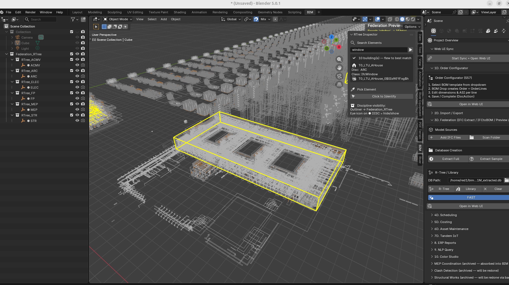
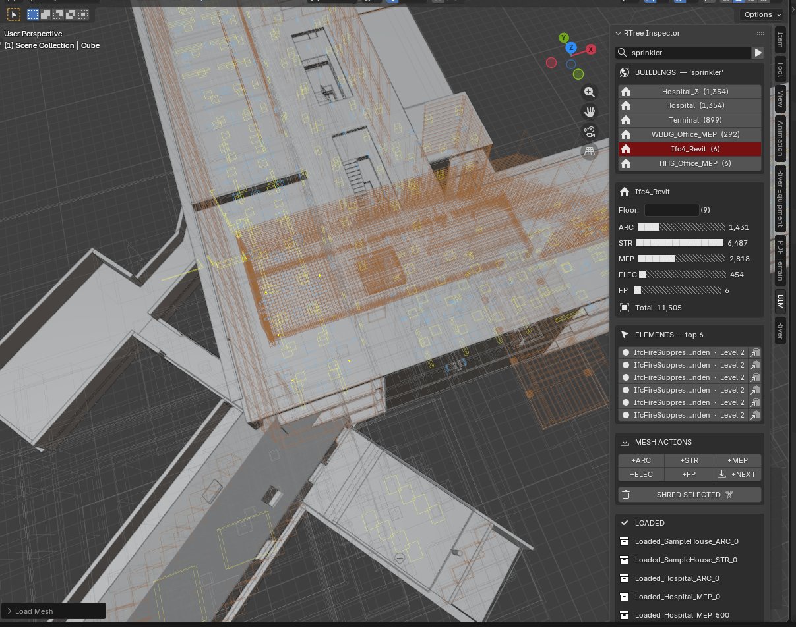
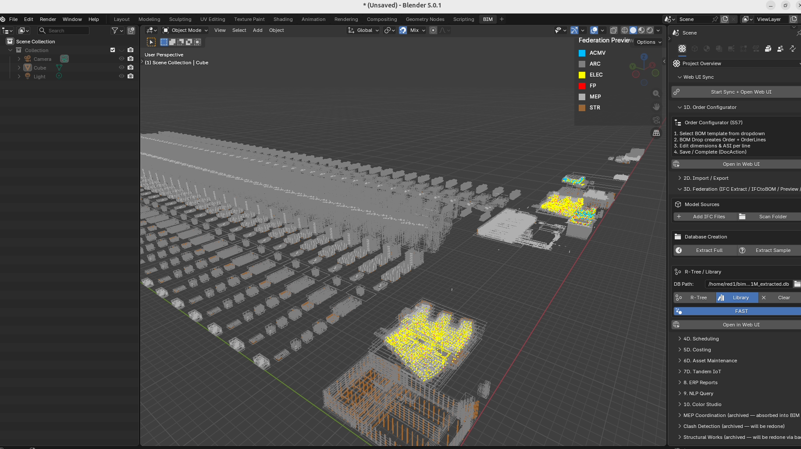
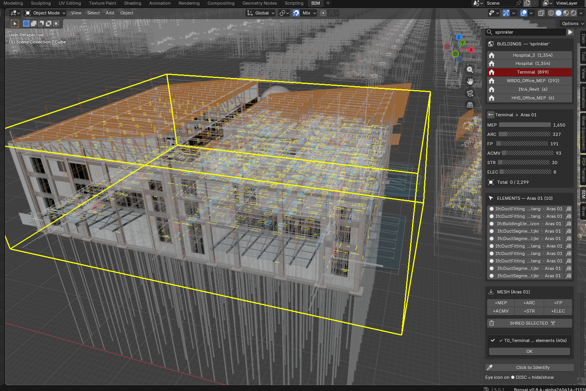
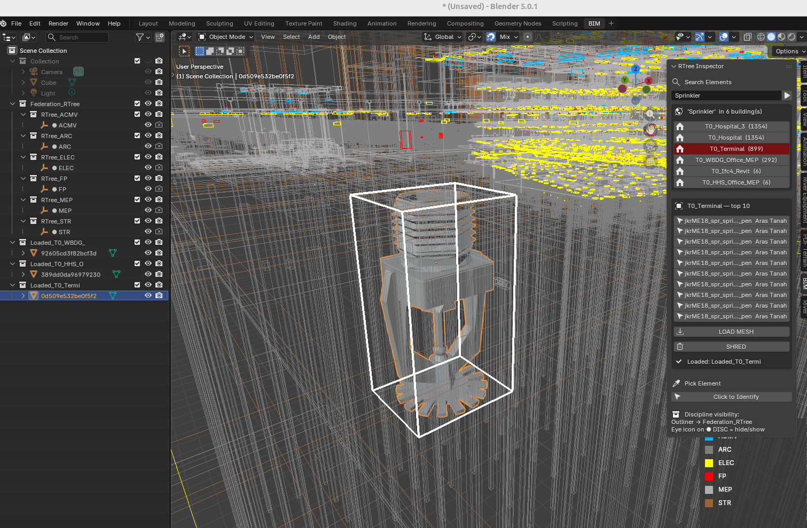
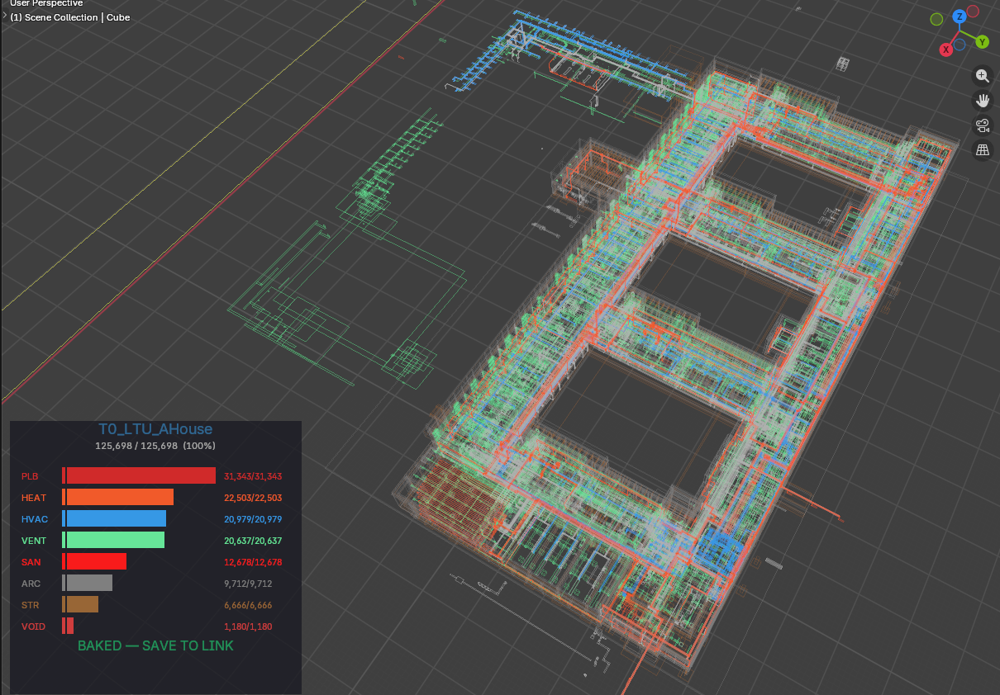

# Compile Once, Query Forever
## RTree GPU Query Engine — BIM Federation at City Scale

> **The industry loads the model, then queries it.**
> **We query the index. The model loads only what you ask for.**

<figure style="float: right; margin: -8px 0 8px 20px; max-width: 520px; text-align: center;">
  
  <figcaption style="font-size: 0.75em; color: #666; margin-top: 4px;">
    1,061,736 elements across a 1.73km × 2.48km city. Search "window" → 10 buildings listed →
    T0_LTU_AHouse (699 matches) highlighted yellow. Drill-down panel visible top-right.
    Orbit is instant. No mesh loaded.
  </figcaption>
</figure>

---

## What This Is

The RTree Query Engine is the primary viewport and navigation system for
federated BIM models at 1M+ elements. It replaces the "open the model"
paradigm with a database cursor attached to a spatial GPU renderer.

The model is never fully loaded. It is always live.

---

## Architecture

```
┌─────────────────────────────────────────────────────────┐
│  elements_rtree (SQLite R-tree virtual table)           │
│  elements_meta  (guid, name, discipline, ifc_class,     │
│                  building, storey)                      │
│  1M+ rows — compiled once by the IFC extraction pipeline│
└────────────────────┬────────────────────────────────────┘
                     │  O(log n) spatial query
          ┌──────────▼──────────┐
          │  RTree GPU Path     │  LOD-0 — always on
          │  GPU line batches   │  1M wireframes
          │  6 discipline colors│  <13s load, instant orbit
          │  zero mesh in RAM   │  zero Blender objects
          └──────────┬──────────┘
                     │  on query / pick
          ┌──────────▼──────────┐
          │  Drill-Down Engine  │  L1 → L2
          │  L1: buildings      │  click → fly + load L2
          │  L2: top 10 elements│  click → fly + white highlight
          └──────────┬──────────┘
                     │  on LOAD MESH
          ┌──────────▼──────────┐
          │  Stingy Mesh Loader │  on-demand only
          │  viewport-centre    │  camera = selector
          │  pre-warmed meshes  │  <1s per MESH press
          │  from library.blend │  one named collection
          │  LOAD / SHRED       │  non-destructive
          └──────────┬──────────┘
                     │  on OVERNIGHT (large building)
          ┌──────────▼──────────┐
          │  Smart Bake Engine  │  S186
          │  background process │  blender --background
          │  fresh scene per    │  no O(n) penalty
          │  building, 36s/48K  │  linked refs → 2MB
          │  4 cores parallel   │  1M city < 10 min
          └─────────────────────┘
```

---

## Complexity Class

| Operation | This system | Traditional viewer |
|-----------|-------------|-------------------|
| Open model | O(1) — load index only | O(n) — load all geometry |
| Query by type | O(log n) — R-tree spatial filter | O(n) — iterate loaded objects |
| Navigate to element | O(log n) — SQL + viewport fly | Manual — user scrolls/searches |
| Load geometry | O(k) — k = what you asked for | O(n) — everything or nothing |

At 1M elements: traditional viewer stalls on open.
This system opens in seconds, queries in milliseconds, loads in seconds — only what was asked.

---

## The Three Modes

### Mode 1 — RTree GPU (always on)
- Loads on "Preview" button press
- All 1M elements rendered as colored wireframe bounding boxes
- 6 discipline colors (ARC/STR/MEP/ELEC/FP/ACMV)
- Eye icon on `● DISC` in Outliner → hide/show that discipline's GPU batch
- Orbit, zoom, pan: instant at any scale
- **This never turns off.** It is the permanent spatial context.

### Mode 2 — Federation Cockpit (Query + Drill-Down)

Search field in N-panel → BIM tab → RTree Inspector (S183 cockpit layout):

```
[ search...  ▶ ]

BUILDINGS — 'IfcDoor'
  ▶ Hospital      ×2   (18,241)   ← click → fly + ghost city
  ▶ LTU_AHouse   ×18  (  699)    ← ×18 = 18 tiles, flies to nearest
  ▶ Clinic              (  321)

── on click Hospital ──────────────────
  Hospital                  Floor [     ]
  ARC  ████████████░   18,241
  STR  ███░░░░░░░░░░    3,445
  MEP  ████████████░   12,876
  ELEC ████░░░░░░░░░    4,201
  FP   ██░░░░░░░░░░░    2,109
  Total  40,872

  ELEMENTS — top 10
  IfcDoor · Frame Door · Level 3   [→][📋]
  IfcDoor · Frame Door · Level 2   [→][📋]

  MESH ACTIONS
  [+ARC][+STR][+MEP][+ELEC][+FP][+NEXT]
  [ SHRED SELECTED  ✂ ]

LOADED
  Hospital_ARC_0
  Hospital_STR_0
```

When a building is drilled into, all city wireframes ghost — the
yellow building envelope and white picked element read clearly against a dim city.
When x-ray is on (Alt-Z), wireframes return to full visibility.
On new search or clear, full colours return.

Buildings deduplicated by type — `T0_LTU_AHouse … T17_LTU_AHouse` shows as one
entry `LTU_AHouse ×18`. Sandbox tile prefixes (`S0_0_`, `T0_`) stripped automatically.
Click flies to the nearest tile to camera.

Search resolves: element name, IFC class, discipline, GUID, building name.
One search box. No mode switching. Works across 500+ building rows, deduplicates
to 10 display entries.

**Cockpit features (S183–S184):**
- Unicode discipline bars — proportional fill showing ARC/STR/MEP/ELEC/FP counts
- Storey filter — set floor, MESH loads only that storey
- GUID copy to clipboard — one click per element
- Pre-warm on drill-in — building meshes link in background while user reads cockpit

<figure style="margin: 16px 0; text-align: center;">
  
  <figcaption style="font-size: 0.75em; color: #666; margin-top: 4px;">
    Federation Cockpit in action — search "door", drill into SampleCastle, discipline bars,
    element list with fly-to and GUID copy, MESH actions, loaded collections.
    Viewport-centre meshing: camera is the selector.
  </figcaption>
</figure>

**Two navigation patterns from one query model:**
- *Know what, find where* → type "IfcDoor", find which buildings have doors + discipline breakdown
- *Know where, find what* → click any wireframe box, system identifies it, GUID to clipboard

### Mode 3 — Stingy Mesh Loader

```
MESH ACTIONS
[+ARC][+STR][+MEP][+ELEC][+FP][+NEXT]
```

**Camera is the selector.** MESH loads only elements within the viewport centre —
what you're looking at is what you get. Pan the camera, press MESH again,
get more geometry there. No learning curve.

- **+DISC buttons**: load that discipline's elements within viewport centre radius
- **+NEXT**: progressive — each press loads the next 500 (ARC→STR→MEP→ELEC→FP, with offset)
- **Storey filter**: set Floor field → MESH loads only that storey. Clear for all floors.
- Each load creates an independent named collection in the Scene Inventory
- **SHRED SELECTED**: select any loaded mesh objects in viewport → removed. Freestyle.
- Nothing selected → removes last loaded batch

Each Load is independent. Load Hospital ARC, load Clinic MEP, shred Hospital ARC.
The user can also hand-pick individual mesh objects in the viewport and shred just those —
building up a precise cross-section by addition and subtraction.
The RTree is never affected.

**Pre-warm on drill-in (S184):** When the user clicks a building in the cockpit,
the system counts disciplines (50ms) and displays the cockpit bars.
While the user reads those bars, a background timer silently links that
building's geometry hashes from library.blend (~2s, invisible).
By the time the user presses +MESH, the meshes are already in RAM.

**The 15-second workflow:**
1. Preview → 1M wireframes in 13s
2. Search → click building → cockpit shows discipline bars (meshes pre-warming in background)
3. Pan to area of interest → press +ARC → geometry appears in <1s
4. Pan elsewhere → +ARC again → more geometry where you look
5. Select unwanted pieces → SHRED → exactly what you want remains
Result: a hand-crafted view of a million-element project in 15 seconds.

---

## Viewport Click-Picker

"Click to Identify" button activates a modal LEFT_MOUSE handler.

Click any wireframe box in the viewport:
1. Ray cast from camera through click position into IFC coordinate space
2. Two-pass hit test:
   - Pass 1: does ray hit a highlighted building envelope? → return that building, trigger L2
   - Pass 2: does ray hit any individual element bbox? → return that element
3. Result populates L2 list in N-panel
4. Picked element highlighted white in GPU overlay

The click is the fastest path to identification — no typing, no scrolling.
Point at something, click, know what it is.

---

<figure style="margin: 16px 0; text-align: center;">
  
  <figcaption style="font-size: 0.75em; color: #666; margin-top: 4px;">
    RTree GPU load — 1,061,736 elements, discipline-coloured wireframe bounding boxes.
    Legend (top-right): ACMV, ARC, ELEC, FP, MEP, STR.
    Tiled suburb city in background, hospital complex foreground with MEP/ELEC highlighted.
    Orbit instant. Zero mesh. Zero Blender objects. Pure GPU batch lines.
  </figcaption>
</figure>

## Performance (sandbox_1M, S184 2026-04-13)

> **A whole city of one million elements, 100 thousand unique meshes,
> loaded in 13 seconds. Search, drill, mesh — under 1 second.
> Ultra smooth navigation with no lag on a normal laptop.**

| Metric | Result |
|--------|--------|
| DB size | 1,061,736 elements, 6 disciplines |
| Unique geometry hashes | 108,000+ |
| City extent | 1.73km × 2.48km × 79m |
| RTree load time | **~13s** |
| Orbit / pan | **Instant** (GPU batch, no per-frame eval) |
| Search SQL | <2s (LIKE scan, 1M rows) |
| Building drill-down | <0.5s (+ background pre-warm, invisible) |
| Mesh load (pre-warmed) | **<1s** (all meshes cached, viewport-centre query, batch transforms) |
| Mesh load (cold) | ~2.5s (library.blend open overhead per batch) |

### S185 Performance — Multi-Pass Pre-Warm

When a building is selected (L1 drill-in), the pre-warm timer links mesh
datablocks from `library.blend` in batches of 800 every 0.5s. This runs in
the background while the user reads the cockpit. For a building with 2,000+
unique geometry hashes, 3 passes complete in ~7s — all invisible.

By the time the user presses +MESH, all meshes are already in `bpy.data.meshes`.
The stingy loader skips `libraries.load()` entirely (`link=0ms` in logs),
reducing per-press time from ~2.5s to **<0.5s** for placement-only work.

| Metric | Before (S184) | After (S185) |
|--------|---------------|--------------|
| Pre-warm cap | 800 hashes (one-shot) | Unlimited (multi-pass) |
| +MESH cold (library.blend open) | ~2.5s per press | ~2.5s first press only |
| +MESH warmed | <1s | **<0.5s** (link=0ms) |
| Bottleneck | `libraries.load()` per press | Eliminated by pre-warm |

Other S185 optimisations:
- `matrix_basis` single write (replaces `location` + `rotation_euler`)
- Deferred scene link for new collections (avoids O(n²) collection sync)
- Duplicate mesh skip (already-loaded objects not re-created)
- Back-to-front depth ordering (farthest from camera loads first)
- Auto `clip_end` proportional to model extent (no manual View End Clip)

Scales to 10M+ elements with no architectural changes.
The DB is the ceiling, not the viewer.

---

### S186 Performance — Smart Overnight + Offline Bake

The overnight modal loader degrades on large buildings because Blender's scene graph
is O(n) — each new object is slower than the last. Hospital (63K elements) starts at
2.4s/batch and reaches 6.3s/batch by 12K objects, trending toward 3.4 hours.

**Smart Overnight** detects this. After 2,000 elements it computes:
- Online ETA from rolling batch average
- Offline estimate from bake benchmarks

If online ETA exceeds offline by 5x, it offers to switch:

```
┌─────────────────────────────────────────────┐
│  At this rate: ~1.8h                        │
│  Offline bake: ~73s                         │
│                                             │
│  [SWITCH TO OFFLINE]     [KEEP GOING]       │
└─────────────────────────────────────────────┘
```

On accept: a background `blender --background --factory-startup` subprocess
bakes the entire building in a fresh empty scene. The user's viewport stays
fully interactive — orbit, search, mesh other buildings. When the subprocess
finishes, partial objects are shredded and the complete building links into
the viewport instantly.

**Why it's fast:**

| Factor | Overnight modal | Offline bake |
|--------|-----------------|--------------|
| Scene graph | O(n) — 63K objects growing | Fresh empty — always O(1) |
| Library opens | Per-batch (2.7s × hundreds) | Once (67s total) |
| Mesh refs | Linked per batch | Linked in one call |
| Viewport | Redraws every tick | No viewport (`--background`) |
| Result | Trends to 3.4h, may crash | Deterministic, always completes |

**Measured results:**

| Building | Elements | Unique meshes | Bake time | File size |
|----------|----------|---------------|-----------|-----------|
| Duplex | 1,169 | 650 | 6.4s | 197KB |
| Terminal | 48,428 | 7,150 | **36.6s** | ~2MB |
| Hospital | 63,917 | 23,045 | **123s** | 5.6MB |

**City-scale extrapolation (1,061,736 elements, 25 buildings):**

Background parallel Blender sessions (up to 4 instances on 4 CPU cores) can
resolve a full 1-million-element city in under 10 minutes. Total baked file
size: ~75MB. Previously the same city trended toward 3.5 hours with crashes
on save.

Each subprocess is a separate OS process — not a Python thread. Blender
remains single-threaded per process, but 4 processes run on 4 cores
simultaneously. The operating system handles parallelism, not Blender.

The baked `.blend` files use linked mesh references to `library.blend` (276MB,
shared). No mesh data is duplicated. A complete building is just transforms +
collection hierarchy. Save takes seconds. Reopen resolves the links
automatically.

<figure style="margin: 24px 0; text-align: center;">
  
  <figcaption style="font-size: 0.75em; color: #666; margin-top: 4px;">
    Terminal building (48,428 elements) baked in 36.6 seconds via background subprocess.
    Up to 4 parallel Blender instances can resolve a 1-million-element city under 10 minutes
    at ~75MB total file size. Previously trended to 3.5 hours with save crashes.
  </figcaption>
</figure>

### S187 — Shred Baked, Collapsible Panel, Version Stamp

**Shred now handles both load patterns:**

| Pattern | Source | Shred action |
|---------|--------|-------------|
| `Loaded_*` collections | Stingy Mesh Loader | Unlink objects, remove collection |
| `Baked_*` collection instances | Smart Bake Engine | Delete `*_inst` empties per discipline |

Select `T0_Hospital_MEP_inst` → SHRED → only MEP removed, others remain.
Select nothing → SHRED removes last `Loaded_*` or last `Baked_*` building.
Empty `Baked_*` parent auto-cleaned.

**Collapsible element list (S187):** The L2 element list collapses to a single
header row when overnight/bake is active, keeping the SHORT-CUT button visible
without scrolling. Triangle toggle for manual collapse at any time.

**SHORT-CUT countdown now shows total cost upfront:**
```
⚡ SHORT-CUT  ~37s + ~25s link
```
The `+25s link` warns that Blender will freeze briefly at the end when linking
the baked file. Wait cursor shown during link. No two-phase state splitting.

**Pre-S185 DB guard:** LOAD MESH and OVERNIGHT reject extracted DBs that lack
rotation columns (pre-S185 schema). Clean error in status bar:
"DB too old — re-extract with current pipeline."

**Version stamp:** `_FED_VERSION` in `operator.py` prints `[S187b]` on Preview.
Confirms running code matches source after Blender restart.

**Storey element fly-to fix:** Storey-level top-10 query now includes rtree
JOIN for bounding boxes. Fixes `KeyError: 'bbox'` crash when clicking an
element after drilling into a storey.

**Log evidence (Terminal 48K, 2026-04-15):**
```
[S186] §BAKE_SWITCH bld=Terminal partial=3650
[S186] §BAKE_POLL bld=Terminal ~23,245/48,428 (48%) 35s elapsed ~37s left
  [BAKE-SUB] §PROOF BAKE bld=Terminal placed=48428 no_mesh=0 no_xform=0
             discs=['MEP','ACMV','ARC','STR','ELEC','FP'] 36.4s
[S186] §BAKE_DONE bld=Terminal elapsed=40s
[S186] §BAKE_SHRED bld=Terminal collections=2 objects=3767
[S187] §BAKE_LINK bld=Terminal instances=6 total=48,428 link=24.1s
```
Viewport remained fully interactive during the 40s bake — storey drill-down,
fly-to-element, and re-Preview all worked while the subprocess ran.
File saved at 125.5KB (linked refs to library.blend, no mesh duplication).

---

## Geo Hash Hell — SOLVED (S180)

When loading meshes from library.blend, Blender renames datablocks that
collide at the 63-char name limit. If geometry_hash name is truncated or
duplicated, the transform lookup fails and elements appear at the origin.

**S178 fix:** `T_{full_hash}` naming, 21/21 PASS (`0dc3912c`).
**S180 confirmation:** Shred works. Placement dead accurate across all tested
elements — sprinklers, doors, windows, structural members. Stale-selection bug
(`_selected_element` not cleared on new building drill-in) also fixed. No
further geo hash hell reports. This is considered closed.

---

## Files — Technical Section

Source root: `/home/red1/IfcOpenShell/src/bonsai/bonsai/bim/module/federation/`

| File | Role |
|------|------|
| `bbox_visualization.py` | RTree GPU batches, draw handler, search/pick, `_load_progress`, `_loaded_collections` |
| `discipline_legend.py` | GPU overlay (bottom-right, discipline colors + search hint) |
| `operator.py` | FedRTreeSearch, FedRTreeFlyToResult, FedRTreeFlyToElement, FedRTreePick, FedRTreeLoadMesh, FedRTreeShred (Loaded+Baked), FedRTreeOvernight, FedRTreeSwitchOffline, `_FED_VERSION` stamp |
| `ui.py` | BIM_PT_rtree_inspector (N-panel, bl_order=0) — cockpit panel, discipline bars, building list |
| `prop.py` | rtree_search, rtree_result_*, rtree_picked_*, rtree_bld_* discipline counts |
| `__init__.py` | operator + panel registration |
| `library/component_library.db` | S189: BLOB mesh source (123K geometry hashes, SQLite indexed) |
| `scripts/blob_tessellate_worker.py` | S189: per-chunk BLOB bake subprocess |
| `DAGCompiler/lib/input/*_extracted.db` | extracted federation DBs (source of truth) |

---

## Related Specs

- `internal/DLOD_SPEC.md` — LOD tier system (§S179: LOD-0 = RTree GPU, not bbox mesh; GN mode halted S184)
- `prompts/S184_gn_dlod_fix.md` — S184 spec: viewport-centre query, batch transforms, pre-warm on drill-in
- `internal/StressTest_1M_Results.md` — full performance history S165→S178
- `docs/StressTest_1M.md` — the 1M element loading challenge and GN architecture
- `prompts/S179_dlod_rtree_handoff.md` — corrected DLOD architecture
- `prompts/S180_stingy_mesh_loader.md` — next session: picker fix + Load/Shred
- `prompts/S187_overnight_panel_review.md` — S187 spec: instance validation, collapsible panels, shred fix
- `docs/MANIFESTO.md` §The Backend — Why No Framework — architecture philosophy: OS-level parallelism, no frameworks, compile-once principle

---

## The Paradigm

Every BIM viewer built before this one assumes the same workflow:
open the model, wait for it to load, then navigate what's loaded.
At city scale — 50 buildings, 10M elements, 20 disciplines — that workflow
breaks. The model is too large to hold in memory. The viewer stalls.

The alternative is to treat the BIM model as a database, not a file.
The compiled output of the IFC extraction pipeline — `elements_meta`,
`elements_rtree`, `element_transforms` — is a queryable index.
The geometry exists in `component_library.db` as tessellated BLOBs (S189).
Nothing is loaded until asked.

The user navigates by querying. The geometry appears on demand.
The city is always visible as wireframes. The detail appears where attention goes.

This is how game engines work at 100M polygons.
This is how databases work at 1B rows.
BIM has been doing neither. Until now.

<figure style="margin: 24px 0; text-align: center;">
  
  <figcaption style="font-size: 0.75em; color: #666; margin-top: 4px;">
    RTree search drill in action — 1,061,736 elements loaded in ~13s.
    Each query layer narrows the result: L1 buildings highlighted by match count,
    L2 top elements highlighted white, final LOD mesh fetched on demand from library.blend.
    Federation BIM Compiler addon to Bonsai. Normal laptop. No stall.
  </figcaption>
</figure>

<figure style="margin: 24px 0; text-align: center;">
  
  <figcaption style="font-size: 0.75em; color: #666; margin-top: 4px;">
    Progress HUD (S191) — GPU overlay with discipline-colored progress bars, pulsing status,
    countdown ETAs, and save-to-link pipeline. Baked backend running on a 1M-element city.
    Viewport stays fully interactive during bake.
  </figcaption>
</figure>

**Compile Once, Query Forever.**

---

## Video Demo

<div style="text-align: center; margin: 24px 0;">
  <a href="https://youtu.be/J2MP_q63BNU">
    
  </a>
  <p style="font-size: 0.85em; color: #666; margin-top: 8px;">
    RTree Query Engine in action — 1M+ elements, search, drill-down, instant mesh loading.
    <br><a href="https://youtu.be/J2MP_q63BNU">Watch on YouTube</a>
  </p>
</div>
