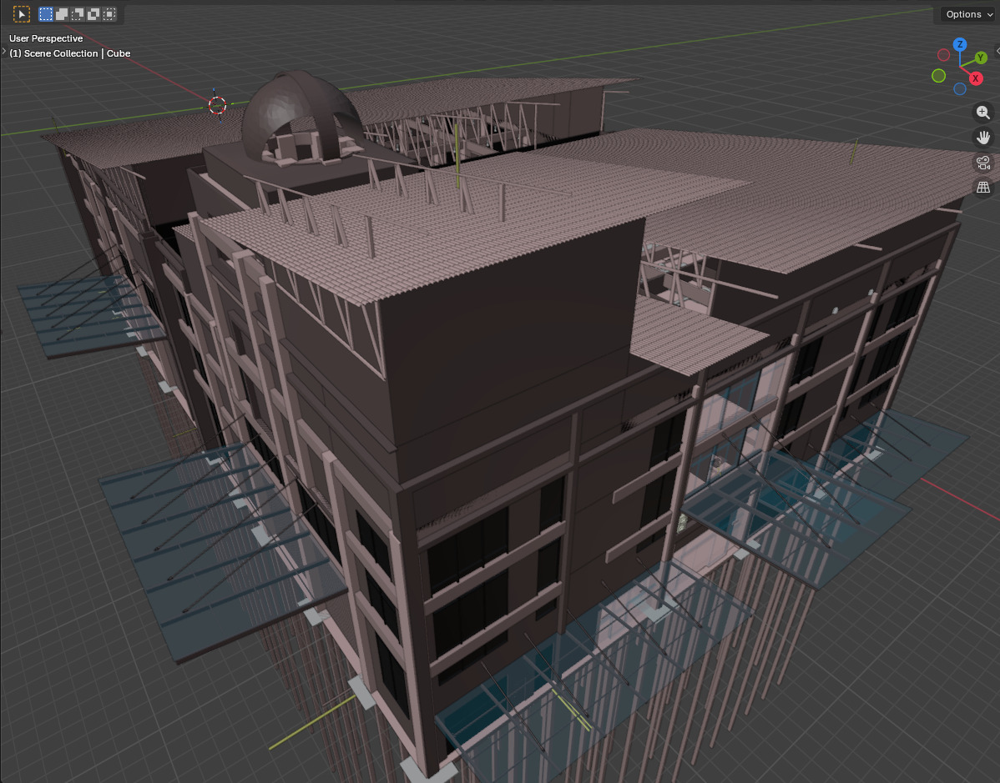
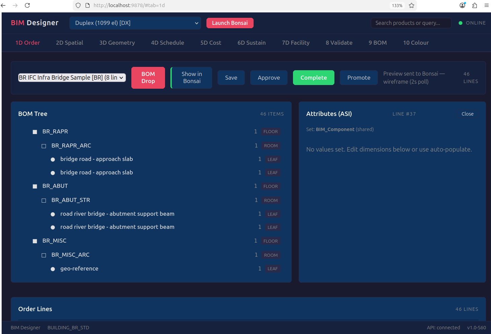

---
hide:
  - navigation
  - toc
---

# BIM Intent Compiler

**Construction = BOM + (x, y, z).** One formula that unifies geometry, procurement, scheduling, compliance, and cost — the way E=mc² unified mass and energy. Five domains that the industry treats as separate tools, separate vendors, separate budgets — unified in a formula an inch long.

It reads a [BOM](BOMBasedCompilation.md) and produces verified 3D coordinates — the same way an [ERP system](MANIFESTO.md) explodes a manufacturing BOM into work orders. The output renders live in the [BIM OOTB browser viewer](https://red1oon.github.io/bim-ootb/) — no install, no server, two DBs, one browser. [Domain-agnostic](ShipYard.md) — buildings, bridges, [ships](ShipYard.md), tunnels. Nothing invented. No AI inside. Pure arithmetic. Deterministic.

<div style="max-width: 620px; margin: 32px auto; padding: 24px 40px; background: #263238; border-left: 4px solid #ff9800; text-align: center; border-radius: 4px;">
<span style="font-size: 1.3em; line-height: 1.7; color: #eceff1; letter-spacing: 0.3px;">"What <b style="color: #ff9800;">AUTODESK</b>, <b style="color: #ff9800;">PRIMAVERA</b> and <b style="color: #ff9800;">SAP</b> should have done<br>together long ago — <i>but I couldn't wait.</i>"</span>
<br><span style="font-size: 0.75em; letter-spacing: 1.5px; text-transform: uppercase; color: #78909c; margin-top: 12px; display: inline-block;">Redhuan D. Oon · ADempiere 2006 · iDempiere 2010 · BIM Compiler 2025</span>
</div>

Every existing tool starts with geometry and extracts quantities downstream — draw first, count second. This compiler inverts the direction: the [Bill of Materials](BOMBasedCompilation.md) is the source of truth, and geometry is the compiled output. Procurement doesn't follow design. Design follows procurement.

| | Draw first, count second | Count first, draw second |
|---|---|---|
| **Source of truth** | 3D model (Revit, ArchiCAD) | Bill of Materials |
| **Quantities** | Extracted after design | Inherent — the BOM IS the quantity |
| **Change a wall** | Redraw → re-extract QTO → re-estimate | Change one BOM line → [recompile](BOMBasedCompilation.md) |
| **Compliance** | Separate checker (Solibri) | Same rule engine ([AD_Val_Rule](DocValidate.md)) |
| **Cost** | Separate estimator | Same BOM × price list |
| **Schedule** | Separate tool (Primavera) | BOM tree [topological sort](ProjectOrderBlueprint.md) |
| **Proof** | Visual inspection | [6 mathematical gates](TestArchitecture.md) — deterministic |

Built on [iDempiere](https://idempiere.org/) ERP conventions, [SQLite](https://www.sqlite.org/), and the [Blender](https://www.blender.org/)/[Bonsai](https://bonsaibim.org/) open-source 3D viewport — upgraded with the [FederatedModel Spatial Database](https://github.com/red1oon/IfcOpenShell/tree/feature/IFC4_DB/src/bonsai/bonsai/bim/module/federation) and [PDF Terrain](PDF_TERRAIN.md) survey-to-3D. From Kuala Lumpur, Malaysia — where BIM is [mandated](StrategicIndustryPositioning.md) for all projects >= RM10M from July 2025. It is the Creator, [Redhuan D. Oon](mailto:red1org@gmail.com)'s gift to the world.

<div style="clear: right;"></div>

---

<figure style="float: right; margin: -8px 0 8px 20px; max-width: 280px; text-align: center;">
  
  <figcaption style="font-size: 0.75em; color: #666; margin-top: 4px;">Compiled in Blender/Bonsai. Colour = discipline (STR, ARC, ELEC, FP, ACMV, SP).</figcaption>
</figure>

<div class="grid cards" markdown>

-   **35 Buildings Compiled**

    ---

    34 extracted from real [IFC](https://www.buildingsmart.org/standards/bsi-standards/industry-foundation-classes/) files + 1 generative.
    19 pass all [6 mathematical gates](TestArchitecture.md).
    16 in progress — geometry coverage and verb gaps tracked in [TestArchitecture](TestArchitecture.md).
    Largest: [48,428 elements](TerminalAnalysis.md) (airport terminal).

    [:octicons-arrow-right-24: See the buildings](SampleHouseAnalysis.md)

-   **77 Verbs, 2,475 Products**

    ---

    [BIM COBOL](BIM_COBOL.md): TILE surfaces, ROUTE pipes, FRAME structures,
    CLUSTER repetitions. The compiler speaks construction.

    [:octicons-arrow-right-24: Read the verb grammar](BIM_COBOL.md)

-   **6 Gates + Standards Compliance**

    ---

    Count, Volume, Digest, Tamper, Provenance, Isolation —
    [6 gates](TestArchitecture.md) prove geometry. [Jurisdiction rules](STANDARDS_COMPLIANCE_SRS.md)
    prove code compliance — MY UBBL, US IBC, EU Eurocode.

    [:octicons-arrow-right-24: Test architecture](TestArchitecture.md) · [:octicons-arrow-right-24: Compliance](STANDARDS_COMPLIANCE_SRS.md)

-   **Clash Detection — In the Browser**

    ---

    12 discipline-pair rules. [Clash matrix](CLASH_DETECTION.md), fly-to visualization, live tolerance slider,
    in-viewer review workflow. 48K elements, zero server. Replaces Navisworks ($3,570/yr).

    [:octicons-arrow-right-24: Clash Detection](CLASH_DETECTION.md)

-   **ERP-Native + Reports**

    ---

    [C_Order, C_OrderLine, M_Product, M_BOM](DATA_MODEL.md) — [iDempiere](https://idempiere.org/) patterns.
    Same compiled output produces [BOM schedules, compliance certificates, cost reports](REPORTING_ENGINE_SRS.md).

    [:octicons-arrow-right-24: ERP world view](MANIFESTO.md) · [:octicons-arrow-right-24: Reporting](REPORTING_ENGINE_SRS.md)

-   **Enterprise Security — No Server Required**

    ---

    3-layer cryptographic verification: HMAC pipeline attestation, Ed25519 identity signing,
    SHA-256 transport integrity. Beats BIM360/Trimble on every attack vector.
    Free to view. Pay for [authenticated collaboration](EnterpriseAuthentication.md).

    [:octicons-arrow-right-24: Security Architecture](EnterpriseAuthentication.md)

</div>

---

## **How It Works**

```
IFC file → extract → classify.yaml → IFCtoBOM → BOM.db → compile → output.db → gates
           (once)    (human intent)    (once)     (recipe)   (repeat)  (elements)   (proof)
```

A product catalog ([M_Product](DATA_MODEL.md)) becomes building elements. A Bill of Materials ([M_BOM](BOMBasedCompilation.md)) becomes assembly recipes. A work order ([C_Order](ProjectOrderBlueprint.md)) becomes a construction project. The same [ERP](MANIFESTO.md) tables that run a factory floor now compile a building.

---

## **The Rosetta Stone Strategy**

AI cannot see spatial geometry — being LLM-based, it has no native understanding of where a wall ends, how a slab sits, or whether two elements collide. The [Rosetta Stone strategy](TheRosettaStoneStrategy.md) sidesteps AI entirely: real buildings become the ground truth, and every compiled output is verified against that truth with pure arithmetic.

<figure style="float: right; margin: -8px 0 8px 20px; max-width: 480px; text-align: center;">
  
  <figcaption style="font-size: 0.75em; color: #666; margin-top: 4px;">48,428 elements. 8 disciplines. Compiled from BOM.</figcaption>
</figure>

Real IFC buildings are decomposed into reference databases. The compiler reads a BOM describing the same building and produces output. If every compiled element lands at the **same position** as the reference — same coordinates, same dimensions, same 3D space — the BOM grammar is **certified**.

35 buildings compiled — from a single-storey house to a multi-storey airport terminal. 19 pass all 6 mathematical gates. Once a stone is certified, any new building composed from its proven grammar inherits the proof — no new reference needed.

[:octicons-arrow-right-24: Read the full strategy](TheRosettaStoneStrategy.md)

<div style="clear: right;"></div>

---

## **Compile Once, Query Forever**

<figure style="float: right; margin: -8px 0 8px 20px; max-width: 480px; text-align: center;">
  
  <figcaption style="font-size: 0.75em; color: #666; margin-top: 4px;">1M+ elements across a city. Search, drill down, load mesh on demand. No model file opened.</figcaption>
</figure>

The industry loads the model, then queries it. This compiler inverts that too: the [RTree Query Engine](RTree.md) queries the spatial index and loads only what you ask for. One million elements render as GPU wireframes in 13 seconds — zero mesh in RAM, instant orbit. Press MESH and the Stingy Loader delivers exact IFC geometry for the elements around your camera in under one second. Press SHRED to clean up. The model is never fully loaded. It is always live.

An earlier approach used Blender's Geometry Nodes to instance meshes via point clouds (S175–S184). At city scale the GN evaluation overhead made it unviable. The RTree GPU path resolved the speed problem by eliminating mesh loading from the default viewport entirely — wireframes from the database index, mesh on demand.

[:octicons-arrow-right-24: RTree architecture and benchmarks](RTree.md) · [:octicons-arrow-right-24: 1M stress test](StressTest_1M.md)

<div style="clear: right;"></div>

---

## **We Got Eyes**

The compiler can see. [BIMEyes](EYES_SRS.md) reduces every element's shape to three dimensionless ratios — planarity, elongation, squareness. A wall *must* be planar. A column *must* be elongated. A slab *must* be flat. These are mathematical facts, not heuristics.

Three verification tiers: **per-element** (each element is geometrically sane), **pairwise** (doors inside walls, furniture inside rooms), and **aggregate** (every room has walls, floor, ceiling, and a door). 28 proof classes across 90,310 elements. 97% pass both shape AND position proof. No AI. No tolerance tuning. Pure arithmetic. No trained models — thresholds are derived from geometric definitions (a wall IS planar by IFC class definition, not by statistical inference).

[:octicons-arrow-right-24: EYES specification](EYES_SRS.md)

---

## **Design in Blender, Compile from BOM**

<figure style="float: right; margin: -8px 0 8px 20px; max-width: 570px; text-align: center;">
  
  <figcaption style="font-size: 0.75em; color: #666; margin-top: 4px;">BIM Designer web UI. BOM tree, DocAction lifecycle buttons (Approve, Complete, Promote).</figcaption>
</figure>

The compiler powers a live GUI inside [Blender](https://www.blender.org/) via the [Bonsai](https://bonsaibim.org/) addon and the [BIM Designer](BIM_Designer_UserGuide.md). Create a building from a single click, edit room dimensions with sliders, switch jurisdictions, save/recall design versions, and promote a design to a construction-ready work order.

The HTML web UI (port 9878) provides 10 tabs: spatial views, geometry inspection, validation, BOM tree, and colour-coded discipline breakdown. [DocAction](DocAction_SRS.md) lifecycle buttons (Draft → Approve → Complete → Promote) drive the design through ERP-standard approval stages. Bidirectional sync: browser pushes commands to Bonsai, Bonsai renders the compiled output live.

408+ passing tests. What the user sees IS what the compiler produces, deterministically.

[:octicons-arrow-right-24: Designer guide](BIM_Designer_UserGuide.md)

<div style="clear: right;"></div>

---

## **Quick Start**

```bash
# Prerequisites: Java 17+, Maven 3.8+, SQLite3
git clone https://github.com/red1oon/BIMCompiler.git
cd bim-compiler

mvn compile -q                              # Compile all modules
./scripts/run_RosettaStones.sh classify_sh.yaml   # Compile Sample House + verify gates
./scripts/run_tests.sh                      # Full test gate (408+ tests)
```

[:octicons-arrow-right-24: Full getting started guide](WorkOrderGuide.md) · [:octicons-arrow-right-24: IFC onboarding runbook](IFC_ONBOARDING_RUNBOOK.md)

---

## **Documentation Map**

<figure style="float: right; margin: -8px 0 8px 20px; max-width: 560px; text-align: center;">
  
  <figcaption style="font-size: 0.75em; color: #666; margin-top: 4px;">Sample House floor plan (Pelan Lantai) — generated from 1D BOM → 3D compilation → <a href="2D_LAYOUT/">2D drawing</a>. The round-trip proof.</figcaption>
</figure>

| I want to... | Start here |
|--------------|-----------|
| Understand the ERP world view | [**MANIFESTO — Read First**](MANIFESTO.md) |
| Read the master spec | [BOM-Based Compilation](BOMBasedCompilation.md) |
| Navigate the code | [Source Code Guide](SourceCodeGuide.md) |
| Onboard a new IFC | [IFC Onboarding Runbook](IFC_ONBOARDING_RUNBOOK.md) |
| See the frontier | [Project Order Blueprint](ProjectOrderBlueprint.md) |
| Compare to other approaches | [Prior Art — Why Not Parametric?](StrategicIndustryPositioning.md) |
| Understand how it was built | [Vibe Programming — AI + Domain Expertise](VibeProgramming.md) |
| Explore the enterprise platform | [**FederatedModel — 4D through 8D**](Enterprise.md) |
| Navigate 1M+ elements in real time | [**RTree Query Engine — Compile Once, Query Forever**](RTree.md) |
| Walk to any element indoors | [Find & Navigate — Indoor Wayfinding](RouteTemplate.md) |

<div style="clear: right;"></div>

*Copyright (c) 2025-2026 Redhuan D. Oon. MIT Licensed.*
